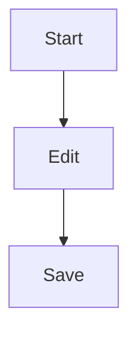

# LaTeX Markdown Online - Math Editor with Live Preview ✨

Professional **latex markdown online** editor with instant preview. Create **math markdown** documents with LaTeX equations, Greek letters, and mathematical formulas. Perfect for **markdown live preview** with full LaTeX support.

- https://markdownlivepreview.org/

## LaTeX Math Online - Quick Examples

### Basic LaTeX in Markdown

**Inline math**: Einstein's famous equation $E = mc^2$ demonstrates mass-energy equivalence.

**Display math** - Newton's second law:

$$
F = ma
$$

### LaTeX Preview Online - Common Use Cases

#### 1. Calculus & Derivatives

$$
\frac{d}{dx}(x^2) = 2x \quad \text{and} \quad \int x^2 dx = \frac{x^3}{3} + C
$$

#### 2. LaTeX Math Equation Generator - Fractions

$$
\frac{a}{b} + \frac{c}{d} = \frac{ad + bc}{bd}
$$

#### 3. Square Root in Markdown

$$
\sqrt{16} = 4 \quad \text{and} \quad \sqrt[3]{27} = 3
$$

#### 4. Greek Letters in Markdown

$$
\alpha + \beta = \gamma \quad \theta = 45° \quad \pi \approx 3.14159
$$

Common Greek letters: $\alpha$, $\beta$, $\gamma$, $\delta$, $\epsilon$, $\theta$, $\lambda$, $\mu$, $\pi$, $\sigma$, $\omega$

#### 5. LaTeX Formula Online - Summation & Products

$$
\sum_{i=1}^{n} i = \frac{n(n+1)}{2} \quad \prod_{i=1}^{n} i = n!
$$

#### 6. Matrix LaTeX Online

$$
\begin{pmatrix}
a & b \\
c & d
\end{pmatrix}
\begin{pmatrix}
x \\
y
\end{pmatrix} =
\begin{pmatrix}
ax + by \\
cx + dy
\end{pmatrix}
$$

#### 7. LaTeX Equation Viewer - Limits

$$
\lim_{x \to 0} \frac{\sin x}{x} = 1
$$

#### 8. Online Latex Equation Editor - Integrals

$$
\int_0^{\pi} \sin x \, dx = 2
$$

#### 9. Math Formula Markdown - Statistics

$$
\mu = \frac{1}{n}\sum_{i=1}^n x_i \quad \sigma^2 = \frac{1}{n}\sum_{i=1}^n (x_i - \mu)^2
$$

#### 10. LaTeX Formulas Online - Quadratic Formula

$$
x = \frac{-b \pm \sqrt{b^2-4ac}}{2a}
$$

## Math Markdown Editor - Advanced Features

### Aligned Equations (Latex Math Online)

$$
\begin{align*}
(x+y)^2 &= x^2 + 2xy + y^2 \\
(x-y)^2 &= x^2 - 2xy + y^2 \\
(x+y)(x-y) &= x^2 - y^2
\end{align*}
$$

### Piecewise Functions (Markdown Latex Formula)

$$
f(x) = \begin{cases}
x^2 & \text{if } x \geq 0 \\
-x^2 & \text{if } x < 0
\end{cases}
$$

### Markdown Equation Generator - Systems of Equations

$$
\begin{cases}
x + 2y = 5 \\
3x - y = 4
\end{cases}
$$

### Trigonometry (LaTeX Math Generator)

$$
\sin^2\theta + \cos^2\theta = 1 \quad \tan\theta = \frac{\sin\theta}{\cos\theta}
$$

## Code with Math (Markdown Math Online)

Combine code and equations in technical documentation. When your document is ready, [export it as a PDF](/tools/markdown-to-pdf) or [convert to Word](/tools/markdown-to-word) — LaTeX equations are fully preserved in both formats.

```python
def quadratic_formula(a, b, c):
    """
    Solve: ax² + bx + c = 0
    Formula: x = (-b ± √(b²-4ac)) / 2a
    """
    discriminant = b**2 - 4*a*c
    x1 = (-b + discriminant**0.5) / (2*a)
    x2 = (-b - discriminant**0.5) / (2*a)
    return x1, x2

# Example: x² - 5x + 6 = 0
print(quadratic_formula(1, -5, 6))  # Output: (3.0, 2.0)
```

Algorithm complexity with LaTeX:

| Algorithm     | Time Complexity | Space       | Formula            |
| ------------- | --------------- | ----------- | ------------------ |
| Binary Search | $O(\log n)$     | $O(1)$      | $\log_2 n$         |
| Quick Sort    | $O(n \log n)$   | $O(\log n)$ | $n \log_2 n$       |
| Bubble Sort   | $O(n^2)$        | $O(1)$      | $\frac{n(n-1)}{2}$ |

## LaTeX Online Preview - Physics Examples

### Classical Mechanics

$$
F = ma \quad E_k = \frac{1}{2}mv^2 \quad p = mv
$$

### Electromagnetism

$$
F = qE \quad F = q\mathbf{v} \times \mathbf{B} \quad E = mc^2
$$

### Wave Equation

$$
v = f\lambda \quad \text{where } v \text{ is velocity, } f \text{ is frequency}
$$

## How to Use LaTeX in Markdown

### Inline Math

Use single dollar signs: `$E = mc^2$` renders as $E = mc^2$

### Display Math

Use double dollar signs:

```
$$
x = \frac{-b \pm \sqrt{b^2-4ac}}{2a}
$$
```

### Special Characters

- Fractions: `\frac{a}{b}` → $\frac{a}{b}$
- Square root: `\sqrt{x}` → $\sqrt{x}$
- Exponents: `x^2` → $x^2$
- Subscripts: `x_i` → $x_i$
- Sum: `\sum_{i=1}^n` → $\sum_{i=1}^n$
- Integral: `\int_a^b` → $\int_a^b$

## Mermaid Diagrams (Basic Example)

### Simple Flowchart



## Markdown Formula Tips

> **💡 Tip**: Always escape backslashes in LaTeX: use `\\frac` not `\frac` in code

> **⚠️ Common Issues**:
>
> - Missing closing braces: `{...}`
> - Unescaped special chars: `$`, `%`, `&`
> - Nested fractions need extra braces

## Real-World Examples

### Computer Science (Markdown Math Expression)

$$
T(n) = \begin{cases}
1 & \text{if } n = 1 \\
2T(\frac{n}{2}) + n & \text{if } n > 1
\end{cases}
$$

Solving: $T(n) = O(n \log n)$

### Finance (LaTeX Equation Online)

$$
FV = PV \times (1 + r)^n \quad CI = P \left(1 + \frac{r}{n}\right)^{nt} - P
$$

### Probability (Math Latex Online)

$$
P(A \cup B) = P(A) + P(B) - P(A \cap B)
$$

$$
E(X) = \sum_{i=1}^n x_i \cdot P(x_i)
$$

---

<div align="center">

## 🚀 Start Creating Math Markdown Now!

**Left Panel**: Write your markdown with LaTeX
**Right Panel**: See instant live preview

### Popular Features

✅ **LaTeX Math Online** - Full KaTeX support
✅ **Markdown Live Preview** - Real-time rendering
✅ **Greek Letters** - Complete symbol library
✅ **Equation Generator** - Complex formulas made easy
✅ **Mermaid Diagrams** - Professional visualizations
✅ **Code Highlighting** - 100+ languages supported

### Quick Start Guide

1. Type math between `$...$` for inline or `$$...$$` for display
2. Use `\frac{}{}`, `\sqrt{}`, Greek letters (`\alpha`, `\beta`)
3. See instant preview with proper LaTeX rendering
4. Export your document — [save as PDF](/tools/markdown-to-pdf) with LaTeX rendered, or [download as Word (.docx)](/tools/markdown-to-word) with native editable equations

**Try it now** - Clear this example and start typing! 📝

> **🛠️ Export tools**: [Markdown to PDF](/tools/markdown-to-pdf) · [Markdown to Word](/tools/markdown-to-word) · [All tools](/tools)

</div>
