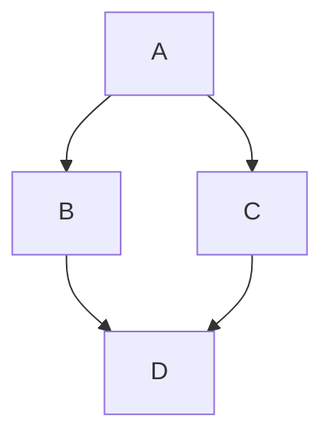
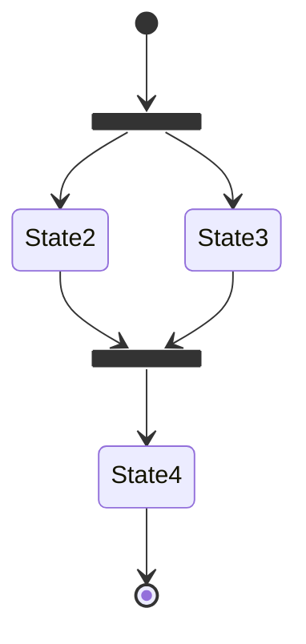
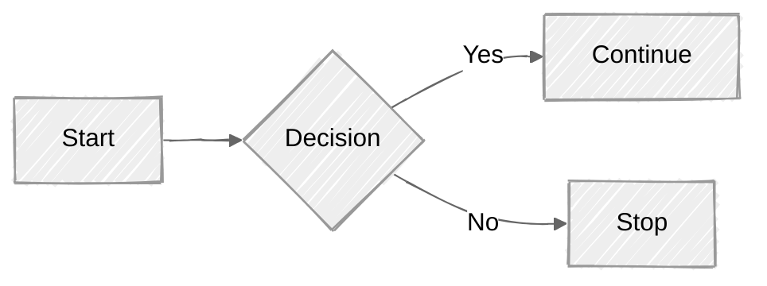
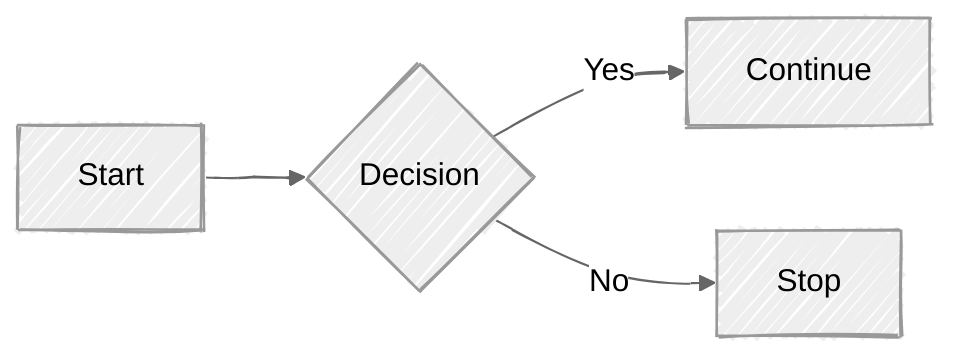

# KaTeX Asset Test

If your self-hosting setup is working correctly, the equations below should look professional and aligned. If they look like raw text or "exploded" symbols, the CSS or Fonts are missing.

## 1. Inline Math

This test verifies that KaTeX is processing text within a paragraph.
The equation $E = mc^2$ should be inline.

**Subscript Test:** The variables $x_1, x_2, \dots, x_n$ should have clear subscripts. (If you see italics but no positioning, the CSS is missing).

## 2. Display Block (The Big Stuff)

This tests the `$$` block syntax and multi-line alignment.

$$
I = \int_{0}^{2\pi} \sin(x) \, dx = 0
$$

## 3. Font & Symbol Stress Test

This verifies that your `/static/katex/fonts/` directory is correctly linked. If you see "boxes" instead of symbols, the fonts didn't download or are in the wrong path.

**Matrix Test:**

$$
\begin{pmatrix}
a & b \\
c & d
\end{pmatrix}
\times
\begin{pmatrix}
1 & 0 \\
0 & 1
\end{pmatrix}
=
\begin{pmatrix}
a & b \\
c & d
\end{pmatrix}
$$

**Greek & Accents:**
$\alpha, \beta, \gamma, \Gamma, \pi, \phi, \sigma, \zeta$.
$\hat{x}, \bar{y}, \tilde{z}$.

## 4. MDX Component Interop

Since this is an `.mdx` file, let's ensure a standard React component doesn't break the math nearby.

import Admonition from "@theme/Admonition";

<Admonition type="info">
  The definition of the derivative is $\lim_{h \to 0} \frac{f(x+h) - f(x)}{h}$.
</Admonition>

---

## Troubleshooting the "Broken" Look

| Symptom                             | Probable Cause     | Fix                                                                        |
| :---------------------------------- | :----------------- | :------------------------------------------------------------------------- |
| **Raw symbols ($ \int $)**          | Plugin missing     | Check `remark-math` and `rehype-katex` in `docusaurus.config.ts`.          |
| **Symbols are stacked/overlapping** | CSS missing        | Check path in `stylesheets` or try `@import` in `custom.css`.              |
| **Missing symbols (empty boxes)**   | Fonts missing      | Ensure `/static/katex/fonts/` is populated with `.woff2` files.            |
| **MDX Error: "Expected X"**         | MDX Brace Conflict | Wrap math in `$` or use `\{` to escape curly braces if using TS variables. |

## Usage

Add a code block with language `mermaid`:

````md title="Example Mermaid diagram"

````


````md

````


````md

````




See the [Mermaid syntax documentation](https://mermaid-js.github.io/mermaid/#/./n00b-syntaxReference) for more information on the Mermaid syntax.

## Docusaurus's Default Languages

Docusaurus includes a small set of very common languages by default to keep the bundle size small. You don't need to do anything to use these; they are ready to go. The list includes languages and their aliases, such as:

- `markup`, `html`, `xml`, `svg`, `mathml`, `ssml`, `atom`, `rss`
- `css`
- `clike` (C-like)
- `js`, `javascript`
- `jsx`
- `tsx`
- `bash`, `shell`
- `json`
- `markdown`, `md`
- `python`, `py`
- `sql`

### Core Default Code Samples

- `clike` (C-like)

```clike
#include <stdio.h>

int main() {
  printf("Hello World!");
  return 0;
}
```

- `c`
- https://www.w3schools.com/c/index.php

```c
#include <stdio.h>

int main() {
  printf("Hello World!");
  return 0;
}
```

- `js`, `javascript`
- https://www.w3schools.com/js/js_examples.asp

```js
// Declaring variables
let name = "Alice"; // String
const age = 30; // Number
let isStudent = true; // Boolean
let hobbies = ["reading", "hiking"]; // Array
let person = { firstName: "John", lastName: "Doe" }; // Object

console.log(name);
console.log(age);
console.log(hobbies[0]); // Accessing array elements
console.log(person.firstName); // Accessing object properties
```

- `tsx`
- https://www.w3schools.com/typescript/

```tsx
function identity<T>(arg: T): T {
  return arg;
}
// highlight-next-line
let output1 = identity<string>("myString");
let output2 = identity<number>(123);

console.log(output1);
console.log(output2);
```

- `java`
- https://www.w3schools.com/java/java_examples.asp

```java
public class Main {
  public static void main(String[] args) {
    /* The code below will print the words Hello World
    to the screen, and it is amazing */
    // highlight-next-line
    System.out.println("Hello World");
  }
}
```

- `python`, `py`
- https://www.w3schools.com/python/python_examples.asp

```py
def factorial(n):
    """
    Calculates the factorial of a non-negative integer.
    """
    if n == 0:
        return 1
    else:
        result = 1
        for i in range(1, n + 1):
            result *= i
        return result

# Example usage:
number = 5
# highlight-next-line
print(f"The factorial of {number} is: {factorial(number)}")
```

- `sql`
- https://www.w3schools.com/sql/sql_examples.asp

```sql
CREATE TABLE Employees (
-- highlight-next-line
    EmployeeID INT PRIMARY KEY,
    FirstName VARCHAR(50),
    LastName VARCHAR(50),
    Department VARCHAR(50),
    HireDate DATE
);
```

- `json`

```json
{
  "name": "John Doe",
  "age": 30,
  "isStudent": false,
  <!-- comment -->
  <!-- highlight-next-line -->
  "hobbies": ["reading", "hiking", "gaming"],
  "address": {
    "street": "123 Main St",
    "city": "Anytown",
    "zip": "12345"
  }
}
```

- `xml`
- https://www.w3schools.com/xml/default.asp

```xml
 <?xml version="1.0" encoding="UTF-8"?>
<note>
  <to>Tove</to>
  <from>Jani</from>
  <heading>Reminder</heading>
  <!-- This is a single-line or multi-line XML comment -->
  <!-- highlight-next-line -->
  <body>Don't forget me this weekend!</body>
</note>
```

- `yml` or `yaml`

```yml
---
# This is a sample YAML file
# It demonstrates key-value pairs, lists, and nested structures.

# Simple key-value pairs
name: Jane Doe
age: 30
is_student: false
gpa: 3.85

# A list of items
hobbies:
  - Reading
  - Hiking
  - Cooking
  - Photography

# A nested structure (mapping within a mapping)
address:
  street: 123 Main St
  city: Anytown
  state: CA
  zip_code: "90210" # String value for zip code

# Another list with nested mappings
# highlight-next-line
courses:
  - title: Introduction to Programming
    instructor: Dr. Smith
    credits: 3
  - title: Data Structures
    instructor: Prof. Johnson
    credits: 4

# Multi-line string using literal style (preserves newlines)
description: |
  This is a multi-line
  description of the
  sample data.

# Multi-line string using folded style (folds newlines into spaces)
summary: >
  This is a summary that
  will appear as a single line
  when parsed.
```

- `tex`, `latex` and `context`

  LaTeX —latex, tex, context

```tex
\documentclass[border=1mm]{standalone}
\usepackage{tikz-timing}
\tikzset{timing/name/.style={font=\sffamily\scriptsize}}
\begin{document}
\begin{tikztimingtable}[timing/slope=0,timing/xunit=15,timing/yunit=15]
	A & 2{8C}; \\
	B & 4{4C}; \\
	C & 8{2C}; \\
	D & 16{C}; \\
  % highlight-next-line
	Y & HXLHXHXHXLHHHXXH \\
	\extracode
	\begin{scope}[on background layer]
		\vertlines[help lines, dashed]{}
		\horlines[help lines]{}
		\foreach [count=\x] \b in {0,1,...,15} {
				\node [below,font=\sffamily\bfseries\tiny,inner ysep=2pt] at (\x-.5,-8) {\b};}
	\end{scope}
\end{tikztimingtable}
\end{document}
```

- `matlab`

```matlab
% Basic Setup
clear; % Clears the workspace variables
clc;   % Clears the command window

%% 1. Inputs & Variables
threshold = 15;
numbers = [4, 12, 19, 3, 25, 8];
sum_result = 0;

%% 2. For Loop & Conditional Logic
% highlight-next-line
fprintf('Evaluating array elements:\n');
for i = 1:length(numbers)
    current_val = numbers(i);

    if current_val > threshold
        fprintf('  %d is greater than %d\n', current_val, threshold);
    else
        fprintf('  %d is less than or equal to %d\n', current_val, threshold);
    end

    % Accumulate sum
    sum_result = sum_result + current_val;
end

%% 3. Output Results
disp('--- Execution Summary ---');
fprintf('Total sum of elements: %d\n', sum_result);
```

- `arduino`
- Arduino — arduino, ino

```arduino
#define LED 2

void setup() {
  pinMode(LED, OUTPUT);
  Serial.begin(115200);
  // highlight-next-line
  Serial.println("Hello, ESP32!");
}

void loop() {
  digitalWrite(LED, HIGH);
  delay(500);
  digitalWrite(LED, LOW);
  delay(500);
}
```

- `armasm`
- ARM Assembly

```armasm
.syntax unified
.cpu cortex-m4
.thumb

.global main

main:
    # --- 1. Enable Clock for GPIOA ---
    # RCC Base Address = 0x40023800
    # RCC_AHB1ENR Address = RCC Base + 0x30 = 0x40023830
    ldr r0, =0x40023830
    ldr r1, [r0]            # Read current AHB1ENR register
    orr r1, r1, #1          # Set Bit 0 to enable GPIOA clock
    str r1, [r0]            # Store back to AHB1ENR

    # --- 2. Configure PA5 as Output ---
    # GPIOA Base Address = 0x40020000
    # GPIOA_MODER Address = GPIOA Base + 0x00 = 0x40020000
    ldr r2, =0x40020000
    ldr r3, [r2]            # Read current MODER
    bic r3, r3, #(3 << 10)  # Clear bits 11:10 (PA5)
    orr r3, r3, #(1 << 10)  # Set bit 10 to configure as General Purpose Output
    str r3, [r2]            # Store back to MODER

loop:
    # --- 3. Turn LED ON (Set PA5) ---
    # GPIOA_BSRR Address = GPIOA Base + 0x18 = 0x40020018
    # PA5 Set bit is bit 5
    # highlight-next-line
    ldr r4, =0x40020018
    mov r5, #(1 << 5)
    str r5, [r4]

    bl delay                # Call delay subroutine

    # --- 4. Turn LED OFF (Reset PA5) ---
    # PA5 Reset bit is bit (5 + 16) = 21
    mov r5, #(1 << 21)
    str r5, [r4]

    bl delay                # Call delay subroutine
    b loop                  # Infinite loop

delay:
    ldr r6, =0x500000       # Load delay counter
delay_loop:
    subs r6, r6, #1         # Decrement counter and update flags
    bne delay_loop          # If not zero, repeat
    bx lr                   # Return from subroutine

.end
```

## All Prism.js Supported Languages

Prism.js itself supports a massive number of languages, far more than Docusaurus includes by default. To use any of these, you must explicitly add them to your `docusaurus.config.js` file.

You can find the full, comprehensive list of all supported languages (and their aliases) by browsing the `node_modules/prismjs/components` directory in your Docusaurus project. The language component file names are in the format `prism-language_name.js`. The `language_name` is what you should add to your configuration.

**How to add them:**

1.  Open your `docusaurus.config.js` file.
2.  Find the `themeConfig` object.
3.  Add the `prism` object and the `additionalLanguages` array.
4.  Specify the languages you want to add as strings in the array.

For example, if you wanted to add support for PHP and PowerShell, your config would look like this:

```javascript
// docusaurus.config.js

import { themes as prismThemes } from "prism-react-renderer";

export default {
  themeConfig: {
    prism: {
      theme: prismThemes.github,
      darkTheme: prismThemes.dracula,
      additionalLanguages: ["php", "powershell"],
    },
  },
};
```

**Common language identifiers you might want to add:**

- `go`
- `php`
- `ruby`
- `rust`
- `typescript`, `ts`
- `yaml`
- `json5`
- `c`
- `cpp`
- `r`

This approach ensures your website only includes the code highlighting assets it needs, keeping the build lean and performant.

## Highlighting with comments

You can use comments with `highlight-next-line`, `highlight-start`, and `highlight-end` to select which lines are highlighted.

```js
function HighlightSomeText(highlight) {
  if (highlight) {
    // highlight-next-line
    return "This text is highlighted!";
  }

  return "Nothing highlighted";
}

function HighlightMoreText(highlight) {
  // highlight-start
  if (highlight) {
    return "This range is highlighted!";
  }
  // highlight-end

  return "Nothing highlighted";
}
```
