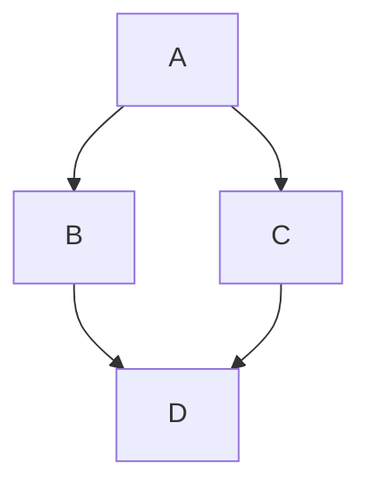
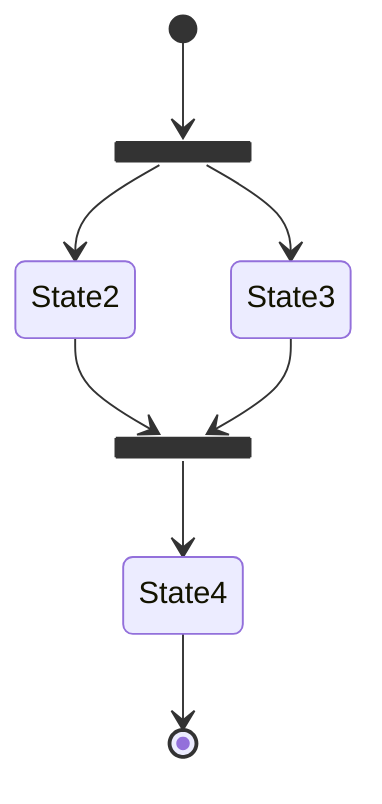
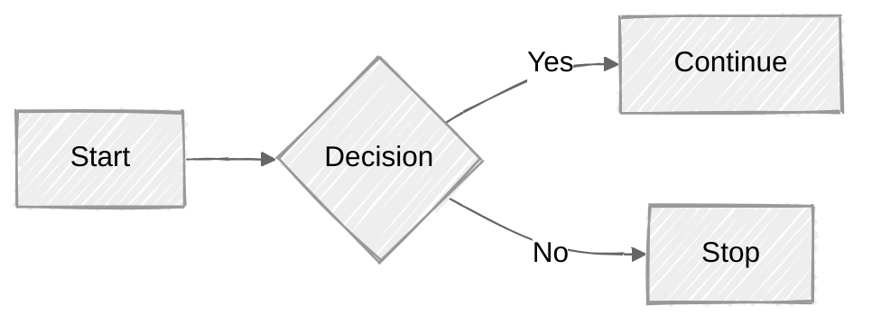
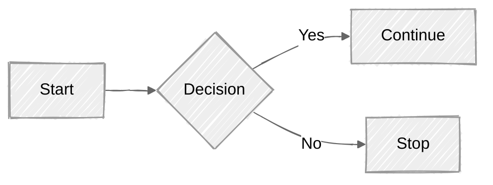
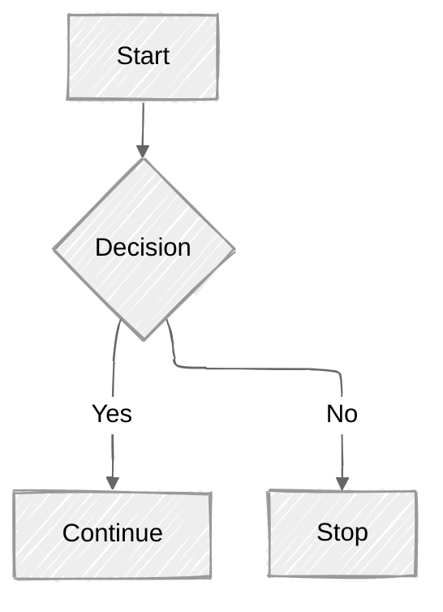

# KaTeX Asset Test

If your self-hosting setup is working correctly, the equations below should look professional and aligned. If they look like raw text or "exploded" symbols, the CSS or Fonts are missing.

## 1. Inline Math

This test verifies that KaTeX is processing text within a paragraph.
The equation $E = mc^2$ should be inline.

**Subscript Test:** The variables $x_1, x_2, \dots, x_n$ should have clear subscripts. (If you see italics but no positioning, the CSS is missing).

## 2. Display Block (The Big Stuff)

This tests the `$$` block syntax and multi-line alignment.

$$
I = \int_{0}^{2\pi} \sin(x) \, dx = 0
$$

## 3. Font & Symbol Stress Test

This verifies that your `/static/katex/fonts/` directory is correctly linked. If you see "boxes" instead of symbols, the fonts didn't download or are in the wrong path.

**Matrix Test:**

$$
\begin{pmatrix}
a & b \\
c & d
\end{pmatrix}
\times
\begin{pmatrix}
1 & 0 \\
0 & 1
\end{pmatrix}
=
\begin{pmatrix}
a & b \\
c & d
\end{pmatrix}
$$

**Greek & Accents:**
$\alpha, \beta, \gamma, \Gamma, \pi, \phi, \sigma, \zeta$.
$\hat{x}, \bar{y}, \tilde{z}$.

## 4. MDX Component Interop

Since this is an `.mdx` file, let's ensure a standard React component doesn't break the math nearby.

import Admonition from "@theme/Admonition";

<Admonition type="info">
  The definition of the derivative is $\lim_{h \to 0} \frac{f(x+h) - f(x)}{h}$.
</Admonition>

---

## Troubleshooting the "Broken" Look

| Symptom                             | Probable Cause     | Fix                                                                        |
| :---------------------------------- | :----------------- | :------------------------------------------------------------------------- |
| **Raw symbols ($ \int $)**          | Plugin missing     | Check `remark-math` and `rehype-katex` in `docusaurus.config.ts`.          |
| **Symbols are stacked/overlapping** | CSS missing        | Check path in `stylesheets` or try `@import` in `custom.css`.              |
| **Missing symbols (empty boxes)**   | Fonts missing      | Ensure `/static/katex/fonts/` is populated with `.woff2` files.            |
| **MDX Error: "Expected X"**         | MDX Brace Conflict | Wrap math in `$` or use `\{` to escape curly braces if using TS variables. |

## Usage

Add a code block with language `mermaid`:

````md title="Example Mermaid diagram"

````


````md

````


````md

````





See the [Mermaid syntax documentation](https://mermaid-js.github.io/mermaid/#/./n00b-syntaxReference) for more information on the Mermaid syntax.
