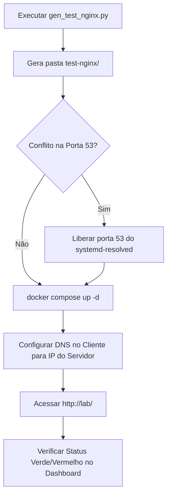

import Tabs from "@theme/Tabs";
import TabItem from "@theme/TabItem";

# Gerador de Stack Mínimo de Teste (`gen_test_nginx.py`)

O script `gen_test_nginx.py` é uma ferramenta em Python desenvolvida para validar a infraestrutura de rede, resolução de nomes (DNS) e roteamento HTTP/Nginx do ambiente de laboratório **sem a necessidade de subir os serviços reais** (como n8n, Node-RED, Gitea e brokers MQTT).

:::tip[Objetivo Principal]
Permite testar rapidamente se a resolução wildcard (\*.lab) e o apontamento IP dos clientes estão funcionando antes de fazer o deploy pesado dos contêineres de cada aluno ou grupo.
:::

---

## 🛠️ O que o Script Gera

Ao executar o script, é criada a pasta `test-nginx/` contendo:

1. **`docker-compose.yml`**: Configuração do Nginx (alpine) e, opcionalmente, do servidor DNS (`dockurr/dnsmasq`).
2. **`dnsmasq.d/lab.conf`**: Configuração do DNS wildcard apontando `*.lab` (ou o domínio definido) para o IP do servidor.
3. **`nginx.conf`**: Regras de roteamento (por **subdomínio** ou por **caminho/path**) respondendo com respostas estáticas leves e endpoints de `/ping` com suporte a CORS.
4. **`html/index.html`**: Dashboard de diagnóstico interativo com Bootstrap que executa um auto-teste automático (ping via `fetch`) em todos os endpoints configurados, exibindo visualmente se o host está acessível (verde) ou inalcançável (vermelho).
5. **`hosts.lab`**: Arquivo de fallback contendo os mapeamentos estáticos IP-hostname para uso direto no arquivo `hosts` do sistema operacional caso o serviço de DNS não possa ser alterado no cliente.

---

## 💻 Parâmetros CLI

| Parâmetro           |   Tipo   |          Padrão          | Descrição                                                                               |
| :------------------ | :------: | :----------------------: | :-------------------------------------------------------------------------------------- |
| `--turma`           | `string` |          `n21`           | Identificador da turma.                                                                 |
| `--grupos`          |  `int`   |           `10`           | Quantidade de grupos a serem gerados (ex: 10 gera de `n21-a` até `n21-j`).              |
| `--dominio`         | `string` |          `lab`           | Domínio base da aplicação (ex: `lab`, `local`, `meulab.internal`).                      |
| `--servicos`        | `string` | `n8n,nodered,gitea,mqtt` | Lista de serviços separados por vírgula.                                                |
| `--ip`              | `string` |       `127.0.0.1`        | IP do servidor de laboratório (usado no DNS e arquivo `hosts.lab`).                     |
| `--porta`           |  `int`   |           `80`           | Porta HTTP do host onde o Nginx irá escutar.                                            |
| `--dns1` / `--dns2` | `string` |  `1.1.1.1` / `1.0.0.1`   | Servidores DNS upstream para consultas fora do laboratório.                             |
| `--grupo`           | `string` |          `None`          | Permite especificar grupos pontuais (ex: `a,c,e` ou `n21-a,p,n`), ignorando `--grupos`. |
| `--sem-dns`         |  `flag`  |         `False`          | Omite o serviço `dnsmasq` do `docker-compose.yml`.                                      |
| `--modo`            | `choice` |       `subdominio`       | Esquema de roteamento: `subdominio` ou `path`.                                          |

---

## 🔄 Modos de Roteamento (`--modo`)

O script oferece dois esquemas principais de mapeamento de rede:

### 1. Modo Subdomínio (`subdominio` - Padrão)

Cada serviço ganha um hostname FQDN exclusivo no formato `<servico>.<turma>-<grupo>.<dominio>`.

- **Exemplos**:
  - `n8n.n21-a.lab`
  - `nodered.n21-a.lab`
  - `gitea.n21-a.lab`
- **Requisito de DNS**: Requer DNS wildcard (`*.lab`) funcional via `dnsmasq` ou arquivo `hosts.lab` expandido com todas as entradas explicitadas.

### 2. Modo Caminho (`path`)

Todos os serviços e grupos compartilham o **mesmo domínio**, sendo diferenciados pela estrutura de caminhos `/caminho`.

- **Exemplos**:
  - `lab/n21-a/n8n/`
  - `lab/n21-a/nodered/`
  - `lab/n21-a/gitea/`
- **Requisito de DNS**: Necessita apenas de um único registro de DNS resolvendo o domínio principal (`lab`).

---

## 🚀 Exemplos de Uso

### 1. Pré-requisitos

- **Python 3.x** instalado.
- **Docker** e **Docker Compose** instalados na máquina do servidor.

### 2. Gerando os Arquivos

Gera a estrutura para 10 grupos na turma `n21`, utilizando o IP da máquina de laboratório `192.168.0.102`.

```bash
# 1. Gerar os arquivos do stack
python3 gen_test_nginx.py --turma n21 --grupos 10 --ip 192.168.0.102

# 2. Subir o ambiente de teste com Docker
cd test-nginx
docker compose up -d

# 3. Testar o portal de diagnóstico no navegador
# Acesse: http://lab/
```

Ideal para ambientes onde não é possível alterar as configurações de DNS dos clientes para aceitar subdomínios wildcard.

```bash
# Gera no modo path na porta 8080 para evitar conflitos
python3 gen_test_nginx.py --turma n22 --grupos 5 --modo path --ip 192.168.1.50 --porta 8080

cd test-nginx
docker compose up -d

# Acesse o portal em:
# [http://192.168.1.50:8080/](http://192.168.1.50:8080/) ou http://lab:8080/
```

Útil para recriar o ambiente apenas para determinados grupos ou rodar em um servidor que já possui um DNS interno configurado.

```bash
# Gera apenas para o grupo 'a', grupo 'b', professor ('p') e painel de notas ('n')
python3 gen_test_nginx.py --turma n21 --grupo a,b,p,n --sem-dns --ip 10.0.0.15

cd test-nginx
docker compose up -d
```

---

## 📋 Passo a Passo de Execução e Homologação



### Liberando a Porta 53 no Linux (`systemd-resolved`)

Se o serviço `dnsmasq` for ativado, a porta 53 do host precisa estar livre. No Ubuntu/Debian modernos, desative o `DNSStubListener`:

```bash
sudo sed -i 's/^#\?DNSStubListener=.*/DNSStubListener=no/' /etc/systemd/resolved.conf
sudo systemctl restart systemd-resolved
```

### Configuração no Cliente

Nos computadores dos alunos/clientes:

- **Com DNS (`dnsmasq`)**: Defina o IP do servidor onde o stack está rodando como o **Servidor DNS Preferencial** das propriedades de IPv4 da rede.
- **Sem DNS (Arquivo `hosts`)**: Copie o conteúdo gerado em `test-nginx/hosts.lab` para:
- **Windows**: `C:\Windows\System32\drivers\etc\hosts`
- **Linux/macOS**: `/etc/hosts`

---

## 🧹 Finalizando o Teste

Após validar que a rede e as rotas estão funcionando corretamente, destrua o stack de teste para liberar a porta 80/53 para os serviços reais:

```bash
cd test-nginx
docker compose down
```

:::note[Observação sobre o MQTT]
No ambiente real do laboratório, o MQTT utiliza conexão TCP direta na porta `1883`. Neste script de teste, o MQTT é disponibilizado temporariamente via HTTP apenas para validação rápida de resolução de nome e alcançabilidade de rede pelo Nginx.
:::
