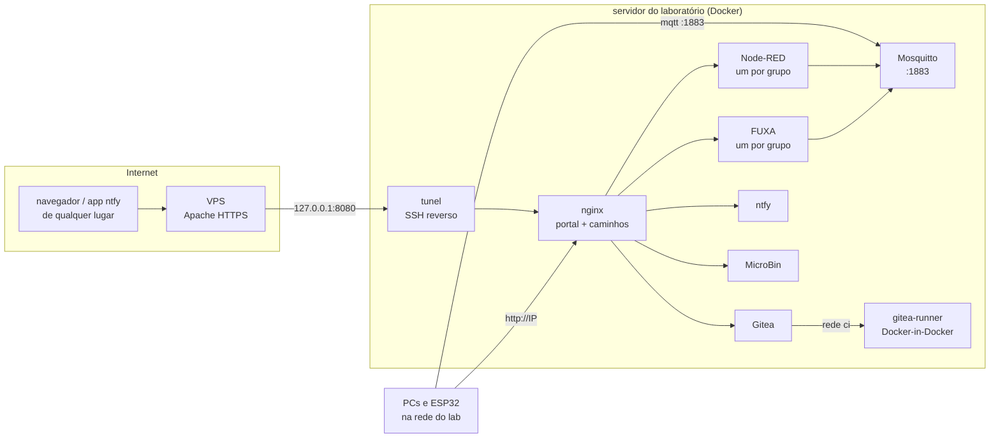

import Tabs from "@theme/Tabs";
import TabItem from "@theme/TabItem";

O **LAB IoT** é o servidor da turma: um Node-RED e um FUXA (SCADA/HMI) por grupo, um broker
MQTT, um Gitea com CI (Gitea Actions), notificações push (ntfy) e um MicroBin para colar
código. Tudo isso fica atrás de **um único endereço**, separado por caminhos, e pode ser
publicado na internet por um túnel SSH, sem abrir portas na rede da instituição.

Nada é montado à mão. O script **`gen_iot_scada_portal.py`** gera a pasta completa
(`docker-compose.yml`, configurações, senhas, páginas de acesso) a partir de poucos parâmetros,
e um `docker compose up -d --build` sobe o laboratório.

:::info[Para quem é este guia]
As seções [Gerar e subir](#gerar) a [Problemas comuns](#problemas) são para quem
**administra** o servidor (o professor). Os grupos encontram o essencial em
[Para os grupos](#grupos) e na página de acesso do repositório do grupo.
:::

## O que tem no portal {/* #servicos */}

Em `<base>`, use `http://<IP do servidor>` na rede do laboratório ou `https://<domínio público>`
de qualquer lugar (com o túnel ligado). Os exemplos usam o lab `lab05`.

| Caminho                   | Serviço                                                             | Um por              | Login                             |
| ------------------------- | ------------------------------------------------------------------- | ------------------- | --------------------------------- |
| `/`                       | Portal (cards para tudo)                                            | lab                 | —                                 |
| `/lab05-a/`               | **Node-RED** do grupo A (editor; dashboard em `/lab05-a/dashboard`) | grupo               | usuário e senha do grupo          |
| `/lab05-p/` · `/lab05-n/` | Node-RED do **professor** · do **painel de notas**                  | —                   | idem                              |
| `/fuxa/lab05-a/`          | **FUXA** (SCADA/HMI) do grupo A                                     | grupo + professor   | ver telas: livre · editar: grupo  |
| `/git/`                   | **Gitea**: uma organização por grupo, com **Gitea Actions**         | lab                 | usuário e senha do grupo          |
| `/ntfy/`                  | **ntfy**: servidor para o app do celular e para o Node-RED          | lab (ACL por grupo) | usuário/senha ou token            |
| `/avisos/`                | página web do ntfy: ler e publicar avisos                           | lab                 | usuário e senha do grupo          |
| `/bin/`                   | **MicroBin**: colar texto/código e enviar arquivos                  | lab                 | usuário e senha de qualquer grupo |
| `:3001`                   | **MQTT Explorer** (só na rede local, porta própria)                 | lab                 | opcional                          |
| `:1883`                   | **broker MQTT** (Mosquitto) para ESP32 e PCs (só na rede local)     | lab                 | anônimo                           |



O túnel **sai** do laboratório até o VPS. O Apache do VPS recebe o HTTPS público e o entrega,
pelo túnel, ao nginx do laboratório. A rede da instituição não precisa abrir nenhuma porta.

## Contas e papéis {/* #contas */}

Cada conta é uma letra do lab. As letras `p` e `n` são reservadas, e os grupos usam as demais
(`a`…`z`, até 24 grupos).

| Conta            | Quem            | Node-RED                                                              | Gitea                                         | ntfy                                                  | FUXA                     | MicroBin            |
| ---------------- | --------------- | --------------------------------------------------------------------- | --------------------------------------------- | ----------------------------------------------------- | ------------------------ | ------------------- |
| `lab05-a` …      | grupo           | o próprio (`/lab05-a/`)                                               | time `grupo` (escrita) na org `lab05-grupo-a` | lê/escreve `lab05-a` e `lab05-a-*`; lê `lab05-avisos` | administrador do próprio | usa                 |
| `lab05-p`        | professor       | o próprio                                                             | **administrador** do site                     | **admin** (publica em `lab05-avisos`)                 | administrador em todos   | painel `/bin/admin` |
| `lab05-n`        | painel de notas | o próprio, com os fluxos de **todos** em `/data_grupos/` (só leitura) | time `avaliacao` (leitura) em todas as orgs   | lê todos os `lab05-*`                                 | —                        | usa                 |
| `lab05-a-view` … | projetor        | **só leitura** no Node-RED do grupo                                   | —                                             | —                                                     | —                        | —                   |

**Uma senha por conta**, a mesma no Node-RED, FUXA, Gitea, MicroBin e ntfy. As senhas são
sorteadas na primeira execução e guardadas em `.segredos.json`. As execuções seguintes as
**reaproveitam**, até você pedir `--novas-senhas`.

## Requisitos {/* #requisitos */}

- **Servidor do laboratório**: Docker com Compose (Docker Desktop no Windows 11 com WSL 2, ou
  Docker Engine no Linux). Reserve **4 núcleos e 8 GB** para uma turma de 8 a 10 grupos com o
  runner do Gitea Actions. Cada job de ESP32 usa ~1 CPU e até 3 GB, além dos Node-RED e FUXA.
- **Python 3** com o pacote `bcrypt`, para rodar o gerador:

  ```bash
  pip install bcrypt
  ```

- A imagem **`ruseler/mqtt-explorer:local`** construída no servidor. O MQTT Explorer usa uma
  imagem local, não a do Docker Hub.
- **Internet** no servidor na primeira subida (imagens Docker, nós do Node-RED, drivers do
  FUXA) e sempre que o CI rodar (actions do github.com, PlatformIO, wokwi-cli).
- **Para publicar na internet** (opcional): um VPS com Apache, `sshd` e um certificado HTTPS
  (certbot) para o domínio.

## Gerar e subir {/* #gerar */}

<Tabs groupId="modo">
<TabItem value="local" label="Só na rede do lab" default>

```bash
py gen_iot_scada_portal.py --lab lab05 --grupos 10 --ip 192.168.0.10 --sem-tunel
cd lab05
docker compose up -d --build
```

O portal fica em `http://192.168.0.10/`. Use o IP **real** do servidor (`ipconfig` ou
`ip addr`): com `127.0.0.1`, ninguém na rede alcança o servidor, e os jobs do Gitea Actions
também não.

</TabItem>
<TabItem value="tunel" label="Com publicação na internet">

```bash
py gen_iot_scada_portal.py --lab lab05 --grupos 10 --ip 192.168.0.10 \
   --publico-url https://iot.exemplo.edu.br
cd lab05
```

Na primeira vez, prepare o túnel e o VPS (veja [Publicar na internet](#tunel)) e então:

```bash
docker compose up -d --build
docker compose logs -f tunel
```

</TabItem>
</Tabs>

A primeira subida demora alguns minutos: ela monta a imagem do Node-RED, com os nós extras, e
baixa as demais imagens. Depois disso:

1. **Confira** `docker compose ps`: tudo `running`, exceto `db-init` e `gitea-init`, que rodam
   uma vez e saem (`exited (0)`).
2. **Veja o `gitea-init`**: `docker compose logs gitea-init` deve terminar em `concluido.`.
   Ele cria o professor (admin), os usuários, as organizações, os times, o repositório inicial
   e os secrets do CI.
3. **Abra o portal** e entre no Node-RED do professor com a conta `lab05-p`.
4. **Distribua os acessos**: `credenciais.txt` tem tudo; as páginas por grupo vão para o
   GitHub com o `publicar-acessos-github.sh` (veja [Distribuir os acessos](#acessos)).

:::warning[`credenciais.txt` e `.segredos.json`]
Esses dois arquivos têm **todas** as senhas e tokens do laboratório. Não os versione, não os
envie a ninguém e faça backup deles junto com os dados. Sem o `.segredos.json`, uma nova
execução sorteia senhas novas, e as credenciais salvas nos nós do Node-RED ficam ilegíveis.
:::

## Opções do gerador {/* #opcoes */}

`py gen_iot_scada_portal.py --help` lista todas. As mais usadas:

### Laboratório

| Opção             | Padrão      | Para quê                                                                              |
| ----------------- | ----------- | ------------------------------------------------------------------------------------- |
| `--lab`           | `lab05`     | prefixo de tudo: caminhos, usuários, tópicos, containers                              |
| `--grupos`        | `10`        | quantidade de grupos (1 a 24)                                                         |
| `--ip`            | `127.0.0.1` | IP do servidor na rede do lab (portal local, MQTT, MQTT Explorer)                     |
| `--saida`         | `<lab>`     | pasta gerada                                                                          |
| `--novas-senhas`  | —           | sorteia senhas novas para **todas** as contas                                         |
| `--proteger-http` | —           | exige login também nos dashboards e endpoints HTTP do Node-RED, e para **ver** o FUXA |
| `--dominio`       | `iot.lab`   | só para os e-mails das contas (`lab05-a@iot.lab`)                                     |

### Serviços opcionais

| Opção                                          | Efeito                                                                                                     |
| ---------------------------------------------- | ---------------------------------------------------------------------------------------------------------- |
| `--sem-gitea`                                  | sem Gitea (e sem CI)                                                                                       |
| `--gitea-db sqlite`                            | Gitea em SQLite, sem o PostgreSQL (padrão: `postgres`)                                                     |
| `--gitea-repo NOME`                            | repositório criado em cada organização (padrão `nodered`; `''` = nenhum)                                   |
| `--sem-runner`                                 | Gitea sem Actions (sem runner)                                                                             |
| `--runner-capacidade N`                        | jobs simultâneos no runner (padrão 2)                                                                      |
| `--runner-imagem`                              | imagem do runner (padrão `docker.io/gitea/runner:3-dind`)                                                  |
| `--runner-dns IP[,IP]`                         | DNS dos containers dos jobs (use o da instituição se a porta 53 externa for bloqueada)                     |
| `--wokwi-token TOKEN`                          | token do Wokwi CI: vira o secret `WOKWI_CLI_TOKEN` de cada organização (`-` remove)                        |
| `--sem-fuxa` · `--sem-ntfy` · `--sem-microbin` | tira o serviço                                                                                             |
| `--mqtt-explorer-auth`                         | exige login no MQTT Explorer (`--mqtt-explorer-usuario`, `--mqtt-explorer-senha`, `--mqtt-explorer-porta`) |

### Publicação e distribuição

| Opção                                              | Padrão                           | Para quê                                                       |
| -------------------------------------------------- | -------------------------------- | -------------------------------------------------------------- |
| `--sem-tunel`                                      | —                                | só rede local                                                  |
| `--publico-url`                                    | `https://iot.adrianoruseler.com` | URL pública (HTTPS, sem caminho)                               |
| `--vps-host` · `--vps-ssh-porta` · `--vps-usuario` | host da URL · `22` · `tunel`     | SSH do túnel                                                   |
| `--vps-porta-tunel`                                | `8080`                           | porta, só em `127.0.0.1` do VPS, onde o túnel entrega o portal |
| `--github-org`                                     | `ELT85B-N21-2026-2`              | organização com os repositórios `<lab>-grupo-<letra>`          |
| `--kit GRUPO`                                      | —                                | gera o [kit do grupo](#kit) para a máquina do aluno            |

## O que é gerado {/* #arquivos */}

```text
lab05/
├── docker-compose.yml        todos os serviços
├── Dockerfile                imagem do Node-RED com os nós extras
├── credenciais.txt           senhas, tokens e endereços (só o professor)
├── .segredos.json            o que é reaproveitado entre execuções (senhas, chaves, tokens)
├── nginx/                    nginx.conf (caminhos), htpasswd, html/ (portal, /avisos/, robots.txt)
├── settings/<conta>.js       settings.js de cada Node-RED (login, caminho, Projects)
├── data/<conta>/             fluxos e credenciais de cada Node-RED
├── fuxa/<conta>/             appdata (projeto e usuários), db (históricos), images, pkg (drivers)
├── mosquitto/                mosquitto.conf
├── mqtt-explorer/data/       conexão pronta com o broker
├── ntfy/server.yml           usuários, ACL e tokens do ntfy
├── gitea/init/gitea-init.sh  usuários, organizações, times, repositório, secrets do CI
├── postgres/init/bancos.sql  banco e usuário do Gitea (com --gitea-db postgres)
├── runner/config.yaml        configuração do runner do Gitea Actions
├── tunel/                    cliente do túnel SSH e a chave (com túnel)
├── vps/                      proxy.conf, página "laboratório desligado" e setup-vps.sh (com túnel)
├── acessos/<conta>.md        página de acesso de cada grupo, do professor e das notas
└── publicar-acessos-github.sh  injeta as páginas de acesso nos repositórios do GitHub
```

**Rodar o gerador de novo é seguro.** Ele regrava as configurações, mantém as senhas e não
toca em `data/` nem nos projetos do FUXA (só re-sincroniza os usuários). Depois, aplique:

```bash
docker compose up -d --build                 # recria só o que mudou
docker compose run --rm gitea-init           # se mudaram usuários, senhas ou secrets do CI
```

## Os serviços {/* #detalhes */}

### Portal e nginx

Um nginx (`<lab>-portal`) é a **única porta HTTP** do servidor (80). Ele serve o portal
estático e encaminha cada caminho ao container certo, com WebSocket (editores do Node-RED,
telas do FUXA, assinaturas do ntfy). Detalhes que evitam dor de cabeça:

- os links são **relativos**: o mesmo portal funciona em `http://IP` e no domínio público;
- o nginx resolve os containers pelo DNS do Docker **a cada acesso**: recriar um Node-RED não
  exige reiniciar o nginx;
- o `robots.txt` pede aos buscadores que não indexem nada.

### Node-RED (um por conta)

Imagem `lab-nodered:latest`, montada pelo `Dockerfile` a partir de `nodered/node-red:latest`,
com: Dashboard 2 (`@flowfuse/node-red-dashboard` e LED), `node-red-node-sqlite`,
`node-red-node-ui-table`, `node-red-contrib-finite-statemachine`, `node-red-contrib-bcrypt` e
os drivers industriais `node-red-contrib-modbus`, `node-red-contrib-s7` e
`node-red-contrib-opcua`.

- **Login**: `lab05-a` (tudo) e `lab05-a-view` (só leitura). O `credentialSecret` é fixo por
  grupo (`.segredos.json`), por isso as credenciais salvas nos nós sobrevivem a novas
  execuções.
- **Projects** ligado: o grupo clona o repositório do Gitea em `http://gitea:3000/lab05-grupo-a/nodered.git`.
- **Variáveis de ambiente** prontas para os fluxos (`env.get("...")`):

  | Variável                                           | Valor                                                                |
  | -------------------------------------------------- | -------------------------------------------------------------------- |
  | `GRUPO`                                            | `lab05-a`                                                            |
  | `NTFY_URL` · `NTFY_TOPIC` · `NTFY_TOKEN`           | `http://ntfy` · `lab05-a` · token do grupo                           |
  | `NTFY_AVISOS`                                      | `lab05-avisos`                                                       |
  | `MICROBIN_URL` · `MICROBIN_AUTH` · `MICROBIN_LINK` | MicroBin interno · `Basic ...` do grupo · link para abrir no celular |

- O fluxo de exemplo `<base>/avisos/exemplo-node-red.json` (aviso no ntfy e relatório longo no
  MicroBin com o link no aviso) usa só essas variáveis e funciona em qualquer grupo.
- O **painel de notas** (`lab05-n`) monta a pasta `data/` inteira em `/data_grupos` (só
  leitura): um fluxo de avaliação lê os `flows.json` de todos os grupos.

### MQTT: Mosquitto e MQTT Explorer

- **Mosquitto** em `IP:1883` (rede local) e `mosquitto:1883` (dentro do Docker). Os tópicos de
  cada grupo começam com o nome da conta: `lab05-a/...`.
- **MQTT Explorer** em `http://IP:3001/`, já conectado ao broker e assinando `#`. Ele não
  funciona em subcaminho, então fica fora do túnel; o caminho `/mqtt` do portal redireciona
  para ele.

:::caution[O broker é aberto]
O Mosquitto aceita conexões **anônimas** e não tem ACL: a separação por tópico
(`lab05-a/...`) é uma **convenção**. Qualquer equipamento na rede do lab lê e publica em
qualquer tópico. A porta 1883 não passa pelo túnel e fica restrita à rede local.
:::

### FUXA (um por grupo + professor)

`frangoteam/fuxa:1.3.4` em `/fuxa/<conta>/`, com usuários **já criados**: o grupo e o professor
como administradores. O `admin/123456` padrão do FUXA não existe. Ver as telas (HMI) não exige
login; editar exige. Com `--proteger-http`, o nginx pede o login do grupo antes de abrir.

- Ligação com o Node-RED: **Conexões → MQTT client**, `mqtt://mosquitto:1883`, tópicos
  `lab05-a/...`; comandos em `lab05-a/cmd/...`.
- Drivers (Modbus, OPC-UA, S7) instalados pelo editor ficam em `fuxa/<conta>/pkg` e
  sobrevivem à recriação do container.
- O Node-RED embutido do FUXA fica desligado: o do grupo já está integrado.

### Gitea e Gitea Actions

`gitea/gitea:28` em `/git/`, com cadastro fechado, login obrigatório até para ver, tudo
privado e acesso só por HTTP (sem SSH). O `gitea-init` deixa pronto:

| Organização                     | Times                                                                         | Repositório                |
| ------------------------------- | ----------------------------------------------------------------------------- | -------------------------- |
| `lab05-grupo-a` (uma por grupo) | `grupo` (escrita, cria repositórios) · `avaliacao` (leitura, conta `lab05-n`) | `nodered` (`--gitea-repo`) |

O professor (`lab05-p`) é administrador do site e dono de todas as organizações.

**Gitea Actions.** Um runner para o lab inteiro (`<lab>-runner`) executa os workflows de
`.gitea/workflows/` de todos os repositórios. Se essa pasta não existir, ele executa os de
`.github/workflows/`. O formato é o do GitHub Actions, e `uses: actions/checkout@v4` vem do
github.com.

- O runner roda em **Docker-in-Docker**, numa rede própria (`ci`) onde só está o Gitea. Cada
  job é um container novo **dentro** do Docker do runner, não privilegiado e sem montar
  pastas do servidor. Os jobs **não** veem o Docker do servidor, a rede interna (`mosquitto`,
  Node-RED) nem os dados dos grupos.
- Os jobs chegam ao Gitea e ao ntfy pela **URL oficial** (`http://IP/...` ou o domínio
  público), que é a `github.server_url` do job.
- Cada organização recebe a variable `NTFY_URL` e os secrets `NTFY_TOPIC` (`lab05-a-ci`),
  `NTFY_TOKEN` (token do grupo **só para o CI**, revogável sem afetar o Node-RED) e, com
  `--wokwi-token`, `WOKWI_CLI_TOKEN`. O grupo usa os valores, mas não os lê nem os troca.
- `--runner-capacidade` define quantos jobs rodam ao mesmo tempo **para a turma toda**.
  Limites por job e cache ficam em `runner/config.yaml`.
- O runner e as runs ficam em `<base>/git/-/admin/actions/runners`. O token de registro é
  fixo (está em `credenciais.txt`) e serve para registrar runners extras, por exemplo num PC
  do laboratório.

:::tip[Aqueça o runner antes da aula]
O primeiro job baixa a imagem dos jobs (`runner-images:ubuntu-latest`, ~1,5 GB), que depois
fica no volume `runner_docker`. Rode um CI num repositório seu antes da aula: senão, todos os
grupos esperam o mesmo download no primeiro push.
:::

### ntfy e a página de avisos

`binwiederhier/ntfy` em `/ntfy/`, com cadastro fechado e acesso negado por padrão. Usuários,
permissões e tokens são **declarados** em `ntfy/server.yml` e re-sincronizados a cada subida.

| Conta           | Tópicos                                                                                     |
| --------------- | ------------------------------------------------------------------------------------------- |
| grupo `lab05-a` | lê/escreve `lab05-a` e `lab05-a-*` (ex.: `lab05-a-alarme`, `lab05-a-ci`); lê `lab05-avisos` |
| professor       | admin: lê e escreve tudo; é quem publica em `lab05-avisos`                                  |
| notas           | lê `lab05-*`                                                                                |

- **No celular**: app ntfy (Android/iOS), servidor `<base>/ntfy`, login do grupo, assinando
  `lab05-a` e `lab05-avisos`.
- **No navegador**: `<base>/avisos/`. Lá dá para ler as últimas 48 h dos tópicos escolhidos e
  publicar com título e prioridade. Um texto longo pode ir para o MicroBin, e o aviso leva o
  link. O app web original do ntfy não funciona em subcaminho; esta página o substitui.
- **No Node-RED**: as variáveis `NTFY_*` já existem (veja o fluxo de exemplo).

### MicroBin

`danielszabo99/microbin:2.1.4` em `/bin/`, um para o lab, com o login de **qualquer** conta.
Serve para colar código, logs e JSON com realce de sintaxe e enviar arquivos (até 50 MB, ou
10 MB criptografados). Os itens são privados, editáveis, com "apagar após ler" e validade
padrão de 24 h (máximo de 1 mês). Painel de administração em `/bin/admin`, com o login do
professor.

```bash title="Pela linha de comando"
curl -u lab05-a:<senha> -F content='texto' -F expiration=24hour -F privacy=unlisted <base>/bin/upload
# resposta 302: o link está no cabeçalho Location (/bin/upload/<id>)
```

## Publicar na internet (túnel + VPS) {/* #tunel */}

O container `tunel` mantém um **SSH reverso** do laboratório até o VPS: a porta
`127.0.0.1:8080` do VPS passa a levar ao nginx do laboratório. O Apache do VPS, que já tem o
HTTPS do domínio, encaminha tudo para essa porta. O túnel reconecta sozinho, e com o
laboratório desligado o Apache mostra a página "laboratório desligado".

Uma vez só:

1. **Gere a chave do túnel** e copie a parte pública:

   ```bash
   docker compose run --rm --no-deps --build tunel chave
   ```

2. **Leve os arquivos ao VPS**:

   ```bash
   ssh ubuntu@iot.exemplo.edu.br mkdir -p iot-lab
   scp -r vps tunel/chave/id_ed25519.pub ubuntu@iot.exemplo.edu.br:iot-lab/
   ```

3. **Prepare o VPS** (é preciso já ter o certificado: `sudo certbot --apache -d <domínio>`):

   ```bash
   ssh -t ubuntu@iot.exemplo.edu.br sudo bash iot-lab/vps/setup-vps.sh iot-lab/id_ed25519.pub
   ```

   O `setup-vps.sh` cria o usuário `tunel`, **sem shell**, que só pode abrir
   `127.0.0.1:8080`. Ele também ajusta o `sshd` para esse usuário, liga os módulos de proxy do
   Apache, insere o `Include` no VirtualHost 443 (com backup e `configtest`) e aumenta o limite
   de conexões do MPM event, porque cada editor ou tela aberta é um WebSocket. No fim, testa o
   domínio. Pode rodar de novo, por exemplo para trocar a chave.

4. **Suba o laboratório**: `docker compose up -d --build` e `docker compose logs -f tunel`.

:::note[Endereços com túnel]
Com o túnel, a URL "oficial" do Gitea (links, clones, `github.server_url` dos jobs) é a
**pública**, que também funciona de dentro do laboratório, desde que ele tenha internet. Sem o
túnel, a URL oficial é `http://IP`.
:::

## Kit do grupo {/* #kit */}

O kit roda na máquina do aluno o mesmo ambiente de **um** grupo (Node-RED, FUXA, Mosquitto e
ntfy), com os mesmos caminhos e nomes de serviço do laboratório. Um fluxo ou uma tela feitos
em casa funcionam no laboratório sem mudança, e vice-versa. Se `<lab>/.segredos.json` existir,
o kit usa a **mesma senha** e o mesmo `credentialSecret` do grupo.

```bash
py gen_iot_scada_portal.py --lab lab05 --kit a                    # lab05-kits/lab05-a + .zip
py gen_iot_scada_portal.py --lab lab05 --grupos 10 --kit todos    # um kit (.zip) por grupo
py gen_iot_scada_portal.py --lab lab05 --kit a --ponte-mqtt 192.168.0.10   # MQTT ligado ao lab
```

- O `.zip` traz um `LEIA-ME.md` com a instalação (Docker Desktop), os endereços e como levar
  fluxos e telas entre o kit e o laboratório (Projects do Node-RED pelo Gitea do lab, ou
  exportar e importar).
- `--ponte-mqtt` liga o broker do kit ao do laboratório **só nos tópicos do grupo**
  (`lab05-a/#`), nos dois sentidos. Funciona com o PC na rede do lab; fora dela, o kit segue
  normal.
- `--porta-http 8080` evita conflito quando a porta 80 da máquina está ocupada.
- O kit não tem Gitea, MicroBin, MQTT Explorer, runner nem túnel. Os nós do Node-RED que usam
  o MicroBin apontam para o do laboratório, pelo endereço público.

## Distribuir os acessos {/* #acessos */}

`acessos/<conta>.md` tem, para cada grupo, o professor e as notas: usuário e senha, endereços
(local e público), permissões, configurações para o Node-RED e o FUXA e os dados do Gitea
Actions. O `publicar-acessos-github.sh` coloca essa página no repositório **privado** de cada
grupo no GitHub (`<org>/<lab>-grupo-<letra>`), usando o GitHub CLI:

```bash
gh auth login                                   # uma vez (no Windows, rode no Git Bash)
bash publicar-acessos-github.sh --dry-run       # mostra o que faria
bash publicar-acessos-github.sh                 # seção no topo do README.md de cada grupo
```

| Opção                           | Efeito                                                                                    |
| ------------------------------- | ----------------------------------------------------------------------------------------- |
| (padrão)                        | seção entre marcadores no topo do `README.md`; as próximas execuções trocam só essa seção |
| `--arquivo`                     | arquivo separado `ACESSO-<LAB>.md`, sem tocar no README                                   |
| `--remover`                     | retira a seção e/ou o arquivo (fim do semestre)                                           |
| `--grupos "a b"` · `--org NOME` | só alguns grupos · outra organização                                                      |

Os commits levam `[skip ci]`, para não disparar o CI dos grupos. Depois de `--novas-senhas`,
publique de novo.

## Operação do dia a dia {/* #operacao */}

| Para                             | Comando (na pasta gerada)                                                               |
| -------------------------------- | --------------------------------------------------------------------------------------- |
| Ver o estado                     | `docker compose ps`                                                                     |
| Logs de um serviço               | `docker compose logs -f lab05-a-nodered` (ou `gitea`, `gitea-runner`, `ntfy`, `tunel`…) |
| Reiniciar o Node-RED de um grupo | `docker compose restart lab05-a-nodered`                                                |
| Aplicar uma nova geração         | `docker compose up -d --build`                                                          |
| Re-sincronizar o Gitea           | `docker compose run --rm gitea-init`                                                    |
| Atualizar as imagens             | `docker compose pull` e `docker compose build --pull` e `docker compose up -d`          |
| Desligar (os dados ficam)        | `docker compose down`                                                                   |

**Trocar todas as senhas.** Rode `--novas-senhas`, depois `docker compose up -d`,
`docker compose run --rm gitea-init` e `bash publicar-acessos-github.sh`. O `credentialSecret`
dos Node-RED **não** muda, então as credenciais salvas nos nós continuam legíveis.

**Novo semestre ou novo lab.** Gere com outro `--lab` (por exemplo, `lab06`) numa pasta nova.
Cada lab tem os próprios containers, volumes e senhas. Antes de subir o novo, desligue o
antigo (`docker compose down`), porque os dois disputam as portas 80, 1883 e 3001.

**Backup.** Guarde a pasta gerada inteira (`data/`, `fuxa/`, `.segredos.json`,
`credenciais.txt`) e os **volumes** do Docker com os dados do Gitea, do PostgreSQL, do ntfy e
do MicroBin. O nome do volume tem o prefixo do projeto, isto é, da pasta:

```bash
docker volume ls | grep lab05
docker run --rm -v lab05_gitea_data:/v -v "$PWD":/b alpine tar czf /b/gitea_data.tgz -C /v .
```

Os volumes `runner_data` e `runner_docker` guardam apenas o cache e as imagens do CI e não
precisam de backup.

## Segurança: o que é isolado e o que não é {/* #seguranca */}

| Isolado                       | Como                                                                                                      |
| ----------------------------- | --------------------------------------------------------------------------------------------------------- |
| Node-RED e FUXA de cada grupo | containers e logins separados (os grupos não editam os dos outros)                                        |
| Repositórios                  | organizações privadas, login obrigatório, times por grupo                                                 |
| Notificações                  | ACL do ntfy: cada grupo só no próprio prefixo                                                             |
| Jobs do CI                    | Docker-in-Docker, rede `ci`, sem privilégios nem pastas do servidor; token do job limitado ao repositório |
| Secrets do CI                 | ficam na organização; o grupo usa, mas não lê                                                             |
| Túnel                         | usuário sem shell no VPS, que só pode abrir `127.0.0.1:<porta>`                                           |

| Não isolado                          | Cuidado                                                                                             |
| ------------------------------------ | --------------------------------------------------------------------------------------------------- |
| Broker MQTT                          | anônimo e sem ACL: tópicos por convenção, só na rede local                                          |
| MicroBin                             | um para todos (os itens são privados, mas o login de qualquer grupo entra)                          |
| HTTP local                           | sem túnel, senhas trafegam sem criptografia na rede do lab; para o `git`, prefira um token do Gitea |
| `credenciais.txt` · `.segredos.json` | têm tudo: só no servidor, com backup protegido                                                      |
| Dashboards do Node-RED               | abertos por padrão; use `--proteger-http` se os dados não puderem ser vistos                        |

## Para os grupos {/* #grupos */}

A página de acesso no repositório do grupo no GitHub tem o usuário, a senha e os endereços.
Em resumo:

- **Node-RED**: `<base>/lab05-a/` (dashboard em `/lab05-a/dashboard`). Nós MQTT: servidor
  `mosquitto`, porta `1883`, tópicos `lab05-a/...`.
- **ESP32 ou PC na rede do lab**: broker `IP:1883`, os mesmos tópicos.
- **FUXA**: `<base>/fuxa/lab05-a/`, conexão _MQTT client_ em `mqtt://mosquitto:1883`.
- **Gitea**: `<base>/git/lab05-grupo-a`. No PC, use um **token** (Configurações → Aplicações)
  no lugar da senha. Workflows em `.gitea/workflows/`, com `runs-on: ubuntu-latest`.
- **Avisos**: app ntfy com servidor `<base>/ntfy` e tópicos `lab05-a` e `lab05-avisos`; ou a
  página `<base>/avisos/`.
- **MicroBin**: `<base>/bin/` para colar código e trocar arquivos.

## Problemas comuns {/* #problemas */}

| Sintoma                                   | Causa provável                                           | O que fazer                                                                                                                                            |
| ----------------------------------------- | -------------------------------------------------------- | ------------------------------------------------------------------------------------------------------------------------------------------------------ |
| Ninguém na rede abre o portal             | gerado com `--ip 127.0.0.1`, ou firewall na porta 80     | gere com o IP real; libere as portas 80, 1883 e 3001                                                                                                   |
| `502` num caminho                         | o container daquele serviço caiu ou está subindo         | `docker compose ps` e `docker compose logs <serviço>`                                                                                                  |
| Página "laboratório desligado" no domínio | túnel desconectado                                       | `docker compose logs -f tunel`; confira a chave no VPS e se o sshd do VPS tem `AllowUsers`                                                             |
| Senha nova não vale no Gitea              | o `gitea-init` não rodou depois da geração               | `docker compose run --rm gitea-init`                                                                                                                   |
| Credenciais dos nós do Node-RED "sumiram" | `.segredos.json` perdido (novo `credentialSecret`)       | restaure o `.segredos.json` do backup e gere de novo                                                                                                   |
| Drivers do FUXA somem ao recriar          | pasta `pkg` ausente (geração antiga)                     | gere de novo: o volume `fuxa/<conta>/pkg` já vem no compose                                                                                            |
| FUXA não conecta no CLP S7 por nome       | o driver S7 só aceita IP                                 | use o IP do container (`docker exec <fuxa> getent hosts <nome>`)                                                                                       |
| Job do CI fica em "Esperando"             | todas as vagas do runner ocupadas, ou runner offline     | veja `<base>/git/-/admin/actions/runners`; `docker compose logs gitea-runner`                                                                          |
| Job falha no `actions/checkout`           | o job não alcança a URL oficial                          | gere com o IP real; com túnel, o servidor precisa de internet; teste com um workflow de diagnóstico                                                    |
| Jobs sem DNS (falha em github.com)        | porta 53 externa bloqueada na instituição                | `--runner-dns <DNS da instituição>`                                                                                                                    |
| Runner extra não registra                 | o token de registro foi "resetado" na interface do Gitea | runners já registrados seguem funcionando; para novos, apague `gitea_runner_token` do `.segredos.json`, gere de novo e recrie `gitea` e `gitea-runner` |
| Mudança no ntfy não aplicou               | —                                                        | `docker compose up -d` (o hash do `server.yml` no rótulo recria o container)                                                                           |
