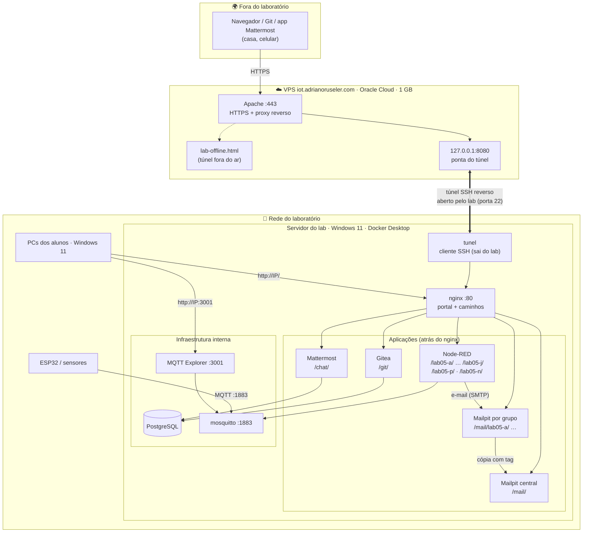
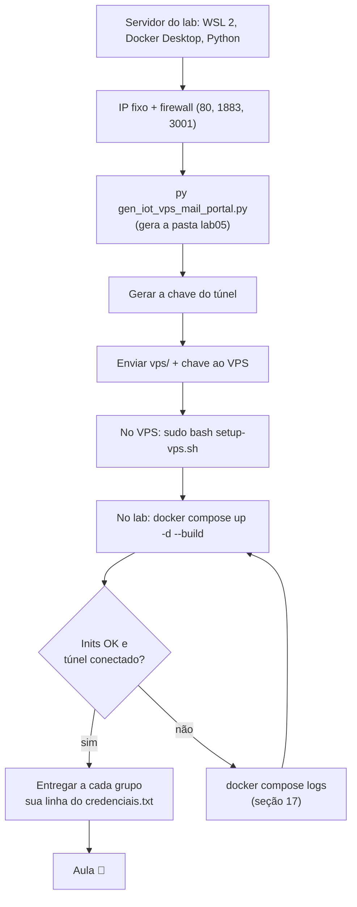
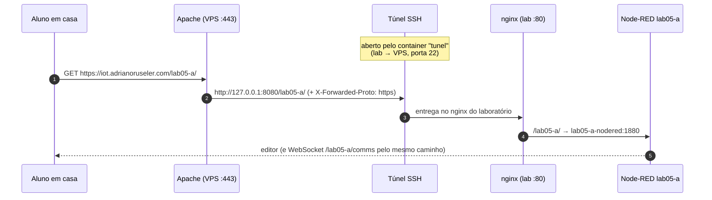
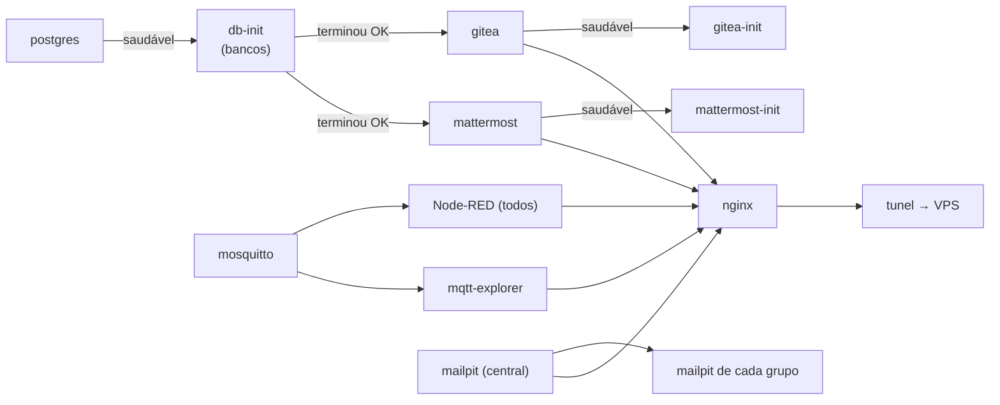
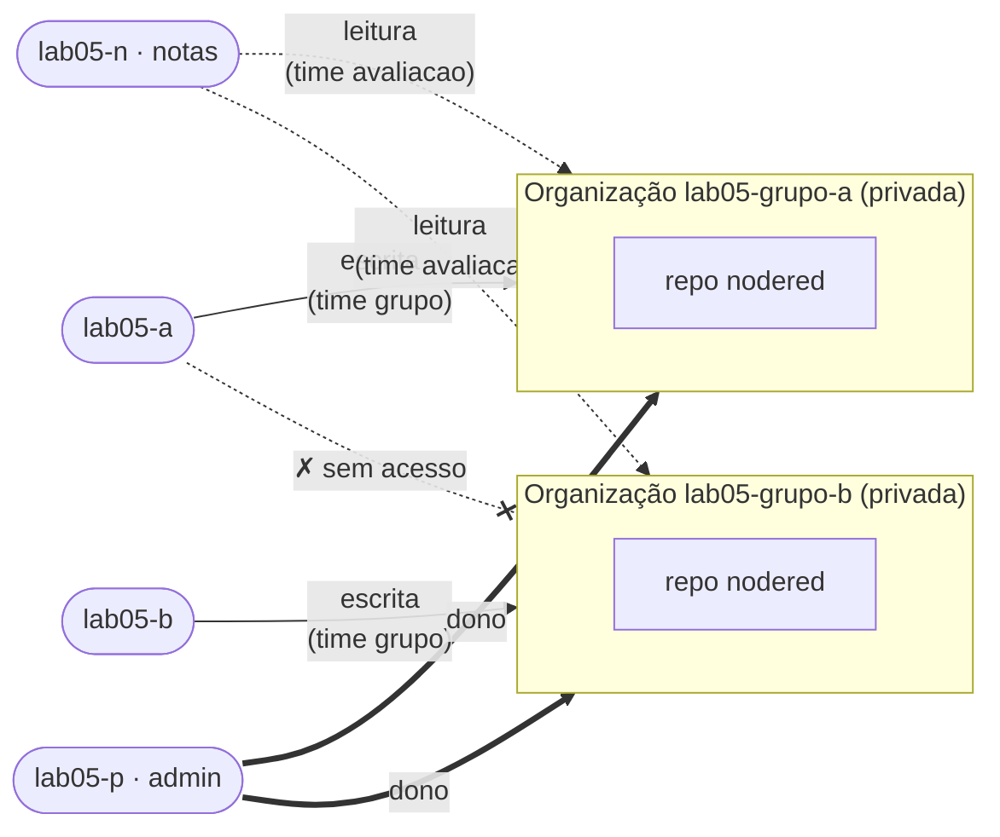
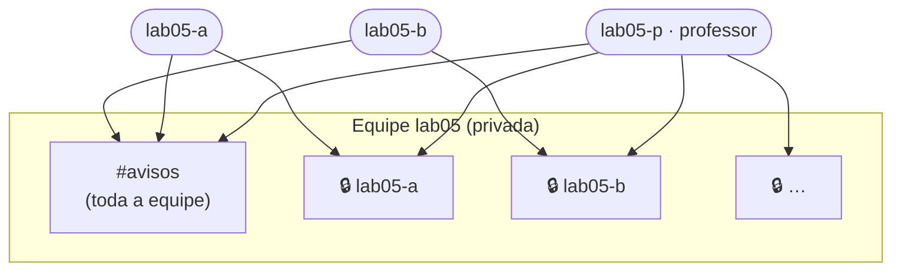
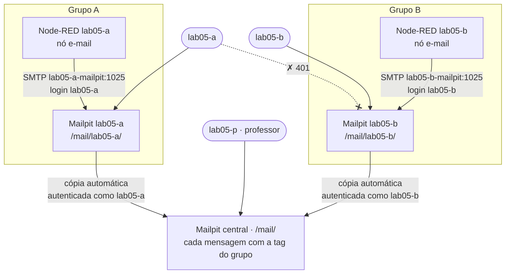
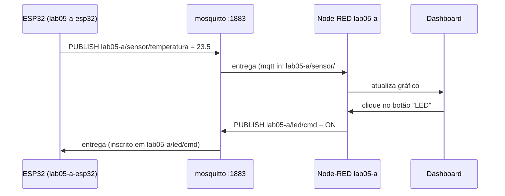
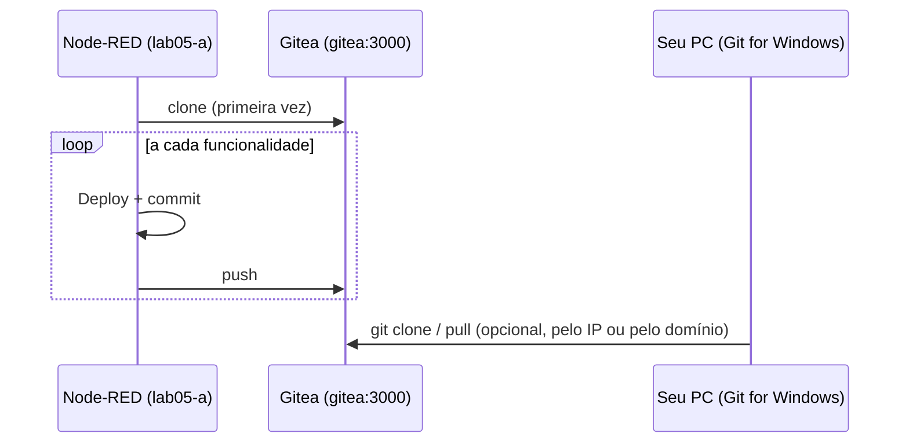

# Guia do LAB IoT Mail

Este guia explica como montar o laboratório da disciplina com o script
**`gen_iot_vps_mail_portal.py`** e como usá-lo no dia a dia.

- **[Parte 1 — Professor](#parte-1--professor)**: preparar o servidor do laboratório (Windows 11)
  e o VPS, gerar o ambiente, publicar na internet e administrar o lab.
- **[Parte 2 — Aluno](#parte-2--aluno)**: acessar no laboratório ou de casa, programar no
  Node-RED, usar MQTT, enviar e-mails de teste, conversar no chat e versionar no Gitea.

:::info[Visão geral em uma frase]
Todos os serviços rodam **no servidor do laboratório** (Windows 11 + Docker Desktop). Na rede do
laboratório, o acesso é direto pelo IP (`http://192.168.0.102/`). De qualquer outro lugar, o acesso é
por **`https://iot.adrianoruseler.com/`**: um **túnel SSH** que **sai** do laboratório leva as
requisições do **Apache do VPS** até o portal. Nenhuma porta precisa ser aberta na rede da instituição.
:::

## Arquitetura



### Dois endereços, o mesmo laboratório

| Onde você está              | Endereço base                           | Observações                                     |
| --------------------------- | --------------------------------------- | ----------------------------------------------- |
| **Na rede do laboratório**  | `http://192.168.0.102` (IP do servidor) | mais rápido; não depende da internet nem do VPS |
| **Em qualquer outro lugar** | `https://iot.adrianoruseler.com`        | HTTPS; só funciona com o servidor do lab ligado |

Os serviços ficam em **caminhos** do endereço base, iguais nos dois casos:

| Serviço                     | Caminho              | No lab | De fora |
| --------------------------- | -------------------- | ------ | ------- |
| Portal                      | `/`                  | ✅     | ✅      |
| Node-RED do grupo A         | `/lab05-a/`          | ✅     | ✅      |
| Dashboard do grupo A        | `/lab05-a/dashboard` | ✅     | ✅      |
| Gitea                       | `/git/`              | ✅     | ✅      |
| Chat (Mattermost)           | `/chat/`             | ✅     | ✅      |
| E-mail do grupo A (Mailpit) | `/mail/lab05-a/`     | ✅     | ✅      |
| E-mail central do professor | `/mail/`             | ✅     | ✅      |
| MQTT Explorer               | porta `3001`         | ✅     | ❌      |
| Broker MQTT                 | porta `1883`         | ✅     | ❌      |

### Convenção de nomes

O nome do lab (`--lab`, padrão `lab05`) é combinado com uma letra:

| Item                      | Nome                                              | Observação                              |
| ------------------------- | ------------------------------------------------- | --------------------------------------- |
| Grupos de alunos          | `lab05-a`, `lab05-b`, …                           | um por grupo (máx. 24)                  |
| Professor                 | `lab05-p`                                         | letra **p** reservada                   |
| Painel de notas           | `lab05-n`                                         | letra **n** reservada                   |
| Organização no Gitea      | `lab05-grupo-a`, …                                | uma por grupo                           |
| Canal privado no chat     | `lab05-a`, …                                      | grupo + professor                       |
| Caixa de e-mail (Mailpit) | `/mail/lab05-a/`, servidor SMTP `lab05-a-mailpit` | uma por grupo; tag `lab05-a` na central |
| Tópicos MQTT do grupo     | `lab05-a/...`                                     | prefixo obrigatório por convenção       |

---

## Parte 1 — Professor

### 1. Visão geral da preparação



### 2. Preparar o servidor do laboratório (Windows 11)

#### 2.1 Hardware recomendado

| Recurso     | Mínimo                   | Recomendado       |
| ----------- | ------------------------ | ----------------- |
| Memória RAM | 8 GB                     | **16 GB** ou mais |
| Disco livre | 20 GB                    | 40 GB (SSD)       |
| Rede        | cabo, na rede dos alunos | cabo + IP fixo    |

Com 10 grupos, o laboratório usa cerca de 3 a 4 GB de RAM: perto de 100 MB por Node-RED, mais o
Mattermost (cerca de 1 GB), o PostgreSQL, o Gitea e os demais serviços.

#### 2.2 Instalar os programas

No **PowerShell como administrador**:

```powershell
wsl --install                          # WSL 2 (reinicie se for pedido)
winget install -e --id Docker.DockerDesktop
winget install -e --id Python.Python.3.12
winget install -e --id Git.Git         # opcional
```

Reinicie o computador e abra o **Docker Desktop** uma vez. Em **Settings → General**, marque
_Use the WSL 2 based engine_ e _Start Docker Desktop when you sign in_. Depois, num PowerShell comum:

```powershell
py -m pip install bcrypt
docker version; docker compose version; py --version
```

:::warning[Energia e suspensão]
O servidor não pode suspender durante a aula, nem quando os alunos acessam de casa. Em
**Configurações → Sistema → Energia**, ajuste a suspensão para **Nunca** quando estiver na tomada.
:::

#### 2.3 Imagem do MQTT Explorer

O laboratório usa a imagem local **`ruseler/mqtt-explorer:local`**, que precisa existir no servidor:

```powershell
docker image ls ruseler/mqtt-explorer          # deve listar a tag "local"
# vinda de outro computador:
docker save -o mqtt-explorer.tar ruseler/mqtt-explorer:local   # na origem
docker load -i mqtt-explorer.tar                                # no servidor
```

#### 2.4 IP fixo, perfil de rede e firewall

1. Descubra o IP com `ipconfig` (**Endereço IPv4**, por exemplo `192.168.0.102`).
2. Fixe-o por **reserva de DHCP** no roteador ou em **Configurações → Rede e Internet → Ethernet →
   Atribuição de IP → Manual**.
3. Deixe a rede como **Privada** e libere as portas usadas **dentro do laboratório**. No PowerShell
   como administrador:

```powershell
Set-NetConnectionProfile -InterfaceAlias "Ethernet" -NetworkCategory Private

New-NetFirewallRule -DisplayName "LAB IoT - HTTP (portal)" -Direction Inbound -Protocol TCP -LocalPort 80   -Action Allow -Profile Private
New-NetFirewallRule -DisplayName "LAB IoT - MQTT"          -Direction Inbound -Protocol TCP -LocalPort 1883 -Action Allow -Profile Private
New-NetFirewallRule -DisplayName "LAB IoT - MQTT Explorer" -Direction Inbound -Protocol TCP -LocalPort 3001 -Action Allow -Profile Private
```

:::tip[O túnel não precisa de porta aberta]
O túnel é uma conexão **de saída** (SSH, porta 22) do servidor do lab até o VPS. Basta que a rede da
instituição permita sair para a porta 22 do VPS. Não é preciso redirecionar portas no roteador nem
pedir liberação de entrada.
:::

### 3. Preparar o VPS

O VPS **não roda** os serviços. Ele só recebe o HTTPS e repassa pelo túnel, o que cabe
folgado em 1 GB de RAM.

Antes de começar, confira:

| Requisito                                                                        | Como verificar no VPS                                           |
| -------------------------------------------------------------------------------- | --------------------------------------------------------------- |
| Apache servindo **HTTPS** para `iot.adrianoruseler.com` (certificado do certbot) | `sudo apache2ctl -S` lista um VirtualHost `*:443` com esse nome |
| Acesso SSH com `sudo` (usuário `ubuntu` na Oracle)                               | `ssh ubuntu@iot.adrianoruseler.com`                             |
| Portas **22** e **443** abertas (Security List da Oracle + firewall)             | já usadas hoje para SSH e o site                                |
| `python3` e `curl`                                                               | já vêm no Ubuntu                                                |

Se ainda não houver certificado:

```bash
sudo certbot --apache -d iot.adrianoruseler.com
```

:::caution[A raiz do domínio passa a ser o laboratório]
Depois do setup, **todo** o `https://iot.adrianoruseler.com/` é encaminhado ao laboratório. Se esse
domínio já mostra outro conteúdo, ele deixa de aparecer. As exceções são a validação do certbot
(`/.well-known/acme-challenge/`) e a página `lab-offline.html`.
:::

### 4. Gerar o ambiente

Coloque o `gen_iot_vps_mail_portal.py` em `C:\lab`, abra o PowerShell nessa pasta e rode:

```powershell
cd C:\lab
py .\gen_iot_vps_mail_portal.py --lab lab05 --grupos 10 --ip 192.168.0.102
```

O script **não sobe nada**: ele só gera os arquivos em `C:\lab\lab05`. Saída (resumida):

```text
🐳 docker-compose.yml
🌐 nginx/nginx.conf
🐙 gitea/init/gitea-init.sh
🐘 postgres/init/bancos.sql
💬 mattermost/init/
🔐 tunel/  e  🌍 vps/ (proxy.conf, lab-offline.html, setup-vps.sh)

✅ lab05: 10 grupos (lab05-a..lab05-j) + professor (lab05-p) + notas (lab05-n)

  Local:   http://192.168.0.102/
  Público: https://iot.adrianoruseler.com/   (túnel SSH -> Apache do VPS iot.adrianoruseler.com)

🌍 Publicação em https://iot.adrianoruseler.com — passos (uma vez):
   1) docker compose run --rm --no-deps --build tunel chave   (gera e mostra a chave)
   2) ssh ubuntu@iot.adrianoruseler.com mkdir -p iot-lab
      scp -r vps tunel/chave/id_ed25519.pub ubuntu@iot.adrianoruseler.com:iot-lab/
   3) ssh -t ubuntu@iot.adrianoruseler.com sudo bash iot-lab/vps/setup-vps.sh iot-lab/id_ed25519.pub
   4) docker compose up -d --build
```

:::tip[Pasta curta e sem OneDrive]
Use uma pasta local e curta como `C:\lab`. Evite **Área de Trabalho** e **Documentos** se estiverem
sincronizados com o OneDrive, porque a sincronização pode travar arquivos usados pelos containers.
:::

#### 4.1 Todos os parâmetros

| Parâmetro                                           | Padrão                           | O que faz                                                                        |
| --------------------------------------------------- | -------------------------------- | -------------------------------------------------------------------------------- |
| `--lab`                                             | `lab05`                          | Nome do lab; prefixo de tudo (deve começar com letra).                           |
| `--grupos`                                          | `10`                             | Quantidade de grupos (1 a 24).                                                   |
| `--ip`                                              | `127.0.0.1`                      | **IP do servidor na rede do lab** (acesso local, MQTT, MQTT Explorer).           |
| `--publico-url`                                     | `https://iot.adrianoruseler.com` | Endereço público servido pelo Apache do VPS.                                     |
| `--vps-host`                                        | host da `--publico-url`          | Host ou IP do VPS para o SSH do túnel.                                           |
| `--vps-ssh-porta`                                   | `22`                             | Porta SSH do VPS.                                                                |
| `--vps-usuario`                                     | `tunel`                          | Usuário restrito criado no VPS para o túnel.                                     |
| `--vps-porta-tunel`                                 | `8080`                           | Porta, **só em 127.0.0.1 do VPS**, onde o túnel entrega o portal.                |
| `--sem-tunel`                                       | desligado                        | Sem publicação: só a rede local (`http://IP/`).                                  |
| `--sem-gitea`                                       | desligado                        | Não inclui o Gitea.                                                              |
| `--gitea-db`                                        | `postgres`                       | Banco do Gitea: `postgres` (compartilhado) ou `sqlite`.                          |
| `--gitea-repo`                                      | `nodered`                        | Repositório criado em cada organização (`''` = nenhum).                          |
| `--sem-chat`                                        | desligado                        | Não inclui o Mattermost.                                                         |
| `--sem-mailpit`                                     | desligado                        | Não inclui o Mailpit (caixas de e-mail de teste).                                |
| `--proteger-http`                                   | desligado                        | Dashboards e endpoints HTTP do Node-RED passam a pedir usuário e senha do grupo. |
| `--novas-senhas`                                    | desligado                        | Sorteia senhas **novas** para todos (por padrão, as senhas são mantidas).        |
| `--dominio`                                         | `iot.lab`                        | Usado só nos e-mails internos das contas (`lab05-a@iot.lab`).                    |
| `--saida`                                           | nome do lab                      | Pasta onde tudo é gerado.                                                        |
| `--mqtt-explorer-auth`                              | desligado                        | Exige login no MQTT Explorer.                                                    |
| `--mqtt-explorer-usuario` / `--mqtt-explorer-senha` | `admin` / gerada                 | Credenciais do MQTT Explorer.                                                    |
| `--mqtt-explorer-porta`                             | `3001`                           | Porta do MQTT Explorer.                                                          |

:::warning[Não esqueça o --ip]
Com o padrão `127.0.0.1`, o lab só funciona **no próprio servidor**. Sempre gere com o IP real da
rede do laboratório.
:::

#### 4.2 Outros exemplos

```powershell
# Dashboards protegidos por senha quando acessados de fora
py .\gen_iot_vps_mail_portal.py --lab lab05 --ip 192.168.0.102 --proteger-http

# Laboratório enxuto: sem chat e Gitea em SQLite (não cria o PostgreSQL)
py .\gen_iot_vps_mail_portal.py --lab lab05 --ip 192.168.0.102 --sem-chat --gitea-db sqlite

# Só rede local, sem VPS
py .\gen_iot_vps_mail_portal.py --lab lab05 --ip 192.168.0.102 --sem-tunel
```

### 5. O que foi gerado

```text
lab05\
├── docker-compose.yml           # todos os serviços (inclui o "tunel")
├── Dockerfile                   # imagem do Node-RED com nós extras
├── credenciais.txt              # ⚠️ senhas e endereços de todos
├── .segredos.json               # ⚠️ senhas e chaves persistentes — NÃO apague
├── nginx\nginx.conf             # um servidor, tudo em caminhos
├── nginx\html\index.html        # portal (links relativos: valem no IP e no domínio)
├── settings\lab05-a.js ...      # configuração de cada Node-RED
├── data\lab05-a\ ...            # fluxos, projetos e bancos SQLite de cada grupo
├── mosquitto\  mqtt-explorer\   # broker e explorer
├── gitea\init\gitea-init.sh     # usuários, organizações, times e repositórios
├── mattermost\init\             # equipe, usuários e canais do chat
├── postgres\init\bancos.sql     # bancos do Gitea e do Mattermost
├── tunel\                       # cliente do túnel SSH
│   ├── Dockerfile, entrypoint.sh
│   └── chave\                   # ⚠️ chave privada do túnel (gerada no 1º uso)
└── vps\                         # vai para o VPS
    ├── setup-vps.sh             # configura usuário, sshd e Apache
    ├── proxy.conf               # trecho do Apache (proxy + WebSocket)
    └── lab-offline.html         # página "laboratório desligado"
```

Bancos, repositórios Git, anexos do chat e e-mails ficam em **volumes do Docker**
(`lab05_postgres_data`, `lab05_gitea_data`, `lab05_mm_*`, `lab05_mailpit_data`,
`lab05_mosquitto_data`). O backup está na [seção 15](#15-operação-do-dia-a-dia).

### 6. Publicar no VPS

Faça isto **uma vez**, no PowerShell, dentro de `C:\lab\lab05`. O Windows 11 já traz `ssh` e `scp`.

**1) Gerar a chave do túnel**

```powershell
docker compose run --rm --no-deps --build tunel chave
```

A chave fica em `tunel\chave\`. A linha `ssh-ed25519 …` exibida é a parte **pública**.

**2) Enviar os arquivos ao VPS**

```powershell
ssh ubuntu@iot.adrianoruseler.com mkdir -p iot-lab
scp -r vps tunel\chave\id_ed25519.pub ubuntu@iot.adrianoruseler.com:iot-lab/
```

**3) Rodar o setup no VPS**

```powershell
ssh -t ubuntu@iot.adrianoruseler.com sudo bash iot-lab/vps/setup-vps.sh iot-lab/id_ed25519.pub
```

```text
[setup-vps] usuário tunel criado
[setup-vps] chave do túnel autorizada (só 127.0.0.1:8080)
[setup-vps] sshd recarregado
[setup-vps] MPM event: limite de conexões simultâneas ajustado para 400
[setup-vps] VirtualHost HTTPS: /etc/apache2/sites-available/iot.adrianoruseler.com-le-ssl.conf
[setup-vps] Include inserido (backup: ...-le-ssl.conf.bak-iot-lab-20261001110743)
[setup-vps] Apache recarregado
[setup-vps] OK: Apache pronto; o túnel ainda não está conectado (página 'laboratório desligado').
```

O `setup-vps.sh` pode rodar de novo quantas vezes for preciso (por exemplo, para trocar a chave).
Ele faz o seguinte:

| Etapa           | O que faz                                                                                                   | Por quê                                                 |
| --------------- | ----------------------------------------------------------------------------------------------------------- | ------------------------------------------------------- |
| Usuário `tunel` | sem senha nem shell; a chave só pode abrir `127.0.0.1:8080`                                                 | se a chave vazar, não dá acesso ao VPS                  |
| sshd            | regras só para `tunel` e detecção de conexão morta a cada 15 s                                              | libera a porta rápido após uma queda                    |
| Apache          | liga `proxy`, `proxy_http`, `proxy_wstunnel`, `headers` e insere o `Include` no VirtualHost 443, com backup | encaminhar HTTPS e WebSocket                            |
| MPM event       | até 400 conexões simultâneas                                                                                | cada editor, dashboard e chat aberto mantém uma conexão |
| Validação       | `apache2ctl configtest`; se falhar, **restaura o backup**                                                   | não derrubar o site                                     |

**4) Subir o laboratório** (próxima seção)

#### Como uma requisição chega ao Node-RED



### 7. Subir o laboratório

```powershell
cd C:\lab\lab05
docker compose up -d --build
```

A primeira subida leva vários minutos. A ordem de inicialização é:



Confira o estado e os logs:

```powershell
docker compose ps -a                       # db-init, gitea-init, mattermost-init: "exited (0)"
docker compose logs gitea-init mattermost-init
docker compose logs -f tunel
```

```text
[tunel] chave pública: ssh-ed25519 AAAAC3Nza... tunel-iot-lab
[tunel] conectando tunel@iot.adrianoruseler.com:22  (VPS 127.0.0.1:8080 -> nginx:80)
Warning: Permanently added 'iot.adrianoruseler.com' (ED25519) to the list of known hosts.
```

Sem novas mensagens depois de "conectando", o túnel está **no ar**. Se ele cair, o container tenta
de novo a cada 10 s.

### 8. Verificar

| Teste                                                 | Onde              | Esperado                                             |
| ----------------------------------------------------- | ----------------- | ---------------------------------------------------- |
| `http://192.168.0.102/`                               | PC na rede do lab | portal com os cartões                                |
| `https://iot.adrianoruseler.com/`                     | celular no 4G     | o mesmo portal, com cadeado                          |
| `https://iot.adrianoruseler.com/` com o lab desligado | qualquer lugar    | página **"O laboratório está desligado no momento"** |
| `http://192.168.0.102:3001/`                          | rede do lab       | MQTT Explorer                                        |
| `http://192.168.0.102/mail/`                          | rede do lab       | pede login; com `lab05-p`, mostra a caixa central    |
| `http://192.168.0.102/robots.txt`                     | qualquer lugar    | `Disallow: /`                                        |

### 9. Credenciais

O `credenciais.txt` traz as senhas e **os dois endereços** de cada serviço. **Um par
usuário/senha por grupo** vale para Node-RED, Gitea, chat e e-mail:

| Usuário               | Node-RED                      | Gitea                                | Chat                                       | E-mail (Mailpit)                          |
| --------------------- | ----------------------------- | ------------------------------------ | ------------------------------------------ | ----------------------------------------- |
| `lab05-a`             | edita o próprio Node-RED      | escreve em `lab05-grupo-a`           | canal privado `lab05-a` + `avisos`         | só a caixa `/mail/lab05-a/`               |
| `lab05-a-view`        | só visualiza                  | —                                    | —                                          | —                                         |
| `lab05-p` (professor) | edita o Node-RED do professor | **administrador**                    | **administrador**, está em todos os canais | caixa central + caixas de todos os grupos |
| `lab05-n` (notas)     | edita o painel de notas       | **leitura** em todas as organizações | —                                          | caixa central                             |

As senhas são **mantidas** quando o script roda de novo (ficam em `.segredos.json`). Para
sortear novas, use `--novas-senhas`.

:::danger[Proteja credenciais.txt, .segredos.json e tunel\chave]
Os três contêm segredos em texto puro. Não os coloque em repositório, em OneDrive compartilhado nem
em pasta acessível aos alunos. Para entregar a senha, copie **só a linha do grupo**.
:::

### 10. Gitea



O `gitea-init` cria, para cada grupo, o usuário (mesma senha do Node-RED), a organização privada,
os times `grupo` (escrita) e `avaliacao` (leitura, para `lab05-n`) e o repositório `nodered` com
`README.md` na branch `main`. O cadastro público fica desligado e é preciso login até para ver.

A imagem do Gitea fica fixada na versão **28** (`gitea/gitea:28`), para que uma versão nova não mude o
comportamento no meio do semestre.

O endereço "oficial" do Gitea (links e URLs de clone exibidos) é o público,
`https://iot.adrianoruseler.com/git/`. Mesmo assim, ele **funciona normalmente pelo IP** dentro do
laboratório. Os repositórios ficam no volume `lab05_gitea_data`, e o banco, no PostgreSQL.

### 11. Chat (Mattermost)



O `mattermost-init` cria:

- a equipe privada **`lab05`**;
- o canal **`avisos`**, com todos;
- um canal **privado** por grupo, só com o grupo e o professor;
- os usuários com as senhas do `credenciais.txt`. `lab05-p` é o administrador do sistema.

As contas são **por grupo**: a mensagem aparece como `lab05-a`, e não com o nome do aluno. Peça aos
alunos que assinem quando isso importar. O app **Mattermost Desktop** ou **mobile** pode ser usado
com o servidor `https://iot.adrianoruseler.com/chat`.

### 12. E-mail de teste (Mailpit)

O **Mailpit** é um servidor de e-mail **de teste**: ele recebe as mensagens e mostra numa página web,
mas **nunca as entrega** a ninguém. Os grupos podem testar alertas por e-mail (nó **e-mail** do
Node-RED, já instalado) sem risco de enviar spam e sem precisar de uma conta de e-mail real.

Um único Mailpit não separa caixas por usuário (quem entra vê tudo). Por isso o laboratório usa
**uma instância por grupo** e uma **caixa central** do professor:



| Caixa    | Endereço         | Quem entra            | O que mostra                              |
| -------- | ---------------- | --------------------- | ----------------------------------------- |
| Do grupo | `/mail/lab05-a/` | o grupo e o professor | só os e-mails daquele grupo               |
| Central  | `/mail/`         | `lab05-p` e `lab05-n` | **todos**, cada um com a **tag** do grupo |

**Como a tag é aplicada:** cada caixa de grupo encaminha uma cópia para a central **autenticando
com o usuário do grupo**, e a central marca a mensagem com esse usuário. A tag não depende do aluno:
ele não precisa colocar nada no e-mail, e um grupo não consegue se passar por outro.

Na caixa central, filtre por grupo digitando na busca:

```text
tag:lab05-a
```

O portal tem um cartão **E-mail (Mailpit)**, que leva à caixa central, e uma linha **"Caixa de e-mail
de cada grupo"** com os links `/mail/lab05-a/`, `/mail/lab05-b/`, …

Cada caixa de grupo guarda até 500 mensagens, e a central até 5.000; as mais antigas são apagadas
automaticamente. Cada instância usa cerca de 20 MB de RAM.

### 13. Painel de notas (`lab05-n`)

O Node-RED de notas monta a pasta `data` de **todos** os grupos, só para leitura, em `/data_grupos`:

```text
/data_grupos/lab05-a/flows.json
/data_grupos/lab05-a/projects/nodered/flows.json   # se o grupo usa Projects
```

Use **read file** (ou `fs` num nó `function`) para analisar os fluxos. O usuário `lab05-n` também
tem leitura em todas as organizações do Gitea.

### 14. Segurança com o laboratório na internet

| Item                                        | Situação                                                                                                                                                   |
| ------------------------------------------- | ---------------------------------------------------------------------------------------------------------------------------------------------------------- |
| Editores Node-RED                           | exigem login (usuário do grupo ou `-view`)                                                                                                                 |
| Gitea e chat                                | exigem login; sem cadastro público                                                                                                                         |
| **Dashboards e endpoints HTTP do Node-RED** | **abertos** por padrão. Use `--proteger-http` para pedir a senha do grupo. Nesse caso, um ESP32 que chame endpoints HTTP também precisa enviá-la.          |
| E-mail (Mailpit)                            | cada caixa exige login; um grupo não vê nem usa a caixa de outro; **nenhum e-mail sai do laboratório**                                                     |
| Broker MQTT e MQTT Explorer                 | **não** são publicados; só na rede do lab                                                                                                                  |
| Chave do túnel                              | só abre `127.0.0.1:8080` no VPS; não tem shell nem outros redirecionamentos                                                                                |
| Buscadores e robôs de IA                    | `robots.txt` com `Disallow: /` e o Apache envia `X-Robots-Tag: noindex, nofollow`. Robôs bem-comportados respeitam; os outros só encontram telas de login. |

As senhas dos grupos têm 8 caracteres. Com o laboratório exposto, evite reutilizá-las em outros
lugares e, ao final do semestre, desligue a publicação ([seção 15.3](#153-fim-do-semestre)).

### 15. Operação do dia a dia

No PowerShell, dentro de `C:\lab\lab05`:

| Tarefa                                   | Comando                                                                          |
| ---------------------------------------- | -------------------------------------------------------------------------------- |
| Ver status                               | `docker compose ps -a`                                                           |
| Logs do túnel                            | `docker compose logs -f tunel`                                                   |
| Reiniciar o túnel                        | `docker compose restart tunel`                                                   |
| Tirar o lab da internet (continua local) | `docker compose stop tunel`                                                      |
| Logs de um grupo                         | `docker compose logs -f lab05-a-nodered`                                         |
| Reiniciar um grupo                       | `docker compose restart lab05-a-nodered`                                         |
| Parar tudo (mantém dados)                | `docker compose down`                                                            |
| Subir de novo                            | `docker compose up -d`                                                           |
| Ver mensagens MQTT                       | `docker exec -it lab05-mosquitto mosquitto_sub -t '#' -v`                        |
| Recriar usuários do Gitea / chat         | `docker compose run --rm gitea-init` / `docker compose run --rm mattermost-init` |
| Logs do e-mail de um grupo               | `docker compose logs -f lab05-a-mailpit`                                         |
| Recarregar o nginx (após regerar)        | `docker compose restart nginx`                                                   |

No VPS:

| Tarefa                       | Comando                                    |
| ---------------------------- | ------------------------------------------ |
| O túnel está conectado?      | `sudo ss -ltnp` e procure `127.0.0.1:8080` |
| Erros do Apache              | `sudo tail -f /var/log/apache2/error.log`  |
| Tentativas de login do túnel | `sudo journalctl -u ssh -f`                |

#### 15.1 Backup

```powershell
cd C:\lab\lab05
New-Item -ItemType Directory -Force backup | Out-Null
$d = Get-Date -Format yyyy-MM-dd

# Bancos (Gitea + chat): gerado dentro do container e copiado (evita UTF-16 do PowerShell)
docker exec lab05-postgres pg_dumpall -U postgres -f /tmp/dump.sql
docker cp lab05-postgres:/tmp/dump.sql ".\backup\postgres_$d.sql"

# Pastas locais e segredos
tar -czf ".\backup\pastas_$d.tgz" data settings credenciais.txt .segredos.json tunel\chave

# Repositórios Git e anexos do chat
docker run --rm -v lab05_gitea_data:/v -v "${PWD}\backup:/b" alpine tar czf /b/gitea_$d.tgz -C /v .
docker run --rm -v lab05_mm_data:/v    -v "${PWD}\backup:/b" alpine tar czf /b/mm_data_$d.tgz -C /v .
docker run --rm -v lab05_mailpit_data:/v -v "${PWD}\backup:/b" alpine tar czf /b/mailpit_$d.tgz -C /v .
```

O prefixo `lab05_` dos volumes vem do nome da pasta. Confira com `docker volume ls`.

#### 15.2 Zerar o Node-RED de um grupo

```powershell
docker compose stop lab05-a-nodered
Rename-Item data\lab05-a lab05-a.old
New-Item -ItemType Directory data\lab05-a | Out-Null
docker compose start lab05-a-nodered
```

#### 15.3 Fim do semestre

```powershell
docker compose down        # para tudo e mantém dados e volumes
docker compose down -v     # ⚠️ APAGA também os volumes (bancos, repositórios, chat, e-mails)
```

Para revogar o acesso do túnel ao VPS, no VPS:

```bash
sudo truncate -s 0 /home/tunel/.ssh/authorized_keys
```

### 16. Regerar o ambiente

| Item                                                 | Ao rodar o script de novo na mesma pasta        |
| ---------------------------------------------------- | ----------------------------------------------- |
| Senhas dos grupos                                    | **mantidas** (use `--novas-senhas` para trocar) |
| Senhas internas, chaves do Node-RED e do Gitea       | **mantidas** (`.segredos.json`)                 |
| Chave do túnel (`tunel\chave`)                       | **mantida**                                     |
| `data\` e volumes                                    | **preservados**                                 |
| `docker-compose.yml`, `nginx\`, `settings\`, scripts | sobrescritos                                    |

Depois de regerar com a turma em andamento:

```powershell
docker compose up -d --build
docker compose restart nginx              # o nginx só relê o nginx.conf ao reiniciar
docker compose run --rm gitea-init        # só necessário com --novas-senhas
docker compose run --rm mattermost-init   # idem
```

:::note[Por que reiniciar o nginx?]
O `nginx.conf` é um arquivo montado no container. Quando só ele muda, o `docker compose up -d` não
recria o nginx, e a configuração nova só vale depois do `restart`. As senhas do Mailpit ficam no
`docker-compose.yml`, então os containers de e-mail são recriados sozinhos pelo `up -d`.
:::

Se você mudou `--publico-url` ou `--vps-porta-tunel`, envie a pasta `vps\` de novo e rode o
`setup-vps.sh` outra vez.

### 17. Problemas comuns

<details>
<summary>O domínio mostra "O laboratório está desligado no momento"</summary>

O túnel não está conectado. No lab, rode `docker compose ps` e `docker compose logs tunel`. O
servidor precisa estar ligado, com o Docker Desktop aberto e com acesso à internet.

</details>

<details>
<summary>tunel: "Permission denied (publickey)"</summary>

O VPS não reconhece a chave. Gere de novo a pública com `docker compose run --rm --no-deps tunel chave`,
envie o `id_ed25519.pub` e rode o `setup-vps.sh` outra vez. Se o sshd do VPS usa `AllowUsers`, inclua
`tunel` nessa lista (o setup avisa).

</details>

<details>
<summary>tunel: "remote port forwarding failed for listen port 8080"</summary>

O VPS ainda mantém a sessão anterior, que caiu sem avisar. O sshd a encerra em até cerca de 45 s e
o container reconecta sozinho. Se persistir, veja se outro programa usa a porta 8080 no VPS
(`sudo ss -ltnp | grep 8080`). Nesse caso, gere com outra `--vps-porta-tunel` e rode o setup de novo.

</details>

<details>
<summary>tunel: "Connection timed out" ao conectar</summary>

A rede da instituição bloqueia a saída para a porta 22. Faça o sshd do VPS escutar também em outra
porta (por exemplo `2222`; a 443 já é do Apache), libere-a na Security List da Oracle e gere com
`--vps-ssh-porta 2222`.

</details>

<details>
<summary>setup-vps.sh: "não achei o VirtualHost *:443"</summary>

O Apache ainda não tem HTTPS para o domínio. Rode `sudo certbot --apache -d iot.adrianoruseler.com` e
execute o setup de novo.

</details>

<details>
<summary>setup-vps.sh avisa sobre MPM "prefork"</summary>

O Apache está em `prefork` (comum com `mod_php`). Nesse modo, cada conexão aberta ocupa um processo
inteiro, e 1 GB de RAM não aguenta a turma. Migre para PHP-FPM + `mpm_event`, ou não use PHP nesse
VPS, e rode o setup de novo.

</details>

<details>
<summary>Funciona pelo domínio mas não pelo IP (ou o contrário)</summary>

- Só o IP falha: confira o perfil de rede **Privado** e o firewall ([seção 2.4](#24-ip-fixo-perfil-de-rede-e-firewall)),
  e se o lab foi gerado com o `--ip` correto.
- Só o domínio falha: é o túnel ou o VPS. Veja os logs do `tunel` e `/var/log/apache2/error.log`.

</details>

<details>
<summary>Um caminho (ex.: /git/) dá 502 Bad Gateway</summary>

O nginx não alcançou o container daquele serviço. Veja se ele está no ar (`docker compose ps`) e os
logs dele (`docker compose logs gitea`). Se o serviço está bem, rode `docker compose logs nginx`. A
mensagem `no resolver defined` indica um `nginx.conf` gerado por uma versão antiga do script: gere de
novo e rode `docker compose restart nginx`.

</details>

<details>
<summary>E-mails aparecem na caixa do grupo, mas não na central</summary>

Veja `docker compose logs lab05-a-mailpit` e procure linhas `[forward]`. A cópia para a central usa o
usuário e a senha do grupo. Se as senhas foram trocadas (`--novas-senhas`), rode
`docker compose up -d` para recriar os containers de e-mail com as senhas novas.

</details>

<details>
<summary>gitea-init ou mattermost-init terminou com erro</summary>

Normalmente o serviço demorou para ficar pronto. Rode de novo: `docker compose run --rm mattermost-init`
(ou `gitea-init`).

</details>

<details>
<summary>Gitea ou chat: "password authentication failed"</summary>

O `.segredos.json` foi apagado ou trocado depois que o PostgreSQL foi criado. Restaure o arquivo e rode
`docker compose up -d`. Sem ele, só resta recriar o volume `lab05_postgres_data`, **perdendo** os
dados do Gitea e do chat.

</details>

---

## Parte 2 — Aluno

### 1. O que você recebe do professor

- A **letra do seu grupo** (ex.: `a`, então seu grupo é `lab05-a`).
- O **usuário e a senha** do grupo. **A mesma senha vale para o Node-RED, o Gitea, o chat e o e-mail.**
- Os dois endereços do laboratório:

| Onde você está               | Abra                                     |
| ---------------------------- | ---------------------------------------- |
| No laboratório               | `http://192.168.0.102/` (IP do servidor) |
| Em casa ou em qualquer lugar | `https://iot.adrianoruseler.com/`        |

Não é preciso configurar nada no Windows: nem DNS, nem arquivo `hosts`.

:::tip[No laboratório, use o IP]
Dentro do laboratório, o endereço pelo IP é mais rápido e funciona mesmo se a internet cair. O
endereço público passa pela internet e pelo VPS.
:::

### 2. Portal e Node-RED

1. Abra o endereço base. Aparecem cartões para cada grupo e para professor, notas, chat, Gitea,
   e-mail e MQTT Explorer, e logo abaixo os links das caixas de e-mail de cada grupo.
2. Clique no cartão do **seu grupo** e entre com o usuário e a senha do grupo.

|                      | No laboratório                           | De fora                                            |
| -------------------- | ---------------------------------------- | -------------------------------------------------- |
| Editor do grupo A    | `http://192.168.0.102/lab05-a/`          | `https://iot.adrianoruseler.com/lab05-a/`          |
| Dashboard do grupo A | `http://192.168.0.102/lab05-a/dashboard` | `https://iot.adrianoruseler.com/lab05-a/dashboard` |

O usuário `lab05-a-view` abre o editor **sem poder alterar nada**. Use-o para apresentar no
projetor.

:::note[Página "O laboratório está desligado no momento"]
Se ela aparecer no endereço público, o servidor do laboratório está desligado ou sem internet.
Isso é normal fora do horário das aulas. Tente mais tarde ou avise o professor no chat.
:::

### 3. Chat do lab

Abra o cartão **Chat** (`/chat/`) e entre com o **usuário e a senha do grupo**.

| Canal                         | Quem vê                      | Para quê             |
| ----------------------------- | ---------------------------- | -------------------- |
| `avisos`                      | todo o lab                   | recados do professor |
| 🔒 `lab05-a` (o do seu grupo) | só o seu grupo e o professor | dúvidas e orientação |
| mensagens diretas             | as duas pontas               | conversa direta      |

Todos do grupo usam a **mesma conta**: comece com o seu nome quando importar ("**Ana:** o sensor
parou…"). Para mostrar código, use três crases antes e depois do trecho. No celular, o app
**Mattermost** funciona com o servidor `https://iot.adrianoruseler.com/chat`.

### 4. E-mail de teste (Mailpit)

Seu grupo tem uma **caixa de e-mail de teste**: tudo o que o Node-RED do grupo enviar por e-mail
aparece em **`/mail/lab05-a/`**, e **nada é entregue de verdade**. Use para testar alertas ("temperatura
acima do limite") sem precisar de uma conta de e-mail. Só o seu grupo e o professor veem essa caixa.

**Enviar pelo Node-RED** com o nó **e-mail** (saída, da categoria _social_):

| Campo do nó           | Valor                                                      |
| --------------------- | ---------------------------------------------------------- |
| To                    | qualquer endereço, até inventado (ex.: `dono@exemplo.com`) |
| Server                | `lab05-a-mailpit` (troque a letra pela do seu grupo)       |
| Port                  | `1025`                                                     |
| Use secure connection | **desmarcado**                                             |
| Auth type             | Basic                                                      |
| Userid / Password     | usuário e senha do grupo                                   |

O **assunto** vem de `msg.topic`, e o **texto**, de `msg.payload`. Exemplo de nó `function` antes do
nó e-mail:

```js
msg.topic = "Alerta: temperatura alta";
msg.payload = `A temperatura chegou a ${msg.payload} °C às ${new Date().toLocaleTimeString("pt-BR")}.`;
return msg;
```

Abra `/mail/lab05-a/`, entre com o usuário e a senha do grupo e veja a mensagem chegar na hora.
O professor recebe uma cópia na caixa central, marcada com a tag do seu grupo.

:::warning[Use o servidor do seu grupo]
O servidor `lab05-a-mailpit` só aceita o login do grupo A. Se o nó mostrar erro de autenticação,
confira se a letra do servidor é a do seu grupo e se a senha está certa.
:::

### 5. MQTT

O broker MQTT só existe **na rede do laboratório**.



| Cliente                                     | Servidor (host)                  | Porta  |
| ------------------------------------------- | -------------------------------- | ------ |
| Node-RED do grupo (no servidor)             | `mosquitto`                      | `1883` |
| ESP32, celular, MQTTX, Python (rede do lab) | IP do servidor (`192.168.0.102`) | `1883` |

O broker não pede usuário nem senha. No Node-RED:

1. Arraste um nó **mqtt in** ou **mqtt out**.
2. Em _Server_, crie o broker com **Server** `mosquitto` e **Port** `1883`.
3. Em _Topic_, use o prefixo do grupo (ex.: `lab05-a/sensor/#`).
4. Clique em **Deploy**. O nó deve mostrar **connected**.

Mesmo editando o Node-RED **de casa**, os nós MQTT continuam funcionando, porque eles rodam no
servidor do laboratório. O que só funciona no laboratório é ligar dispositivos e clientes **seus** ao
broker.

```cpp
const char* MQTT_HOST = "192.168.0.102";   // IP do servidor do laboratório
const int   MQTT_PORT = 1883;

client.setServer(MQTT_HOST, MQTT_PORT);
client.connect("lab05-a-esp32");          // client id único por dispositivo
client.publish("lab05-a/sensor/temperatura", "23.5");
client.subscribe("lab05-a/led/cmd");
```

:::warning[Respeite os tópicos dos outros grupos]
O broker é compartilhado e não bloqueia tópicos. Publicar fora do seu prefixo atrapalha os outros
grupos e a avaliação.
:::

### 6. MQTT Explorer

Na rede do laboratório, abra o cartão **MQTT Explorer** (`http://192.168.0.102:3001/`). Ele já vem
conectado ao broker. Expanda `lab05-a` para ver as mensagens do grupo. Se pedir login, use as
credenciais **do MQTT Explorer** informadas pelo professor.

### 7. Banco de dados SQLite

O nó **sqlite** está instalado. Grave o banco dentro da pasta de dados do Node-RED:

```text
Database: /data/meu_banco.db
```

### 8. Gitea: versionar o projeto

Seu grupo tem a organização privada **`lab05-grupo-a`** com o repositório **`nodered`**.



#### 8.1 Entrar no Gitea

Abra o cartão **Gitea** (`/git/`) e entre com o **mesmo usuário e senha** do grupo.

#### 8.2 Ligar o Node-RED ao repositório (Projects)

1. No primeiro acesso, o Node-RED abre o assistente de projetos. Informe nome e e-mail para os
   commits (ex.: `Grupo A`, `lab05-a@iot.lab`).
2. Escolha **Clone Repository**:

   | Campo          | Valor                                         |
   | -------------- | --------------------------------------------- |
   | Repository URL | `http://gitea:3000/lab05-grupo-a/nodered.git` |
   | Username       | `lab05-a`                                     |
   | Password       | senha do grupo                                |

   Use **`gitea:3000`**, o nome interno do Docker. O Node-RED roda dentro do servidor, e esse
   endereço funciona tanto no laboratório quanto de casa.

3. Defina uma **chave de criptografia das credenciais** e anote-a.
4. Se o Node-RED avisar que faltam arquivos do projeto (`package.json` ou o arquivo de fluxos),
   aceite criá-los.

No dia a dia, use a aba **Project history**:

- **commit**: em _Local changes_, marque os arquivos, clique em **commit** e escreva a mensagem;
- **push**: clique na seta ↑ para enviar ao Gitea.

:::tip[Commits pequenos e frequentes]
Faça um commit a cada funcionalidade que funcionar ("leitura do sensor ok",
"dashboard com gráfico"). O histórico ajuda o grupo a voltar atrás e mostra ao professor a
evolução do trabalho.
:::

#### 8.3 Clonar no seu PC (opcional)

Instale o Git for Windows (`winget install -e --id Git.Git`) e, no PowerShell:

<Tabs groupId="local">
<TabItem value="lab" label="No laboratório" default>

```powershell
git clone http://192.168.0.102/git/lab05-grupo-a/nodered.git
```

</TabItem>
<TabItem value="fora" label="De fora">

```powershell
git clone https://iot.adrianoruseler.com/git/lab05-grupo-a/nodered.git
```

</TabItem>
</Tabs>

O **Git Credential Manager** pede o usuário (`lab05-a`) e a senha do grupo. Em computador
compartilhado, remova a credencial ao final em **Painel de Controle → Gerenciador de Credenciais →
Credenciais do Windows**.

### 9. Boas práticas

- Dê **Deploy** com frequência e teste com nós **debug**.
- Faça commit e push no Gitea ao fim de cada aula.
- Não guarde senhas reais em nós `function` ou `template`. Lembre que o dashboard pode estar acessível
  pela internet.
- Se o seu Node-RED ficar fora do ar, avise no **canal privado do grupo**.

### 10. Problemas comuns

| Sintoma                                     | Causa provável                            | O que fazer                                                |
| ------------------------------------------- | ----------------------------------------- | ---------------------------------------------------------- |
| "O laboratório está desligado no momento"   | servidor do lab desligado ou sem internet | tente mais tarde; no lab, use o IP                         |
| O IP não abre, no laboratório               | rede diferente (ex.: Wi-Fi de visitantes) | conecte-se à rede do laboratório                           |
| Login recusado                              | usuário ou senha errados                  | o usuário é `lab05-a` (sem `-view`); diferencia maiúsculas |
| Nó MQTT em _disconnected_                   | servidor errado no nó                     | use `mosquitto` e porta `1883`                             |
| ESP32 não conecta                           | fora da rede do lab ou IP errado          | o broker só existe na rede do laboratório                  |
| MQTT Explorer não abre de casa              | ele é só local                            | use-o no laboratório                                       |
| Clone no Node-RED falha                     | URL externa                               | use `http://gitea:3000/...` dentro do Node-RED             |
| "Repository not found"                      | organização de outro grupo                | cada grupo só acessa a sua                                 |
| Nó e-mail: erro de autenticação             | servidor de outro grupo ou senha errada   | use `lab05-<sua letra>-mailpit` e a senha do grupo         |
| Nó e-mail: erro de TLS/conexão              | conexão segura marcada                    | desmarque _Use secure connection_; porta `1025`            |
| A caixa `/mail/lab05-a/` pede senha de novo | login de outro grupo                      | cada caixa só aceita o próprio grupo                       |

---

## Referência rápida

<Tabs groupId="papel">
<TabItem value="prof" label="Professor" default>

```powershell
# no servidor do laboratório (uma vez)
py -m pip install bcrypt
cd C:\lab
py .\gen_iot_vps_mail_portal.py --lab lab05 --grupos 10 --ip 192.168.0.102
cd .\lab05
docker compose run --rm --no-deps --build tunel chave
ssh ubuntu@iot.adrianoruseler.com mkdir -p iot-lab
scp -r vps tunel\chave\id_ed25519.pub ubuntu@iot.adrianoruseler.com:iot-lab/
ssh -t ubuntu@iot.adrianoruseler.com sudo bash iot-lab/vps/setup-vps.sh iot-lab/id_ed25519.pub
docker compose up -d --build
docker compose logs -f tunel
notepad credenciais.txt
```

</TabItem>
<TabItem value="aluno" label="Aluno">

| O quê                       | Onde                                                  |
| --------------------------- | ----------------------------------------------------- |
| Portal (no laboratório)     | `http://192.168.0.102/`                               |
| Portal (de fora)            | `https://iot.adrianoruseler.com/`                     |
| Node-RED do grupo           | `/lab05-<letra>/`                                     |
| Chat                        | `/chat/` (mesma senha)                                |
| Gitea                       | `/git/` (mesma senha)                                 |
| E-mail do grupo             | `/mail/lab05-<letra>/` (mesma senha)                  |
| SMTP no Node-RED            | `lab05-<letra>-mailpit:1025`, sem TLS, login do grupo |
| Broker no Node-RED          | `mosquitto:1883`                                      |
| Broker no ESP32 (só no lab) | `192.168.0.102:1883`                                  |
| Tópicos                     | `lab05-<letra>/...`                                   |
| Repositório no Node-RED     | `http://gitea:3000/lab05-grupo-<letra>/nodered.git`   |

</TabItem>
</Tabs>
