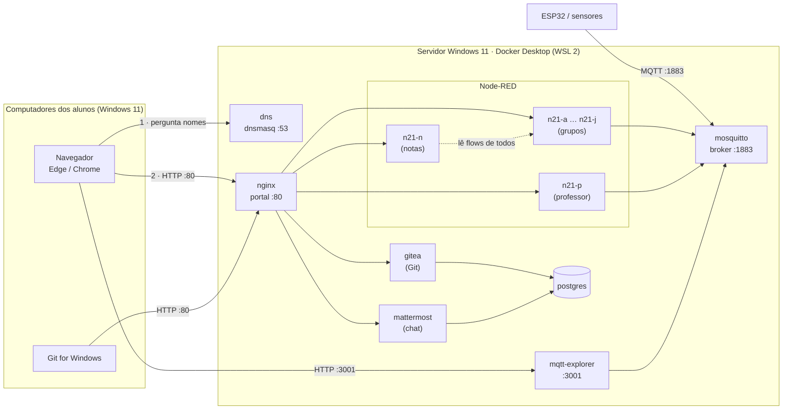
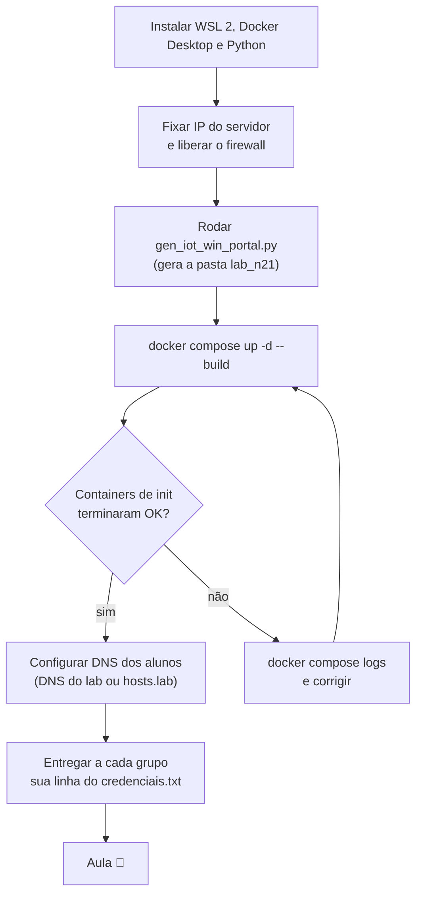
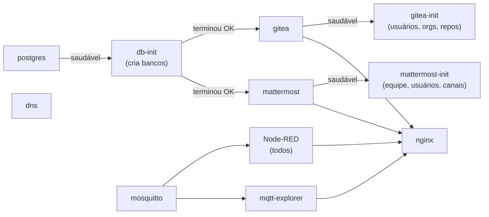
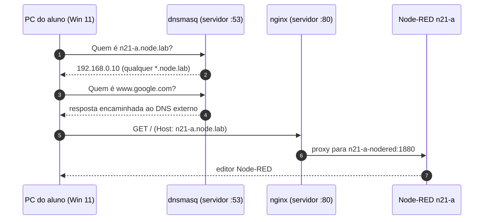
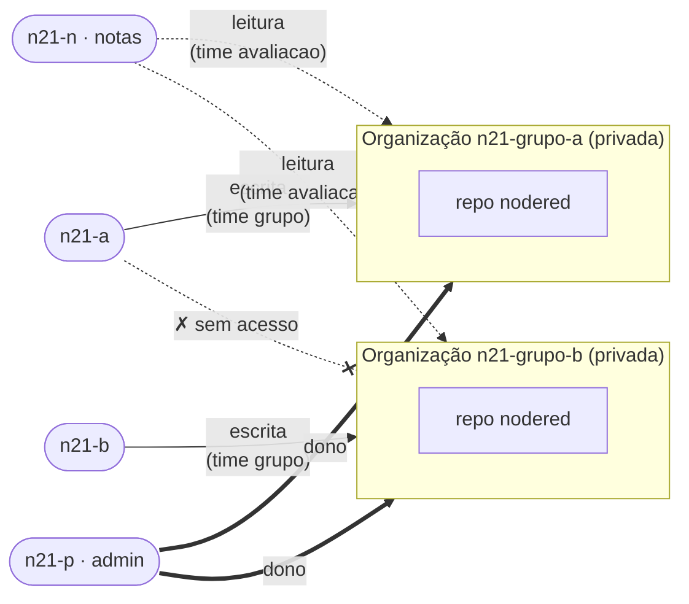
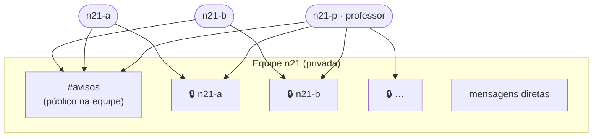
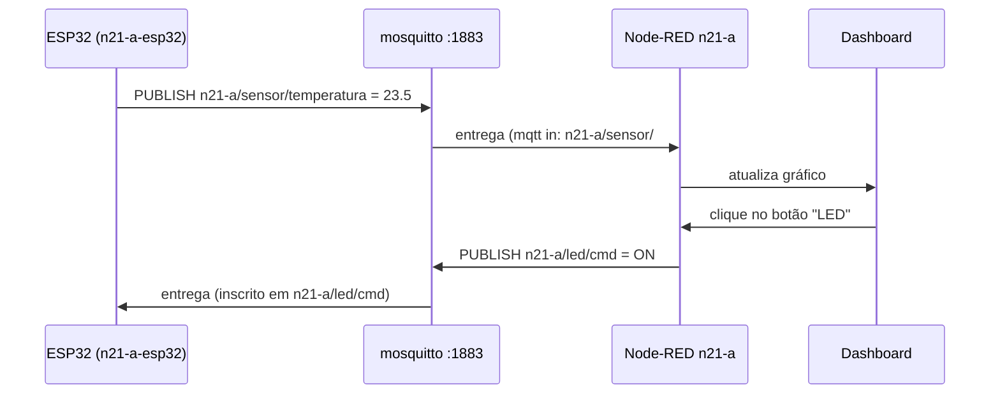
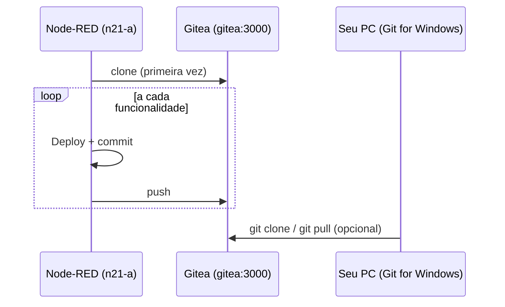

# Guia do LAB IoT

Este guia explica como montar o laboratório da disciplina com o script
`gen_iot_win_portal.py` e como usá-lo no dia a dia. **Todos os computadores usam Windows 11**:
o servidor (computador do professor ou do laboratório) e as máquinas dos alunos.

- **[Parte 1 — Professor](#parte-1--professor)**: preparar o servidor Windows 11, gerar o
  ambiente, subir os containers, configurar a rede e administrar a turma.
- **[Parte 2 — Aluno](#parte-2--aluno)**: configurar o Windows 11, acessar o portal,
  programar no Node-RED, usar MQTT, conversar no chat e versionar no Gitea.

:::info[Visão geral em uma frase]
Um servidor Windows 11 com **Docker Desktop** roda um **portal web** que dá acesso a
**um Node-RED por grupo**, a um **broker MQTT**, ao **MQTT Explorer**, a um **Gitea**
(uma organização por grupo) e a um **chat Mattermost** (um canal privado por grupo).
Um **DNS próprio** faz os nomes `*.node.lab` funcionarem em todas as máquinas, e todos os
usuários e senhas são gerados automaticamente.
:::

## Arquitetura



### Convenção de nomes

O identificador da turma (`--turma`, padrão `n21`) é combinado com uma letra:

| Item                  | Nome                            | Observação                        |
| --------------------- | ------------------------------- | --------------------------------- |
| Grupos de alunos      | `n21-a`, `n21-b`, `n21-c`, …    | um por grupo                      |
| Professor             | `n21-p`                         | letra **p** reservada             |
| Painel de notas       | `n21-n`                         | letra **n** reservada             |
| Organização no Gitea  | `n21-grupo-a`, `n21-grupo-b`, … | uma por grupo                     |
| Canal privado no chat | `n21-a`, `n21-b`, …             | grupo + professor                 |
| Tópicos MQTT do grupo | `n21-a/...`                     | prefixo obrigatório por convenção |

As letras **p** e **n** nunca vão para grupos, por isso o máximo é **24 grupos**.
O identificador da turma deve começar com letra e ter só letras e dígitos.

---

## Parte 1 — Professor

### 1. Visão geral da preparação



### 2. Preparar o servidor Windows 11

#### 2.1 Hardware recomendado

| Recurso     | Mínimo                         | Recomendado       |
| ----------- | ------------------------------ | ----------------- |
| Memória RAM | 8 GB                           | **16 GB** ou mais |
| Disco livre | 20 GB                          | 40 GB (SSD)       |
| Rede        | cabo, na mesma rede dos alunos | cabo + IP fixo    |

Com 10 grupos, o laboratório usa algo como 3 a 4 GB de RAM: cerca de 100 MB por Node-RED,
mais o Mattermost (cerca de 1 GB), o PostgreSQL, o Gitea e os demais serviços.

#### 2.2 Instalar os programas

Abra o **PowerShell como administrador** (menu Iniciar → digite _PowerShell_ → _Executar
como administrador_) e rode:

```powershell
wsl --install                          # WSL 2 (reinicie o computador se for pedido)
winget install -e --id Docker.DockerDesktop
winget install -e --id Python.Python.3.12
winget install -e --id Git.Git         # opcional, útil para testar o Gitea
```

Depois, **reinicie** o computador e abra o **Docker Desktop** uma vez para concluir a
configuração. Em **Settings**:

- **General** → marque _Use the WSL 2 based engine_ e _Start Docker Desktop when you sign in_;
- **Resources** → confira se a memória disponível é suficiente (ajustável pelo arquivo
  `%UserProfile%\.wslconfig`, se precisar).

Instale a biblioteca do script, em um PowerShell **comum**:

```powershell
py -m pip install bcrypt
```

Confira se tudo responde:

```powershell
docker version
docker compose version
py --version
```

:::warning[Energia e suspensão]
O servidor não pode entrar em suspensão durante a aula. Em **Configurações → Sistema →
Energia**, ajuste _Colocar o dispositivo em suspensão_ para **Nunca** quando conectado à energia.
:::

#### 2.3 Imagem do MQTT Explorer

O laboratório usa a imagem **`ruseler/mqtt-explorer:local`**. Ela é local (tag `:local`),
então precisa existir no servidor antes da subida:

```powershell
docker image ls ruseler/mqtt-explorer          # deve listar a tag "local"

# Se a imagem está em outro computador:
docker save -o mqtt-explorer.tar ruseler/mqtt-explorer:local   # na origem
docker load -i mqtt-explorer.tar                                # no servidor
```

#### 2.4 IP fixo do servidor

Todos os endereços apontam para o IP do servidor, então ele não pode mudar.

1. Descubra o IP atual com `ipconfig` (linha **Endereço IPv4**, por exemplo `192.168.0.10`).
2. Fixe-o de uma das formas:
   - **reserva de DHCP** no roteador (melhor, se você tiver acesso); ou
   - **Configurações → Rede e Internet → Ethernet → Atribuição de IP → Editar → Manual**.

#### 2.5 Perfil de rede e firewall

A rede precisa estar como **Privada**, e as portas do laboratório, liberadas. No **PowerShell
como administrador**:

```powershell
Get-NetConnectionProfile                                   # veja o nome da interface
Set-NetConnectionProfile -InterfaceAlias "Ethernet" -NetworkCategory Private

New-NetFirewallRule -DisplayName "LAB IoT - HTTP (portal)"  -Direction Inbound -Protocol TCP -LocalPort 80   -Action Allow -Profile Private
New-NetFirewallRule -DisplayName "LAB IoT - MQTT"           -Direction Inbound -Protocol TCP -LocalPort 1883 -Action Allow -Profile Private
New-NetFirewallRule -DisplayName "LAB IoT - MQTT Explorer"  -Direction Inbound -Protocol TCP -LocalPort 3001 -Action Allow -Profile Private
New-NetFirewallRule -DisplayName "LAB IoT - DNS (UDP)"      -Direction Inbound -Protocol UDP -LocalPort 53   -Action Allow -Profile Private
New-NetFirewallRule -DisplayName "LAB IoT - DNS (TCP)"      -Direction Inbound -Protocol TCP -LocalPort 53   -Action Allow -Profile Private
```

Se o Windows exibir um alerta de firewall para o **Docker Desktop Backend**, permita o acesso
em **redes privadas**.

### 3. Gerar o ambiente

Coloque o `gen_iot_win_portal.py` numa pasta de trabalho, por exemplo `C:\lab`, abra o
PowerShell nela e rode:

```powershell
cd C:\lab
py .\gen_iot_win_portal.py --turma n21 --grupos 10 --ip 192.168.0.10
```

O script **não sobe nada**: ele só gera os arquivos dentro de `C:\lab\lab_n21`. Saída (resumida):

```text
🐝 mosquitto.conf gerado com sucesso.
📦 Dockerfile gerado com sucesso.
🔭 mqtt-explorer/data/settings.json gerado com sucesso.
🐙 gitea/init/gitea-init.sh gerado com sucesso.
🐘 postgres/init/bancos.sql gerado com sucesso.
💬 mattermost/init/mattermost-init.sh gerado com sucesso.
🧭 dnsmasq/dnsmasq.conf gerado com sucesso.
🔒 As credenciais foram salvas em 'credenciais.txt'.
🌐 hosts.lab gerado com sucesso.
...
▶  Para subir:  cd C:\lab\lab_n21 && docker compose up -d --build
```

:::tip[Pasta curta e sem OneDrive]
Use uma pasta curta e local, como `C:\lab`. Evite **Área de Trabalho** e **Documentos**
quando estiverem sincronizados com o OneDrive, porque a sincronização pode travar arquivos
que os containers estão usando.
:::

#### 3.1 Todos os parâmetros

| Parâmetro                 | Padrão            | O que faz                                                                        |
| ------------------------- | ----------------- | -------------------------------------------------------------------------------- |
| `--turma`                 | `n21`             | Identificador da turma; prefixo de todos os nomes.                               |
| `--grupos`                | `10`              | Quantidade de grupos de alunos (máx. 24).                                        |
| `--dominio`               | `node.lab`        | Domínio base do laboratório.                                                     |
| `--ip`                    | `127.0.0.1`       | **IP do servidor.** Usado no DNS, no `hosts.lab` e nas origens do MQTT Explorer. |
| `--modo`                  | `subdominio`      | `subdominio`: um host por serviço. `path`: um domínio, vários caminhos.          |
| `--saida`                 | `lab_<turma>`     | Pasta onde **todos** os arquivos são gerados.                                    |
| `--sem-gitea`             | desligado         | Não inclui o Gitea.                                                              |
| `--gitea-db`              | `postgres`        | Banco do Gitea: `postgres` (compartilhado) ou `sqlite`.                          |
| `--gitea-repo`            | `nodered`         | Repositório criado em cada organização (`''` = nenhum).                          |
| `--sem-chat`              | desligado         | Não inclui o Mattermost.                                                         |
| `--sem-dns`               | desligado         | Não inclui o DNS do laboratório (dnsmasq).                                       |
| `--dns-upstream`          | `1.1.1.1,8.8.8.8` | DNS externos usados para os demais nomes (internet).                             |
| `--mqtt-explorer-auth`    | desligado         | Exige login no MQTT Explorer.                                                    |
| `--mqtt-explorer-usuario` | `admin`           | Usuário do MQTT Explorer.                                                        |
| `--mqtt-explorer-senha`   | gerada            | Senha do MQTT Explorer (10 caracteres se omitida).                               |
| `--mqtt-explorer-porta`   | `3001`            | Porta direta do MQTT Explorer.                                                   |

:::warning[Não esqueça o --ip]
Com o padrão `127.0.0.1`, o DNS e o `hosts.lab` só funcionam **no próprio servidor**.
Sempre gere com o IP real da rede do laboratório.
:::

#### 3.2 Escolhendo o modo de acesso

<Tabs groupId="modo">
<TabItem value="subdominio" label="subdominio (padrão)" default>

| Serviço       | Endereço                                                 |
| ------------- | -------------------------------------------------------- |
| Portal        | `http://node.lab/`                                       |
| Grupo A       | `http://n21-a.node.lab/`                                 |
| Professor     | `http://n21-p.node.lab/`                                 |
| Notas         | `http://n21-n.node.lab/`                                 |
| Gitea         | `http://git.node.lab/`                                   |
| Chat          | `http://chat.node.lab/`                                  |
| MQTT Explorer | `http://mqtt.node.lab/` (ou `http://192.168.0.10:3001/`) |

Cada serviço fica na raiz do seu próprio host. Com o **DNS do laboratório** ativo, todos os
nomes funcionam sem nenhuma configuração extra por serviço.

</TabItem>
<TabItem value="path" label="path">

| Serviço       | Endereço                                              |
| ------------- | ----------------------------------------------------- |
| Portal        | `http://node.lab/`                                    |
| Grupo A       | `http://node.lab/n21-a/`                              |
| Professor     | `http://node.lab/n21-p/`                              |
| Notas         | `http://node.lab/n21-n/`                              |
| Gitea         | `http://node.lab/git/`                                |
| Chat          | `http://node.lab/chat/`                               |
| MQTT Explorer | `http://node.lab:3001/` (`/mqtt` redireciona para lá) |

Os clientes só precisam resolver **um** nome. O Node-RED de cada grupo roda com
`httpAdminRoot` e `httpNodeRoot` iguais a `/n21-a/`, então o dashboard fica em
`http://node.lab/n21-a/dashboard`. O MQTT Explorer não funciona em subcaminho, por isso usa
a porta direta.

```powershell
py .\gen_iot_win_portal.py --turma n21 --grupos 10 --ip 192.168.0.10 --modo path
```

</TabItem>
</Tabs>

#### 3.3 Outros exemplos

```powershell
# MQTT Explorer protegido com senha escolhida
py .\gen_iot_win_portal.py --turma n21 --ip 192.168.0.10 --mqtt-explorer-auth --mqtt-explorer-senha Lab2026x

# Laboratório enxuto: sem chat e com Gitea em SQLite (não cria o PostgreSQL)
py .\gen_iot_win_portal.py --turma n21 --ip 192.168.0.10 --sem-chat --gitea-db sqlite

# Rede da instituição já tem DNS próprio: sem dnsmasq
py .\gen_iot_win_portal.py --turma n21 --ip 192.168.0.10 --sem-dns
```

### 4. O que foi gerado

```text
lab_n21\
├── docker-compose.yml           # todos os serviços
├── Dockerfile                   # imagem do Node-RED com nós extras
├── credenciais.txt              # ⚠️ senhas de todos (Node-RED, Gitea, chat, PostgreSQL)
├── .segredos.json               # ⚠️ senhas internas, reaproveitadas ao regerar — NÃO apague
├── hosts.lab                    # alternativa ao DNS (arquivo hosts dos clientes)
├── nginx\
│   ├── nginx.conf               # proxy reverso (conforme o --modo)
│   └── html\index.html          # página do portal
├── settings\n21-a.js ...        # configuração de cada Node-RED (usuários, rotas)
├── data\n21-a\ ...              # dados de cada Node-RED (flows, projetos, .db)
├── mosquitto\mosquitto.conf     # broker MQTT
├── mqtt-explorer\data\settings.json
├── gitea\init\gitea-init.sh     # cria usuários, organizações, times e repositórios
├── mattermost\init\             # Dockerfile + mattermost-init.sh (equipe, usuários, canais)
├── postgres\init\bancos.sql     # bancos e usuários do PostgreSQL
└── dnsmasq\                     # Dockerfile + dnsmasq.conf (DNS do laboratório)
```

Alguns dados ficam em **volumes do Docker**, fora da pasta: PostgreSQL (`postgres_data`),
Gitea (`gitea_data`), Mattermost (`mm_*`) e as mensagens retidas do MQTT (`mosquitto_data`).
O backup deles está na [seção 11](#11-operação-do-dia-a-dia).

#### 4.1 Nós extras do Node-RED

| Pacote                                  | Para que serve                                                              |
| --------------------------------------- | --------------------------------------------------------------------------- |
| `@flowfuse/node-red-dashboard`          | Dashboard 2.0 (interfaces web)                                              |
| `@flowfuse/node-red-dashboard-2-ui-led` | LED para o Dashboard 2.0                                                    |
| `node-red-node-sqlite`                  | Banco de dados SQLite                                                       |
| `node-red-contrib-bcrypt`               | Hash de senhas                                                              |
| `node-red-contrib-finite-statemachine`  | Máquinas de estado                                                          |
| `node-red-node-serialport`              | Porta serial (no Windows/Docker Desktop não há acesso direto às portas COM) |
| `node-red-node-ui-table`                | Tabela (dashboard clássico)                                                 |

### 5. Subir o laboratório

```powershell
cd C:\lab\lab_n21
docker compose up -d --build
```

A primeira subida leva vários minutos, porque baixa as imagens e compila os nós nativos.
O Docker Compose respeita esta ordem de dependências:



Depois, confira:

```powershell
docker compose ps -a
```

Todos devem estar `running`, exceto os três containers de inicialização, que rodam uma vez e
terminam com `exited (0)`: **`db-init`**, **`gitea-init`** e **`mattermost-init`**. Para ver o que
fizeram:

```powershell
docker compose logs db-init gitea-init mattermost-init
```

```text
[gitea-init] usuario n21-a criado
[gitea-init] organizacao n21-grupo-a criada
[gitea-init] repositorio n21-grupo-a/nodered criado
[mattermost-init] equipe n21 criada
[mattermost-init] usuario n21-a criado
[mattermost-init] canal n21-a criado
[mattermost-init]   membros de n21-a: n21-a n21-p
...
```

### 6. DNS: fazendo os nomes funcionarem

O domínio `node.lab` não existe na internet. Cada computador precisa saber que `node.lab`
e todos os `*.node.lab` apontam para o servidor.



Há três formas de configurar os clientes, da melhor para a mais manual:

1. **DHCP entrega o DNS do laboratório (melhor).** Se você administra o roteador do
   laboratório, configure o **servidor DNS do DHCP** com o IP do servidor (`192.168.0.10`).
   Assim nenhum aluno precisa configurar nada.
2. **Cada aluno aponta o DNS para o servidor.** O passo a passo para Windows 11 está na
   [Parte 2](#2-configurar-o-windows-11).
3. **Arquivo `hosts` (sem DNS).** Use o `hosts.lab` gerado. Funciona mesmo com `--sem-dns`,
   mas no modo `subdominio` exige uma linha por serviço em cada máquina.

Teste o DNS a partir de um cliente:

```powershell
Resolve-DnsName n21-a.node.lab -Server 192.168.0.10
```

:::caution[Porta 53 ocupada no servidor]
Se o `docker compose up` acusar que a porta 53 não está disponível, descubra quem a ocupa:

```powershell
Get-NetUDPEndpoint -LocalPort 53 | Select-Object LocalAddress, OwningProcess
Get-Process -Id <PID>
```

Um caso comum é o serviço **Compartilhamento de Conexão com a Internet** (`SharedAccess`).
Se ele não for necessário, pare-o pelo PowerShell como administrador
(`Stop-Service SharedAccess` e `Set-Service SharedAccess -StartupType Disabled`), ou gere o
laboratório com `--sem-dns` e use o `hosts.lab`.
:::

### 7. Credenciais

O arquivo `credenciais.txt` reúne todos os acessos. Um único par **usuário/senha por grupo**
vale para o Node-RED, o Gitea e o chat:

| Usuário             | Node-RED                      | Gitea                                | Chat                                       |
| ------------------- | ----------------------------- | ------------------------------------ | ------------------------------------------ |
| `n21-a`             | edita o próprio Node-RED      | escreve em `n21-grupo-a`             | canal privado `n21-a` + `avisos`           |
| `n21-a-view`        | só visualiza                  | —                                    | —                                          |
| `n21-p` (professor) | edita o Node-RED do professor | **administrador**                    | **administrador**, está em todos os canais |
| `n21-n` (notas)     | edita o painel de notas       | **leitura** em todas as organizações | —                                          |

O arquivo também traz a URL do MQTT Explorer (e a senha, se houver), as senhas internas do
PostgreSQL e o IP do DNS.

**Como entregar aos grupos:** abra o `credenciais.txt` no Bloco de Notas, copie só a linha
do grupo e entregue em papel ou mensagem privada.

:::danger[Proteja o credenciais.txt e o .segredos.json]
Os dois arquivos contêm senhas em texto puro. Não os coloque em repositório público, no
OneDrive compartilhado nem em pasta acessível aos alunos.
:::

### 8. Gitea



Para cada grupo, o `gitea-init` cria o usuário (com a mesma senha do Node-RED), a organização
privada, os times `grupo` (escrita) e `avaliacao` (leitura, para `n21-n`) e o repositório
`nodered`, com um `README.md` na branch `main`. O cadastro público fica desligado e é
preciso login até para visualizar.

Por padrão, o Gitea guarda o banco no **PostgreSQL** compartilhado (`--gitea-db postgres`).
Isso evita travamentos quando vários grupos fazem push ao mesmo tempo e centraliza o backup.
Os repositórios ficam no volume `gitea_data`.

### 9. Chat (Mattermost)



O `mattermost-init` cria:

- a equipe privada **`n21`** (só entra quem o script adicionou);
- o canal **`avisos`**, com todos os grupos e o professor;
- um canal **privado** por grupo (`n21-a`, `n21-b`, …) com **apenas** o grupo e o professor;
- os usuários com as mesmas senhas do `credenciais.txt`. O professor (`n21-p`) é
  administrador do sistema.

Os canais padrão do Mattermost (_Town Square_ e _Off-Topic_) continuam existindo, e qualquer
participante pode trocar mensagens diretas.

:::tip[Uso sugerido]
Use **`avisos`** para recados da turma toda e o **canal privado** para dúvidas, feedback e
orientação de cada grupo. O histórico fica registrado e pode ser pesquisado.
:::

As contas são **por grupo**: no chat, a mensagem aparece como `n21-a`, e não com o nome do
aluno. Peça para os alunos assinarem as mensagens quando isso importar.

O aplicativo **Mattermost Desktop** para Windows (`winget install -e --id Mattermost.MattermostDesktop`)
é opcional: o navegador funciona igual. O aplicativo pode alertar que a conexão é HTTP
(sem cadeado), o que é esperado na rede do laboratório.

### 10. Painel de notas (`n21-n`)

O Node-RED de notas monta a pasta `data` de **todos** os grupos em modo somente leitura, em
`/data_grupos`. Um fluxo de avaliação consegue ler, por exemplo:

```text
/data_grupos/n21-a/flows.json
/data_grupos/n21-a/projects/nodered/flows.json   # se o grupo usa Projects
```

Use um nó **read file** (ou `fs` num nó `function`) para carregar e analisar os fluxos. O
usuário `n21-n` também tem leitura em todas as organizações do Gitea.

### 11. Operação do dia a dia

Todos os comandos são executados no PowerShell, dentro de `C:\lab\lab_n21`:

| Tarefa                          | Comando                                                                                                                |
| ------------------------------- | ---------------------------------------------------------------------------------------------------------------------- |
| Ver status (inclui os de init)  | `docker compose ps -a`                                                                                                 |
| Logs de um grupo                | `docker compose logs -f n21-a-nodered`                                                                                 |
| Reiniciar um grupo              | `docker compose restart n21-a-nodered`                                                                                 |
| Parar tudo (mantém dados)       | `docker compose down`                                                                                                  |
| Subir de novo                   | `docker compose up -d`                                                                                                 |
| Reconstruir o Node-RED          | `docker compose build --no-cache` e depois `docker compose up -d`                                                      |
| Ver mensagens MQTT              | `docker exec -it lab-mosquitto mosquitto_sub -t '#' -v`                                                                |
| Recriar usuários do Gitea       | `docker compose run --rm gitea-init`                                                                                   |
| Recriar usuários/canais do chat | `docker compose run --rm mattermost-init`                                                                              |
| Ver consultas DNS               | descomente `log-queries` em `dnsmasq\dnsmasq.conf`, depois `docker compose restart dns` e `docker compose logs -f dns` |

#### 11.1 Backup

```powershell
cd C:\lab\lab_n21
New-Item -ItemType Directory -Force backup | Out-Null
$d = Get-Date -Format yyyy-MM-dd

# 1) Bancos (Gitea + Mattermost) — o arquivo é gerado dentro do container e copiado
docker exec lab-postgres pg_dumpall -U postgres -f /tmp/dump.sql
docker cp lab-postgres:/tmp/dump.sql ".\backup\postgres_$d.sql"

# 2) Pastas locais (fluxos, configurações, credenciais)
tar -czf ".\backup\pastas_$d.tgz" data settings credenciais.txt .segredos.json

# 3) Volumes de arquivos (repositórios Git e anexos do chat)
docker run --rm -v lab_n21_gitea_data:/v -v "${PWD}\backup:/b" alpine tar czf /b/gitea_$d.tgz -C /v .
docker run --rm -v lab_n21_mm_data:/v    -v "${PWD}\backup:/b" alpine tar czf /b/mm_data_$d.tgz -C /v .
```

O prefixo `lab_n21_` dos volumes é o nome da pasta. Confira com `docker volume ls`.

:::note[Por que não usar > no PowerShell?]
No Windows PowerShell, redirecionar com `>` grava o arquivo em UTF-16, o que estraga o
dump do PostgreSQL. Por isso o dump é gerado dentro do container e copiado com `docker cp`.
:::

#### 11.2 Zerar o Node-RED de um grupo

```powershell
docker compose stop n21-a-nodered
Rename-Item data\n21-a n21-a.old
New-Item -ItemType Directory data\n21-a | Out-Null
docker compose start n21-a-nodered
```

#### 11.3 Fim do semestre

```powershell
docker compose down        # para tudo e mantém dados e volumes
docker compose down -v     # ⚠️ APAGA também os volumes (bancos, repositórios, chat)
```

Faça o backup antes de usar `-v`. Lembre os alunos de **reverter o DNS** dos notebooks
pessoais ([Parte 2, seção 11](#11-ao-final-da-disciplina)).

### 12. Regerar o ambiente: o que muda

| Item                                                   | Ao rodar o script de novo na mesma pasta |
| ------------------------------------------------------ | ---------------------------------------- |
| Senhas dos grupos (`credenciais.txt`, `settings\*.js`) | **novas** para todos                     |
| Senhas internas (PostgreSQL, chave do Gitea)           | **mantidas** (vêm do `.segredos.json`)   |
| `data\`, volumes do Docker                             | **preservados**                          |
| `docker-compose.yml`, `nginx\`, scripts de init        | sobrescritos                             |

Depois de regerar com a turma em andamento:

```powershell
docker compose up -d --build
docker compose run --rm gitea-init        # alinha as senhas do Gitea
docker compose run --rm mattermost-init   # alinha as senhas do chat
```

Em seguida, redistribua as senhas. Para testar opções sem afetar a turma, gere em outra
pasta com `--saida`.

### 13. Problemas comuns

<details>
<summary>"docker: error during connect" ou o comando docker não responde</summary>

O Docker Desktop não está aberto ou ainda está iniciando. Abra-o, espere o ícone ficar verde
(_Engine running_) e tente de novo. Deixe marcado _Start Docker Desktop when you sign in_.

</details>

<details>
<summary>Do próprio servidor funciona, dos alunos não</summary>

- Confira o **perfil de rede Privado** e as **regras de firewall** ([seção 2.5](#25-perfil-de-rede-e-firewall)).
- Confira se o laboratório foi gerado com o **IP real** (`--ip`), e não com `127.0.0.1`.
- Teste de um cliente: `Test-NetConnection 192.168.0.10 -Port 80`.

</details>

<details>
<summary>O portal abre, mas um serviço dá 502 Bad Gateway</summary>

O container ainda está iniciando ou caiu. Veja `docker compose ps -a` e
`docker compose logs <serviço>`. Na primeira subida, o Mattermost leva cerca de um minuto
para ficar pronto.

</details>

<details>
<summary>gitea-init ou mattermost-init terminou com erro</summary>

Veja `docker compose logs gitea-init mattermost-init`. Normalmente o serviço demorou para
ficar saudável. Basta rodar de novo: `docker compose run --rm mattermost-init` (ou `gitea-init`).

</details>

<details>
<summary>Gitea ou Mattermost não conectam ao banco ("password authentication failed")</summary>

O `.segredos.json` foi apagado ou trocado depois que o PostgreSQL foi criado. Restaure o
arquivo original e rode `docker compose up -d`. Sem ele, só resta recriar o volume
(`docker compose down` e depois `docker volume rm lab_n21_postgres_data`), **perdendo** os
dados do Gitea e do chat.

</details>

<details>
<summary>O MQTT Explorer fica em branco</summary>

Confirme que a imagem `ruseler/mqtt-explorer:local` existe. O endereço usado no navegador
precisa estar em `ALLOWED_ORIGINS` no `docker-compose.yml` (por padrão: `mqtt.node.lab`,
`node.lab:3001`, `IP:3001` e `localhost:3001`).

</details>

<details>
<summary>Um grupo esqueceu a senha</summary>

Consulte o `credenciais.txt`. Para trocar só a de um grupo no Node-RED, gere um hash e
substitua a linha `password` em `settings\n21-a.js`:

```powershell
py -c "import bcrypt;print(bcrypt.hashpw(b'NovaSenha1',bcrypt.gensalt(8)).decode())"
docker compose restart n21-a-nodered
```

No Gitea e no chat, o professor troca a senha pela administração do sistema de cada um.

</details>

:::caution[Segurança do broker MQTT]
O Mosquitto aceita conexões **anônimas** e não restringe tópicos. A separação por `n21-a/...`
é uma **convenção**. Use o laboratório apenas em rede interna.
:::

---

## Parte 2 — Aluno

### 1. O que você recebe do professor

- O **endereço do portal**: `http://node.lab/`.
- A **letra do seu grupo** (ex.: `a`, então seu grupo é `n21-a`).
- O **usuário e a senha** do grupo (ex.: `n21-a` / `Xa81kQ2m`). **A mesma senha vale para o
  Node-RED, o Gitea e o chat.**
- O **IP do servidor** (ex.: `192.168.0.10`).

:::tip[Seu nome é seu tópico]
Tudo o que o seu grupo publicar no MQTT começa com o nome do grupo:
`n21-a/sensor/temperatura`, `n21-a/led/cmd`, etc.
:::

### 2. Configurar o Windows 11

Primeiro, teste: abra o navegador e digite **`http://node.lab/`** (com `http://`). Se o
portal abrir, a rede do laboratório já está pronta e você pode pular para a seção 3.

<Tabs groupId="dns-aluno">
<TabItem value="dns" label="Usar o DNS do laboratório (recomendado)" default>

**Pelas Configurações**

1. **Configurações → Rede e Internet**.
2. Clique em **Ethernet**, ou em **Wi-Fi → (nome da rede) → Propriedades**.
3. Em **Atribuição de servidor DNS**, clique em **Editar** e escolha **Manual**.
4. Ative **IPv4**. Em **DNS preferencial**, digite o IP do servidor (ex.: `192.168.0.10`).
5. Deixe o **DNS alternativo vazio** e clique em **Salvar**.

**Ou pelo PowerShell (como administrador)**

```powershell
Get-NetAdapter                       # veja o nome: "Ethernet", "Wi-Fi"...
Set-DnsClientServerAddress -InterfaceAlias "Ethernet" -ServerAddresses 192.168.0.10
ipconfig /flushdns
Resolve-DnsName n21-a.node.lab       # deve responder 192.168.0.10
```

:::warning[Não preencha o DNS alternativo]
Se você colocar `8.8.8.8` como alternativo, o Windows às vezes pergunta para ele, e os
endereços `*.node.lab` falham de forma intermitente. O DNS do laboratório já encaminha
para a internet os demais nomes.
:::

</TabItem>
<TabItem value="hosts" label="Arquivo hosts (alternativa)">

Use esta opção se o professor pedir, ou se não for possível mudar o DNS.

1. Menu Iniciar → digite **Bloco de Notas** → botão direito → **Executar como administrador**.
2. **Arquivo → Abrir** e cole o caminho `C:\Windows\System32\drivers\etc\hosts`. Mude o filtro
   para **Todos os arquivos (\*.\*)**.
3. Cole no final as linhas do `hosts.lab` recebidas do professor e salve.
4. Em um terminal, rode `ipconfig /flushdns`.

Ou, no **PowerShell como administrador**, com o arquivo `hosts.lab` na pasta atual:

```powershell
Add-Content -Path "$env:windir\System32\drivers\etc\hosts" -Value (Get-Content .\hosts.lab)
ipconfig /flushdns
```

</TabItem>
</Tabs>

:::tip[Digite sempre http://]
`node.lab` não é um domínio da internet. Se você digitar só `node.lab`, o Edge ou o Chrome
podem fazer uma **pesquisa** em vez de abrir o site. Digite `http://node.lab/` completo e
salve nos favoritos.
:::

### 3. Portal e Node-RED

1. Abra **`http://node.lab/`**. Aparecem cartões para cada grupo e para professor, notas,
   MQTT Explorer, Gitea e Chat.
2. Clique no cartão do **seu grupo** e faça login com o usuário e a senha do grupo.

| Modo do laboratório | Editor do grupo A        | Dashboard do grupo A              |
| ------------------- | ------------------------ | --------------------------------- |
| subdomínio          | `http://n21-a.node.lab/` | `http://n21-a.node.lab/dashboard` |
| path                | `http://node.lab/n21-a/` | `http://node.lab/n21-a/dashboard` |

O usuário `n21-a-view` abre o editor **sem poder alterar nada**. Ele serve para apresentar no
projetor.

### 4. Chat da turma

Abra o cartão **Chat** no portal (`http://chat.node.lab/` ou `http://node.lab/chat/`) e entre
com o **usuário e a senha do grupo**.

| Canal                       | Quem vê                      | Para quê                      |
| --------------------------- | ---------------------------- | ----------------------------- |
| `avisos`                    | toda a turma                 | recados do professor          |
| 🔒 `n21-a` (o do seu grupo) | só o seu grupo e o professor | dúvidas e orientação privadas |
| mensagens diretas           | as duas pontas               | conversa direta com alguém    |

Todos do grupo usam a **mesma conta**, então comece a mensagem com o seu nome quando for
importante saber quem escreveu ("**Ana:** o sensor parou de publicar…"). Para mostrar
código, use três crases antes e depois do trecho.

### 5. MQTT



O endereço do broker depende de **onde** o cliente está:

| Cliente                                | Servidor (host)                      | Porta  |
| -------------------------------------- | ------------------------------------ | ------ |
| Node-RED do grupo (dentro do servidor) | `mosquitto`                          | `1883` |
| ESP32, celular, MQTTX, Python no PC    | IP do servidor (ex.: `192.168.0.10`) | `1883` |

Não há usuário nem senha no broker. No Node-RED:

1. Arraste um nó **mqtt in** ou **mqtt out**.
2. Em _Server_, clique no lápis e crie o broker com **Server** `mosquitto` e **Port** `1883`.
3. Em _Topic_, use o prefixo do grupo (ex.: `n21-a/sensor/#`).
4. Clique em **Deploy**. O nó deve mostrar **connected**.

ESP32 (Arduino IDE, biblioteca PubSubClient):

```cpp
const char* MQTT_HOST = "192.168.0.10";   // IP do servidor (o ESP32 não usa o DNS do lab)
const int   MQTT_PORT = 1883;

client.setServer(MQTT_HOST, MQTT_PORT);
client.connect("n21-a-esp32");            // client id único por dispositivo
client.publish("n21-a/sensor/temperatura", "23.5");
client.subscribe("n21-a/led/cmd");
```

:::warning[Respeite os tópicos dos outros grupos]
O broker é compartilhado e não bloqueia tópicos. Publicar fora do seu prefixo atrapalha
os outros grupos e a avaliação.
:::

### 6. MQTT Explorer

Abra o cartão **MQTT Explorer** (ou `http://192.168.0.10:3001/`). Ele já vem conectado ao
broker e mostra a árvore de tópicos em tempo real. Expanda `n21-a` para ver as mensagens do
seu grupo. Se pedir login, use o usuário e a senha **do MQTT Explorer** que o professor
informar, e não a do grupo.

### 7. Banco de dados SQLite

O nó **sqlite** está instalado. Grave o banco dentro da pasta de dados do Node-RED para que
ele não se perca:

```text
Database: /data/meu_banco.db
```

### 8. Gitea: versionar o projeto

Seu grupo tem a organização privada **`n21-grupo-a`** com o repositório **`nodered`**. Só o
seu grupo e o professor têm acesso a ela.



#### 8.1 Entrar no Gitea

Abra o cartão **Gitea** (`http://git.node.lab/` ou `http://node.lab/git/`) e entre com o
**mesmo usuário e senha** do grupo.

#### 8.2 Ligar o Node-RED ao repositório (Projects)

1. No primeiro acesso, o Node-RED abre o assistente de projetos. Informe um nome e um e-mail
   para os commits (ex.: `Grupo A`, `n21-a@node.lab`).
2. Escolha **Clone Repository** e preencha:

   | Campo          | Valor                                       |
   | -------------- | ------------------------------------------- |
   | Repository URL | `http://gitea:3000/n21-grupo-a/nodered.git` |
   | Username       | `n21-a`                                     |
   | Password       | senha do grupo                              |

   Use **`gitea:3000`**, e não `git.node.lab`: o Node-RED roda **dentro** do servidor e usa o
   nome interno do Docker.

3. Defina uma **chave de criptografia das credenciais** e anote-a.
4. Se o Node-RED avisar que faltam arquivos do projeto (`package.json` ou o arquivo de
   fluxos), aceite criá-los.

No dia a dia, use a aba **Project history** da barra lateral:

- **commit**: em _Local changes_, marque os arquivos, clique em **commit** e escreva a mensagem;
- **push**: clique na seta ↑ para enviar ao Gitea.

:::tip[Commits pequenos e frequentes]
Faça um commit a cada funcionalidade que funcionar ("leitura do sensor ok",
"dashboard com gráfico"). O histórico ajuda o grupo a voltar atrás e mostra ao professor a
evolução do trabalho.
:::

#### 8.3 Clonar no seu PC (opcional)

Instale o Git for Windows (`winget install -e --id Git.Git`) e, no PowerShell:

<Tabs groupId="modo">
<TabItem value="subdominio" label="subdominio" default>

```powershell
git clone http://git.node.lab/n21-grupo-a/nodered.git
```

</TabItem>
<TabItem value="path" label="path">

```powershell
git clone http://node.lab/git/n21-grupo-a/nodered.git
```

</TabItem>
</Tabs>

O **Git Credential Manager** abre uma janela pedindo usuário (`n21-a`) e senha do grupo, e
guarda os dados para as próximas vezes. Em computador compartilhado, remova a credencial ao
final da aula em **Painel de Controle → Gerenciador de Credenciais → Credenciais do Windows**.

### 9. Boas práticas

- Dê **Deploy** com frequência e teste com nós **debug**.
- Faça commit e push no Gitea ao fim de cada aula.
- Não guarde senhas reais em nós `function` ou `template`.
- Se o seu Node-RED ficar fora do ar, avise o professor **no canal privado do grupo**. Ele
  pode reiniciar só o seu container.

### 10. Problemas comuns

| Sintoma                               | Causa provável             | O que fazer                                                                 |
| ------------------------------------- | -------------------------- | --------------------------------------------------------------------------- |
| O navegador faz uma pesquisa          | Faltou `http://`           | Digite `http://node.lab/` completo.                                         |
| "Não é possível acessar esse site"    | DNS não configurado        | Revise a seção 2 e rode `ipconfig /flushdns`.                               |
| Funciona às vezes, às vezes não       | DNS alternativo preenchido | Deixe só o DNS do laboratório.                                              |
| Login recusado                        | Usuário ou senha errados   | O usuário é `n21-a` (sem `-view`); diferencia maiúsculas.                   |
| Nó MQTT em _disconnected_             | Servidor errado no nó      | Use `mosquitto` e porta `1883` no Node-RED.                                 |
| ESP32 não conecta                     | IP ou rede diferentes      | Use o IP do servidor e a mesma rede do laboratório.                         |
| Clone no Node-RED falha               | URL externa                | Use `http://gitea:3000/...` dentro do Node-RED.                             |
| "Repository not found"                | Organização de outro grupo | Cada grupo só acessa a própria organização.                                 |
| Não vejo o canal do meu grupo no chat | Equipe ou canal errado     | Confira se está na equipe `n21` e procure por `n21-a` em _Procurar canais_. |

### 11. Ao final da disciplina

Se você mudou o DNS do **seu notebook pessoal**, volte ao automático. Senão, a internet
funciona normalmente na rede do laboratório, mas pode falhar em outras redes.

```powershell
# PowerShell como administrador
Set-DnsClientServerAddress -InterfaceAlias "Ethernet" -ResetServerAddresses
Set-DnsClientServerAddress -InterfaceAlias "Wi-Fi"    -ResetServerAddresses
ipconfig /flushdns
```

Pelas Configurações: **Atribuição de servidor DNS → Editar → Automático (DHCP)**. Se você usou
o arquivo `hosts`, apague as linhas `node.lab` que foram adicionadas.

---

## Referência rápida

<Tabs groupId="papel">
<TabItem value="prof" label="Professor" default>

```powershell
py -m pip install bcrypt
cd C:\lab
py .\gen_iot_win_portal.py --turma n21 --grupos 10 --ip 192.168.0.10
cd .\lab_n21
docker compose up -d --build
docker compose ps -a
docker compose logs gitea-init mattermost-init
notepad credenciais.txt                 # 1 linha por grupo
```

DNS dos alunos = **IP do servidor** (pelo DHCP do roteador ou manual em cada PC).

</TabItem>
<TabItem value="aluno" label="Aluno">

| O quê                   | Onde                                              |
| ----------------------- | ------------------------------------------------- |
| DNS do Windows          | IP do servidor (DNS alternativo vazio)            |
| Portal                  | `http://node.lab/`                                |
| Node-RED do grupo       | cartão do grupo no portal                         |
| Chat                    | cartão **Chat** (mesma senha)                     |
| Gitea                   | cartão **Gitea** (mesma senha)                    |
| Broker no Node-RED      | `mosquitto:1883`                                  |
| Broker no ESP32/PC      | `IP-do-servidor:1883`                             |
| Tópicos                 | `n21-<letra>/...`                                 |
| Repositório no Node-RED | `http://gitea:3000/n21-grupo-<letra>/nodered.git` |

</TabItem>
</Tabs>
