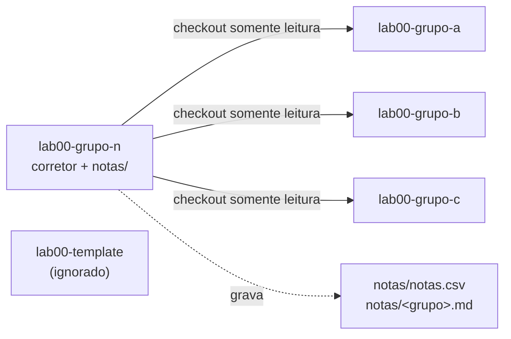

import Tabs from "@theme/Tabs";
import TabItem from "@theme/TabItem";

# Repositório de notas e correção automática

Cada aula tem um repositório de notas — **`<aula>-grupo-n`** (o "grupo N" de
**N**otas). Ele funciona como **corretor central daquela aula**: lê os
repositórios dos grupos (`<aula>-grupo-a`, `-grupo-b`, …), aplica a rubrica e
guarda os boletins em `notas/`.

Como a lógica de correção e o token de acesso ficam **dentro do `-grupo-n`** — ao
qual os grupos **não têm acesso** — não há nada que um grupo possa alterar no
próprio repositório para mudar a nota.

## Arquitetura



:::note[Diagrama Mermaid]
Para o diagrama acima renderizar, o site precisa do tema
`@docusaurus/theme-mermaid` habilitado (`markdown.mermaid: true` no
`docusaurus.config`). Sem ele, o bloco aparece como texto.
:::

Na organização `ELT85B-N21-2026-2`, o mesmo padrão se repete por aula:
`lab00-grupo-n` corrige `lab00-grupo-*`, `lab10-grupo-n` corrige `lab10-grupo-*`,
`projeto-grupo-n` corrige `projeto-grupo-*`, e assim por diante.

## Autoconfiguração

O grande truque: **os mesmos workflows servem para qualquer aula**. Nada de editar
caminhos ou listas — o despachante descobre tudo sozinho:

- A **aula** é deduzida do nome do próprio repositório. Em `grade-all.yml`:

  ```bash
  SELF='lab00-grupo-n'      # github.event.repository.name
  PREFIX="${SELF%-grupo-n}" # -> lab00
  ```

- Os **grupos** são listados pela convenção de nomes, excluindo o `-template`
  (que não casa com o filtro) e o próprio `-grupo-n`:

  ```bash
  gh repo list "$ORG" --limit 1000 --json name --jq '.[].name' \
    | grep -E "^${PREFIX}-grupo-" \
    | grep -vx "${PREFIX}-grupo-n"
  ```

Resultado: copiando o mesmo scaffold para cada `-grupo-n`, cada um passa a corrigir
automaticamente os grupos da sua aula.

## Os arquivos do scaffold

Um repositório de notas contém três arquivos essenciais:

```
.github/workflows/grade-one.yml    # reutilizável: corrige UM grupo
.github/workflows/grade-all.yml    # despachante: descobre, corrige todos e grava notas/
autograde/grade.py                 # a RUBRICA da aula (a única parte que muda por aula)
```

- **`grade-one.yml`** — workflow reutilizável (`workflow_call`). Recebe um `repo`
  de grupo, faz o checkout dele em modo leitura, roda o `grade.py` e publica o
  boletim (`GRADE.md` + `nota.csv`) como artefato.
- **`grade-all.yml`** — descobre os grupos, chama o `grade-one.yml` uma vez por
  grupo (em paralelo) e, no fim, consolida tudo em `notas/` e no resumo do run.
- **`grade.py`** — contém as tarefas, pontos e verificações. É a única peça que
  você adapta de uma aula para outra.

## Instalação

### Na organização (uma vez)

<Tabs>
<TabItem value="pat" label="Fine-grained PAT" default>

1. Crie um **fine-grained Personal Access Token** com acesso aos repositórios da
   organização e as permissões _Contents: Read-only_ e _Metadata: Read_.
2. Em **Org → Settings → Secrets and variables → Actions → New organization
   secret**, crie **`STUDENTS_TOKEN`** com esse token e libere-o para os
   repositórios `*-grupo-n`.

</TabItem>
<TabItem value="app" label="GitHub App (escala)">

Para muitas turmas, prefira um **GitHub App** instalado na organização com
_Contents: Read_ e _Metadata: Read_. Gere o token no workflow com
`actions/create-github-app-token` e use-o no lugar do `STUDENTS_TOKEN`. Vantagem:
privilégio mínimo e credenciais de curta duração.

</TabItem>
</Tabs>

:::tip[Configure o token só uma vez]
Como `STUDENTS_TOKEN` é um secret **de organização**, você não precisa cadastrá-lo
repositório por repositório — basta liberá-lo para os `*-grupo-n`.
:::

### Em cada aula

Copie os três arquivos do scaffold para cada repositório de notas (`lab00-grupo-n`,
`lab10-grupo-n`, `projeto-grupo-n`, …). Os dois YAML são **idênticos** em todas as
aulas; apenas o `autograde/grade.py` muda, refletindo a rubrica daquela aula.

## Como a correção casa commits com tarefas

A correção é baseada em commits. Cada tarefa é entregue por um commit cuja
**mensagem começa** com o código dela (`T1`, `T2`, …):

```bash
git add .
git commit -m "T1: implementa os cinco niveis de log"
git push
```

O corretor localiza o commit **mais recente** de cada código, volta o repositório
do grupo para **aquele estado** (via `git worktree`) e roda as verificações da
tarefa. Isso é essencial porque as tarefas costumam editar os **mesmos arquivos**
(ex.: mudar `CORE_DEBUG_LEVEL` de 5 para 2 e depois voltar para 5): olhando só o
estado final, seria impossível avaliar cada etapa — mas cada commit é um retrato
independente.

:::info[Regras da convenção]

- O código vai no **início** da mensagem: `T1: ...`, `T2: ...`.
- Pode **refazer** uma tarefa — vale o commit mais recente daquele código.
- `T1` **não** casa com `T10`: são tarefas diferentes.
- Tarefa sem commit correspondente vale **zero**.
  :::

## A rubrica (`grade.py`)

A rubrica é uma lista de tarefas. Cada tarefa tem `token`, `nome`, `pontos` e uma
lista de `checks`. A nota de cada tarefa é **proporcional** ao número de
verificações que passam.

```python title="autograde/grade.py (trecho)"
TAREFAS = [
  {"token": "T1", "nome": "Cinco niveis de log", "pontos": 15, "checks": [
      {"tipo": "contem", "arquivo": "src/main.cpp",   "padrao": r"\blog_e\s*\(", "desc": "usa log_e"},
      {"tipo": "contem", "arquivo": "platformio.ini", "padrao": r"CORE_DEBUG_LEVEL\s*=\s*5", "desc": "nivel 5"},
      {"tipo": "compila", "desc": "projeto compila"}]},
  # T2, T3, ... conforme a aula
]
```

### Tipos de verificação

<Tabs>
<TabItem value="contem" label="contem" default>

O arquivo indicado **deve casar** com o padrão (regex Python).

```python
{"tipo": "contem", "arquivo": "src/main.cpp", "padrao": r"\blog_i\s*\(", "desc": "usa log_i"}
```

</TabItem>
<TabItem value="nao_contem" label="nao_contem">

O arquivo **não deve** casar com o padrão. Útil para exigir que algo tenha sido
removido.

```python
{"tipo": "nao_contem", "arquivo": "src/main.cpp", "padrao": r"Serial\.print", "desc": "sem Serial.print"}
```

</TabItem>
<TabItem value="compila" label="compila">

O projeto **deve compilar** com `pio run`. É o portão mais forte: código quebrado
não pontua nesta verificação.

```python
{"tipo": "compila", "desc": "projeto compila"}
```

</TabItem>
</Tabs>

Para adaptar a rubrica a outra aula, edite apenas essa lista: troque os tokens, os
arquivos, os padrões e os pontos.

## Executando a correção

- **Todos os grupos:** aba **Actions → Grade all → Run workflow**, com o campo
  `only` vazio. Há também um agendamento diário (`schedule`) que pode rodar
  sozinho.
- **Um grupo só:** **Grade all → Run workflow** e informe o sufixo em `only`
  (ex.: `grupo-a`).

## Onde ficam as notas

Ao final, o job `report` grava **no próprio `-grupo-n`**:

- `notas/notas.csv` — planilha consolidada da turma (`grupo,nota,pontos,max`).
- `notas/<grupo>.md` — boletim detalhado de cada grupo, tarefa a tarefa.

Uma tabela-resumo também aparece no _summary_ do run em **Actions**. Como só o time
de notas acessa `*-grupo-n`, os boletins permanecem privados aos docentes.

## Verificação em execução com Wokwi (opcional)

Além das verificações estáticas e da compilação, é possível **simular** o firmware
no Wokwi dentro do CI para conferir a saída serial real (por exemplo, que todas as
macros de log aparecem). Isso requer um cenário de automação (`.test.yaml`) e o
secret `WOKWI_CLI_TOKEN`. Veja a página do laboratório correspondente para o
cenário e o job do Wokwi.

## Segurança — por que é à prova de adulteração

- A correção **executa apenas no `-grupo-n`**. Os grupos não veem o `grade.py`, os
  workflows, nem o `STUDENTS_TOKEN`. Alterar o próprio repositório não muda a
  correção nem a nota registrada.
- O checkout do grupo usa `persist-credentials: false`: o token de leitura **não
  fica gravado em disco** enquanto o código do grupo compila. Isso importa porque
  `pio run` pode executar código arbitrário definido pelo grupo (ex.:
  `extra_scripts` no `platformio.ini`). O token é somente-leitura e de escopo
  mínimo; os runners hospedados são efêmeros.
- O commit das notas usa `[skip ci]` e o `grade-all` **não** dispara em `push`,
  então não há laço de execução.

:::warning[Proteja o repositório de notas]
Ative proteção de branch no `-grupo-n` e fixe as _actions_ por SHA para impedir
mudanças não revisadas na lógica de correção. Se preferir não escrever no branch
principal, ajuste o passo _Commit do boletim_ para gravar num branch `notas`.
:::

## Solução de problemas

| Sintoma                                  | Causa provável                           | Solução                                                              |
| ---------------------------------------- | ---------------------------------------- | -------------------------------------------------------------------- |
| "Nenhum repositório de grupo encontrado" | Token sem acesso ou nomes fora do padrão | Confirme o `STUDENTS_TOKEN` e que os repos seguem `<aula>-grupo-<x>` |
| Todas as tarefas "sem commit"            | Convenção de mensagem não seguida        | As mensagens devem começar com `T1`, `T2`, …                         |
| `[ ] projeto compila` sempre falha       | Erro real de build no repo do grupo      | Abra o log do job `grade` para ver a saída do `pio run`              |
| Notas não são gravadas                   | Sem permissão de escrita                 | O `grade-all.yml` precisa de `permissions: contents: write`          |
| `gh: command not found`                  | Runner sem GitHub CLI                    | Use `ubuntu-latest` (o `gh` já vem instalado)                        |

## Referência rápida — rubrica do lab00

| Código | Tarefa                            | Pontos |
| ------ | --------------------------------- | ------ |
| `T1`   | Cinco níveis de log               | 15     |
| `T2`   | Filtragem por nível de compilação | 10     |
| `T3`   | Log com dados formatados          | 15     |
| `T4`   | Simulando um erro real            | 15     |

Total configurável em `autograde/grade.py`; a nota final é normalizada para 0–10.
