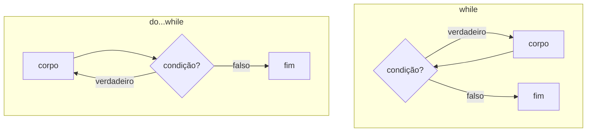

import Tabs from "@theme/Tabs";
import TabItem from "@theme/TabItem";
import CommitPoint from "@site/src/components/CommitPoint";

# Aula de Laboratório — Estruturas de Controle no ESP32

**Plataforma:** ESP32 · **Ambiente:** PlatformIO · **Framework:** Arduino · **Simulador:** Wokwi

---

## 1. Objetivos de aprendizagem

Ao final desta aula, o aluno será capaz de:

- Tomar decisões com `if`, `else if` e `else`.
- Selecionar entre vários caminhos com `switch...case`, usando `break` e `default`.
- Repetir código com `while`, `do...while` e `for`.
- Controlar o fluxo de um laço com `break` e `continue`.
- Encerrar uma função e devolver um valor com `return`.
- Reconhecer o uso (raro e cuidadoso) de `goto`.
- Combinar tudo em uma máquina de estados simples acionada pela porta serial.

:::info[Pontos de commit]
Ao longo da aula, os cartões **"Ponto de commit"** indicam quando salvar seu progresso. Cada commit corresponde a uma tarefa avaliada automaticamente — use exatamente a mensagem sugerida (o botão copia o comando pronto).
:::

---

## 2. Material necessário

- 1 × placa ESP32 (ex.: ESP32 DevKit v1) — ou apenas o **simulador Wokwi**.
- 1 × cabo USB (se usar hardware real).
- (Projeto) 1 × LED + 1 × resistor de 220 Ω (ou o LED do Wokwi).
- VS Code com **PlatformIO IDE** e **Wokwi for VS Code**.

---

## 3. Setup — PlatformIO e Wokwi

Crie o projeto e configure o `platformio.ini`:

```ini title="platformio.ini"
[env:esp32dev]
platform = espressif32
board = esp32dev
framework = arduino
monitor_speed = 115200
```

Toda a aula usa a **Serial Monitor** (115200 baud). As Partes 1 a 8 rodam só com a
serial; o **projeto integrador** usa um LED, ideal para simular no Wokwi.

### Arquivos do Wokwi (para o projeto)

Crie estes dois arquivos na raiz do projeto:

<Tabs>
<TabItem value="diagram" label="diagram.json" default>

```json title="diagram.json"
{
  "version": 1,
  "author": "Aluno",
  "editor": "wokwi",
  "parts": [
    {
      "type": "board-esp32-devkit-c-v4",
      "id": "esp",
      "top": 0,
      "left": 0,
      "attrs": {}
    },
    {
      "type": "wokwi-led",
      "id": "led1",
      "top": -48,
      "left": 110,
      "attrs": { "color": "green" }
    },
    {
      "type": "wokwi-resistor",
      "id": "r1",
      "top": 20,
      "left": 110,
      "attrs": { "value": "220" }
    }
  ],
  "connections": [
    ["esp:TX0", "$serialMonitor:RX", "", []],
    ["esp:RX0", "$serialMonitor:TX", "", []],
    ["esp:2", "r1:1", "green", []],
    ["r1:2", "led1:A", "green", []],
    ["led1:C", "esp:GND.1", "black", []]
  ]
}
```

O LED liga no **GPIO 2** através do resistor; o cátodo vai ao GND.

</TabItem>
<TabItem value="wokwi" label="wokwi.toml">

```toml title="wokwi.toml"
[wokwi]
version = 1
firmware = '.pio/build/esp32dev/firmware.bin'
elf = '.pio/build/esp32dev/firmware.elf'
```

Ajuste o caminho se o seu ambiente não se chamar `esp32dev`.

</TabItem>
</Tabs>

Fluxo: **Build** (PlatformIO) → paleta de comandos → **Wokwi: Start Simulator**. Você
digita os comandos na **Serial Monitor do Wokwi**.

:::tip[Regra de ouro do Wokwi]
O simulador roda o firmware **já compilado**. Sempre recompile antes de reiniciar a simulação.
:::

---

:::info[Por que quase todo o código fica no `setup()`?]
No Arduino/ESP32, `setup()` roda **uma vez** no boot e `loop()` roda **repetidamente** logo depois, para sempre. Nos experimentos das Partes 1 a 8, o objetivo é **demonstrar um conceito e imprimir o resultado uma única vez** para você comparar com a saída esperada — por isso o código fica no `setup()` e o `loop()` fica vazio (`void loop() {}`). Se estivesse no `loop()`, a mesma saída se repetiria sem parar, rolando na Serial Monitor.

O **projeto integrador** (seção 9) faz o contrário de propósito: a lógica fica no `loop()`, porque ele precisa **reagir continuamente** aos comandos que chegam pela serial. Regra prática: **execução única / demonstração → `setup()`**; **comportamento contínuo / que reage a entradas ou tempo → `loop()`**.
:::

---

## Parte 1 — Decisão: `if`, `else if`, `else`

Executa um bloco conforme uma condição booleana. O `else if` encadeia alternativas; o `else` é o "senão" final.

```cpp
#include <Arduino.h>

void setup() {
  Serial.begin(115200);
  delay(1000);

  int leituras[] = {12, 55, 95};
  for (int k = 0; k < 3; k++) {
    int nivel = leituras[k];
    Serial.print("nivel="); Serial.print(nivel); Serial.print(" -> ");
    if (nivel < 20) {
      Serial.println("BAIXO");
    } else if (nivel < 70) {
      Serial.println("MEDIO");
    } else {
      Serial.println("ALTO");
    }
  }
}

void loop() {}
```

Saída esperada:

```text
nivel=12 -> BAIXO
nivel=55 -> MEDIO
nivel=95 -> ALTO
```

:::warning[Atribuição não é comparação]
Use `==` para comparar. `if (x = 5)` **atribui** 5 e é sempre verdadeiro; o certo é `if (x == 5)`.
:::

<CommitPoint task="decide faixas com if, else if e else" pontos={5} />

---

## Parte 2 — `switch...case`

Compara uma variável (inteiro ou `char`) com vários valores fixos. Cada `case` precisa de `break`; sem ele, a execução "escorrega" para o próximo (_fallthrough_) — útil para **agrupar** casos. O `default` trata o que não casou.

```cpp
#include <Arduino.h>

void avaliar(char cmd) {
  switch (cmd) {
    case 'A':
    case 'a':                    // agrupa maiuscula e minuscula
      Serial.println("-> Ligar");
      break;
    case 'B':
    case 'b':
      Serial.println("-> Desligar");
      break;
    case 'P':
    case 'p':
      Serial.println("-> Piscar");
      break;
    default:
      Serial.println("-> Comando invalido");
  }
}

void setup() {
  Serial.begin(115200);
  delay(1000);
  char testes[] = {'A', 'b', 'P', 'Z'};
  for (int i = 0; i < 4; i++) {
    Serial.print("cmd="); Serial.print(testes[i]); Serial.print(" ");
    avaliar(testes[i]);
  }
}

void loop() {}
```

Saída esperada:

```text
cmd=A -> Ligar
cmd=b -> Desligar
cmd=P -> Piscar
cmd=Z -> Comando invalido
```

:::warning[Não esqueça o `break`]
Sem `break`, o `case` continua no próximo. Isso é proposital ao agrupar (como `'A'`/`'a'`), mas é um bug clássico quando esquecido.
:::

<CommitPoint task="usa switch...case com break e default" pontos={5} />

---

## Parte 3 — `while`

Testa a condição **antes** de cada iteração. Se já começar falsa, o corpo **não roda**.

```cpp
#include <Arduino.h>

void setup() {
  Serial.begin(115200);
  delay(1000);

  int n = 5;
  while (n > 0) {
    Serial.print("contagem: "); Serial.println(n);
    n--;                 // sem isso, o laco nunca termina!
  }
  Serial.println("Fim (n chegou a 0).");
}

void loop() {}
```

Saída esperada:

```text
contagem: 5
contagem: 4
contagem: 3
contagem: 2
contagem: 1
Fim (n chegou a 0).
```

<CommitPoint task="repete com while" pontos={5} />

---

## Parte 4 — `do...while`

Testa a condição **depois** de executar o corpo — por isso ele roda **pelo menos uma vez**, mesmo que a condição já seja falsa.



:::note[Diagrama Mermaid]
Requer o tema `@docusaurus/theme-mermaid` habilitado; sem ele o bloco aparece como texto.
:::

```cpp
#include <Arduino.h>

void setup() {
  Serial.begin(115200);
  delay(1000);

  int n = 0;

  Serial.println("--- while (n > 0) ---");
  while (n > 0) {
    Serial.println("nunca imprime");
    n--;
  }

  Serial.println("--- do...while (n > 0) ---");
  do {
    Serial.println("executa pelo menos 1 vez");
  } while (n > 0);
}

void loop() {}
```

Saída esperada:

```text
--- while (n > 0) ---
--- do...while (n > 0) ---
executa pelo menos 1 vez
```

<CommitPoint
  task="repete com do...while executando ao menos uma vez"
  pontos={5}
/>

---

## Parte 5 — `for`

Reúne inicialização, condição e incremento numa linha. Ideal quando você sabe **quantas** vezes repetir. Pode ser **aninhado**.

```cpp
#include <Arduino.h>

void setup() {
  Serial.begin(115200);
  delay(1000);

  // for simples
  for (int i = 1; i <= 5; i++) {
    Serial.print(i); Serial.print(" ");
  }
  Serial.println();

  // for aninhado: tabuada de 1 a 3
  for (int a = 1; a <= 3; a++) {
    for (int b = 1; b <= 3; b++) {
      Serial.print(a * b); Serial.print("\t");
    }
    Serial.println();
  }
}

void loop() {}
```

Saída esperada:

```text
1 2 3 4 5
1	2	3
2	4	6
3	6	9
```

<CommitPoint task="repete com for, inclusive laco aninhado" pontos={5} />

---

## Parte 6 — `break` e `continue`

Dentro de um laço: `continue` **pula** para a próxima iteração; `break` **encerra** o laço imediatamente.

```cpp
#include <Arduino.h>

void setup() {
  Serial.begin(115200);
  delay(1000);

  Serial.println("continue (pula os pares):");
  for (int i = 1; i <= 10; i++) {
    if (i % 2 == 0) continue;   // pula o resto do corpo quando par
    Serial.print(i); Serial.print(" ");
  }
  Serial.println();

  Serial.println("break (para no 7):");
  for (int i = 1; i <= 10; i++) {
    if (i == 7) break;          // sai do laco de vez
    Serial.print(i); Serial.print(" ");
  }
  Serial.println();
}

void loop() {}
```

Saída esperada:

```text
continue (pula os pares):
1 3 5 7 9
break (para no 7):
1 2 3 4 5 6
```

<CommitPoint task="controla o laco com break e continue" pontos={5} />

---

## Parte 7 — `return`

Encerra a função atual. Em funções com tipo de retorno, `return valor` devolve o resultado. É comum **sair cedo** para simplificar a lógica.

```cpp
#include <Arduino.h>

// Sai cedo assim que descobre a resposta
bool ehPrimo(int n) {
  if (n < 2) return false;
  for (int d = 2; d * d <= n; d++) {
    if (n % d == 0) return false;   // achou divisor -> nao e primo
  }
  return true;
}

void setup() {
  Serial.begin(115200);
  delay(1000);
  int nums[] = {1, 2, 9, 13, 20};
  for (int i = 0; i < 5; i++) {
    Serial.print(nums[i]); Serial.print(" primo? ");
    Serial.println(ehPrimo(nums[i]) ? "sim" : "nao");
  }
}

void loop() {}
```

Saída esperada:

```text
1 primo? nao
2 primo? sim
9 primo? nao
13 primo? sim
20 primo? nao
```

:::tip[`return` também em `void`]
Em `loop()`/`setup()` (tipo `void`), um `return` sem valor apenas encerra aquela passagem da função. Usaremos isso no projeto.
:::

<CommitPoint task="encerra a funcao cedo com return" pontos={5} />

---

## Parte 8 — `goto`

Salta para um **rótulo** no mesmo bloco. Na prática moderna é **evitado** porque dificulta a leitura; o uso mais defensável é sair de **laços aninhados** de uma vez.

```cpp
#include <Arduino.h>

void setup() {
  Serial.begin(115200);
  delay(1000);

  int alvo = 42;
  bool achou = false;

  for (int i = 0; i < 10; i++) {
    for (int j = 0; j < 10; j++) {
      if (i * 10 + j == alvo) {
        achou = true;
        goto fim;        // sai dos DOIS lacos de uma vez
      }
    }
  }

fim:
  if (achou) Serial.println("Alvo 42 encontrado; saiu dos lacos aninhados.");
  else       Serial.println("Nao encontrado.");
}

void loop() {}
```

Saída esperada:

```text
Alvo 42 encontrado; saiu dos lacos aninhados.
```

:::danger[Use `goto` com muita parcimônia]
Quase sempre há uma alternativa mais clara (uma função com `return`, uma _flag_, ou reestruturar o laço). Prefira essas opções; reserve `goto` para casos muito específicos.
:::

<CommitPoint task="sai de lacos aninhados com goto" pontos={5} />

---

## 9. Projeto integrador — Menu serial controlando um LED

Junta **tudo**: `switch...case` para os comandos, `for` para piscar, `if`/`else` e `return` para o fluxo, `break` nos casos, tudo dentro do `loop()`. Simule no **Wokwi** (LED no GPIO 2) e digite os comandos na Serial Monitor.

```cpp
#include <Arduino.h>

const int LED = 2;      // GPIO 2 (LED no Wokwi)
int estado = LOW;

void ajuda() {
  Serial.println("Comandos: L=liga  D=desliga  P=pisca  S=status  ?=ajuda");
}

// Retorna quantas vezes piscou (exemplo de return com valor)
int piscar(int vezes) {
  for (int i = 0; i < vezes; i++) {
    digitalWrite(LED, HIGH); delay(150);
    digitalWrite(LED, LOW);  delay(150);
  }
  return vezes;
}

void setup() {
  Serial.begin(115200);
  pinMode(LED, OUTPUT);
  digitalWrite(LED, LOW);
  delay(500);
  Serial.println("== Menu serial ==");
  ajuda();
}

void loop() {
  if (!Serial.available()) return;               // nada a fazer -> sai cedo

  char c = Serial.read();
  if (c == '\n' || c == '\r' || c == ' ') return; // ignora separadores

  switch (c) {
    case 'L': case 'l':
      estado = HIGH; digitalWrite(LED, estado);
      Serial.println("LED ligado");
      break;
    case 'D': case 'd':
      estado = LOW; digitalWrite(LED, estado);
      Serial.println("LED desligado");
      break;
    case 'P': case 'p': {
      int n = piscar(3);
      digitalWrite(LED, estado);                 // restaura o estado anterior
      Serial.print("Piscou "); Serial.print(n); Serial.println(" vezes");
      break;
    }
    case 'S': case 's':
      Serial.print("Status do LED: ");
      Serial.println(estado == HIGH ? "LIGADO" : "DESLIGADO");
      break;
    case '?':
      ajuda();
      break;
    default:
      Serial.print("Comando invalido: "); Serial.println(c);
      Serial.println("Digite ? para ajuda");
  }
}
```

Teste digitando, por exemplo: `L`, `S`, `P`, `D`, `?`, `X`.

<CommitPoint task="projeto integrador: menu serial no Wokwi" pontos={20} />

---

## 10. Desafios

Tente resolver **sem olhar o gabarito**. Faça o commit de cada desafio conforme concluir.

**D1.** _FizzBuzz_ de 1 a 30: para cada número, imprima `Fizz` se múltiplo de 3, `Buzz` se múltiplo de 5, `FizzBuzz` se de ambos, senão o próprio número. (Use `for` e `if/else if/else`.)

<CommitPoint task="desafio D1: FizzBuzz de 1 a 30" pontos={10} />

**D2.** Escreva `int menorDivisor(int n)` que devolve o menor divisor de `n` maior que 1 usando `for` + `break` (e `return`). Ex.: `menorDivisor(15)` = 3.

<CommitPoint task="desafio D2: menor divisor usando for e break" pontos={10} />

**D3.** Escreva `int somaDigitos(int n)` que soma os dígitos de `n` usando `while` (dica: `n % 10` e `n /= 10`). Ex.: `somaDigitos(1234)` = 10.

<CommitPoint task="desafio D3: soma dos digitos usando while" pontos={10} />

**D4.** Dada uma nota inteira de 0 a 100, imprima o conceito com `switch` operando sobre `nota / 10`: 9–10 = A, 8 = B, 7 = C, 6 = D, abaixo = F.

<CommitPoint
  task="desafio D4: classifica nota com switch por faixa"
  pontos={10}
/>

---

## 11. Gabarito

:::danger[Spoiler]
Só abra depois de tentar os desafios por conta própria.
:::

<details>
<summary>Ver soluções</summary>

**D1.**

```cpp
for (int i = 1; i <= 30; i++) {
  if (i % 15 == 0)      Serial.println("FizzBuzz");
  else if (i % 3 == 0)  Serial.println("Fizz");
  else if (i % 5 == 0)  Serial.println("Buzz");
  else                  Serial.println(i);
}
```

**D2.**

```cpp
int menorDivisor(int n) {
  for (int d = 2; d <= n; d++) {
    if (n % d == 0) return d;   // primeiro divisor encontrado
  }
  return n;                     // n primo -> ele mesmo
}
```

**D3.**

```cpp
int somaDigitos(int n) {
  int soma = 0;
  while (n > 0) {
    soma += n % 10;   // ultimo digito
    n /= 10;          // remove o ultimo digito
  }
  return soma;
}
```

**D4.**

```cpp
int nota = 84;
switch (nota / 10) {
  case 10:
  case 9:  Serial.println("A"); break;
  case 8:  Serial.println("B"); break;
  case 7:  Serial.println("C"); break;
  case 6:  Serial.println("D"); break;
  default: Serial.println("F");
}
```

</details>

---

## 12. Checklist de encerramento

- [ ] Compilei e rodei os experimentos das Partes 1 a 8.
- [ ] Previ a saída **antes** de rodar e comparei.
- [ ] Simulei o projeto integrador no Wokwi e testei todos os comandos.
- [ ] Sei explicar a diferença entre `while` e `do...while`.
- [ ] Sei quando usar `break` e `continue`.
- [ ] Resolvi ao menos os desafios D1 a D4.
- [ ] Fiz o commit de cada ponto marcado (T1 a T13).

---

_Fim da aula._
