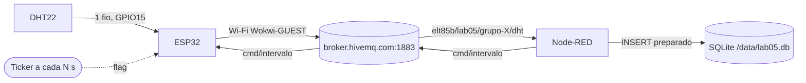
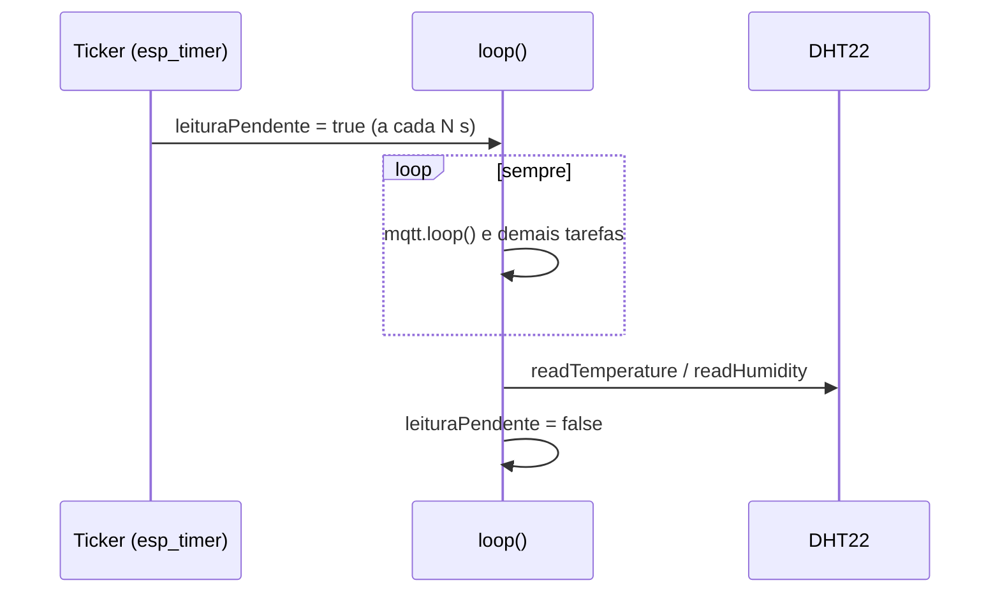
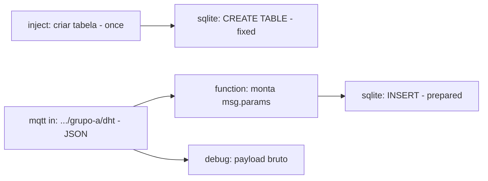

# Laboratório 05

{/* Tabela com link para atividade, inicio, fim e descrição do LAB! */}

<div style={{ display: "flex", justifyContent: "center" }}>
  <LabTable index={5} internal={false} />
</div>

---

## Checklist — Sensor DHT22, Interrupções, Node-RED

- [ ] Verificar `git --version`
- [ ] Abrir o VS Code
- [ ] Abrir a extensão PlatformIO IDE
- [ ] Criar um projeto ESP32
- [ ] Selecionar o framework Arduino
- [ ] Executar o Build
- [ ] Criar `wokwi.toml`
- [ ] Criar `diagram.json`
- [ ] Executar a simulação
- [ ] Verificar o Serial Monitor
- [ ] Atualizar o repositório no GitHub
- [ ] Executar `git push`
- [ ] Confirmar que o projeto está disponível no GitHub
- [ ] Logout

---

import {
  LabSetup,
  LabLogout,
} from "@site/src/components/shared/InstructionsSite";

<LabSetup />

---

<LabLogout />

---

## Clone o repositório inicial do LAB05

Escolha o Grupo e entre com o comando abaixo para criar o repositório no GitHub:

<LabTeamMembers labName="lab05" />

## Envie o link do repositório do seu grupo no Moodle: {/* #moodle-link */}

<LabSubmit labName="lab05" />

---

# Lab 05 — DHT22, MQTT periódico e Node-RED com SQLite

<details>
<summary><strong>Mapa de tarefas</strong> — 8 tarefas · 100 pts</summary>

- [T1 — Dependencias e circuito do DHT22](#t1) · 10 pts
- [T2 — Leitura do DHT22 com temporizador](#t2) · 15 pts
- [T3 — Conexao Wi-Fi](#t3) · 10 pts
- [T4 — Publicacao MQTT periodica em JSON](#t4) · 15 pts
- [T5 — Node-RED com o no SQLite instalado](#t5) · 10 pts
- [T6 — Fluxo MQTT para SQLite](#t6) · 15 pts
- [T7 — Consulta ao banco SQLite](#t7) · 10 pts
- [T8 — Intervalo configuravel via MQTT e status LWT](#t8) · 15 pts

</details>

<LabSetup />

Nesta aula o ESP32 vira um **nó de telemetria**: um **temporizador** dispara leituras
periódicas do **DHT22**, o firmware publica cada leitura em **JSON via MQTT**, e o
**Node-RED** recebe as mensagens e **grava tudo num banco SQLite** — que depois você
consulta para provar que os dados chegaram no ritmo certo.



## Objetivos

- Ler temperatura e umidade do **DHT22** e tratar leituras inválidas (`NaN`).
- Usar um **temporizador** (`Ticker`) para disparar ações periódicas **sem** `delay()`
  e sem bloquear o `loop()`.
- Conectar o ESP32 ao **Wi-Fi** e a um **broker MQTT**, publicando leituras em **JSON**.
- No **Node-RED**, assinar o tópico, validar o payload e gravar em **SQLite** com
  `node-red-node-sqlite` usando **prepared statement**.
- Consultar o banco e verificar a periodicidade das leituras.
- (Integrador) Alterar o intervalo **remotamente** via MQTT e publicar o status do nó com **LWT**.

## Material

- VS Code + PlatformIO + extensão **Wokwi** (ESP32 **simulado** — sem placa física).
- Stack Docker do curso (**Mosquitto + Node-RED + MQTT Explorer**) — nesta aula usamos o
  **Node-RED** dela e o MQTT Explorer para inspecionar mensagens.
- Bibliotecas (baixadas pelo PlatformIO): `adafruit/DHT sensor library`,
  `adafruit/Adafruit Unified Sensor`, `knolleary/PubSubClient`. O `Ticker` já vem com o
  core Arduino do ESP32.

:::info[Por que Wokwi (e não placa física)?]
Conferindo a matriz de simulação: **GPIO** (o DHT22 usa um único pino digital) e **Wi-Fi**
são ✔️ no ESP32 clássico — então a aula roda inteira no Wokwi. A mesma firmware funciona
numa placa física trocando só SSID/senha e o endereço do broker (veja a aba "Placa física"
na [T3](#t3)).
:::

## Clonar o repositório do grupo

<LabTeamMembers labName="lab05" />

O repositório do grupo nasce do `lab05-template`:

<FileTree
  root="lab05-grupo-X"
  files={[
    "platformio.ini u",
    "src/main.cpp u",
    "diagram.json u",
    "wokwi.toml r",
    ".gitignore r",
    ".vscode/extensions.json r",
    "nodered/flows-lab05.json c",
    "evidencias/t2-serial.txt c",
    "evidencias/t3-wifi.txt c",
    "evidencias/t4-mqtt.txt c",
    "evidencias/t5-nodered.txt c",
    "evidencias/t7-consulta.txt c",
    "evidencias/t8-intervalos.txt c",
    "README.md u",
  ]}
/>

:::info[setup() × loop() nesta aula]

- **`setup()`** — o que acontece **uma vez**: iniciar Serial e DHT, conectar Wi-Fi e MQTT,
  **armar** o temporizador.
- **`loop()`** — o comportamento **contínuo**: manter Wi-Fi/MQTT vivos (`mqtt.loop()`),
  e **consumir** a flag do temporizador (ler + publicar).
- **callback do temporizador** — não é nem um nem outro: roda em **outro contexto**
  (a tarefa do `esp_timer`). Por isso ele só faz `leituraPendente = true` e mais nada.
  :::

---

## Parte 1 — Circuito e dependências {/* #parte-1 */}

### 1.1 Circuito no Wokwi

O DHT22 do Wokwi tem 4 pinos: `VCC`, `SDA` (dados), `NC` e `GND`. Ligue **VCC → 3V3**,
**GND → GND** e **SDA → GPIO15**. O template já traz o ESP32; acrescente o sensor no
`diagram.json`:

```json title="diagram.json"
{
  "version": 1,
  "author": "ELT85B - Lab 05",
  "editor": "wokwi",
  "parts": [
    {
      "type": "board-esp32-devkit-c-v4",
      "id": "esp",
      "top": 0,
      "left": 0,
      "attrs": {}
    },
    {
      "type": "wokwi-dht22",
      "id": "dht1",
      "top": -76.5,
      "left": 157.8,
      "attrs": { "temperature": "24.5", "humidity": "55" }
    }
  ],
  "connections": [
    ["esp:TX", "$serialMonitor:RX", "", []],
    ["esp:RX", "$serialMonitor:TX", "", []],
    ["dht1:VCC", "esp:3V3", "red", []],
    ["dht1:GND", "esp:GND.2", "black", []],
    ["dht1:SDA", "esp:15", "green", []]
  ],
  "dependencies": {}
}
```

:::tip[Mudando os valores durante a simulação]
Com o simulador rodando, **clique no DHT22**: aparecem sliders de temperatura e umidade.
É assim que você vai "esquentar" o sensor e ver os números mudarem no banco.
:::

### 1.2 Bibliotecas no `platformio.ini`

```ini title="platformio.ini"
[env:esp32dev]
platform = espressif32
board = esp32dev
framework = arduino
monitor_speed = 115200
lib_deps =
    adafruit/DHT sensor library@^1.4.6
    adafruit/Adafruit Unified Sensor@^1.1.14
    knolleary/PubSubClient@^2.8
```

O `wokwi.toml` do template já aponta para `.pio/build/esp32dev/firmware.bin` e `.elf` —
por isso o nome do ambiente precisa continuar **`esp32dev`**.

<CommitPoint
  id="t1"
  task="Dependencias e circuito do DHT22"
  pontos={10}
  files="platformio.ini diagram.json"
/>

---

## Parte 2 — DHT22 com temporizador {/* #parte-2 */}

### 2.1 Por que um temporizador?

O jeito ingênuo é `ler(); delay(5000);`. Funciona até você precisar fazer **outra coisa**
no `loop()` — como manter a conexão MQTT viva, que exige chamar `mqtt.loop()` várias vezes
por segundo. Com `delay(5000)` o cliente fica 5 s "surdo".

A solução é deixar um **temporizador** marcar o tempo e o `loop()` só **reagir**:



- **`Ticker`** é o temporizador de software do core ESP32 (baseado no `esp_timer`,
  com resolução de microssegundos). `attach(segundos, funcao)` chama `funcao` periodicamente.
- A flag é **`volatile bool`** porque é escrita num contexto (timer) e lida em outro (`loop()`):
  `volatile` impede o compilador de "cachear" o valor num registrador.
- No ESP32, `bool` ocupa **1 byte** e a escrita é atômica — não precisamos de mutex para uma flag.

:::warning[DHT22 é lento]
O DHT22 faz **no máximo uma leitura a cada 2 s**. A biblioteca da Adafruit respeita isso:
se você pedir antes, ela devolve **o último valor** em cache. Por isso nosso intervalo
mínimo será 2 s.
:::

### 2.2 Código

```cpp title="src/main.cpp (T2)"
#include <Arduino.h>
#include <Ticker.h>
#include <DHT.h>

#define DHT_PIN   15
#define DHT_TIPO  DHT22

DHT dht(DHT_PIN, DHT_TIPO);
Ticker temporizador;

volatile bool leituraPendente = false;  // setada pelo temporizador
const float INTERVALO_S = 5.0;           // DHT22: minimo 2 s entre leituras
uint32_t seq = 0;

// Roda no contexto do temporizador: NADA de Serial/DHT/MQTT aqui
void aoEstourarTemporizador() {
  leituraPendente = true;
}

void setup() {
  Serial.begin(115200);
  delay(200);
  Serial.println("\n=== Lab 05 - T2: DHT22 + temporizador ===");
  dht.begin();
  temporizador.attach(INTERVALO_S, aoEstourarTemporizador);
}

void loop() {
  if (leituraPendente) {
    leituraPendente = false;
    float t = dht.readTemperature();
    float h = dht.readHumidity();
    if (isnan(t) || isnan(h)) {
      Serial.println("[DHT] falha na leitura (NaN) - descartada");
      return;
    }
    seq++;
    Serial.printf("[DHT] seq=%lu t=%.1f C h=%.1f %% (%lu ms)\n",
                  (unsigned long)seq, t, h, (unsigned long)millis());
  }
}
```

Compile (**PlatformIO: Build**) e rode **Wokwi: Start Simulator**.

**Saída esperada** (os `ms` variam um pouco):

```text title="Monitor serial"
=== Lab 05 - T2: DHT22 + temporizador ===
[DHT] seq=1 t=24.5 C h=55.0 % (5204 ms)
[DHT] seq=2 t=24.5 C h=55.0 % (10204 ms)
[DHT] seq=3 t=24.5 C h=55.0 % (15204 ms)
```

:::tip[Preveja antes de rodar]

- **P1:** troque `INTERVALO_S` para `1.0` e mude o slider do sensor entre duas leituras.
  Os valores acompanham o slider a cada linha? Por quê?
- **P2:** e se você colocasse o `Serial.printf` **dentro** de `aoEstourarTemporizador()`?
  Pense em quem mais depende da tarefa do `esp_timer` (Wi-Fi, o próprio Ticker…) e no
  tempo que um `printf` a 115200 baud leva.

Anote as previsões e o que observou no `README.md`. Depois **volte o intervalo para 5 s**.
:::

Salve pelo menos **3 leituras** do monitor serial (copie do terminal do Wokwi) em
`evidencias/t2-serial.txt`, incluindo a linha `=== Lab 05`.

<CommitPoint
  id="t2"
  task="Leitura do DHT22 com temporizador"
  pontos={15}
  files="src/main.cpp evidencias/t2-serial.txt"
/>

---

## Parte 3 — Wi-Fi {/* #parte-3 */}

Acrescente o Wi-Fi ao programa da T2. No Wokwi a rede é **`Wokwi-GUEST`**, sem senha; passar
o **canal 6** no `begin()` pula a varredura e conecta mais rápido.

<Tabs groupId="alvo">
<TabItem value="wokwi" label="Wokwi (padrão)" default>

```cpp title="src/main.cpp (trechos novos da T3)"
#include <WiFi.h>

const char *WIFI_SSID  = "Wokwi-GUEST";
const char *WIFI_SENHA = "";

void conectarWiFi() {
  Serial.printf("[WiFi] conectando a %s", WIFI_SSID);
  WiFi.mode(WIFI_STA);
  WiFi.begin(WIFI_SSID, WIFI_SENHA, 6);  // canal 6 acelera no Wokwi
  while (WiFi.status() != WL_CONNECTED) {
    delay(250);
    Serial.print('.');
  }
  Serial.printf("\n[WiFi] conectado, IP %s\n", WiFi.localIP().toString().c_str());
}

// em setup(), depois de dht.begin():
//   conectarWiFi();
// no inicio de loop():
//   if (WiFi.status() != WL_CONNECTED) conectarWiFi();
```

</TabItem>
<TabItem value="fisica" label="Placa física">

Troque só as constantes (o resto é idêntico). O `begin()` **sem** o canal, porque a rede
real pode estar em qualquer canal:

```cpp title="src/main.cpp (placa fisica)"
const char *WIFI_SSID  = "SSID-DO-LAB";
const char *WIFI_SENHA = "senha-do-lab";
// ...
WiFi.begin(WIFI_SSID, WIFI_SENHA);
```

</TabItem>
</Tabs>

**Saída esperada:**

```text title="Monitor serial"
=== Lab 05 ===
[WiFi] conectando a Wokwi-GUEST.....
[WiFi] conectado, IP 10.13.37.2
[DHT] seq=1 t=24.5 C h=55.0 % (6120 ms)
```

:::note[O `while` do Wi-Fi bloqueia — e tudo bem aqui]
Enquanto não há Wi-Fi não há o que publicar, então bloquear na (re)conexão é aceitável
nesta aula. Em produção você trocaria por uma máquina de estados não bloqueante.
:::

Salve a saída (com a linha `[WiFi] conectado`) em `evidencias/t3-wifi.txt`.

<CommitPoint
  id="t3"
  task="Conexao Wi-Fi"
  pontos={10}
  files="src/main.cpp evidencias/t3-wifi.txt"
/>

---

## Parte 4 — Publicação MQTT periódica {/* #parte-4 */}

### 4.1 Tópico e payload

Cada grupo publica no **seu** tópico (troque `a` pela letra do grupo):

| Uso          | Tópico                               | Exemplo de payload                                          |
| ------------ | ------------------------------------ | ----------------------------------------------------------- |
| Leituras     | `elt85b/lab05/grupo-a/dht`           | `{"grupo":"a","seq":7,"t":24.5,"h":55.0,"uptime_ms":35210}` |
| Comando (T8) | `elt85b/lab05/grupo-a/cmd/intervalo` | `10`                                                        |
| Status (T8)  | `elt85b/lab05/grupo-a/status`        | `online` / `offline` (retido)                               |

- `seq` é um contador: se o banco tiver `seq` 7, 8, 10, a mensagem 9 se perdeu.
- `uptime_ms` (de `millis()`) mostra o intervalo **do ponto de vista do ESP32**; o Node-RED
  vai carimbar a hora de **chegada**. Comparar os dois é o que faremos na T7.

:::warning[Broker público]
No Wokwi o ESP32 só alcança a internet, por isso usamos **`broker.hivemq.com:1883`** —
um broker **público e sem senha**: qualquer pessoa pode ler e publicar nesses tópicos.
Não publique nada sensível. (Broker local no Wokwi exige o IoT Gateway do Wokwi Club.)
:::

### 4.2 Código completo até aqui

```cpp title="src/main.cpp (T4)"
#include <Arduino.h>
#include <WiFi.h>
#include <PubSubClient.h>
#include <Ticker.h>
#include <DHT.h>

#define GRUPO     "a"                    // troque pela letra do seu grupo
#define DHT_PIN   15
#define DHT_TIPO  DHT22

const char *WIFI_SSID  = "Wokwi-GUEST";
const char *WIFI_SENHA = "";
const char *MQTT_HOST  = "broker.hivemq.com";
const uint16_t MQTT_PORTA = 1883;
const char *TOPICO_DADOS = "elt85b/lab05/grupo-" GRUPO "/dht";

DHT dht(DHT_PIN, DHT_TIPO);
WiFiClient wifiClient;
PubSubClient mqtt(wifiClient);
Ticker temporizador;

volatile bool leituraPendente = false;
const float INTERVALO_S = 5.0;
uint32_t seq = 0;
char clientId[32];

void aoEstourarTemporizador() {
  leituraPendente = true;
}

void conectarWiFi() {
  Serial.printf("[WiFi] conectando a %s", WIFI_SSID);
  WiFi.mode(WIFI_STA);
  WiFi.begin(WIFI_SSID, WIFI_SENHA, 6);  // canal 6 acelera no Wokwi
  while (WiFi.status() != WL_CONNECTED) {
    delay(250);
    Serial.print('.');
  }
  Serial.printf("\n[WiFi] conectado, IP %s\n", WiFi.localIP().toString().c_str());
}

void conectarMQTT() {
  while (!mqtt.connected()) {
    Serial.printf("[MQTT] conectando a %s como %s ... ", MQTT_HOST, clientId);
    if (mqtt.connect(clientId)) {
      Serial.println("ok");
    } else {
      Serial.printf("falhou (rc=%d), nova tentativa em 2 s\n", mqtt.state());
      delay(2000);
    }
  }
}

void lerEPublicar() {
  float t = dht.readTemperature();
  float h = dht.readHumidity();
  if (isnan(t) || isnan(h)) {
    Serial.println("[DHT] falha na leitura (NaN) - descartada");
    return;
  }
  seq++;
  char payload[128];
  snprintf(payload, sizeof(payload),
           "{\"grupo\":\"%s\",\"seq\":%lu,\"t\":%.1f,\"h\":%.1f,\"uptime_ms\":%lu}",
           GRUPO, (unsigned long)seq, t, h, (unsigned long)millis());
  bool ok = mqtt.publish(TOPICO_DADOS, payload);
  Serial.printf("[PUB] %s %s -> %s\n", ok ? "ok" : "ERRO", TOPICO_DADOS, payload);
}

void setup() {
  Serial.begin(115200);
  delay(200);
  Serial.println("\n=== Lab 05 - T4: DHT22 + MQTT ===");
  dht.begin();

  uint64_t mac = ESP.getEfuseMac();
  snprintf(clientId, sizeof(clientId), "lab05-%s-%04X", GRUPO, (uint16_t)(mac >> 32));

  conectarWiFi();
  mqtt.setServer(MQTT_HOST, MQTT_PORTA);
  conectarMQTT();

  temporizador.attach(INTERVALO_S, aoEstourarTemporizador);
}

void loop() {
  if (WiFi.status() != WL_CONNECTED) conectarWiFi();
  if (!mqtt.connected()) conectarMQTT();
  mqtt.loop();

  if (leituraPendente) {
    leituraPendente = false;
    lerEPublicar();
  }
}
```

Pontos que valem a atenção:

- `"elt85b/lab05/grupo-" GRUPO "/dht"` — literais de string **adjacentes** são concatenados
  pelo compilador; como `GRUPO` é um `#define` de string, o tópico é montado em tempo de compilação.
- **Client ID único:** dois clientes com o mesmo ID no mesmo broker se derrubam mutuamente.
  Por isso o ID leva parte do MAC do chip.
- `%lu` + cast para `unsigned long`: no ESP32 `uint32_t` e `unsigned long` têm ambos 4 bytes,
  mas são tipos diferentes para o `printf` — o cast deixa o formato correto e sem warnings.
- O `PubSubClient` tem buffer padrão de **256 bytes** (cabeçalho + tópico + payload).
  Nosso payload tem ~70 bytes; se um dia passar do limite, `publish()` devolve `false`
  (e o log mostra `ERRO`) — aí use `mqtt.setBufferSize(...)`.

### 4.3 Verificando no broker

Enquanto a simulação roda, assine o tópico. Use o **MQTT Explorer** da stack (conexão
`broker.hivemq.com`, porta `1883`) ou, pelo terminal, um `mosquitto_sub` descartável em Docker:

```bash title="Terminal"
docker run --rm eclipse-mosquitto:2 mosquitto_sub -h broker.hivemq.com \
  -t 'elt85b/lab05/grupo-a/#' -v -C 5 | tee evidencias/t4-mqtt.txt
```

`-C 5` encerra depois de 5 mensagens. **Saída esperada:**

```text title="evidencias/t4-mqtt.txt"
elt85b/lab05/grupo-a/dht {"grupo":"a","seq":3,"t":24.5,"h":55.0,"uptime_ms":16288}
elt85b/lab05/grupo-a/dht {"grupo":"a","seq":4,"t":24.5,"h":55.0,"uptime_ms":21288}
elt85b/lab05/grupo-a/dht {"grupo":"a","seq":5,"t":31.2,"h":48.0,"uptime_ms":26288}
elt85b/lab05/grupo-a/dht {"grupo":"a","seq":6,"t":31.2,"h":48.0,"uptime_ms":31288}
elt85b/lab05/grupo-a/dht {"grupo":"a","seq":7,"t":31.2,"h":48.0,"uptime_ms":36288}
```

:::tip[Preveja antes de rodar]
**P3:** o que aparece se você assinar `elt85b/lab05/+/dht` (com `+` no lugar do grupo)?
E o que aconteceria se dois grupos esquecessem de trocar o `GRUPO` e ficassem ambos com `a`?
:::

<CommitPoint
  id="t4"
  task="Publicacao MQTT periodica em JSON"
  pontos={15}
  files="src/main.cpp evidencias/t4-mqtt.txt"
/>

---

## Parte 5 — Node-RED com SQLite {/* #parte-5 */}

### 5.1 Subir o Node-RED e instalar o nó

1. Suba a stack Docker do curso (a mesma das aulas anteriores) e abra o Node-RED em
   `http://localhost:1880`.
2. Menu (☰) → **Manage palette** → aba **Install** → procure **`node-red-node-sqlite`**
   → **Install**. (A versão atual é a **2.x**; ela instala um binário nativo do SQLite, pode
   demorar um pouco.)
3. Confira que apareceu a categoria **storage** com o nó **sqlite** na paleta.

:::warning[Se o nó não carregar]
A versão 2.x do `node-red-node-sqlite` troca a biblioteca nativa e pode faltar binário
pré-compilado para alguma plataforma (o log mostra algo como `GLIBC ... not found` ou
erro ao carregar `sqlite3`). Nesse caso, remova-o e instale a série 1.x pela linha de
comando do container (substitua `NOME` pelo nome do container do Node-RED, visto em `docker ps`):

```bash title="Terminal"
docker exec -it NOME sh -c "cd /data && npm install node-red-node-sqlite@1"
docker restart NOME
```

:::

### 5.2 Evidência

Descubra o nome do container (`NOME`) e registre que o módulo está instalado no diretório
de usuário do Node-RED (`/data`):

```bash title="Terminal"
docker ps --format '{{.Names}}  {{.Image}}  {{.Status}}' | tee evidencias/t5-nodered.txt
docker exec NOME npm ls --prefix /data node-red-node-sqlite | tee -a evidencias/t5-nodered.txt
```

**Saída esperada** (nomes e versões podem variar):

```text title="evidencias/t5-nodered.txt"
nodered  nodered/node-red:latest  Up 12 minutes
mosquitto  eclipse-mosquitto:2  Up 12 minutes
node-red-project@0.0.1 /data
└── node-red-node-sqlite@2.0.1
```

:::note[Instalou mas o nó não aparece?]
`npm ls` mostra que o pacote está no disco; se ele **não carregou**, o Node-RED avisa no
log. Confira com `docker logs NOME 2>&1 | grep -i sqlite` e veja o aviso "Se o nó não
carregar" acima.
:::

<CommitPoint
  id="t5"
  task="Node-RED com o no SQLite instalado"
  pontos={10}
  files="evidencias/t5-nodered.txt"
/>

---

## Parte 6 — Fluxo MQTT para SQLite {/* #parte-6 */}

Monte o fluxo abaixo numa aba nova chamada **Lab 05**:



### 6.1 Banco e tabela

1. **Config do banco** (aparece ao configurar o primeiro nó sqlite, campo _Database_):
   caminho **`/data/lab05.db`**, modo **Read-Write-Create**. A pasta `/data` do container é
   o volume persistente do Node-RED — o banco sobrevive a reinícios.
2. **inject** "criar tabela" → marque _Inject once after 1 seconds_, sem repetição.
3. **sqlite** "CREATE TABLE" → _SQL Query:_ **Fixed Statement**:

```sql title="SQL do no CREATE TABLE"
CREATE TABLE IF NOT EXISTS leituras (
  id          INTEGER PRIMARY KEY AUTOINCREMENT,
  recebido_em TEXT    NOT NULL DEFAULT (strftime('%Y-%m-%d %H:%M:%f','now')),
  grupo       TEXT    NOT NULL,
  seq         INTEGER NOT NULL,
  temperatura REAL    NOT NULL,
  umidade     REAL    NOT NULL,
  uptime_ms   INTEGER
);
```

`recebido_em` é preenchido **pelo próprio SQLite** (horário UTC, com milissegundos) — o
Node-RED nem precisa mandá-lo.

### 6.2 Receber e gravar

1. **mqtt in** → servidor `broker.hivemq.com`, porta `1883`; tópico
   `elt85b/lab05/grupo-a/dht` (seu grupo); **Output: a parsed JSON object**. Assim
   `msg.payload` já chega como objeto, não como texto.
2. **function** "monta msg.params" — valida o payload e monta os parâmetros:

```js title="function: monta msg.params"
const p = msg.payload;
if (
  typeof p !== "object" ||
  typeof p.t !== "number" ||
  typeof p.h !== "number"
) {
  node.warn("payload invalido: " + JSON.stringify(p));
  return null; // descarta a mensagem
}
msg.params = {
  $grupo: p.grupo,
  $seq: p.seq,
  $t: p.t,
  $h: p.h,
  $uptime_ms: p.uptime_ms,
};
return msg;
```

3. **sqlite** "INSERT leitura" → _SQL Query:_ **Prepared Statement**:

```sql title="SQL do no INSERT"
INSERT INTO leituras (grupo, seq, temperatura, umidade, uptime_ms)
VALUES ($grupo, $seq, $t, $h, $uptime_ms);
```

:::danger[Por que prepared statement?]
Montar o SQL concatenando texto (`"... VALUES (" + msg.payload.t + ")"`) é **SQL injection**
esperando acontecer — e o broker é público: qualquer um pode publicar no seu tópico.
Com **Prepared Statement** os valores de `msg.params` são enviados **separados** do SQL e
nunca executados como código. As chaves precisam do **`$`** — sem ele o nó reclama de
`SQLITE_RANGE: bind or column index out of range`.
:::

**Deploy** e deixe a simulação do Wokwi rodando. No painel _debug_, o "payload bruto" deve
mostrar um objeto a cada 5 s. Para testar a validação, publique no tópico (MQTT Explorer)
o texto `oi` — deve aparecer o aviso `payload invalido` e **nada** ser gravado.

### 6.3 Exportar o fluxo

Selecione a aba **Lab 05** → menu → **Export** → _Current flow_ → **JSON formatado** →
**Download**. Salve como `nodered/flows-lab05.json` no repositório do grupo.

<CommitPoint
  id="t6"
  task="Fluxo MQTT para SQLite"
  pontos={15}
  files="nodered/flows-lab05.json"
/>

---

## Parte 7 — Consultando o banco {/* #parte-7 */}

Acrescente ao fluxo: **inject** "consultar" → **sqlite** (Fixed Statement) → **debug**
(saída `msg.payload`).

```sql title="SQL do no SELECT"
SELECT id, seq, recebido_em, temperatura, umidade,
       ROUND((julianday(recebido_em) - julianday(LAG(recebido_em) OVER (ORDER BY id))) * 86400, 1) AS delta_s
FROM leituras
ORDER BY id DESC
LIMIT 20;
```

- `LAG(...) OVER (ORDER BY id)` pega o `recebido_em` da linha **anterior**; a diferença de
  `julianday` (em dias) × 86400 dá o intervalo em **segundos** entre chegadas.
- A linha mais antiga do resultado tem `delta_s` nulo (não há anterior).

Deixe a simulação rodando pelo menos **1 minuto** (≥ 10 leituras) e clique em "consultar".
No _debug_, passe o mouse sobre o array → ícone **Copy value** e cole em
`evidencias/t7-consulta.txt`. **Saída esperada** (trecho):

```json title="evidencias/t7-consulta.txt"
[
  {
    "id": 14,
    "seq": 14,
    "recebido_em": "2026-09-29 20:11:42.311",
    "temperatura": 31.2,
    "umidade": 48,
    "delta_s": 5
  },
  {
    "id": 13,
    "seq": 13,
    "recebido_em": "2026-09-29 20:11:37.309",
    "temperatura": 31.2,
    "umidade": 48,
    "delta_s": 5
  },
  {
    "id": 12,
    "seq": 12,
    "recebido_em": "2026-09-29 20:11:32.320",
    "temperatura": 24.5,
    "umidade": 55,
    "delta_s": 5
  }
]
```

:::tip[O que olhar no resultado]

- `delta_s` deve ficar **em torno de 5** — pequenas variações vêm da rede, não do temporizador.
  Compare com as diferenças de `uptime_ms` do payload: elas ficam cravadas em 5000.
- Buracos em `seq` = mensagens perdidas (QoS 0 no `publish` do PubSubClient).
- Se `id` e `seq` divergem, você reiniciou a simulação (o `seq` recomeça do 1, o `id` não).
  :::

Acrescente ao mesmo arquivo o resultado desta consulta resumo:

```sql title="SQL de resumo"
SELECT COUNT(*) AS total, ROUND(AVG(temperatura),1) AS t_media, ROUND(AVG(umidade),1) AS h_media
FROM leituras;
```

Exporte o fluxo de novo por cima de `nodered/flows-lab05.json`.

<CommitPoint
  id="t7"
  task="Consulta ao banco SQLite"
  pontos={10}
  files="nodered/flows-lab05.json evidencias/t7-consulta.txt"
/>

---

## Projeto integrador — intervalo remoto e status do nó {/* #integrador */}

Hoje, para mudar o intervalo é preciso recompilar. Faça o ESP32 **aceitar o intervalo via
MQTT** e **anunciar se está vivo**.

### Requisitos

1. **Firmware**
   - Assinar `elt85b/lab05/grupo-X/cmd/intervalo`. O payload é um número em segundos
     (texto, ex.: `10`). Aceitar só **2 a 3600**; fora disso, logar e **ignorar**.
   - Ao receber um valor válido, **rearmar** o temporizador com o novo período
     (`temporizador.detach()` + `attach(...)`) e logar `[TMR] intervalo = N s`.
   - Conectar com **LWT** (_Last Will and Testament_) em `.../status`: mensagem `offline`,
     QoS 1, **retida**. Logo após conectar, publicar `online` **retido** no mesmo tópico.
   - Refazer o `subscribe` a cada reconexão (a sessão MQTT não guarda assinaturas
     quando o cliente conecta com _clean session_).
2. **Node-RED**
   - Dois **inject** ("intervalo 5 s" e "intervalo 10 s", payload texto) → **mqtt out**
     no tópico `.../cmd/intervalo`.
   - (Opcional) um **mqtt in** em `.../status` → debug.
3. **Evidência** — com a simulação rodando: ~1 min em 5 s, clique "intervalo 10 s",
   mais ~1 min, e rode a consulta da T7. Salve o resultado em
   `evidencias/t8-intervalos.txt`: deve dar para ver `delta_s` mudando de ~5 para ~10.

### Dicas de API

```cpp title="Trechos uteis (PubSubClient e Ticker)"
// callback de mensagens recebidas
void aoReceberMensagem(char *topico, byte *payload, unsigned int len);
mqtt.setCallback(aoReceberMensagem);

// connect com LWT: (id, willTopic, willQos, willRetain, willMessage)
mqtt.connect(clientId, TOPICO_STATUS, 1, true, "offline");
mqtt.publish(TOPICO_STATUS, "online", true);   // true = retida
mqtt.subscribe(TOPICO_CMD);

// o payload NAO termina em zero: copie para um buffer e feche a string
char buf[16];
unsigned int n = len < sizeof(buf) - 1 ? len : sizeof(buf) - 1;
memcpy(buf, payload, n);
buf[n] = '\0';
long valor = atol(buf);

// rearmar o temporizador
temporizador.detach();
temporizador.attach((float)novoIntervalo, aoEstourarTemporizador);
```

:::warning[Não chame `mqtt.publish()` nem `subscribe()` de dentro do callback do Ticker]
O callback de mensagens do PubSubClient roda **dentro de `mqtt.loop()`** — ou seja, no
contexto do `loop()`, então rearmar o Ticker ali é seguro. Já o callback do **Ticker** continua
restrito a levantar a flag.
:::

**Saída esperada** no monitor serial ao clicar "intervalo 10 s":

```text title="Monitor serial"
[PUB] ok elt85b/lab05/grupo-a/dht -> {"grupo":"a","seq":12,"t":24.5,"h":55.0,"uptime_ms":61410}
[MQTT] elt85b/lab05/grupo-a/cmd/intervalo -> '10'
[TMR] intervalo = 10 s
[PUB] ok elt85b/lab05/grupo-a/dht -> {"grupo":"a","seq":13,"t":24.5,"h":55.0,"uptime_ms":72390}
```

:::tip[Preveja antes de rodar]
**P4:** com o MQTT Explorer aberto em `.../status`, **pare** a simulação do Wokwi (sem
desconectar educadamente). Quanto tempo leva para aparecer `offline`? Dica: o keepalive
padrão do PubSubClient é **15 s**, e o broker espera 1,5 × keepalive antes de desistir.
:::

Exporte o fluxo novamente para `nodered/flows-lab05.json`.

<CommitPoint
  id="t8"
  task="Intervalo configuravel via MQTT e status LWT"
  pontos={15}
  files="src/main.cpp nodered/flows-lab05.json evidencias/t8-intervalos.txt"
/>

---

## Checklist

- [ ] `platformio.ini` com DHT, Unified Sensor e PubSubClient; `diagram.json` com DHT22 no GPIO15 (T1)
- [ ] Leituras periódicas via `Ticker` + flag `volatile`, `NaN` descartado (T2)
- [ ] Conexão Wi-Fi com reconexão no `loop()` (T3)
- [ ] JSON publicado em `elt85b/lab05/grupo-X/dht` a cada 5 s, client ID único (T4)
- [ ] `node-red-node-sqlite` instalado e carregado (T5)
- [ ] Fluxo `mqtt in` (JSON) → `function` → `sqlite` (prepared) exportado (T6)
- [ ] Consulta com `delta_s` e resumo salva, ≥ 10 leituras (T7)
- [ ] Intervalo remoto 2–3600 s + LWT `online`/`offline` retido (T8)
- [ ] Previsões P1–P4 respondidas no `README.md`
- [ ] Nenhum `push --force`; cada tarefa num commit `Tn:`

:::info[Pontuação]
**T1…T8 = 100 pts** (esta aula não tem desafios): T1 10 · T2 15 · T3 10 · T4 15 · T5 10 ·
T6 15 · T7 10 · T8 15. O autograder normaliza para 0–10. Vale o commit `Tn:` mais recente
de cada tarefa.
:::

## Entrega

<LabSubmit labName="lab05" />

<LabLogout />
