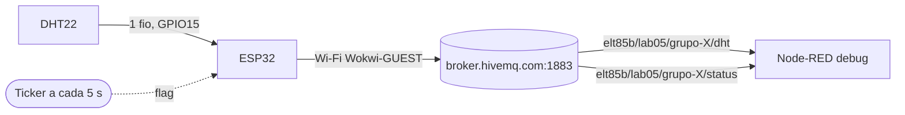
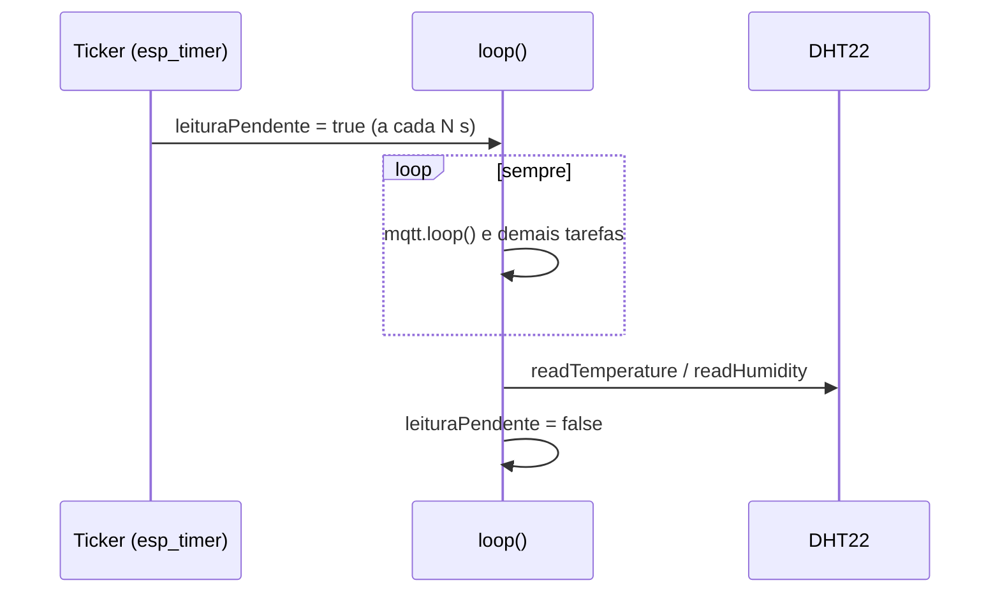
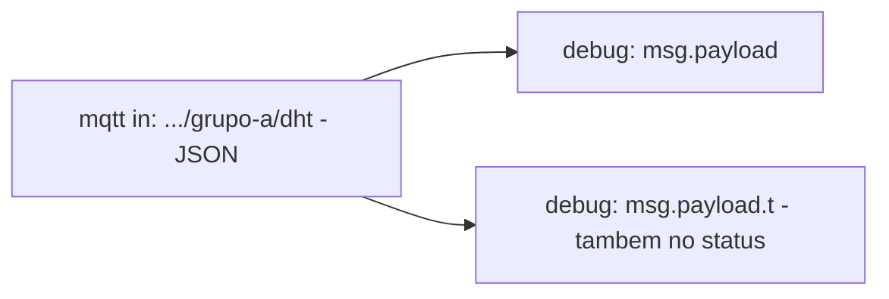
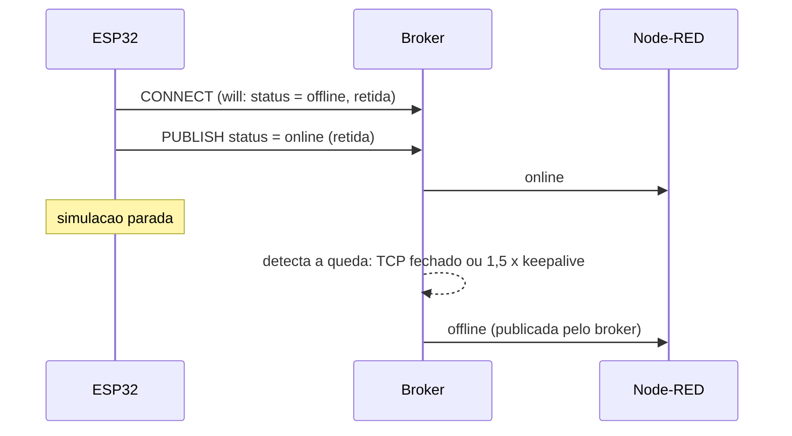

## Checklist — DHT22, temporizador e MQTT com Node-RED {/* #checklist */}

- [ ] `platformio.ini` com DHT, Unified Sensor e PubSubClient; `diagram.json` com DHT22 no GPIO15 (T1)
- [ ] Leituras periódicas via `Ticker` + flag `volatile`, `NaN` descartado (T2)
- [ ] Conexão Wi-Fi com reconexão no `loop()` (T3)
- [ ] JSON publicado em `elt85b/lab05/grupo-X/dht` a cada 5 s, client ID único (T4)
- [ ] Node-RED: `mqtt in` (JSON) → `debug`, fluxo exportado (T5)
- [ ] LWT `offline` + `online` retidos em `.../status`, visíveis no Node-RED (T6)
- [ ] Previsões P1–P4 respondidas no `README.md`
- [ ] Nenhum `push --force`; cada tarefa num commit `Tn:`

:::info[Pontuação]
**T1…T6 = 100 pts** (esta aula não tem desafios): T1 10 · T2 20 · T3 15 · T4 20 · T5 15 ·
T6 20. O autograder normaliza para 0–10. Vale o commit `Tn:` mais recente de cada tarefa.
:::

<LabSetup />

### Configuração do ambiente de desenvolvimento {/* #setup */}

<DevTools />

---

Nesta aula o ESP32 vira um **nó de telemetria**: um **temporizador** dispara leituras
periódicas do **DHT22**, o firmware publica cada leitura em **JSON via MQTT**, e o
**Node-RED** assina o tópico e mostra as mensagens no painel **debug**. No projeto
integrador o nó passa a anunciar se está **online** ou **offline** usando **LWT**.



:::note[Continua no Lab 06]
No **Lab 06** o mesmo firmware é reaproveitado: o Node-RED passa a **gravar as leituras em
SQLite** e a **mudar o intervalo** do ESP32 remotamente.
:::

## Objetivos

- Ler temperatura e umidade do **DHT22** e tratar leituras inválidas (`NaN`).
- Usar um **temporizador** (`Ticker`) para disparar ações periódicas **sem** `delay()`
  e sem bloquear o `loop()`.
- Conectar o ESP32 ao **Wi-Fi** e a um **broker MQTT**, publicando leituras em **JSON**.
- No **Node-RED**, assinar o tópico, receber o JSON já convertido em objeto e
  inspecionar os campos no **debug**.
- (Integrador) Publicar o status do nó com **LWT** (_Last Will and Testament_).

## Material

- VS Code + PlatformIO + extensão **Wokwi** (ESP32 **simulado** — sem placa física).
- Stack Docker do curso (**Mosquitto + Node-RED + MQTT Explorer**) — nesta aula usamos o
  **Node-RED** e o **MQTT Explorer**.
- Bibliotecas (baixadas pelo PlatformIO): `adafruit/DHT sensor library`,
  `adafruit/Adafruit Unified Sensor`, `knolleary/PubSubClient`. O `Ticker` já vem com o
  core Arduino do ESP32.

:::info[Por que Wokwi (e não placa física)?]
Conferindo a matriz de simulação: **GPIO** (o DHT22 usa um único pino digital) e **Wi-Fi**
são ✔️ no ESP32 clássico — então a aula roda inteira no Wokwi. O mesmo firmware funciona
numa placa física trocando só SSID/senha e o endereço do broker (veja a aba "Placa física"
na [T3](#t3)).
:::

## Clonar o repositório do grupo {/* #clonar */}

<LabTeamMembers labName="lab05" />

## Envie o link do repositório do seu grupo no Moodle: {/* #moodle-link */}

<LabSubmit labName="lab05" />

<details>
<summary><strong>Mapa de tarefas</strong> — 6 tarefas · 100 pts</summary>

- [T1 — Dependencias e circuito do DHT22](#t1) · 10 pts
- [T2 — Leitura do DHT22 com temporizador](#t2) · 20 pts
- [T3 — Conexao Wi-Fi](#t3) · 15 pts
- [T4 — Publicacao MQTT periodica em JSON](#t4) · 20 pts
- [T5 — Node-RED recebendo as leituras no debug](#t5) · 15 pts
- [T6 — Status do no com LWT](#t6) · 20 pts

</details>

O repositório do grupo nasce do `lab05-template`:

<FileTree
  root="lab05-grupo-X"
  files={[
    "platformio.ini u",
    "src/main.cpp u",
    "diagram.json u",
    "wokwi.toml r",
    ".gitignore r",
    ".vscode/extensions.json r",
    "nodered/flows-lab05.json c",
    "evidencias/t2-serial.txt c",
    "evidencias/t3-wifi.txt c",
    "evidencias/t4-mqtt.txt c",
    "evidencias/t5-debug.txt c",
    "evidencias/t6-status.txt c",
    "README.md u",
  ]}
/>

:::info[setup() × loop() nesta aula]

- **`setup()`** — o que acontece **uma vez**: iniciar Serial e DHT, conectar Wi-Fi e MQTT,
  **armar** o temporizador.
- **`loop()`** — o comportamento **contínuo**: manter Wi-Fi/MQTT vivos (`mqtt.loop()`),
  e **consumir** a flag do temporizador (ler + publicar).
- **callback do temporizador** — não é nem um nem outro: roda em **outro contexto**
  (a tarefa do `esp_timer`). Por isso ele só faz `leituraPendente = true` e mais nada.
  :::

---

## Parte 1 — Circuito e dependências {/* #parte-1 */}

### 1.1 Circuito no Wokwi

O DHT22 do Wokwi tem 4 pinos: `VCC`, `SDA` (dados), `NC` e `GND`. Ligue **VCC → 3V3**,
**GND → GND** e **SDA → GPIO15**. O template já traz o ESP32; acrescente o sensor no
`diagram.json`:

<FileTree root="lab05-grupo-X" files={["diagram.json u"]} />

```json title="diagram.json"
{
  "version": 1,
  "author": "ELT85B - Lab 05",
  "editor": "wokwi",
  "parts": [
    {
      "type": "board-esp32-devkit-c-v4",
      "id": "esp",
      "top": 0,
      "left": 0,
      "attrs": {}
    },
    {
      "type": "wokwi-dht22",
      "id": "dht1",
      "top": -76.5,
      "left": 157.8,
      "attrs": { "temperature": "24.5", "humidity": "55" }
    }
  ],
  "connections": [
    ["esp:TX", "$serialMonitor:RX", "", []],
    ["esp:RX", "$serialMonitor:TX", "", []],
    ["dht1:VCC", "esp:3V3", "red", []],
    ["dht1:GND", "esp:GND.2", "black", []],
    ["dht1:SDA", "esp:15", "green", []]
  ],
  "dependencies": {}
}
```

:::tip[Mudando os valores durante a simulação]
Com o simulador rodando, **clique no DHT22**: aparecem sliders de temperatura e umidade.
É assim que você vai "esquentar" o sensor e ver os números mudarem no Node-RED.
:::

### 1.2 Bibliotecas no `platformio.ini`

<FileTree root="lab05-grupo-X" files={["platformio.ini u"]} />

```ini title="platformio.ini"
[env:esp32dev]
platform = espressif32
board = esp32dev
framework = arduino
monitor_speed = 115200
lib_deps =
    adafruit/DHT sensor library@^1.4.6
    adafruit/Adafruit Unified Sensor@^1.1.14
    knolleary/PubSubClient@^2.8
```

O `wokwi.toml` do template já aponta para `.pio/build/esp32dev/firmware.bin` e `.elf` —
por isso o nome do ambiente precisa continuar **`esp32dev`**.

<CommitPoint
  id="t1"
  task="Dependencias e circuito do DHT22"
  pontos={10}
  files="platformio.ini diagram.json"
/>

---

## Parte 2 — DHT22 com temporizador {/* #parte-2 */}

### 2.1 Por que um temporizador?

O jeito ingênuo é `ler(); delay(5000);`. Funciona até você precisar fazer **outra coisa**
no `loop()` — como manter a conexão MQTT viva, que exige chamar `mqtt.loop()` várias vezes
por segundo. Com `delay(5000)` o cliente fica 5 s "surdo".

A solução é deixar um **temporizador** marcar o tempo e o `loop()` só **reagir**:



- **`Ticker`** é o temporizador de software do core ESP32 (baseado no `esp_timer`,
  com resolução de microssegundos). `attach(segundos, funcao)` chama `funcao` periodicamente.
- A flag é **`volatile bool`** porque é escrita num contexto (timer) e lida em outro (`loop()`):
  `volatile` impede o compilador de "cachear" o valor num registrador.
- No ESP32, `bool` ocupa **1 byte** e a escrita é atômica — não precisamos de mutex para uma flag.

:::warning[DHT22 é lento]
O DHT22 faz **no máximo uma leitura a cada 2 s**. A biblioteca da Adafruit respeita isso:
se você pedir antes, ela devolve **o último valor** em cache.
:::

### 2.2 Código

<FileTree root="lab05-grupo-X" files={["src/main.cpp u"]} />

```cpp title="src/main.cpp (T2)"
#include <Arduino.h>
#include <Ticker.h>
#include <DHT.h>

#define DHT_PIN   15
#define DHT_TIPO  DHT22

DHT dht(DHT_PIN, DHT_TIPO);
Ticker temporizador;

volatile bool leituraPendente = false;  // setada pelo temporizador
const float INTERVALO_S = 5.0;           // DHT22: minimo 2 s entre leituras
uint32_t seq = 0;

// Roda no contexto do temporizador: NADA de Serial/DHT/MQTT aqui
void aoEstourarTemporizador() {
  leituraPendente = true;
}

void setup() {
  Serial.begin(115200);
  delay(200);
  Serial.println("\n=== Lab 05 - T2: DHT22 + temporizador ===");
  dht.begin();
  temporizador.attach(INTERVALO_S, aoEstourarTemporizador);
}

void loop() {
  if (leituraPendente) {
    leituraPendente = false;
    float t = dht.readTemperature();
    float h = dht.readHumidity();
    if (isnan(t) || isnan(h)) {
      Serial.println("[DHT] falha na leitura (NaN) - descartada");
      return;
    }
    seq++;
    Serial.printf("[DHT] seq=%lu t=%.1f C h=%.1f %% (%lu ms)\n",
                  (unsigned long)seq, t, h, (unsigned long)millis());
  }
}
```

Compile (**PlatformIO: Build**) e rode **Wokwi: Start Simulator**.

**Saída esperada** (os `ms` variam um pouco):

```text title="Monitor serial"
=== Lab 05 - T2: DHT22 + temporizador ===
[DHT] seq=1 t=24.5 C h=55.0 % (5204 ms)
[DHT] seq=2 t=24.5 C h=55.0 % (10204 ms)
[DHT] seq=3 t=24.5 C h=55.0 % (15204 ms)
```

:::tip[Preveja antes de rodar]

- **P1:** troque `INTERVALO_S` para `1.0` e mude o slider do sensor entre duas leituras.
  Os valores acompanham o slider a cada linha? Por quê?
- **P2:** e se você colocasse o `Serial.printf` **dentro** de `aoEstourarTemporizador()`?
  Pense em quem mais depende da tarefa do `esp_timer` e no tempo que um `printf` a
  115200 baud leva.

Anote as previsões e o que observou no `README.md`. Depois **volte o intervalo para 5 s**.
:::

Salve pelo menos **3 leituras** do monitor serial (copie do terminal do Wokwi) em
`evidencias/t2-serial.txt`, incluindo a linha `=== Lab 05`.

<FileTree root="lab05-grupo-X" files={["evidencias/t2-serial.txt c"]} />

<CommitPoint
  id="t2"
  task="Leitura do DHT22 com temporizador"
  pontos={20}
  files="src/main.cpp evidencias/t2-serial.txt"
/>

---

## Parte 3 — Wi-Fi {/* #parte-3 */}

Acrescente o Wi-Fi ao programa da T2. No Wokwi a rede é **`Wokwi-GUEST`**, sem senha; passar
o **canal 6** no `begin()` pula a varredura e conecta mais rápido.

<FileTree root="lab05-grupo-X" files={["src/main.cpp u"]} />

<Tabs groupId="alvo">
<TabItem value="wokwi" label="Wokwi (padrão)" default>

```cpp title="src/main.cpp (trechos novos da T3)"
#include <WiFi.h>

const char *WIFI_SSID  = "Wokwi-GUEST";
const char *WIFI_SENHA = "";

void conectarWiFi() {
  Serial.printf("[WiFi] conectando a %s", WIFI_SSID);
  WiFi.mode(WIFI_STA);
  WiFi.begin(WIFI_SSID, WIFI_SENHA, 6);  // canal 6 acelera no Wokwi
  while (WiFi.status() != WL_CONNECTED) {
    delay(250);
    Serial.print('.');
  }
  Serial.printf("\n[WiFi] conectado, IP %s\n", WiFi.localIP().toString().c_str());
}

// em setup(), depois de dht.begin():
//   conectarWiFi();
// no inicio de loop():
//   if (WiFi.status() != WL_CONNECTED) conectarWiFi();
```

</TabItem>
<TabItem value="fisica" label="Placa física">

Troque só as constantes (o resto é idêntico). O `begin()` **sem** o canal, porque a rede
real pode estar em qualquer canal:

```cpp title="src/main.cpp (placa fisica)"
const char* WIFI_SSID = "IoT-Broker";
const char* WIFI_PASS = "ESP32IoTLab";
// ...
WiFi.begin(WIFI_SSID, WIFI_SENHA);
```

</TabItem>
</Tabs>

**Saída esperada:**

```text title="Monitor serial"
=== Lab 05 ===
[WiFi] conectando a Wokwi-GUEST.....
[WiFi] conectado, IP 10.13.37.2
[DHT] seq=1 t=24.5 C h=55.0 % (6120 ms)
```

:::note[O while do Wi-Fi bloqueia — e tudo bem aqui]
Enquanto não há Wi-Fi não há o que publicar, então bloquear na (re)conexão é aceitável
nesta aula. Em produção você trocaria por uma máquina de estados não bloqueante.
:::

Salve a saída (com a linha `[WiFi] conectado`) em `evidencias/t3-wifi.txt`.

<FileTree root="lab05-grupo-X" files={["evidencias/t3-wifi.txt c"]} />

<CommitPoint
  id="t3"
  task="Conexao Wi-Fi"
  pontos={15}
  files="src/main.cpp evidencias/t3-wifi.txt"
/>

---

## Parte 4 — Publicação MQTT periódica {/* #parte-4 */}

### 4.1 Tópico e payload

Cada grupo publica no **seu** tópico (troque `a` pela letra do grupo):

| Uso         | Tópico                        | Exemplo de payload                                          |
| ----------- | ----------------------------- | ----------------------------------------------------------- |
| Leituras    | `elt85b/lab05/grupo-a/dht`    | `{"grupo":"a","seq":7,"t":24.5,"h":55.0,"uptime_ms":35210}` |
| Status (T6) | `elt85b/lab05/grupo-a/status` | `online` / `offline` (retido)                               |

- `seq` é um contador: se chegarem `seq` 7, 8, 10, a mensagem 9 se perdeu.
- `uptime_ms` (de `millis()`) mostra o instante da leitura **do ponto de vista do ESP32**.

:::warning[Broker público]
No Wokwi o ESP32 só alcança a internet, por isso usamos **`broker.hivemq.com:1883`** —
um broker **público e sem senha**: qualquer pessoa pode ler e publicar nesses tópicos.
Não publique nada sensível. (Broker local no Wokwi exige o IoT Gateway do Wokwi Club.)
:::

### 4.2 Código completo até aqui

<FileTree root="lab05-grupo-X" files={["src/main.cpp u"]} />

```cpp title="src/main.cpp (T4)"
#include <Arduino.h>
#include <WiFi.h>
#include <PubSubClient.h>
#include <Ticker.h>
#include <DHT.h>

#define GRUPO     "a"                    // troque pela letra do seu grupo
#define DHT_PIN   15
#define DHT_TIPO  DHT22

const char *WIFI_SSID  = "Wokwi-GUEST";
const char *WIFI_SENHA = "";
const char *MQTT_HOST  = "broker.hivemq.com";
const uint16_t MQTT_PORTA = 1883;
const char *TOPICO_DADOS = "elt85b/lab05/grupo-" GRUPO "/dht";

DHT dht(DHT_PIN, DHT_TIPO);
WiFiClient wifiClient;
PubSubClient mqtt(wifiClient);
Ticker temporizador;

volatile bool leituraPendente = false;
const float INTERVALO_S = 5.0;
uint32_t seq = 0;
char clientId[32];

void aoEstourarTemporizador() {
  leituraPendente = true;
}

void conectarWiFi() {
  Serial.printf("[WiFi] conectando a %s", WIFI_SSID);
  WiFi.mode(WIFI_STA);
  WiFi.begin(WIFI_SSID, WIFI_SENHA, 6);  // canal 6 acelera no Wokwi
  while (WiFi.status() != WL_CONNECTED) {
    delay(250);
    Serial.print('.');
  }
  Serial.printf("\n[WiFi] conectado, IP %s\n", WiFi.localIP().toString().c_str());
}

void conectarMQTT() {
  while (!mqtt.connected()) {
    Serial.printf("[MQTT] conectando a %s como %s ... ", MQTT_HOST, clientId);
    if (mqtt.connect(clientId)) {
      Serial.println("ok");
    } else {
      Serial.printf("falhou (rc=%d), nova tentativa em 2 s\n", mqtt.state());
      delay(2000);
    }
  }
}

void lerEPublicar() {
  float t = dht.readTemperature();
  float h = dht.readHumidity();
  if (isnan(t) || isnan(h)) {
    Serial.println("[DHT] falha na leitura (NaN) - descartada");
    return;
  }
  seq++;
  char payload[128];
  snprintf(payload, sizeof(payload),
           "{\"grupo\":\"%s\",\"seq\":%lu,\"t\":%.1f,\"h\":%.1f,\"uptime_ms\":%lu}",
           GRUPO, (unsigned long)seq, t, h, (unsigned long)millis());
  bool ok = mqtt.publish(TOPICO_DADOS, payload);
  Serial.printf("[PUB] %s %s -> %s\n", ok ? "ok" : "ERRO", TOPICO_DADOS, payload);
}

void setup() {
  Serial.begin(115200);
  delay(200);
  Serial.println("\n=== Lab 05 - T4: DHT22 + MQTT ===");
  dht.begin();

  uint64_t mac = ESP.getEfuseMac();
  snprintf(clientId, sizeof(clientId), "lab05-%s-%04X", GRUPO, (uint16_t)(mac >> 32));

  conectarWiFi();
  mqtt.setServer(MQTT_HOST, MQTT_PORTA);
  conectarMQTT();

  temporizador.attach(INTERVALO_S, aoEstourarTemporizador);
}

void loop() {
  if (WiFi.status() != WL_CONNECTED) conectarWiFi();
  if (!mqtt.connected()) conectarMQTT();
  mqtt.loop();

  if (leituraPendente) {
    leituraPendente = false;
    lerEPublicar();
  }
}
```

Pontos que valem a atenção:

- `"elt85b/lab05/grupo-" GRUPO "/dht"` — literais de string **adjacentes** são concatenados
  pelo compilador; como `GRUPO` é um `#define` de string, o tópico é montado em tempo de compilação.
- **Client ID único:** dois clientes com o mesmo ID no mesmo broker se derrubam mutuamente.
  Por isso o ID leva parte do MAC do chip.
- `%lu` + cast para `unsigned long`: no ESP32 `uint32_t` e `unsigned long` têm ambos 4 bytes,
  mas são tipos diferentes para o `printf` — o cast deixa o formato correto e sem warnings.
- O `PubSubClient` tem buffer padrão de **256 bytes** (cabeçalho + tópico + payload).
  Nosso payload tem ~70 bytes; se um dia passar do limite, `publish()` devolve `false`
  (e o log mostra `ERRO`) — aí use `mqtt.setBufferSize(...)`.

### 4.3 Verificando no broker

Enquanto a simulação roda, assine o tópico. Use o **MQTT Explorer** da stack (conexão
`broker.hivemq.com`, porta `1883`) ou, pelo terminal, um `mosquitto_sub` descartável em Docker:

<GroupCommands
  commands={[
    {
      codeTitle: "Terminal — Assinar via Docker",
      command: `docker run --rm eclipse-mosquitto:2 mosquitto_sub -h broker.hivemq.com \\
  -t '{course}/lab06/grupo-{group}/#' -v -C 5 | tee evidencias/t4-mqtt.txt`,
    },
  ]}
/>

`-C 5` encerra depois de 5 mensagens. **Saída esperada:**

<FileTree root="lab05-grupo-X" files={["evidencias/t4-mqtt.txt c"]} />

<GroupCommands
  language="text"
  commands={[
    {
      codeTitle: "evidencias/t4-mqtt.txt",
      command: `{course}/lab05/grupo-{group}/dht {"grupo":"{group}","seq":3,"t":24.5,"h":55.0,"uptime_ms":16288}
{course}/lab05/grupo-{group}/dht {"grupo":"{group}","seq":4,"t":24.5,"h":55.0,"uptime_ms":21288}
{course}/lab05/grupo-{group}/dht {"grupo":"{group}","seq":5,"t":31.2,"h":48.0,"uptime_ms":26288}
{course}/lab05/grupo-{group}/dht {"grupo":"{group}","seq":6,"t":31.2,"h":48.0,"uptime_ms":31288}
{course}/lab05/grupo-{group}/dht {"grupo":"{group}","seq":7,"t":31.2,"h":48.0,"uptime_ms":36288}`,
    },
  ]}
/>

:::tip[Preveja antes de rodar]
**P3:** o que aparece se você assinar `elt85b/lab05/+/dht` (com `+` no lugar do grupo)?
E o que aconteceria se dois grupos esquecessem de trocar o `GRUPO` e ficassem ambos com `a`?
:::

<CommitPoint
  id="t4"
  task="Publicacao MQTT periodica em JSON"
  pontos={20}
  files="src/main.cpp evidencias/t4-mqtt.txt"
/>

---

## Parte 5 — Node-RED: receber e visualizar {/* #parte-5 */}

Suba a stack Docker do curso e abra o Node-RED em `http://localhost:1880`. Crie uma aba
nova chamada **Lab 05** e monte:



1. **mqtt in** "leituras DHT22"
   - _Server:_ novo broker `broker.hivemq.com`, porta `1883` (o mesmo em que o ESP32 publica —
     **não** o Mosquitto local, que o Wokwi não alcança).
   - _Topic:_ `elt85b/lab05/grupo-a/dht` (seu grupo) · _QoS_ `0`.
   - _Output:_ **a parsed JSON object** — o texto do payload vira um objeto JavaScript.
2. **debug** "payload" → _Output:_ `msg.payload`.
3. **debug** "temperatura" → _Output:_ `msg.payload.t` e marque **node status**
   (o valor aparece embaixo do nó, no próprio editor).
4. **Deploy.** Com o Wokwi rodando, o nó `mqtt in` deve mostrar **connected** (verde) e o painel
   _debug_ (ícone de inseto, à direita) recebe uma mensagem a cada 5 s.

**Saída esperada no painel debug** (uma mensagem, expandida):

```text title="Painel debug do Node-RED"
29/09/2026, 18:40:12   node: payload
elt85b/lab05/grupo-a/dht : msg.payload : Object
▼ object
  grupo: "a"
  seq: 7
  t: 24.5
  h: 55
  uptime_ms: 36288
```

:::tip[JSON × texto]
Troque temporariamente o _Output_ do `mqtt in` para **a String** e faça Deploy: o debug
passa a mostrar o payload entre aspas e o debug "temperatura" exibe `undefined`. Por quê?
(Volte para **a parsed JSON object** antes de continuar.)
:::

**Evidências:**

<FileTree
  root="lab05-grupo-X"
  files={["nodered/flows-lab05.json c", "evidencias/t5-debug.txt c"]}
/>

1. No debug "payload", passe o mouse sobre **3 mensagens** → ícone **Copy value** e cole cada
   uma numa linha de `evidencias/t5-debug.txt`:

<GroupCommands
  language="json"
  commands={[
    {
      codeTitle: "evidencias/t5-debug.txt",
      command: `{"grupo":"{group}","seq":7,"t":24.5,"h":55,"uptime_ms":36288}
{"grupo":"{group}","seq":8,"t":24.5,"h":55,"uptime_ms":41288}
{"grupo":"{group}","seq":9,"t":31.2,"h":48,"uptime_ms":46288}`,
    },
  ]}
/>
2. Selecione a aba **Lab 05** → menu (☰) → **Export** → _Current flow_ → **JSON
formatado** → **Download**. Salve como `nodered/flows-lab05.json`.

<CommitPoint
  id="t5"
  task="Node-RED recebendo as leituras no debug"
  pontos={15}
  files="nodered/flows-lab05.json evidencias/t5-debug.txt"
/>

---

## Projeto integrador — status do nó com LWT {/* #integrador */}

Quem olha o Node-RED não tem como saber se o ESP32 **caiu** ou só está entre duas leituras.
O MQTT resolve isso com o **LWT** (_Last Will and Testament_): ao conectar, o cliente deixa
com o broker uma mensagem-testamento; se a conexão cair **sem** um `DISCONNECT` educado, o
**broker** publica essa mensagem por ele.



### Requisitos

1. **Firmware**
   - Novo tópico `elt85b/lab05/grupo-X/status`.
   - Conectar com LWT: mensagem `offline`, QoS 1, **retida**.
   - Logo após conectar, publicar `online` **retido** no mesmo tópico.
2. **Node-RED**
   - Segundo **mqtt in** em `.../status` (_Output:_ **a String**) → **debug** com
     **node status** ligado — o nó mostra `online`/`offline` no editor.
   - Exporte o fluxo de novo por cima de `nodered/flows-lab05.json`.
3. **Evidência** — deixe um `mosquitto_sub` escutando o status, inicie a simulação, espere o
   `online`, **pare** a simulação e espere o `offline`; aí encerre com Ctrl+C:

<GroupCommands
  commands={[
    {
      codeTitle: "Terminal — Assinar via Docker",
      command: `docker run --rm eclipse-mosquitto:2 mosquitto_sub -h broker.hivemq.com \\
  -t '{course}/lab06/grupo-{group}' -v | tee evidencias/t6-status.txt`,
    },
  ]}
/>

### Dicas de API

```cpp title="Trechos uteis (PubSubClient)"
const char *TOPICO_STATUS = "elt85b/lab05/grupo-" GRUPO "/status";

// connect com LWT: (id, willTopic, willQos, willRetain, willMessage)
if (mqtt.connect(clientId, TOPICO_STATUS, 1, true, "offline")) {
  mqtt.publish(TOPICO_STATUS, "online", true);   // true = retida
}
```

**Saída esperada:**

```text title="evidencias/t6-status.txt"
elt85b/lab05/grupo-a/status offline
elt85b/lab05/grupo-a/status online
elt85b/lab05/grupo-a/status offline
```

A primeira linha pode ser `offline` ou `online` (ou nem aparecer): é a mensagem **retida** de
uma execução anterior, entregue assim que alguém assina o tópico.

:::tip[Preveja antes de rodar]
**P4:** depois de parar a simulação, quanto tempo leva para aparecer `offline`? Há dois
caminhos: se a conexão TCP é **fechada**, o broker publica o testamento na hora; se ela só
**fica muda** (ex.: cabo/Wi-Fi caiu), ele espera 1,5 × keepalive — e o keepalive padrão do
PubSubClient é **15 s**. Qual dos dois o Wokwi provocou? E o que muda se o firmware chamasse
`mqtt.disconnect()` antes de parar?
:::

<FileTree
  root="lab05-grupo-X"
  files={["nodered/flows-lab05.json u", "evidencias/t6-status.txt c"]}
/>

<CommitPoint
  id="t6"
  task="Status do no com LWT"
  pontos={20}
  files="src/main.cpp nodered/flows-lab05.json evidencias/t6-status.txt"
/>

---

<LabLogout />
