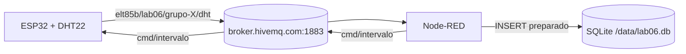
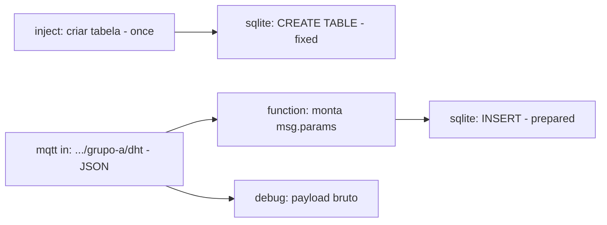

# Laboratório 06

{/* Tabela com link para atividade, inicio, fim e descrição do LAB! */}

<div style={{ display: "flex", justifyContent: "center" }}>
  <LabTable index={6} internal={false} />
</div>

---

## Checklist — OLED SSD1306, Node-RED, SQLite, Interrupções no ESP32

- [ ] Verificar `git --version`
- [ ] Abrir o VS Code
- [ ] Abrir a extensão PlatformIO IDE
- [ ] Criar um projeto ESP32
- [ ] Selecionar o framework Arduino
- [ ] Executar o Build
- [ ] Criar `wokwi.toml`
- [ ] Criar `diagram.json`
- [ ] Executar a simulação
- [ ] Verificar o Serial Monitor
- [ ] Atualizar o repositório no GitHub
- [ ] Executar `git push`
- [ ] Confirmar que o projeto está disponível no GitHub
- [ ] Logout

import {
  LabSetup,
  LabLogout,
} from "@site/src/components/shared/InstructionsSite";

<LabSetup />

---

<LabLogout />

---

## Clone o repositório inicial do LAB06

Escolha o Grupo e entre com o comando abaixo para criar o repositório no GitHub:

<LabTeamMembers labName="lab06" />

## Envie o link do repositório do seu grupo no Moodle: {/* #moodle-link */}

<LabSubmit labName="lab06" />

---

# Lab 06 — Node-RED com SQLite e intervalo remoto

<details>
<summary><strong>Mapa de tarefas</strong> — 5 tarefas · 100 pts</summary>

- [T1 — Node-RED com o no SQLite instalado](#t1) · 10 pts
- [T2 — Fluxo MQTT para SQLite](#t2) · 25 pts
- [T3 — Consulta ao banco SQLite](#t3) · 15 pts
- [T4 — Intervalo configuravel via MQTT no firmware](#t4) · 25 pts
- [T5 — Node-RED comandando o intervalo](#t5) · 25 pts

</details>

<LabSetup />

No **Lab 05** o ESP32 passou a publicar leituras do DHT22 via MQTT e o Node-RED só
**mostrava** as mensagens no debug. Agora o Node-RED vai **guardar** cada leitura num banco
**SQLite** e, no projeto integrador, **comandar** o ESP32: mudar o intervalo de leitura sem
recompilar — e provar pelo próprio banco que a mudança aconteceu.



## Objetivos

- Instalar o **`node-red-node-sqlite`** e criar uma tabela para as leituras.
- Gravar cada mensagem MQTT no banco usando **prepared statement** (sem SQL injection).
- Consultar o banco e medir a **periodicidade** das leituras com SQL.
- Fazer o firmware **assinar um tópico de comando** e rearmar o **temporizador** em tempo de execução.
- Fechar o ciclo: o Node-RED comanda o intervalo e o banco registra o efeito.

## Material

- Tudo do Lab 05: VS Code + PlatformIO + **Wokwi**, stack Docker (**Node-RED**, **MQTT Explorer**).
- Módulo Node-RED **`node-red-node-sqlite`** (instalado na T1).

:::info[Ponto de partida]
O `lab06-template` já traz o **firmware final do Lab 05** (DHT22 + `Ticker` + Wi-Fi + MQTT

- LWT), com os tópicos trocados de `lab05` para **`lab06`**. Se preferir continuar do
  código do seu grupo, copie o seu `src/main.cpp` do Lab 05 e troque `lab05` por `lab06` nos
  tópicos e no client ID.
  :::

## Clonar o repositório do grupo {/* #clonar */}

<LabTeamMembers labName="lab06" />

<FileTree
  root="lab06-grupo-X"
  files={[
    "platformio.ini r",
    "src/main.cpp u",
    "diagram.json r",
    "wokwi.toml r",
    ".gitignore r",
    ".vscode/extensions.json r",
    "nodered/flows-lab06.json c",
    "evidencias/t1-nodered.txt c",
    "evidencias/t3-consulta.txt c",
    "evidencias/t4-serial.txt c",
    "evidencias/t5-intervalos.txt c",
    "README.md u",
  ]}
/>

Antes de começar: troque `GRUPO` em `src/main.cpp` pela letra do grupo, compile, rode o
Wokwi e confira no MQTT Explorer (ou num `mqtt in` + `debug`, como no Lab 05) que chegam
mensagens em `elt85b/lab06/grupo-X/dht` a cada 5 s.

:::info[setup() × loop() nesta aula]

- **`setup()`** — **uma vez**: conectar, **assinar** o tópico de comando, armar o temporizador.
- **`loop()`** — **contínuo**: `mqtt.loop()` — é **dentro dele** que o callback de mensagens
  recebidas roda, então é seguro rearmar o temporizador ali.
- **callback do temporizador** — continua só levantando a flag.
  :::

---

## Parte 1 — Instalar o nó SQLite {/* #parte-1 */}

1. Suba a stack Docker e abra o Node-RED em `http://localhost:1880`.
2. Menu (☰) → **Manage palette** → aba **Install** → procure **`node-red-node-sqlite`**
   → **Install**. (A versão atual é a **2.x**; ela instala um binário nativo do SQLite e pode
   demorar um pouco.)
3. Confira que apareceu a categoria **storage** com o nó **sqlite** na paleta.

:::warning[Se o nó não carregar]
A versão 2.x do `node-red-node-sqlite` troca a biblioteca nativa e pode faltar binário
pré-compilado para alguma plataforma (o log mostra algo como `GLIBC ... not found` ou
erro ao carregar `sqlite3`). Nesse caso, remova-o e instale a série 1.x pela linha de
comando do container (substitua `NOME` pelo nome do container do Node-RED, visto em `docker ps`):

```bash title="Terminal"
docker exec -it NOME sh -c "cd /data && npm install node-red-node-sqlite@1"
docker restart NOME
```

:::

Descubra o nome do container (`NOME`) e registre que o módulo está instalado no diretório
de usuário do Node-RED (`/data`):

```bash title="Terminal"
docker ps --format '{{.Names}}  {{.Image}}  {{.Status}}' | tee evidencias/t1-nodered.txt
docker exec NOME npm ls --prefix /data node-red-node-sqlite | tee -a evidencias/t1-nodered.txt
```

**Saída esperada** (nomes e versões podem variar):

```text title="evidencias/t1-nodered.txt"
nodered  nodered/node-red:latest  Up 12 minutes
mosquitto  eclipse-mosquitto:2  Up 12 minutes
node-red-project@0.0.1 /data
└── node-red-node-sqlite@2.0.1
```

<CommitPoint
  id="t1"
  task="Node-RED com o no SQLite instalado"
  pontos={10}
  files="evidencias/t1-nodered.txt"
/>

---

## Parte 2 — Fluxo MQTT para SQLite {/* #parte-2 */}

Monte o fluxo numa aba nova chamada **Lab 06**:



### 2.1 Banco e tabela

1. **Config do banco** (aparece ao configurar o primeiro nó sqlite, campo _Database_):
   caminho **`/data/lab06.db`**, modo **Read-Write-Create**. A pasta `/data` do container é
   o volume persistente do Node-RED — o banco sobrevive a reinícios.
2. **inject** "criar tabela" → marque _Inject once after 1 seconds_, sem repetição.
3. **sqlite** "CREATE TABLE" → _SQL Query:_ **Fixed Statement**:

```sql title="SQL do no CREATE TABLE"
CREATE TABLE IF NOT EXISTS leituras (
  id          INTEGER PRIMARY KEY AUTOINCREMENT,
  recebido_em TEXT    NOT NULL DEFAULT (strftime('%Y-%m-%d %H:%M:%f','now')),
  grupo       TEXT    NOT NULL,
  seq         INTEGER NOT NULL,
  temperatura REAL    NOT NULL,
  umidade     REAL    NOT NULL,
  uptime_ms   INTEGER
);
```

`recebido_em` é preenchido **pelo próprio SQLite** (horário UTC, com milissegundos) — o
Node-RED nem precisa mandá-lo.

### 2.2 Receber e gravar

1. **mqtt in** → servidor `broker.hivemq.com`, porta `1883`; tópico
   `elt85b/lab06/grupo-a/dht` (seu grupo); **Output: a parsed JSON object**.
2. **function** "monta msg.params" — valida o payload e monta os parâmetros:

```js title="function: monta msg.params"
const p = msg.payload;
if (
  typeof p !== "object" ||
  typeof p.t !== "number" ||
  typeof p.h !== "number"
) {
  node.warn("payload invalido: " + JSON.stringify(p));
  return null; // descarta a mensagem
}
msg.params = {
  $grupo: p.grupo,
  $seq: p.seq,
  $t: p.t,
  $h: p.h,
  $uptime_ms: p.uptime_ms,
};
return msg;
```

3. **sqlite** "INSERT leitura" → _SQL Query:_ **Prepared Statement**:

```sql title="SQL do no INSERT"
INSERT INTO leituras (grupo, seq, temperatura, umidade, uptime_ms)
VALUES ($grupo, $seq, $t, $h, $uptime_ms);
```

:::danger[Por que prepared statement?]
Montar o SQL concatenando texto (`"... VALUES (" + msg.payload.t + ")"`) é **SQL injection**
esperando acontecer — e o broker é público: qualquer um pode publicar no seu tópico.
Com **Prepared Statement** os valores de `msg.params` são enviados **separados** do SQL e
nunca executados como código. As chaves precisam do **`$`** — sem ele o nó reclama de
`SQLITE_RANGE: bind or column index out of range`.
:::

**Deploy** e deixe a simulação do Wokwi rodando. No painel _debug_, o "payload bruto" deve
mostrar um objeto a cada 5 s. Para testar a validação, publique no tópico (MQTT Explorer)
o texto `oi` — deve aparecer o aviso `payload invalido` e **nada** ser gravado.

### 2.3 Exportar o fluxo

Selecione a aba **Lab 06** → menu → **Export** → _Current flow_ → **JSON formatado** →
**Download**. Salve como `nodered/flows-lab06.json` no repositório do grupo.

<CommitPoint
  id="t2"
  task="Fluxo MQTT para SQLite"
  pontos={25}
  files="nodered/flows-lab06.json"
/>

---

## Parte 3 — Consultando o banco {/* #parte-3 */}

Acrescente ao fluxo: **inject** "consultar" → **sqlite** (Fixed Statement) → **debug**
(saída `msg.payload`).

```sql title="SQL do no SELECT"
SELECT id, seq, recebido_em, temperatura, umidade,
       ROUND((julianday(recebido_em) - julianday(LAG(recebido_em) OVER (ORDER BY id))) * 86400, 1) AS delta_s
FROM leituras
ORDER BY id DESC
LIMIT 20;
```

- `LAG(...) OVER (ORDER BY id)` pega o `recebido_em` da linha **anterior**; a diferença de
  `julianday` (em dias) × 86400 dá o intervalo em **segundos** entre chegadas.
- A linha mais antiga do resultado tem `delta_s` nulo (não há anterior).

Deixe a simulação rodando pelo menos **1 minuto** (≥ 10 leituras) e clique em "consultar".
No _debug_, passe o mouse sobre o array → ícone **Copy value** e cole em
`evidencias/t3-consulta.txt`. **Saída esperada** (trecho):

```json title="evidencias/t3-consulta.txt"
[
  {
    "id": 14,
    "seq": 14,
    "recebido_em": "2026-09-29 20:11:42.311",
    "temperatura": 31.2,
    "umidade": 48,
    "delta_s": 5
  },
  {
    "id": 13,
    "seq": 13,
    "recebido_em": "2026-09-29 20:11:37.309",
    "temperatura": 31.2,
    "umidade": 48,
    "delta_s": 5
  },
  {
    "id": 12,
    "seq": 12,
    "recebido_em": "2026-09-29 20:11:32.320",
    "temperatura": 24.5,
    "umidade": 55,
    "delta_s": 5
  }
]
```

:::tip[O que olhar no resultado]

- `delta_s` deve ficar **em torno de 5** — pequenas variações vêm da rede, não do temporizador.
  Compare com as diferenças de `uptime_ms`: elas ficam cravadas em 5000.
- Buracos em `seq` = mensagens perdidas (QoS 0 no `publish` do PubSubClient).
- Se `id` e `seq` divergem, você reiniciou a simulação (o `seq` recomeça do 1, o `id` não).
  :::

Acrescente ao mesmo arquivo o resultado desta consulta resumo (outro inject + sqlite + debug,
ou troque o SQL do nó e clique de novo):

```sql title="SQL de resumo"
SELECT COUNT(*) AS total, ROUND(AVG(temperatura),1) AS t_media, ROUND(AVG(umidade),1) AS h_media
FROM leituras;
```

Exporte o fluxo de novo por cima de `nodered/flows-lab06.json`.

<CommitPoint
  id="t3"
  task="Consulta ao banco SQLite"
  pontos={15}
  files="nodered/flows-lab06.json evidencias/t3-consulta.txt"
/>

---

## Parte 4 — Intervalo configurável via MQTT {/* #parte-4 */}

Hoje, para mudar o intervalo é preciso recompilar. Faça o firmware aceitar o intervalo
pelo tópico **`elt85b/lab06/grupo-X/cmd/intervalo`**.

### Requisitos

- O payload é um número em segundos, como **texto** (ex.: `10`). Aceitar só **2 a 3600**
  (o DHT22 não lê mais rápido que 2 s); fora disso, logar e **ignorar**.
- Ao receber um valor válido, **rearmar** o temporizador com o novo período e logar
  `[TMR] intervalo = N s`.
- `INTERVALO_S` deixa de ser `const`: vira uma variável (`uint32_t intervaloS = 5;`).
- **Assinar** o tópico dentro de `conectarMQTT()`, logo após conectar — assim a assinatura é
  refeita a cada reconexão (com _clean session_, o broker esquece as assinaturas quando o
  cliente cai).

### Dicas de API

```cpp title="Trechos uteis (PubSubClient e Ticker)"
const char *TOPICO_CMD = "elt85b/lab06/grupo-" GRUPO "/cmd/intervalo";

// callback de mensagens recebidas (roda dentro de mqtt.loop())
void aoReceberMensagem(char *topico, byte *payload, unsigned int len);
mqtt.setCallback(aoReceberMensagem);   // em setup(), antes de conectarMQTT()
mqtt.subscribe(TOPICO_CMD);            // em conectarMQTT(), apos conectar

// o payload NAO termina em zero: copie para um buffer e feche a string
char buf[16];
unsigned int n = len < sizeof(buf) - 1 ? len : sizeof(buf) - 1;
memcpy(buf, payload, n);
buf[n] = '\0';
long valor = atol(buf);

// rearmar o temporizador
temporizador.detach();
temporizador.attach((float)novoIntervalo, aoEstourarTemporizador);
```

:::warning[Onde NÃO fazer isso]
Nunca chame `mqtt.publish()`/`subscribe()` nem mexa no Ticker de dentro do **callback do
Ticker**. O callback de **mensagens MQTT** é diferente: ele roda dentro de `mqtt.loop()`,
no contexto do `loop()` — ali é seguro.
:::

### Testando sem o Node-RED

Com o Wokwi rodando, publique um comando pelo MQTT Explorer ou pelo terminal:

```bash title="Terminal"
docker run --rm eclipse-mosquitto:2 mosquitto_pub -h broker.hivemq.com \
  -t 'elt85b/lab06/grupo-a/cmd/intervalo' -m 10
```

**Saída esperada** no monitor serial (envie também um valor inválido, como `1`):

```text title="evidencias/t4-serial.txt"
[PUB] ok elt85b/lab06/grupo-a/dht -> {"grupo":"a","seq":12,"t":24.5,"h":55.0,"uptime_ms":61410}
[MQTT] elt85b/lab06/grupo-a/cmd/intervalo -> '10'
[TMR] intervalo = 10 s
[PUB] ok elt85b/lab06/grupo-a/dht -> {"grupo":"a","seq":13,"t":24.5,"h":55.0,"uptime_ms":74630}
[MQTT] elt85b/lab06/grupo-a/cmd/intervalo -> '1'
[MQTT] intervalo invalido (use 2..3600)
```

Salve esse trecho do monitor serial em `evidencias/t4-serial.txt`.

:::tip[Preveja antes de rodar]
**P1:** o comando chegou **entre** duas leituras. A próxima publicação sai 10 s depois
**da leitura anterior** ou 10 s depois **do comando**? Olhe os `uptime_ms` para confirmar.
**P2:** e se o comando fosse publicado com **retain**? O que aconteceria ao reiniciar a
simulação?
:::

<CommitPoint
  id="t4"
  task="Intervalo configuravel via MQTT no firmware"
  pontos={25}
  files="src/main.cpp evidencias/t4-serial.txt"
/>

---

## Projeto integrador — o Node-RED comanda, o banco comprova {/* #integrador */}

Feche o ciclo: o intervalo passa a ser comandado pelo **Node-RED**, e a prova de que o
comando funcionou vem do **SQLite**.

### Requisitos

1. **Node-RED** — acrescente dois **inject** ("intervalo 5 s" e "intervalo 10 s",
   payload **string** `5` e `10`) ligados a um **mqtt out** no tópico
   `elt85b/lab06/grupo-X/cmd/intervalo` (QoS 1, **sem** retain).
2. **Experimento** — com a simulação rodando:
   1. clique "intervalo 5 s" e deixe ~1 min;
   2. clique "intervalo 10 s" e deixe mais ~1 min;
   3. rode a consulta do `SELECT` com `delta_s` da T3.
3. **Evidência** — salve o resultado em `evidencias/t5-intervalos.txt`: deve dar para ver
   `delta_s` mudando de **~5** para **~10**. Exporte o fluxo por cima de
   `nodered/flows-lab06.json`.

**Saída esperada** (trecho, mais recente primeiro):

```json title="evidencias/t5-intervalos.txt"
[
  {
    "id": 31,
    "seq": 31,
    "recebido_em": "2026-09-29 20:20:17.321",
    "temperatura": 24.5,
    "umidade": 55,
    "delta_s": 10
  },
  {
    "id": 30,
    "seq": 30,
    "recebido_em": "2026-09-29 20:20:07.318",
    "temperatura": 24.5,
    "umidade": 55,
    "delta_s": 10
  },
  {
    "id": 29,
    "seq": 29,
    "recebido_em": "2026-09-29 20:19:57.315",
    "temperatura": 24.5,
    "umidade": 55,
    "delta_s": 13.2
  },
  {
    "id": 28,
    "seq": 28,
    "recebido_em": "2026-09-29 20:19:44.115",
    "temperatura": 24.5,
    "umidade": 55,
    "delta_s": 5
  }
]
```

O `delta_s` "quebrado" (13,2) na transição é esperado — ele fica entre 10 e 15 s. Veja a sua resposta da **P1**.

:::tip[Preveja antes de rodar]
**P3:** o que aparece no banco se alguém publicar `3` no seu tópico de comando pelo broker
público — sem passar pelo seu Node-RED? O que isso diz sobre usar broker público para
**comandos**?
:::

<CommitPoint
  id="t5"
  task="Node-RED comandando o intervalo"
  pontos={25}
  files="nodered/flows-lab06.json evidencias/t5-intervalos.txt"
/>

---

## Checklist

- [ ] `node-red-node-sqlite` instalado e carregado (T1)
- [ ] Tabela `leituras` + fluxo `mqtt in` (JSON) → `function` → `sqlite` (prepared) (T2)
- [ ] Consulta com `delta_s` e resumo salva, ≥ 10 leituras (T3)
- [ ] Firmware aceita `cmd/intervalo` 2–3600 s e rearma o `Ticker` (T4)
- [ ] Node-RED comanda 5 s / 10 s e o banco mostra a mudança (T5)
- [ ] Previsões P1–P3 respondidas no `README.md`
- [ ] Nenhum `push --force`; cada tarefa num commit `Tn:`

:::info[Pontuação]
**T1…T5 = 100 pts** (esta aula não tem desafios): T1 10 · T2 25 · T3 15 · T4 25 · T5 25.
O autograder normaliza para 0–10. Vale o commit `Tn:` mais recente de cada tarefa.
:::

## Entrega

<LabSubmit labName="lab06" />

<LabLogout />
