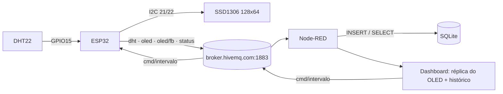
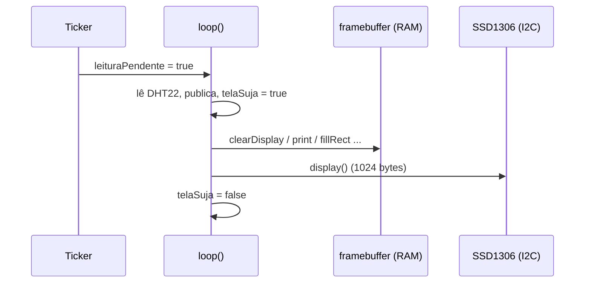
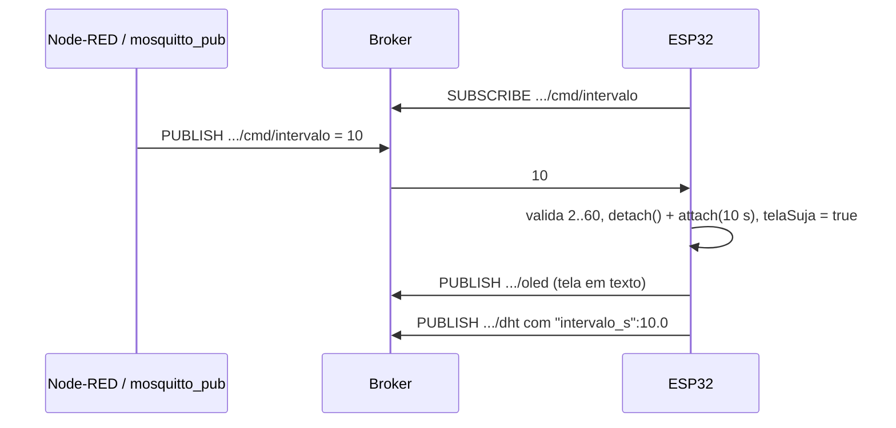
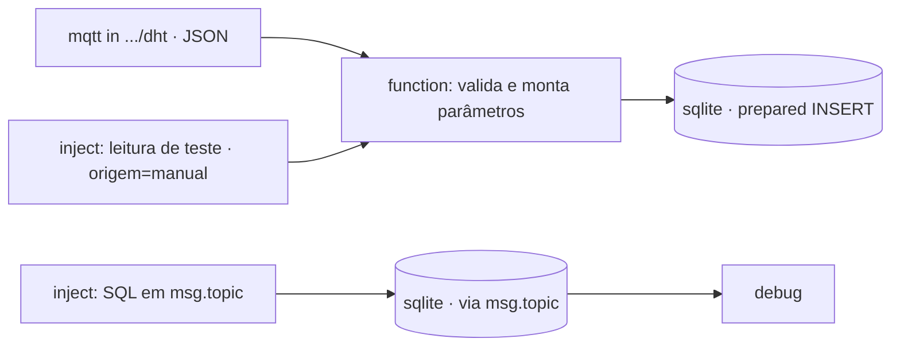
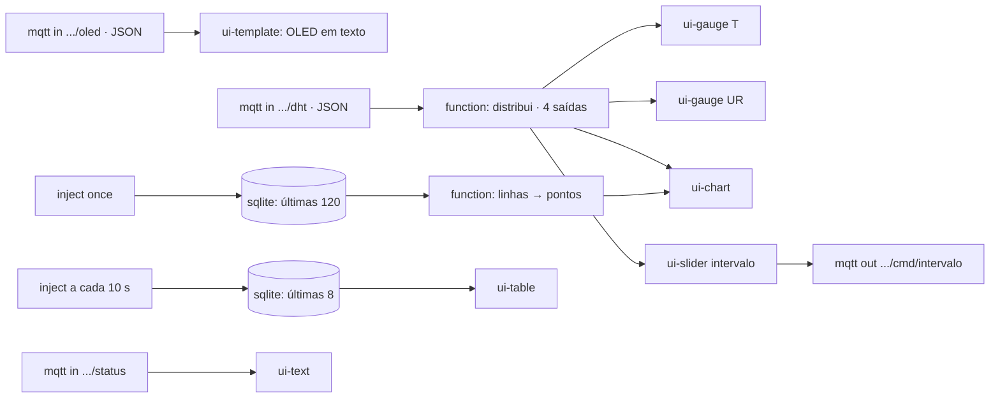

## Checklist — SSD1306, MQTT nos dois sentidos, SQLite e dashboard {/* #checklist */}

- [ ] `platformio.ini` com Adafruit SSD1306 + GFX; `diagram.json` com o OLED em SDA 21 / SCL 22 (T1)
- [ ] Tela local desenhada só quando muda (`telaSuja`), fora do callback do temporizador (T2)
- [ ] Intervalo alterado por MQTT (`.../cmd/intervalo`, 2–60 s) e tela espelhada em texto em `.../oled` (T3)
- [ ] Node-RED grava cada leitura no SQLite (INSERT preparado) e consulta o banco por `inject` (T4)
- [ ] Dashboard: réplica do OLED, gauges, gráfico com histórico do SQLite e slider do intervalo (T5)
- [ ] Framebuffer do SSD1306 em `.../oled/fb` desenhado pixel a pixel no dashboard (T6)
- [ ] Previsões P1–P4 respondidas no `README.md`
- [ ] Nenhum `push --force`; cada tarefa num commit `Tn:`

:::info[Pontuação]
**T1…T6 = 100 pts** (esta aula não tem desafios): T1 10 · T2 15 · T3 20 · T4 20 · T5 15 ·
T6 20. O autograder normaliza para 0–10. Vale o commit `Tn:` mais recente de cada tarefa.
:::

<LabSetup />

### Configuração do ambiente de desenvolvimento {/* #setup */}

<DevTools />

---

Esta aula continua o **Lab 05**: o mesmo nó de telemetria (DHT22 + `Ticker` + MQTT + LWT)
ganha um **display OLED SSD1306**. O MQTT passa a funcionar **nos dois sentidos**: o ESP32
publica as leituras e o conteúdo da tela, e o Node-RED manda comandos de volta, como o
intervalo de leitura. No Node-RED, as leituras são **gravadas e consultadas no SQLite**, e o
**dashboard** mostra a tela do OLED de duas formas: como **texto** e **pixel a pixel**, a
partir do framebuffer.



## Objetivos

- Ligar um **display SSD1306 (I2C)** ao ESP32 e entender o **framebuffer**: o desenho acontece
  na RAM, e só `display()` envia os 1024 bytes pelo barramento.
- Atualizar a tela **só quando algo muda** (flag `telaSuja`), sem bloquear o `loop()`.
- Usar MQTT **nos dois sentidos**: assinar um tópico de comando e mudar o **intervalo** do
  temporizador remotamente.
- No **Node-RED**, **injetar** (INSERT) e **ler** (SELECT) dados no **SQLite**, com statement
  preparado e validação do que chega do broker.
- Visualizar o **SSD1306 no dashboard** do Node-RED: réplica em texto (T5) e réplica fiel,
  pixel a pixel, a partir do framebuffer (T6).

## Material

- VS Code + PlatformIO + extensão **Wokwi** (ESP32 **simulado**, sem placa física).
- Stack Docker do curso: nesta aula usamos o **Node-RED**, com `node-red-node-sqlite` e o
  **Dashboard 2.0** (`@flowfuse/node-red-dashboard`) já instalados na imagem.
- Bibliotecas novas (baixadas pelo PlatformIO): `adafruit/Adafruit SSD1306` e
  `adafruit/Adafruit GFX Library`. As do Lab 05 continuam.

:::info[Por que Wokwi (e não placa física)?]
O Wokwi simula o **SSD1306 por I2C** além do DHT22 e do Wi-Fi, então a aula roda inteira
nele. Numa placa física o firmware é o mesmo. Confira só o **endereço I2C** do seu módulo:
a maioria é `0x3C`, alguns são `0x3D`.
:::

## Clonar o repositório do grupo {/* #clonar */}

<LabTeamMembers labName="lab06" />

## Envie o link do repositório do seu grupo no Moodle: {/* #moodle-link */}

<LabSubmit labName="lab06" />

<details>
<summary><strong>Mapa de tarefas</strong> — 6 tarefas · 100 pts</summary>

- [T1 — Circuito e dependencias do SSD1306](#t1) · 10 pts
- [T2 — Tela local no OLED](#t2) · 15 pts
- [T3 — MQTT nos dois sentidos](#t3) · 20 pts
- [T4 — Node-RED gravando e consultando o SQLite](#t4) · 20 pts
- [T5 — Dashboard com a replica do OLED](#t5) · 15 pts
- [T6 — Framebuffer pixel a pixel no dashboard](#t6) · 20 pts

</details>

O repositório do grupo nasce do `lab06-template`, que já traz o **firmware final do Lab 05**
(com LWT) em `src/main.cpp`:

<FileTree
  root="lab06-grupo-X"
  files={[
    "platformio.ini u",
    "src/main.cpp u",
    "diagram.json u",
    "wokwi.toml r",
    ".gitignore r",
    ".vscode/extensions.json r",
    "nodered/flows-lab06.json c",
    "evidencias/t2-serial.txt c",
    "evidencias/t2-oled.png c",
    "evidencias/t3-mqtt.txt c",
    "evidencias/t4-sqlite.txt c",
    "evidencias/t5-dashboard.png c",
    "evidencias/t6-fb.txt c",
    "evidencias/t6-oled.png c",
    "README.md u",
  ]}
/>

:::info[Tópicos do Lab 06]
Tudo fica sob `elt85b/lab06/grupo-X/`. Troque o `X` (e o `#define GRUPO`) pela letra do seu grupo.

| Tópico              | Sentido        | Payload                                                                       |
| ------------------- | -------------- | ----------------------------------------------------------------------------- |
| `.../dht`           | ESP32 → broker | `{"grupo":"a","seq":7,"t":24.5,"h":55.0,"uptime_ms":35210,"intervalo_s":5.0}` |
| `.../status`        | ESP32 → broker | `online` / `offline` (retido, LWT)                                            |
| `.../oled`          | ESP32 → broker | `{"linhas":["LAB06 grupo a","T: 24.5 C", ...]}` (T3)                          |
| `.../oled/fb`       | ESP32 → broker | 1024 bytes do framebuffer em **base64** (T6)                                  |
| `.../cmd/intervalo` | broker → ESP32 | `10` (segundos, 2–60)                                                         |

:::

---

## Parte 1 — SSD1306 no circuito {/* #parte-1 */}

### 1.1 Circuito no Wokwi

O SSD1306 do Wokwi (`board-ssd1306`) é um módulo **I2C** de 4 pinos: `GND`, `VCC`, `SCL` e
`SDA`. No ESP32, o I2C padrão usa **GPIO21 = SDA** e **GPIO22 = SCL**. Acrescente o display
ao `diagram.json` do Lab 05:

<FileTree root="lab06-grupo-X" files={["diagram.json u"]} />

```json title="diagram.json"
{
  "version": 1,
  "author": "ELT85B - Lab 06",
  "editor": "wokwi",
  "parts": [
    {
      "type": "board-esp32-devkit-c-v4",
      "id": "esp",
      "top": 0,
      "left": 0,
      "attrs": {}
    },
    {
      "type": "wokwi-dht22",
      "id": "dht1",
      "top": -76.5,
      "left": 157.8,
      "attrs": { "temperature": "24.5", "humidity": "55" }
    },
    {
      "type": "board-ssd1306",
      "id": "oled1",
      "top": 108.74,
      "left": 172.23,
      "attrs": { "i2cAddress": "0x3c" }
    }
  ],
  "connections": [
    ["esp:TX", "$serialMonitor:RX", "", []],
    ["esp:RX", "$serialMonitor:TX", "", []],
    ["dht1:VCC", "esp:3V3", "red", []],
    ["dht1:GND", "esp:GND.2", "black", []],
    ["dht1:SDA", "esp:15", "green", []],
    ["oled1:VCC", "esp:3V3", "red", []],
    ["oled1:GND", "esp:GND.2", "black", []],
    ["oled1:SDA", "esp:21", "blue", []],
    ["oled1:SCL", "esp:22", "purple", []]
  ],
  "dependencies": {}
}
```

### 1.2 Bibliotecas

<FileTree root="lab06-grupo-X" files={["platformio.ini u"]} />

```ini title="platformio.ini"
[env:esp32dev]
platform = espressif32
board = esp32dev
framework = arduino
monitor_speed = 115200
lib_deps =
    adafruit/DHT sensor library@^1.4.6
    adafruit/Adafruit Unified Sensor@^1.1.14
    knolleary/PubSubClient@^2.8
    adafruit/Adafruit SSD1306@^2.5.13
    adafruit/Adafruit GFX Library@^1.11.11
```

A **GFX** é a biblioteca de desenho (texto, linhas, retângulos, círculos). A **SSD1306** guarda
o framebuffer e conversa com o controlador do display pelo I2C.

<CommitPoint
  id="t1"
  task="Circuito e dependencias do SSD1306"
  pontos={10}
  files="platformio.ini diagram.json"
/>

---

## Parte 2 — Tela local {/* #parte-2 */}

### 2.1 Como o SSD1306 desenha

O display tem 128 × 64 pixels monocromáticos: **1 bit por pixel**, 1024 bytes no total. A
biblioteca guarda essa imagem num **framebuffer na RAM** do ESP32:

- `clearDisplay()`, `print()`, `drawRect()`, `fillRect()`… **só alteram a RAM**. São rápidas
  e nada aparece ainda.
- `display()` envia os **1024 bytes pelo I2C** para o controlador do display. Isso leva alguns
  milissegundos e só deve ser feito quando a imagem mudou.

Por isso usamos o mesmo padrão do temporizador do Lab 05: quem detecta a mudança só marca uma
**flag**, e o `loop()` redesenha.



### 2.2 Código

Acrescente ao firmware do Lab 05:

<FileTree root="lab06-grupo-X" files={["src/main.cpp u"]} />

```cpp title="src/main.cpp (trechos novos da T2)"
#include <Wire.h>
#include <Adafruit_GFX.h>
#include <Adafruit_SSD1306.h>

#define OLED_SDA  21
#define OLED_SCL  22
#define OLED_ADDR 0x3C
#define OLED_W    128
#define OLED_H    64

Adafruit_SSD1306 oled(OLED_W, OLED_H, &Wire, -1);   // -1 = sem pino de reset

float ultimaT = NAN, ultimaH = NAN;   // última leitura válida (a tela mostra estes)
bool telaSuja = true;                 // redesenhar na próxima volta do loop()

// Quadradinho com letra: cheio = conectado, vazado = desconectado
void indicador(int x, const char *letra, bool ok) {
  if (ok) {
    oled.fillRect(x, 0, 13, 9, SSD1306_WHITE);
    oled.setTextColor(SSD1306_BLACK);
  } else {
    oled.drawRect(x, 0, 13, 9, SSD1306_WHITE);
    oled.setTextColor(SSD1306_WHITE);
  }
  oled.setCursor(x + 4, 1);
  oled.print(letra);
  oled.setTextColor(SSD1306_WHITE);
}

void desenharTela() {
  oled.clearDisplay();
  oled.setTextColor(SSD1306_WHITE);

  oled.setTextSize(1);                               // cabeçalho
  oled.setCursor(0, 1);
  oled.print("LAB06 grupo " GRUPO);
  indicador(98, "W", WiFi.status() == WL_CONNECTED);
  indicador(114, "M", mqtt.connected());
  oled.drawFastHLine(0, 11, OLED_W, SSD1306_WHITE);

  oled.setTextSize(2);                               // temperatura (fonte 12x16)
  oled.setCursor(0, 16);
  if (isnan(ultimaT)) oled.print("--.-");
  else oled.printf("%4.1f", ultimaT);
  oled.drawCircle(53, 18, 2, SSD1306_WHITE);         // símbolo de grau
  oled.setCursor(58, 16);
  oled.print("C");

  oled.setCursor(0, 36);                             // umidade + barra
  if (isnan(ultimaH)) oled.print("--.-%");
  else oled.printf("%4.1f%%", ultimaH);
  oled.drawRect(72, 37, 56, 12, SSD1306_WHITE);
  if (!isnan(ultimaH)) oled.fillRect(74, 39, (int)(52 * ultimaH / 100.0), 8, SSD1306_WHITE);

  oled.setTextSize(1);                               // rodapé
  oled.setCursor(0, 56);
  oled.printf("seq %lu   int %.0f s", (unsigned long)seq, INTERVALO_S);
  oled.display();                                    // <- só aqui vai para o display
}

// em setup(), depois de dht.begin():
//   Wire.begin(OLED_SDA, OLED_SCL);
//   if (!oled.begin(SSD1306_SWITCHCAPVCC, OLED_ADDR))
//     Serial.println("[OLED] SSD1306 nao encontrado - confira SDA/SCL/endereco");
//   desenharTela();
//
// em lerEPublicar(), depois de validar t e h:
//   ultimaT = t;  ultimaH = h;  telaSuja = true;
//
// no fim de loop():
//   if (telaSuja) { telaSuja = false; desenharTela(); }
//
// em conectarMQTT(), logo depois do connect bem-sucedido:
//   telaSuja = true;      // o indicador "M" muda
```

**Tela esperada** depois da primeira leitura:

```text title="SSD1306 (128 x 64)"
LAB06 grupo a          [W] [M]
-------------------------------
24.5 °C
55.0%    [██████████        ]
seq 1   int 5 s
```

As linhas de temperatura e umidade usam a fonte em tamanho 2 (12 × 16 px). `[W]` e `[M]`
aparecem cheios quando Wi-Fi e MQTT estão conectados.

:::tip[Preveja antes de rodar]

- **P1:** por que `desenharTela()` não pode ser chamada **dentro** de `aoEstourarTemporizador()`?
  E se ela fosse chamada **em toda volta** do `loop()`, sem a flag `telaSuja`? Estime o tempo de
  um `display()`: 1024 bytes a 400 kHz, com ~9 bits por byte no I2C. Pense no que acontece com
  o `mqtt.loop()`.

Anote as previsões e o que observou no `README.md`.
:::

**Evidências:** salve o monitor serial com pelo menos 3 leituras em `evidencias/t2-serial.txt`
e uma captura do Wokwi com o display em `evidencias/t2-oled.png`.

<FileTree
  root="lab06-grupo-X"
  files={["evidencias/t2-serial.txt c", "evidencias/t2-oled.png c"]}
/>

<CommitPoint
  id="t2"
  task="Tela local no OLED"
  pontos={15}
  files="src/main.cpp evidencias/t2-serial.txt evidencias/t2-oled.png"
/>

---

## Parte 3 — MQTT nos dois sentidos {/* #parte-3 */}

Até aqui o ESP32 só **publicava**. Agora ele também **assina** um tópico de comando:
o Node-RED (ou qualquer cliente) muda o **intervalo de leitura** sem regravar o firmware.
E a cada redesenho o ESP32 publica o **conteúdo da tela** em texto, para o dashboard copiar.



### 3.1 O que muda

- `INTERVALO_S` deixa de ser `const`: vira `float intervaloS`, que o comando altera.
- **Callback** `aoReceberMensagem()`: o PubSubClient a chama **dentro de `mqtt.loop()`**,
  ou seja, no contexto do `loop()`. Ali pode usar `Serial` e o `Ticker` à vontade, ao
  contrário do callback do temporizador.
- O payload **não** termina com `'\0'`: copie para um buffer e termine a string antes do `atof()`.
- **Valide** o comando. O broker é público: qualquer pessoa pode publicar `0` ou `abc` no seu tópico.
- **Assine dentro de `conectarMQTT()`**: a sessão é limpa, então depois de uma reconexão o
  broker não lembra das assinaturas antigas.
- O JSON das leituras ganha `intervalo_s`, que **confirma** ao Node-RED o valor em uso.

### 3.2 Código completo até aqui

<FileTree root="lab06-grupo-X" files={["src/main.cpp u"]} />

```cpp title="src/main.cpp (T3)"
// ELT85B - Lab 06 (T3): DHT22 + SSD1306 + MQTT nos dois sentidos
#include <Arduino.h>
#include <WiFi.h>
#include <PubSubClient.h>
#include <Ticker.h>
#include <DHT.h>
#include <Wire.h>
#include <Adafruit_GFX.h>
#include <Adafruit_SSD1306.h>

#define GRUPO     "a"                    // troque pela letra do seu grupo
#define DHT_PIN   15
#define DHT_TIPO  DHT22
#define OLED_SDA  21
#define OLED_SCL  22
#define OLED_ADDR 0x3C
#define OLED_W    128
#define OLED_H    64

const char *WIFI_SSID  = "Wokwi-GUEST";
const char *WIFI_SENHA = "";
const char *MQTT_HOST  = "broker.hivemq.com";
const uint16_t MQTT_PORTA = 1883;

#define BASE "elt85b/lab06/grupo-" GRUPO
const char *TOPICO_DADOS     = BASE "/dht";
const char *TOPICO_STATUS    = BASE "/status";
const char *TOPICO_OLED      = BASE "/oled";            // tela em texto (JSON)
const char *TOPICO_INTERVALO = BASE "/cmd/intervalo";   // Node-RED -> ESP32

DHT dht(DHT_PIN, DHT_TIPO);
Adafruit_SSD1306 oled(OLED_W, OLED_H, &Wire, -1);
WiFiClient wifiClient;
PubSubClient mqtt(wifiClient);
Ticker temporizador;

volatile bool leituraPendente = false;
float intervaloS = 5.0;                  // alterado por MQTT (2..60 s)
uint32_t seq = 0;
float ultimaT = NAN, ultimaH = NAN;
bool telaSuja = true;                    // redesenhar na próxima volta do loop()
char clientId[32];

void aoEstourarTemporizador() {
  leituraPendente = true;
}

// ---------------------------------------------------------------------- OLED
void indicador(int x, const char *letra, bool ok) {
  if (ok) {
    oled.fillRect(x, 0, 13, 9, SSD1306_WHITE);
    oled.setTextColor(SSD1306_BLACK);
  } else {
    oled.drawRect(x, 0, 13, 9, SSD1306_WHITE);
    oled.setTextColor(SSD1306_WHITE);
  }
  oled.setCursor(x + 4, 1);
  oled.print(letra);
  oled.setTextColor(SSD1306_WHITE);
}

void desenharTela() {
  oled.clearDisplay();
  oled.setTextColor(SSD1306_WHITE);

  oled.setTextSize(1);                               // cabeçalho
  oled.setCursor(0, 1);
  oled.print("LAB06 grupo " GRUPO);
  indicador(98, "W", WiFi.status() == WL_CONNECTED);
  indicador(114, "M", mqtt.connected());
  oled.drawFastHLine(0, 11, OLED_W, SSD1306_WHITE);

  oled.setTextSize(2);                               // temperatura
  oled.setCursor(0, 16);
  if (isnan(ultimaT)) oled.print("--.-");
  else oled.printf("%4.1f", ultimaT);
  oled.drawCircle(53, 18, 2, SSD1306_WHITE);         // símbolo de grau
  oled.setCursor(58, 16);
  oled.print("C");

  oled.setCursor(0, 36);                             // umidade + barra
  if (isnan(ultimaH)) oled.print("--.-%");
  else oled.printf("%4.1f%%", ultimaH);
  oled.drawRect(72, 37, 56, 12, SSD1306_WHITE);
  if (!isnan(ultimaH)) oled.fillRect(74, 39, (int)(52 * ultimaH / 100.0), 8, SSD1306_WHITE);

  oled.setTextSize(1);                               // rodapé
  oled.setCursor(0, 56);
  oled.printf("seq %lu   int %.0f s", (unsigned long)seq, intervaloS);
  oled.display();
}

// ------------------------------------------------------ espelho da tela (T3)
void publicarTelaTexto() {
  char t[8] = "--.-", h[8] = "--.-";            // antes da 1ª leitura: sem número
  if (!isnan(ultimaT)) snprintf(t, sizeof(t), "%.1f", ultimaT);
  if (!isnan(ultimaH)) snprintf(h, sizeof(h), "%.1f", ultimaH);
  char payload[200];
  snprintf(payload, sizeof(payload),
           "{\"linhas\":[\"LAB06 grupo %s\",\"T: %s C\",\"UR: %s %%\","
           "\"seq %lu | %.0f s\",\"WiFi %s | MQTT %s\"]}",
           GRUPO, t, h, (unsigned long)seq, intervaloS,
           WiFi.status() == WL_CONNECTED ? "ok" : "--", mqtt.connected() ? "ok" : "--");
  mqtt.publish(TOPICO_OLED, payload);
}

// ---------------------------------------------------------------- comandos
void aoReceberMensagem(char *topico, byte *payload, unsigned int tam) {
  char txt[16];
  size_t n = tam < sizeof(txt) - 1 ? tam : sizeof(txt) - 1;
  memcpy(txt, payload, n);
  txt[n] = '\0';
  Serial.printf("[CMD] %s <- '%s'\n", topico, txt);

  if (strcmp(topico, TOPICO_INTERVALO) == 0) {
    float v = atof(txt);
    if (v < 2.0 || v > 60.0) {
      Serial.println("[CMD] intervalo fora de 2..60 s - ignorado");
      return;
    }
    intervaloS = v;
    temporizador.detach();
    temporizador.attach(intervaloS, aoEstourarTemporizador);
    Serial.printf("[CMD] novo intervalo: %.1f s\n", intervaloS);
    telaSuja = true;
  }
}

// ------------------------------------------------------------ Wi-Fi e MQTT
void conectarWiFi() {
  Serial.printf("[WiFi] conectando a %s", WIFI_SSID);
  WiFi.mode(WIFI_STA);
  WiFi.begin(WIFI_SSID, WIFI_SENHA, 6);  // canal 6 acelera no Wokwi
  while (WiFi.status() != WL_CONNECTED) {
    delay(250);
    Serial.print('.');
  }
  Serial.printf("\n[WiFi] conectado, IP %s\n", WiFi.localIP().toString().c_str());
}

void conectarMQTT() {
  while (!mqtt.connected()) {
    Serial.printf("[MQTT] conectando a %s como %s ... ", MQTT_HOST, clientId);
    if (mqtt.connect(clientId, TOPICO_STATUS, 1, true, "offline")) {
      Serial.println("ok");
      mqtt.publish(TOPICO_STATUS, "online", true);
      mqtt.subscribe(TOPICO_INTERVALO);  // (re)assina a cada conexão
      telaSuja = true;
    } else {
      Serial.printf("falhou (rc=%d), nova tentativa em 2 s\n", mqtt.state());
      delay(2000);
    }
  }
}

void lerEPublicar() {
  float t = dht.readTemperature();
  float h = dht.readHumidity();
  if (isnan(t) || isnan(h)) {
    Serial.println("[DHT] falha na leitura (NaN) - descartada");
    return;
  }
  seq++;
  ultimaT = t;
  ultimaH = h;
  char payload[160];
  snprintf(payload, sizeof(payload),
           "{\"grupo\":\"%s\",\"seq\":%lu,\"t\":%.1f,\"h\":%.1f,\"uptime_ms\":%lu,\"intervalo_s\":%.1f}",
           GRUPO, (unsigned long)seq, t, h, (unsigned long)millis(), intervaloS);
  bool ok = mqtt.publish(TOPICO_DADOS, payload);
  Serial.printf("[PUB] %s %s -> %s\n", ok ? "ok" : "ERRO", TOPICO_DADOS, payload);
  telaSuja = true;
}

void setup() {
  Serial.begin(115200);
  delay(200);
  Serial.println("\n=== Lab 06 - DHT22 + SSD1306 + MQTT ===");
  dht.begin();

  Wire.begin(OLED_SDA, OLED_SCL);
  if (!oled.begin(SSD1306_SWITCHCAPVCC, OLED_ADDR)) {
    Serial.println("[OLED] SSD1306 nao encontrado - confira SDA/SCL/endereco");
  }
  desenharTela();

  uint64_t mac = ESP.getEfuseMac();
  snprintf(clientId, sizeof(clientId), "lab06-%s-%04X", GRUPO, (uint16_t)(mac >> 32));

  conectarWiFi();
  mqtt.setServer(MQTT_HOST, MQTT_PORTA);
  mqtt.setCallback(aoReceberMensagem);
  conectarMQTT();

  temporizador.attach(intervaloS, aoEstourarTemporizador);
}

void loop() {
  if (WiFi.status() != WL_CONNECTED) conectarWiFi();
  if (!mqtt.connected()) conectarMQTT();
  mqtt.loop();

  if (leituraPendente) {
    leituraPendente = false;
    lerEPublicar();
  }

  if (telaSuja) {
    telaSuja = false;
    desenharTela();
    publicarTelaTexto();
  }
}
```

### 3.3 Testando pelo terminal

Num terminal, assine **todos** os tópicos do grupo. Num segundo terminal, mande o comando:

<GroupCommands
  commands={[
    {
      codeTitle: "Terminal 1 — Assinar via Docker",
      command: `docker run --rm eclipse-mosquitto:2 mosquitto_sub -h broker.hivemq.com \\
-t '{course}/lab06/grupo-{group}/#' -v | tee evidencias/t3-mqtt.txt`,
    },
    {
      codeTitle: "Terminal 2 — comandar via Docker",
      command: `docker run --rm eclipse-mosquitto:2 mosquitto_pub -h broker.hivemq.com \\
  -t '{course}/lab06/grupo-{group}/cmd/intervalo' -m 10`,
    },
    {
      codeTitle: "Terminal 2 — comandar via Docker",
      command: `docker run --rm eclipse-mosquitto:2 mosquitto_pub -h broker.hivemq.com \\
  -t '{course}/lab06/grupo-{group}/cmd/intervalo' -m 1      # fora da faixa: deve ser ignorado`,
    },
  ]}
/>

**Saída esperada** (trecho; encerre o Terminal 1 com Ctrl+C depois de umas 8 linhas):

<FileTree root="lab06-grupo-X" files={["evidencias/t3-mqtt.txt c"]} />

<GroupCommands
  language="text"
  commands={[
    {
      title: "Exemplo de Evidência de Saída",
      codeTitle: "evidencias/t3-mqtt.txt",
      command: `{course}/lab06/grupo-{group}/status online
{course}/lab06/grupo-{group}/dht {"grupo":"{group}","seq":3,"t":24.5,"h":55.0,"uptime_ms":16288,"intervalo_s":5.0}
{course}/lab06/grupo-{group}/oled {"linhas":["LAB06 grupo {group}","T: 24.5 C","UR: 55.0 %","seq 3 | 5 s","WiFi ok | MQTT ok"]}
{course}/lab06/grupo-{group}/cmd/intervalo 10
{course}/lab06/grupo-{group}/oled {"linhas":["LAB06 grupo {group}","T: 24.5 C","UR: 55.0 %","seq 3 | 10 s","WiFi ok | MQTT ok"]}
{course}/lab06/grupo-{group}/dht {"grupo":"{group}","seq":4,"t":24.5,"h":55.0,"uptime_ms":26290,"intervalo_s":10.0}
{course}/lab06/grupo-{group}/cmd/intervalo 1
{course}/lab06/grupo-{group}/dht {"grupo":"{group}","seq":5,"t":24.5,"h":55.0,"uptime_ms":36290,"intervalo_s":10.0}`,
    },
  ]}
/>

No monitor serial do Wokwi aparecem `[CMD] novo intervalo: 10.0 s` e, depois,
`[CMD] intervalo fora de 2..60 s - ignorado`.

:::tip[Preveja antes de rodar]
**P2:** e se o comando fosse publicado com **retain** (`mosquitto_pub -r`)? O que acontece
quando o ESP32 **reinicia**? Isso é bom ou ruim para um "intervalo de configuração"? E se o
valor retido for inválido, como o `1`? (Para apagar uma mensagem retida, publique um payload
vazio com `-r -n`.)
:::

<CommitPoint
  id="t3"
  task="MQTT nos dois sentidos"
  pontos={20}
  files="src/main.cpp evidencias/t3-mqtt.txt"
/>

---

## Parte 4 — Node-RED + SQLite {/* #parte-4 */}

No Node-RED, crie uma aba **Lab 06**. As leituras que chegam pelo MQTT serão **gravadas**
(INSERT) num banco SQLite, e o banco será **consultado** (SELECT) por nós `inject`.



### 4.1 Banco e tabela

Os nós **sqlite** usam um nó de configuração **sqlitedb**: _Database_
**`/data/sqlite/lab06.sqlite`**, _Mode_ **Read-Write-Create**. A pasta `/data/sqlite` já existe
na imagem do Node-RED da stack e fica no volume, então o banco sobrevive a um restart.

Crie um **inject** "Criar tabela" (_Inject once after_ 0,5 s) com o SQL abaixo em `msg.topic`,
ligado a um **sqlite** com _SQL Query_ **Via msg.topic** → **debug**:

```sql title="msg.topic do inject 'Criar tabela'"
CREATE TABLE IF NOT EXISTS leituras (
    id          INTEGER PRIMARY KEY AUTOINCREMENT,
    recebido_em TEXT DEFAULT (strftime('%Y-%m-%d %H:%M:%f', 'now', 'localtime')),
    grupo       TEXT NOT NULL,
    seq         INTEGER,
    t           REAL,
    h           REAL,
    uptime_ms   INTEGER,
    intervalo_s REAL,
    origem      TEXT DEFAULT 'esp32'   -- 'esp32' (MQTT) ou 'manual' (inject)
);
```

### 4.2 Gravar cada leitura (INSERT preparado)

1. **mqtt in** `elt85b/lab06/grupo-a/dht`, _Output_ **a parsed JSON object**, mesmo broker
   do Lab 05 (`broker.hivemq.com:1883`).
2. **function** "valida e monta parâmetros":

   ```js title="function: valida e monta parâmetros"
   // Leitura do ESP32 (ou injetada à mão) -> parâmetros do INSERT preparado.
   // Broker público: QUALQUER um pode publicar no seu tópico -> valide antes de gravar.
   const p = msg.payload;
   const num = (v) => typeof v === "number" && isFinite(v);
   if (
     !p ||
     typeof p !== "object" ||
     !num(p.t) ||
     !num(p.h) ||
     p.t < -40 ||
     p.t > 80 ||
     p.h < 0 ||
     p.h > 100
   ) {
     node.warn("descartado (formato/faixa inválidos): " + JSON.stringify(p));
     return null;
   }
   msg.params = {
     $grupo: String(p.grupo ?? "?"),
     $seq: num(p.seq) ? p.seq : null,
     $t: p.t,
     $h: p.h,
     $uptime: num(p.uptime_ms) ? p.uptime_ms : null,
     $intervalo: num(p.intervalo_s) ? p.intervalo_s : null,
     $origem: msg.origem || "esp32",
   };
   node.status({
     fill: "green",
     shape: "dot",
     text: `seq ${p.seq}: ${p.t} °C ${p.h} %`,
   });
   return msg;
   ```

3. **sqlite** "INSERT", _SQL Query_ **Prepared Statement**:

   ```sql title="sqlite: INSERT (prepared)"
   INSERT INTO leituras (grupo, seq, t, h, uptime_ms, intervalo_s, origem)
   VALUES ($grupo, $seq, $t, $h, $uptime, $intervalo, $origem);
   ```

:::warning[Por que statement preparado?]
Montar o SQL concatenando strings, como em `` `INSERT ... VALUES (${p.t}, ...)` ``, funciona
até alguém publicar `{"t":"0); DROP TABLE leituras; --"}` no seu tópico **público**. No
statement preparado, os valores vão em `msg.params` e **nunca** viram código SQL.
:::

### 4.3 Injetar uma leitura de teste

**Injetar** dados à mão é útil para testar o banco sem o ESP32. Crie um **inject**
"Injetar leitura de teste" com duas propriedades:

- `msg.payload` (JSON): `{"grupo":"a","seq":0,"t":-12.3,"h":99.0,"uptime_ms":0,"intervalo_s":0}`
- `msg.origem` (string): `manual`

Ligue-o à **mesma** function de validação. O dado de teste percorre o mesmo caminho de um dado
real, mas fica marcado como `origem = 'manual'`.

### 4.4 Consultas

Cada consulta é um **inject** com o SQL em `msg.topic`, ligado ao sqlite **Via msg.topic** → **debug**:

| inject                  | SQL                                                                                               |
| ----------------------- | ------------------------------------------------------------------------------------------------- |
| Últimas 10 leituras     | `SELECT id, recebido_em, seq, t, h, intervalo_s, origem FROM leituras ORDER BY id DESC LIMIT 10;` |
| Apagar leituras manuais | `DELETE FROM leituras WHERE origem = 'manual';`                                                   |

```sql title="Resumo por minuto"
SELECT substr(recebido_em, 1, 16) AS minuto, COUNT(*) AS n, ROUND(AVG(t), 1) AS t_media,
       MIN(t) AS t_min, MAX(t) AS t_max, ROUND(AVG(h), 1) AS h_media
FROM leituras WHERE origem = 'esp32'
GROUP BY minuto ORDER BY minuto DESC LIMIT 10;
```

```sql title="Falhas na sequência (seq)"
SELECT recebido_em, anterior, seq,
       CASE WHEN seq < anterior THEN 'ESP32 reiniciou'
            ELSE (seq - anterior - 1) || ' perdida(s)' END AS diagnostico
FROM (SELECT recebido_em, seq, LAG(seq) OVER (ORDER BY id) AS anterior
      FROM leituras WHERE origem = 'esp32')
WHERE seq <> anterior + 1;
```

```sql title="Intervalo real entre leituras"
SELECT seq, intervalo_s,
       ROUND((julianday(recebido_em) - julianday(LAG(recebido_em) OVER (ORDER BY id))) * 86400, 1) AS dt_s
FROM leituras WHERE origem = 'esp32' ORDER BY id DESC LIMIT 10;
```

`LAG()` é uma **função de janela**: devolve o valor da linha **anterior** na ordem pedida.
É assim que o `seq` do Lab 05 vira diagnóstico: um salto indica mensagens perdidas, e um `seq`
menor que o anterior indica que o ESP32 reiniciou.

**Saída esperada** da consulta "Falhas na sequência", depois do experimento da P3:

```text title="Painel debug do Node-RED"
▼ array[2]
  ▶ 0: { recebido_em: "2026-10-14 18:46:28.138", anterior: 106, seq: 113, diagnostico: "6 perdida(s)" }
  ▶ 1: { recebido_em: "2026-10-14 18:51:02.410", anterior: 131, seq: 1, diagnostico: "ESP32 reiniciou" }
```

:::tip[Preveja antes de rodar]
**P3:** com o ESP32 rodando, **pare o Node-RED** por ~30 s (`docker stop` no container) e
volte a ligá-lo. O que a consulta "Falhas na sequência" mostra? Por que o broker não guardou
as leituras para você? Pense em QoS 0 e em sessão limpa. Depois **reinicie a simulação** do
Wokwi e rode a consulta de novo. Por fim, publique `{"t":"quente"}` e `lixo` no tópico `.../dht`
com `mosquitto_pub`: o que acontece em cada caso e em qual nó?
:::

**Evidências:** copie do debug (ícone **Copy value**) a saída de **"Últimas 10 leituras"**
(com pelo menos uma linha `manual`), de **"Falhas na sequência"** e de **"Intervalo real entre
leituras"** (mostrando a troca de 5 s para 10 s) para `evidencias/t4-sqlite.txt`. Exporte a aba
**Lab 06** em `nodered/flows-lab06.json`.

<FileTree
  root="lab06-grupo-X"
  files={["nodered/flows-lab06.json c", "evidencias/t4-sqlite.txt c"]}
/>

<CommitPoint
  id="t4"
  task="Node-RED gravando e consultando o SQLite"
  pontos={20}
  files="nodered/flows-lab06.json evidencias/t4-sqlite.txt"
/>

---

## Parte 5 — Dashboard com a réplica do OLED {/* #parte-5 */}

O **Dashboard 2.0** já existe na stack (`My Dashboard`, em `http://localhost:1880/dashboard`).
Crie nele uma **página** _Lab 06_ (caminho `/lab06`) com quatro **grupos**: _Tela OLED
(SSD1306)_, _Leituras_, _Histórico (SQLite)_ e _ESP32_.



### 5.1 Réplica do OLED em texto

**mqtt in** `.../oled` (_a parsed JSON object_) → **ui-template** (grupo _Tela OLED_, largura 3).
O ESP32 manda **só o conteúdo**, e o navegador desenha com a fonte dele:

```html title="ui-template: OLED em texto"
<template>
  <!-- Réplica em TEXTO: o ESP32 manda só o conteúdo (JSON) e o navegador desenha -->
  <div class="oled-txt">
    <div v-for="(l, i) in linhas" :key="i">{{ l }}</div>
  </div>
</template>

<script>
  export default {
    computed: {
      linhas() {
        return this.msg?.payload?.linhas ?? ["(aguardando o ESP32...)"];
      },
    },
  };
</script>

<style scoped>
  .oled-txt {
    background: #000;
    color: #dff3ff;
    font-family: "Courier New", monospace;
    font-size: 14px;
    line-height: 1.35;
    padding: 10px 12px;
    border-radius: 6px;
    border: 6px solid #1c1c1c;
    white-space: pre;
  }
</style>
```

### 5.2 Leituras, gráfico e intervalo

**mqtt in** `.../dht` (JSON) → **function** "distribui" com **4 saídas**:

```js title="function: distribui (4 saídas)"
// Uma leitura -> gauges, gráfico (ponto ao vivo) e slider do intervalo
const p = msg.payload;
if (typeof p?.t !== "number" || typeof p?.h !== "number") return null;
const agora = Date.now();
const ultimo = context.get("intervalo");
context.set("intervalo", p.intervalo_s);
return [
  { payload: p.t },
  { payload: p.h },
  {
    payload: [
      { ts: agora, serie: "T (°C)", valor: p.t },
      { ts: agora, serie: "UR (%)", valor: p.h },
    ],
  },
  // só atualiza o slider quando o ESP32 confirma um valor novo
  ultimo === p.intervalo_s ? null : { payload: p.intervalo_s },
];
```

| Saída | Nó                            | Configuração                                                                                                                                                                     |
| ----- | ----------------------------- | -------------------------------------------------------------------------------------------------------------------------------------------------------------------------------- |
| 1     | **ui-gauge** "Temperatura"    | grupo _Leituras_, unidade `°C`, faixa −10 a 60                                                                                                                                   |
| 2     | **ui-gauge** "Umidade"        | grupo _Leituras_, unidade `%`, faixa 0 a 100                                                                                                                                     |
| 3     | **ui-chart**                  | grupo _Histórico_, _Line_; **Series** = key `serie`; **X** = key `ts` (_timescale_); **Y** = key `valor`                                                                         |
| 4     | **ui-slider** "Intervalo (s)" | grupo _ESP32_, 2 a 60, passo 1, _Topic_ `elt85b/lab06/grupo-a/cmd/intervalo`, _Output_ **on release**, **pass-through desligado** → **mqtt out** (tópico vazio: usa `msg.topic`) |

:::note[Por que o slider não "briga" com o ESP32?]
Com **pass-through desligado**, uma mensagem que **chega** no slider só move o cursor: ela
**não** sai pelo `mqtt out`. E a saída 4 só é emitida quando o `intervalo_s` **confirmado** pelo
ESP32 muda. Assim o slider mostra o valor **em uso**, e não só o último pedido.
:::

### 5.3 Histórico vindo do SQLite

Ao fazer o Deploy, o gráfico começa vazio. Para ele já nascer com as últimas leituras **do
banco**, monte: **inject** (_once_, 2 s) → **sqlite** _Fixed Statement_
`SELECT recebido_em, t, h FROM leituras WHERE origem = 'esp32' ORDER BY id DESC LIMIT 120;`
→ **function** → o **mesmo** ui-chart:

```js title="function: linhas -> pontos"
// Linhas do SQLite -> pontos do gráfico (substitui o que havia)
const pontos = [];
for (const r of msg.payload.reverse()) {
  // mais antigo primeiro
  const ts = new Date(r.recebido_em.replace(" ", "T")).getTime();
  pontos.push(
    { ts, serie: "T (°C)", valor: r.t },
    { ts, serie: "UR (%)", valor: r.h },
  );
}
node.status({ text: `${msg.payload.length} leituras carregadas` });
return { payload: pontos, action: "replace" };
```

Complete com:

- **inject** a cada 10 s → **sqlite** _Fixed Statement_
  `SELECT strftime('%H:%M:%S', recebido_em) AS hora, seq, t, h, intervalo_s AS int_s, origem FROM leituras ORDER BY id DESC LIMIT 8;`
  → **ui-table** (colunas automáticas, _action_ **replace**).
- **mqtt in** `.../status` (_a String_) → **ui-text** "ESP32" no grupo _ESP32_.

Abra `http://localhost:1880/dashboard/lab06`, mova o slider para 10 s e confira:

- o **rodapé do OLED** no Wokwi e a réplica mudam para `int 10 s`;
- a **tabela** passa a mostrar `int_s = 10`;
- a consulta "Intervalo real entre leituras" passa a mostrar `dt_s ≈ 10`.

**Evidências:** captura do dashboard em `evidencias/t5-dashboard.png` e o fluxo exportado de
novo em `nodered/flows-lab06.json`.

<FileTree
  root="lab06-grupo-X"
  files={["nodered/flows-lab06.json u", "evidencias/t5-dashboard.png c"]}
/>

<CommitPoint
  id="t5"
  task="Dashboard com a replica do OLED"
  pontos={15}
  files="nodered/flows-lab06.json evidencias/t5-dashboard.png"
/>

---

## Projeto integrador — framebuffer pixel a pixel {/* #integrador */}

A réplica em texto da T5 **não é** a tela do ESP32. Ela não tem o grau desenhado com
`drawCircle`, a barra de umidade, os indicadores `[W]` `[M]` nem a fonte grande. Para ver
**exatamente** o que o display mostra, o ESP32 envia o próprio **framebuffer**: os 1024 bytes
que acabaram de ir para o SSD1306 pelo I2C.

### Como os 1024 bytes estão organizados

O SSD1306 divide a tela em **8 páginas** de 8 linhas. Cada byte é uma **coluna de 8 pixels**
dentro de uma página, com o **bit 0 em cima**:

```text title="Mapa do framebuffer (128 x 64)"
byte  0 .. 127   -> página 0 (linhas  0..7),  um byte por coluna x = 0..127
byte 128 .. 255  -> página 1 (linhas  8..15)
...
byte 896 .. 1023 -> página 7 (linhas 56..63)

pixel (x, y) aceso  <=>  fb[(y / 8) * 128 + x]  &  (1 << (y % 8))
```

Como o MQTT/JSON é texto, os bytes viajam em **base64**: 3 bytes viram 4 caracteres, logo
1024 bytes viram **1368** caracteres.

### Requisitos

1. **Firmware**
   - Novo tópico `elt85b/lab06/grupo-X/oled/fb`.
   - Depois de **cada** `desenharTela()`, codificar `oled.getBuffer()` (1024 bytes) em base64 e
     publicar nesse tópico.
   - Aumentar o buffer do PubSubClient, que por padrão tem **256 bytes**.
2. **Node-RED**
   - **mqtt in** `.../oled/fb` (_Output_: **a String**) → **ui-template** no grupo _Tela OLED_,
     ao lado da réplica em texto, que desenha os pixels num `<canvas>` (escala 3: 384 × 192 px).
   - Exporte o fluxo de novo por cima de `nodered/flows-lab06.json`.
3. **Evidências**
   - `evidencias/t6-oled.png`: Wokwi e dashboard **lado a lado**, mostrando a mesma tela.
   - `evidencias/t6-fb.txt`: tamanho de **uma** mensagem do framebuffer, pelo terminal:

<GroupCommands
  commands={[
    {
      codeTitle: "Terminal — Assinar via Docker",
      command: `docker run --rm eclipse-mosquitto:2 mosquitto_sub -h broker.hivemq.com \\
  -t '{course}/lab06/grupo-{group}/oled/fb' -C 1 | wc -c | tee evidencias/t6-fb.txt`,
    },
  ]}
/>

```text title="evidencias/t6-fb.txt"
1369
```

São 1368 caracteres base64 mais a quebra de linha que o `mosquitto_sub` acrescenta.

### Dicas de API

```cpp title="Trechos úteis (firmware)"
#include "mbedtls/base64.h"          // já vem com o core do ESP32

const char *TOPICO_OLED_FB = BASE "/oled/fb";

void publicarFramebuffer() {
  static unsigned char b64[1400];    // 1368 + '\0' (static: fora da pilha)
  size_t n = 0;
  mbedtls_base64_encode(b64, sizeof(b64), &n, oled.getBuffer(), OLED_W * OLED_H / 8);
  if (!mqtt.publish(TOPICO_OLED_FB, b64, n, false))
    Serial.println("[FB] publish falhou: aumente mqtt.setBufferSize()");
}

// em setup(), antes de conectarMQTT():
//   mqtt.setBufferSize(1600);   // cabeçalho + tópico + 1368 de payload
```

```html title="Esqueleto do ui-template (complete o desenhar())"
<template>
  <div class="fb-wrap">
    <canvas ref="tela" width="384" height="192" class="oled-fb"></canvas>
  </div>
</template>

<script>
  export default {
    watch: {
      msg() {
        this.desenhar();
      },
    }, // roda a cada mensagem nova
    mounted() {
      this.desenhar();
    }, // e quando a página abre
    methods: {
      desenhar() {
        const b64 = this.msg?.payload;
        if (typeof b64 !== "string" || !this.$refs.tela) return;
        const fb = atob(b64); // string com 1024 "bytes": fb.charCodeAt(i)
        const ctx = this.$refs.tela.getContext("2d");
        // 1) pinte tudo de preto
        // 2) para cada página (0..7), coluna x (0..127) e bit (0..7):
        //    se o bit estiver aceso, pinte um quadrado 3x3 em (x*3, (pagina*8 + bit)*3)
      },
    },
  };
</script>

<style scoped>
  .oled-fb {
    display: block;
    width: 100%;
    max-width: 384px;
    aspect-ratio: 2 / 1;
    image-rendering: pixelated;
    background: #000;
    border: 6px solid #1c1c1c;
    border-radius: 6px;
  }
</style>
```

:::tip[Preveja antes de rodar]
**P4:** quantos bytes cada atualização da tela custa no broker em cada versão: texto (`.../oled`)
× framebuffer (`.../oled/fb`)? Qual das duas o Node-RED conseguiria **gravar no SQLite e
consultar** com SQL, e qual mostra **fielmente** o que o usuário vê no display? O que
aconteceria se você esquecesse o `setBufferSize()`? Onde isso apareceria: no serial, no broker
ou no dashboard?
:::

<FileTree
  root="lab06-grupo-X"
  files={[
    "src/main.cpp u",
    "nodered/flows-lab06.json u",
    "evidencias/t6-fb.txt c",
    "evidencias/t6-oled.png c",
  ]}
/>

<CommitPoint
  id="t6"
  task="Framebuffer pixel a pixel no dashboard"
  pontos={20}
  files="src/main.cpp nodered/flows-lab06.json evidencias/t6-fb.txt evidencias/t6-oled.png"
/>

---

<LabLogout />
