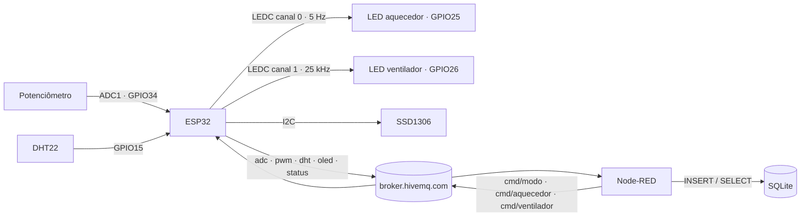
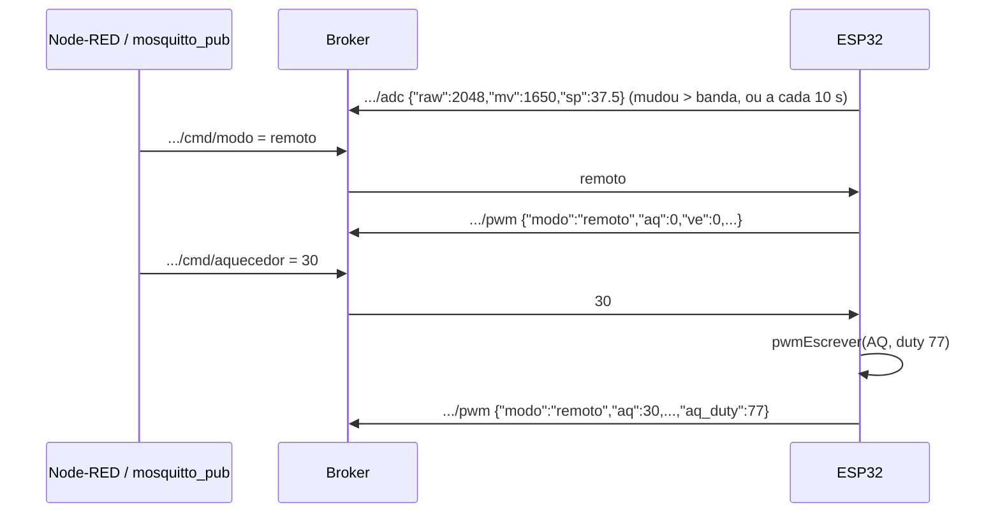
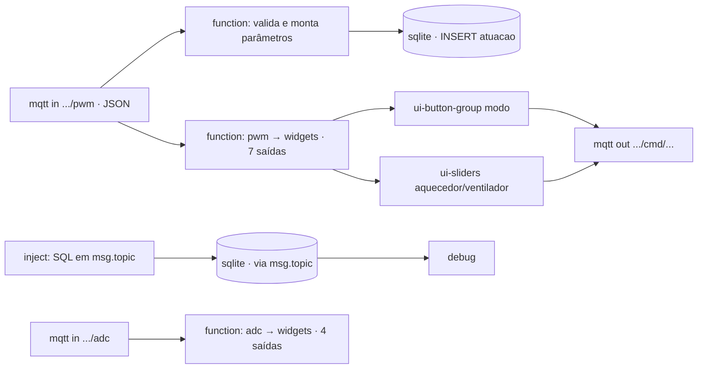
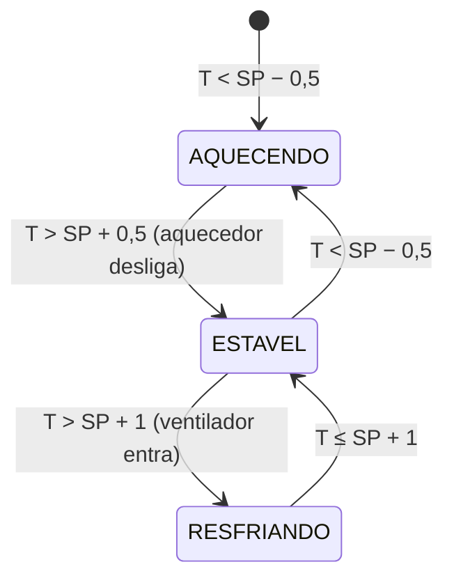

## Checklist — ADC, PWM, modos de operação e controle ON/OFF {/* #checklist */}

- [ ] `diagram.json` com potenciômetro no GPIO34 e LEDs "aquecedor" (GPIO25) e "ventilador" (GPIO26) com resistores, mais o analisador lógico (T1)
- [ ] ADC: média de 16 amostras, leitura em mV e setpoint de 20 a 55 °C em passos de 0,5 °C (T2)
- [ ] PWM (LEDC): dois canais de 8 bits, a 5 Hz e 25 kHz, com o potenciômetro como _dimmer_ (T3)
- [ ] MQTT: `.../adc` com banda morta, `.../pwm` a cada mudança e comandos `.../cmd/modo`, `.../cmd/aquecedor`, `.../cmd/ventilador` (T4)
- [ ] Node-RED: tabela `atuacao` no SQLite, consultas com `LEAD()` e dashboard com modo e sliders (T5)
- [ ] Modo `auto`: aquecedor ON/OFF com histerese e ventilador proporcional (T6)
- [ ] Previsões P1–P4 respondidas no `README.md`
- [ ] Nenhum `push --force`; cada tarefa num commit `Tn:`

:::info[Pontuação]
**T1…T6 = 100 pts** (esta aula não tem desafios): T1 10 · T2 15 · T3 20 · T4 20 · T5 15 ·
T6 20. O autograder normaliza para 0–10. Vale o commit `Tn:` mais recente de cada tarefa.
:::

<LabSetup />

### Configuração do ambiente de desenvolvimento {/* #setup */}

<DevTools />

---

Esta aula continua o **Lab 06**. Até agora o ESP32 só **lia** o mundo, com o DHT22 (digital).
Agora ele passa a ler uma **grandeza analógica**, a posição de um potenciômetro, pelo
**ADC**. E passa também a **agir**: dois canais de **PWM** acionam um "aquecedor" e um
"ventilador", representados por LEDs. Com MQTT, Node-RED e SQLite, o nó vira o embrião de uma
**câmara climática**: o potenciômetro define o **setpoint**, e o ESP32 liga o aquecedor
quando a temperatura está abaixo dele.



## Objetivos

- Ler um sinal analógico com o **ADC** do ESP32: resolução (12 bits), **atenuação**, leitura
  em **milivolts** calibrada e por que o potenciômetro precisa estar num pino do **ADC1**.
- Reduzir o ruído com **média de amostras** e não inundar o broker com uma **banda morta**.
- Gerar **PWM** com o periférico **LEDC**: canal, frequência, resolução e _duty cycle_, e a
  troca entre **frequência e resolução**.
- Organizar o firmware em **modos de operação** (`pot`, `remoto`, `auto`) comandados por MQTT.
- No Node-RED, registrar cada mudança dos atuadores no **SQLite** e calcular **tempo em cada
  estado** e **energia** com a função de janela `LEAD()`.
- (Integrador) Implementar um **controle ON/OFF com histerese**.

## Material

- VS Code + PlatformIO + extensão **Wokwi** (ESP32 **simulado**).
- Stack Docker do curso: **Node-RED** com `node-red-node-sqlite` e o **Dashboard 2.0**.
- **Nenhuma biblioteca nova**: o ADC e o LEDC fazem parte do core Arduino do ESP32. O
  `platformio.ini` é o mesmo do Lab 06.

:::info[O que o Wokwi simula (e o que não)]
O Wokwi simula o **ADC** (o potenciômetro gira de verdade), o **LEDC** (o brilho do LED
acompanha o _duty_) e um **analisador lógico** para medir o PWM. Mas o ADC simulado é
**ideal**: linear e sem ruído. Numa placa física, a média de amostras e a banda morta da T2/T4
fazem diferença visível. E o "aquecedor" não esquenta o DHT22: na T6, **você** faz o papel da
planta, mexendo no slider do sensor.
:::

## Clonar o repositório do grupo {/* #clonar */}

<LabTeamMembers labName="lab07" />

## Envie o link do repositório do seu grupo no Moodle: {/* #moodle-link */}

<LabSubmit labName="lab07" />

<details>
<summary><strong>Mapa de tarefas</strong> — 6 tarefas · 100 pts</summary>

- [T1 — Circuito: potenciometro, LEDs e analisador logico](#t1) · 10 pts
- [T2 — Leitura do potenciometro com o ADC](#t2) · 15 pts
- [T3 — PWM com o LEDC](#t3) · 20 pts
- [T4 — ADC e PWM no MQTT, modos pot e remoto](#t4) · 20 pts
- [T5 — Node-RED: SQLite e dashboard de comando](#t5) · 15 pts
- [T6 — Modo auto: controle ON/OFF com histerese](#t6) · 20 pts

</details>

O repositório do grupo nasce do `lab07-template`, que já traz o **firmware final do Lab 06**
(com o framebuffer) em `src/main.cpp`:

<FileTree
  details={true}
  defaultOpen={false}
  title="Estrutura de Arquivos do Projeto"
  root="lab07-grupo-X"
  files={[
    "platformio.ini r",
    "src/main.cpp u",
    "diagram.json u",
    "wokwi.toml r",
    ".gitignore r",
    ".vscode/extensions.json r",
    "nodered/flows-lab07.json c",
    "evidencias/t2-serial.txt c",
    "evidencias/t3-pwm.png c",
    "evidencias/t4-mqtt.txt c",
    "evidencias/t5-sqlite.txt c",
    "evidencias/t5-dashboard.png c",
    "evidencias/t6-serial.txt c",
    "evidencias/t6-sqlite.txt c",
    "README.md u",
  ]}
/>

:::info[Tópicos do Lab 07]
Tudo fica sob `elt85b/lab07/grupo-X/`. Troque o `X` (e o `#define GRUPO`) pela letra do seu
grupo. `dht`, `status`, `oled`, `oled/fb` e `cmd/intervalo` continuam como no Lab 06.

| Tópico               | Sentido        | Payload                                                                                             |
| -------------------- | -------------- | --------------------------------------------------------------------------------------------------- |
| `.../adc`            | ESP32 → broker | `{"raw":2048,"mv":1650,"sp":37.5}`                                                                  |
| `.../pwm`            | ESP32 → broker | `{"modo":"auto","estado":"AQUECENDO","aq":100,"ve":0,"aq_duty":255,"ve_duty":0,"sp":37.5,"t":24.5}` |
| `.../cmd/modo`       | broker → ESP32 | `pot`, `remoto` ou `auto` (T6)                                                                      |
| `.../cmd/aquecedor`  | broker → ESP32 | `0` a `100` (%), vale no modo `remoto`                                                              |
| `.../cmd/ventilador` | broker → ESP32 | `0` a `100` (%), vale no modo `remoto`                                                              |

:::

---

## Parte 1 — Circuito {/* #parte-1 */}

Acrescente ao circuito do Lab 06:

- **Potenciômetro** (`wokwi-potentiometer`): `VCC → 3V3`, `GND → GND`, `SIG → GPIO34`.
- **LED laranja "aquecedor"** no **GPIO25** e **LED azul "ventilador"** no **GPIO26**, cada um
  com um **resistor de 220 Ω** em série (o GPIO fornece no máximo ~40 mA; o resistor limita
  a corrente do LED a ~6 mA).
- **Analisador lógico** (`wokwi-logic-analyzer`): `D0 → GPIO25`, `D1 → GPIO26`, `GND → GND`.
  Ele grava os dois sinais de PWM para você medir frequência e _duty_ na T3.

<FileTree root="lab07-grupo-X" files={["diagram.json u"]} />

```json title="diagram.json"
{
  "version": 1,
  "author": "ELT85B - Lab 07",
  "editor": "wokwi",
  "parts": [
    {
      "type": "board-esp32-devkit-c-v4",
      "id": "esp",
      "top": 0,
      "left": 0,
      "attrs": {}
    },
    {
      "type": "wokwi-dht22",
      "id": "dht1",
      "top": -76.5,
      "left": 157.8,
      "attrs": { "temperature": "24.5", "humidity": "55" }
    },
    {
      "type": "board-ssd1306",
      "id": "oled1",
      "top": 108.74,
      "left": 172.23,
      "attrs": { "i2cAddress": "0x3c" }
    },
    {
      "type": "wokwi-potentiometer",
      "id": "pot1",
      "top": 30,
      "left": -150,
      "attrs": { "value": "511" }
    },
    {
      "type": "wokwi-resistor",
      "id": "r1",
      "top": 215,
      "left": 120,
      "attrs": { "value": "220" }
    },
    {
      "type": "wokwi-led",
      "id": "led_aq",
      "top": 170,
      "left": 230,
      "attrs": { "color": "orange", "label": "aquecedor" }
    },
    {
      "type": "wokwi-resistor",
      "id": "r2",
      "top": 265,
      "left": 120,
      "attrs": { "value": "220" }
    },
    {
      "type": "wokwi-led",
      "id": "led_ve",
      "top": 220,
      "left": 300,
      "attrs": { "color": "blue", "label": "ventilador" }
    },
    {
      "type": "wokwi-logic-analyzer",
      "id": "logic1",
      "top": 320,
      "left": 120,
      "attrs": {
        "channelNames": "aquecedor,ventilador",
        "filename": "lab07-pwm"
      }
    }
  ],
  "connections": [
    ["esp:TX", "$serialMonitor:RX", "", []],
    ["esp:RX", "$serialMonitor:TX", "", []],
    ["dht1:VCC", "esp:3V3", "red", []],
    ["dht1:GND", "esp:GND.2", "black", []],
    ["dht1:SDA", "esp:15", "green", []],
    ["oled1:VCC", "esp:3V3", "red", []],
    ["oled1:GND", "esp:GND.2", "black", []],
    ["oled1:SDA", "esp:21", "blue", []],
    ["oled1:SCL", "esp:22", "purple", []],
    ["pot1:VCC", "esp:3V3", "red", []],
    ["pot1:GND", "esp:GND.2", "black", []],
    ["pot1:SIG", "esp:34", "orange", []],
    ["esp:25", "r1:1", "orange", []],
    ["r1:2", "led_aq:A", "orange", []],
    ["led_aq:C", "esp:GND.2", "black", []],
    ["esp:26", "r2:1", "blue", []],
    ["r2:2", "led_ve:A", "blue", []],
    ["led_ve:C", "esp:GND.2", "black", []],
    ["logic1:D0", "esp:25", "orange", []],
    ["logic1:D1", "esp:26", "blue", []],
    ["logic1:GND", "esp:GND.2", "black", []]
  ],
  "dependencies": {}
}
```

:::warning[Por que GPIO34 e não qualquer pino?]
O ESP32 tem dois ADCs. O **ADC2** (GPIOs 0, 2, 4, 12–15 e 25–27) é usado pelo **rádio
Wi-Fi**: com o Wi-Fi ligado, `analogRead()` num pino do ADC2 falha. Por isso o potenciômetro
vai num pino do **ADC1** (GPIOs 32–39). O GPIO34 é **somente entrada**, sem pull-up interno,
o que é perfeito para um sinal analógico.
:::

<CommitPoint
  id="t1"
  task="Circuito: potenciometro, LEDs e analisador logico"
  pontos={10}
  files="diagram.json"
/>

---

## Parte 2 — ADC: lendo o potenciômetro {/* #parte-2 */}

### 2.1 Como o ADC do ESP32 enxerga uma tensão

O ADC é do tipo **SAR, de 12 bits**: converte a tensão do pino num número de **0 a 4095**.
Três detalhes importam:

- **Atenuação.** O conversor só mede ~1,1 V internamente. Para medir até perto de 3,3 V, o
  sinal passa por um atenuador. Com `ADC_11db`, a faixa vai de ~0 a ~3,1 V. A Espressif
  recomenda usar só até ~2,45 V se precisar de linearidade.
- **Calibração.** `analogRead()` devolve o número cru. `analogReadMilliVolts()` usa a
  calibração gravada de fábrica no chip (eFuse) e devolve **milivolts**: é ela que você usa
  quando o valor tem significado físico.
- **Ruído.** Numa placa real, leituras seguidas do mesmo potenciômetro parado variam algumas
  dezenas de unidades. Uma **média de 16 amostras** reduz esse ruído para ~1/4.

O potenciômetro vira o **setpoint** da câmara, de 20 a 55 °C em passos de 0,5 °C:

```text title="Conversão"
setpoint = 20 + raw × (55 − 20) / 4095        → arredondado para 0,5 °C
raw = 0     → 20,0 °C
raw = 2048  → 37,5 °C
raw = 4095  → 55,0 °C
```

### 2.2 Código

A leitura é disparada por um **segundo `Ticker`**, a 10 Hz, com o mesmo padrão de flag do
Lab 05: o callback só marca `adcPendente`, e o `loop()` lê.

<FileTree root="lab07-grupo-X" files={["src/main.cpp u"]} />

```cpp title="src/main.cpp (trechos novos da T2)"
// ---- ADC: potenciômetro no GPIO34 (ADC1_CH6 - o ADC1 funciona junto com o Wi-Fi)
#define POT_PIN      34
#define ADC_AMOSTRAS 16                  // média de 16 leituras (reduz o ruído)
#define ADC_BANDA    40                  // só reage se mudar mais que ~1 % (40/4095)
#define SP_MIN       20.0f               // faixa do setpoint (°C)
#define SP_MAX       55.0f

Ticker temporizadorAdc;                  // leitura do potenciômetro
volatile bool adcPendente = false;
int adcRaw = 0, adcMv = 0;               // média das leituras
float setpoint = SP_MIN;                 // °C, vem do potenciômetro
int rawPublicado = -10000;               // último raw "aceito" (banda morta)

void aoEstourarTemporizadorAdc() { adcPendente = true; }

void lerAdc() {
  uint32_t somaRaw = 0, somaMv = 0;
  for (int i = 0; i < ADC_AMOSTRAS; i++) {
    somaRaw += analogRead(POT_PIN);
    somaMv += analogReadMilliVolts(POT_PIN);
  }
  adcRaw = somaRaw / ADC_AMOSTRAS;
  adcMv = somaMv / ADC_AMOSTRAS;
  float sp = SP_MIN + adcRaw * (SP_MAX - SP_MIN) / 4095.0f;
  setpoint = roundf(sp * 2) / 2;         // passos de 0,5 °C
}

// em setup(), depois de dht.begin():
//   analogReadResolution(12);                       // 0..4095
//   analogSetPinAttenuation(POT_PIN, ADC_11db);     // faixa de ~0 a 3,1 V
//   lerAdc();
//   ... e no fim do setup():
//   temporizadorAdc.attach_ms(100, aoEstourarTemporizadorAdc);   // 10 Hz
//
// no loop():
//   if (adcPendente) {
//     adcPendente = false;
//     lerAdc();
//     if (abs(adcRaw - rawPublicado) > ADC_BANDA) {   // banda morta: ignora o ruído
//       rawPublicado = adcRaw;
//       Serial.printf("[ADC] raw=%4d  %4d mV  SP=%.1f C\n", adcRaw, adcMv, setpoint);
//       telaSuja = true;
//     }
//   }
```

Na tela, mostre o `SP` e os `mV` à direita da temperatura. O desenho final, com as barras
de PWM que entram na T3, está no código completo da T4:

```text title="SSD1306 (128 x 64) — a partir da T3"
LAB07 grupo a          [W] [M]
-------------------------------
24.5 °C            SP 37.5
                   1650 mV
AQ [██████████          ]  50%
VE [██████████          ]  50%
pot: MANUAL
```

Gire o potenciômetro no Wokwi e veja o serial:

```text title="Monitor serial"
=== Lab 07 - ADC + PWM + MQTT ===
[ADC] raw=2047  1650 mV  SP=37.5 C
[ADC] raw=3001  2420 mV  SP=45.5 C
[ADC] raw=1200   968 mV  SP=30.5 C
```

Os valores em mV dependem da calibração e podem variar um pouco no seu simulador.

:::tip[Preveja antes de rodar]

- **P1:** troque o `POT_PIN` para **GPIO4** (que é do ADC2), religue o fio e rode com o Wi-Fi
  conectado. O que `analogRead()` devolve? E se você comentar o `conectarWiFi()`? Depois volte
  para o GPIO34. Por que, num pino de ADC, um potenciômetro precisa de **VCC e GND**, e não
  só do fio de sinal?

Anote as previsões e o que observou no `README.md`.
:::

**Evidência:** salve o serial girando o potenciômetro de um extremo ao outro (pelo menos 5
linhas `[ADC]`) em `evidencias/t2-serial.txt`.

<FileTree root="lab07-grupo-X" files={["evidencias/t2-serial.txt c"]} />

<CommitPoint
  id="t2"
  task="Leitura do potenciometro com o ADC"
  pontos={15}
  files="src/main.cpp evidencias/t2-serial.txt"
/>

---

## Parte 3 — PWM com o LEDC {/* #parte-3 */}

### 3.1 O que é o PWM e como o LEDC gera

Um pino digital só fica em 0 V ou 3,3 V. O **PWM** liga e desliga esse pino muito rápido, e
a **fração do tempo ligado** (o _duty cycle_) controla a **potência média** entregue à carga:

```text title="PWM de 8 bits: duty 0..255"
duty  64 (25 %)  ▇▁▁▁▇▁▁▁▇▁▁▁    potência média = 25 %
duty 191 (75 %)  ▇▇▇▁▇▇▇▁▇▇▇▁    potência média = 75 %
                 |<-T->|         frequência = 1/T
```

No ESP32 quem gera o PWM é o periférico **LEDC**: 16 **canais**, cada um com frequência e
**resolução** (bits do _duty_) próprias, ligados a qualquer GPIO de saída. O PWM roda **em
hardware**: depois de configurado, não ocupa a CPU.

Frequência e resolução **disputam** o mesmo relógio de 80 MHz:

```text title="Limite do LEDC (relógio de 80 MHz)"
frequência máxima = 80 MHz / 2^bits
 8 bits (0..255)    → até 312,5 kHz
10 bits (0..1023)   → até  78,1 kHz
12 bits (0..4095)   → até  19,5 kHz   ← não serve para 25 kHz!
```

Usamos frequências bem diferentes nos dois canais, de propósito:

| Canal | Pino   | Carga real (na câmara)                         | Frequência | Por quê                                                                                     |
| ----- | ------ | ---------------------------------------------- | ---------- | ------------------------------------------------------------------------------------------- |
| 0     | GPIO25 | resistência via relé de estado sólido / MOSFET | **5 Hz**   | a resistência tem inércia térmica de segundos; chavear devagar reduz perdas e interferência |
| 1     | GPIO26 | ventoinha de 4 fios                            | **25 kHz** | é o padrão das ventoinhas PWM: acima da faixa audível, sem zumbido                          |

### 3.2 A API mudou entre as versões do core

O PlatformIO usa hoje o **core Arduino 2.x**. O core **3.x**, usado pela Arduino IDE recente,
mudou as funções do LEDC. Para o mesmo código compilar nos dois, encapsule:

| Core 2.x                       | Core 3.x                                     |
| ------------------------------ | -------------------------------------------- |
| `ledcSetup(canal, freq, bits)` | `ledcAttachChannel(pino, freq, bits, canal)` |
| `ledcAttachPin(pino, canal)`   | (feito pela linha acima)                     |
| `ledcWrite(canal, duty)`       | `ledcWrite(pino, duty)`                      |

<FileTree root="lab07-grupo-X" files={["src/main.cpp u"]} />

```cpp title="src/main.cpp (trechos novos da T3)"
// ---- PWM (LEDC): dois canais com frequências bem diferentes
#define AQ_PIN     25                    // "aquecedor": resistência -> PWM lento
#define VE_PIN     26                    // "ventilador": ventoinha 4 fios -> 25 kHz
#define AQ_CANAL   0
#define VE_CANAL   1
#define AQ_FREQ_HZ 5
#define VE_FREQ_HZ 25000
#define PWM_BITS   8                     // duty de 0 a 255
#define PWM_MAX    ((1 << PWM_BITS) - 1)

float aqPct = -1, vePct = -1;            // % aplicados (-1: ainda não aplicado)
const char *estado = "---";

void pwmIniciar(uint8_t pino, uint8_t canal, uint32_t freq) {
#if ESP_ARDUINO_VERSION_MAJOR >= 3
  ledcAttachChannel(pino, freq, PWM_BITS, canal);
#else
  ledcSetup(canal, freq, PWM_BITS);
  ledcAttachPin(pino, canal);
#endif
}

void pwmEscrever(uint8_t pino, uint8_t canal, uint32_t duty) {
#if ESP_ARDUINO_VERSION_MAJOR >= 3
  (void)canal;
  ledcWrite(pino, duty);                 // 3.x: endereça pelo pino
#else
  (void)pino;
  ledcWrite(canal, duty);                // 2.x: endereça pelo canal
#endif
}

uint32_t dutyDe(float pct) { return (uint32_t)lroundf(pct * PWM_MAX / 100.0f); }

// Decide os atuadores. Na T3 só existe o modo "potenciômetro = dimmer".
void controlar() {
  float aq = roundf(adcRaw * 100.0f / 4095.0f);
  float ve = aq;
  if (aq == aqPct && ve == vePct) return;     // nada mudou: não reescreve
  aqPct = aq;
  vePct = ve;
  estado = "MANUAL";
  pwmEscrever(AQ_PIN, AQ_CANAL, dutyDe(aqPct));
  pwmEscrever(VE_PIN, VE_CANAL, dutyDe(vePct));
  Serial.printf("[PWM] aq=%.0f%% (duty %lu)  ve=%.0f%% (duty %lu)\n",
                aqPct, (unsigned long)dutyDe(aqPct), vePct, (unsigned long)dutyDe(vePct));
  telaSuja = true;
}

// em setup(), antes de lerAdc():
//   pwmIniciar(AQ_PIN, AQ_CANAL, AQ_FREQ_HZ);
//   pwmIniciar(VE_PIN, VE_CANAL, VE_FREQ_HZ);
//   ... e depois de lerAdc():  controlar();
//
// no loop(), dentro do if da banda morta do ADC:   controlar();
```

Gire o potenciômetro e observe os dois LEDs: o **azul** muda de brilho suavemente, e o
**laranja** **pisca** 5 vezes por segundo, com o tempo aceso proporcional ao _duty_.

### 3.3 Medindo com o analisador lógico

Deixe o potenciômetro em ~25 %, rode a simulação por alguns segundos e **pare**. No VS Code o
Wokwi grava o arquivo **`wokwi.vcd`** na raiz do projeto. Abra-o no **PulseView** ou no
**Surfer** (`app.surfer-project.org`, no navegador) e meça:

- **D0 (aquecedor):** período ≈ 200 ms (5 Hz), tempo em nível alto ≈ 25 % do período.
- **D1 (ventilador):** período ≈ 40 µs (25 kHz), mesmo _duty_. Dê zoom: em escala de
  milissegundos ele parece um "borrão".

:::tip[Preveja antes de rodar]
**P2:** por que o LED do aquecedor **pisca** e o do ventilador não, se os dois recebem o mesmo
_duty_? O que aconteceria numa ventoinha real acionada a 5 Hz? E numa resistência acionada por
um relé de estado sólido a 25 kHz? Qual a **maior resolução** possível a 25 kHz?
:::

**Evidência:** captura do PulseView ou do Surfer com os dois canais e as medições, em
`evidencias/t3-pwm.png`.

<FileTree root="lab07-grupo-X" files={["evidencias/t3-pwm.png c"]} />

<CommitPoint
  id="t3"
  task="PWM com o LEDC"
  pontos={20}
  files="src/main.cpp evidencias/t3-pwm.png"
/>

---

## Parte 4 — ADC e PWM no MQTT, modos `pot` e `remoto` {/* #parte-4 */}

Agora os atuadores podem ser comandados **de fora**. O firmware ganha **modos de operação**:

| Modo     | Quem decide o PWM                                      | O potenciômetro é...      |
| -------- | ------------------------------------------------------ | ------------------------- |
| `pot`    | o potenciômetro (dimmer, como na T3)                   | o comando dos dois canais |
| `remoto` | os comandos `.../cmd/aquecedor` e `.../cmd/ventilador` | só o setpoint (exibido)   |
| `auto`   | o controle ON/OFF (T6)                                 | o **setpoint** da câmara  |



### 4.1 O que muda

- **`controlar()`** passa a olhar o `modo`. Ele só mexe no PWM, e só **publica** em
  `.../pwm`, quando algo **mudou**: o broker recebe um evento por mudança, não um fluxo
  constante.
- **`.../adc`** é publicado quando a leitura sai da **banda morta** (±40 contagens) **ou** a
  cada 10 s, como sinal de "ainda estou aqui" para quem acabou de abrir o dashboard.
- **Comandos**: `cmd/modo` aceita só `pot` ou `remoto` (o `auto` entra na T6); `cmd/aquecedor`
  e `cmd/ventilador` aceitam 0–100 e ficam **guardados** até o modo ser `remoto`.
- Ao (re)conectar, o ESP32 publica `.../adc` e `.../pwm` com o estado atual.
- A **tela** mostra o modo e o estado no rodapé, e o espelho em texto/framebuffer do Lab 06
  continua funcionando.

<FileTree root="lab07-grupo-X" files={["src/main.cpp u"]} />

```cpp title="src/main.cpp (trechos novos da T4)"
const char *TOPICO_ADC      = BASE "/adc";
const char *TOPICO_PWM      = BASE "/pwm";
const char *TOPICO_CMD_MODO = BASE "/cmd/modo";        // pot | remoto
const char *TOPICO_CMD_AQ   = BASE "/cmd/aquecedor";   // 0..100 % (modo remoto)
const char *TOPICO_CMD_VE   = BASE "/cmd/ventilador";  // 0..100 % (modo remoto)

enum Modo { MODO_POT, MODO_REMOTO };
const char *NOME_MODO[] = {"pot", "remoto"};
const int N_MODOS = 2;
Modo modo = MODO_POT;
float aqRemoto = 0, veRemoto = 0;        // % pedidos por MQTT (modo remoto)

void publicarPwm() {
  char t[8] = "null";
  if (!isnan(ultimaT)) snprintf(t, sizeof(t), "%.1f", ultimaT);
  char payload[200];
  snprintf(payload, sizeof(payload),
           "{\"modo\":\"%s\",\"estado\":\"%s\",\"aq\":%.0f,\"ve\":%.0f,"
           "\"aq_duty\":%lu,\"ve_duty\":%lu,\"sp\":%.1f,\"t\":%s}",
           NOME_MODO[modo], estado, aqPct, vePct,
           (unsigned long)dutyDe(aqPct), (unsigned long)dutyDe(vePct), setpoint, t);
  mqtt.publish(TOPICO_PWM, payload);
  Serial.printf("[PWM] %s\n", payload);
}

void controlar() {
  float aq = 0, ve = 0;
  const char *novoEstado;
  switch (modo) {
    case MODO_POT:                       // potenciômetro = "dimmer" dos dois canais
      aq = ve = adcRaw * 100.0f / 4095.0f;
      novoEstado = "MANUAL";
      break;
    case MODO_REMOTO:                    // valores vindos do MQTT
    default:
      aq = aqRemoto;
      ve = veRemoto;
      novoEstado = "REMOTO";
      break;
  }
  aq = roundf(aq);
  ve = roundf(ve);
  if (aq == aqPct && ve == vePct && strcmp(novoEstado, estado) == 0) return;   // nada mudou
  aqPct = aq;
  vePct = ve;
  estado = novoEstado;
  pwmEscrever(AQ_PIN, AQ_CANAL, dutyDe(aqPct));
  pwmEscrever(VE_PIN, VE_CANAL, dutyDe(vePct));
  publicarPwm();
  telaSuja = true;
}

// no callback aoReceberMensagem(), depois do if do intervalo:
  } else if (strcmp(topico, TOPICO_CMD_MODO) == 0) {
    int novo = -1;
    for (int i = 0; i < N_MODOS; i++)
      if (strcasecmp(txt, NOME_MODO[i]) == 0) novo = i;
    if (novo < 0) {
      Serial.println("[CMD] modo invalido (use pot ou remoto)");
      return;
    }
    modo = (Modo)novo;
    controlar();
    telaSuja = true;
  } else if (strcmp(topico, TOPICO_CMD_AQ) == 0 || strcmp(topico, TOPICO_CMD_VE) == 0) {
    char *fim;
    float v = strtof(txt, &fim);
    if (fim == txt || v < 0 || v > 100) {
      Serial.println("[CMD] use 0..100 (%)");
      return;
    }
    if (strcmp(topico, TOPICO_CMD_AQ) == 0) aqRemoto = v;
    else veRemoto = v;
    if (modo == MODO_REMOTO) controlar();
    else Serial.println("[CMD] guardado; vale no modo remoto");
  }
```

`strtof()` com o ponteiro `fim` detecta texto que **não é número**: se nada foi convertido,
`fim == txt`. O `atof()` da T3 do Lab 06 devolveria `0` em silêncio.

<details>
<summary><strong>Código completo até a T4</strong> (clique para abrir)</summary>

<FileTree root="lab07-grupo-X" files={["src/main.cpp u"]} />

```cpp title="src/main.cpp (T4)"
// ELT85B - Lab 07 (T4): ADC (potenciômetro) + PWM (LEDC) + modos pot/remoto via MQTT
#include <Arduino.h>
#include <WiFi.h>
#include <PubSubClient.h>
#include <Ticker.h>
#include <DHT.h>
#include <Wire.h>
#include <Adafruit_GFX.h>
#include <Adafruit_SSD1306.h>
#include "mbedtls/base64.h"

#define GRUPO     "a"                    // troque pela letra do seu grupo
#define DHT_PIN   15
#define DHT_TIPO  DHT22
#define OLED_SDA  21
#define OLED_SCL  22
#define OLED_ADDR 0x3C
#define OLED_W    128
#define OLED_H    64

// ---- ADC: potenciômetro no GPIO34 (ADC1_CH6 - o ADC1 funciona junto com o Wi-Fi)
#define POT_PIN      34
#define ADC_AMOSTRAS 16                  // média de 16 leituras (reduz o ruído)
#define ADC_BANDA    40                  // publica só se mudar mais que ~1 % (40/4095)...
#define ADC_REPUB_MS 10000               // ...ou a cada 10 s, para quem acabou de chegar
#define SP_MIN       20.0f               // faixa do setpoint (°C)
#define SP_MAX       55.0f

// ---- PWM (LEDC): dois canais com frequências bem diferentes
#define AQ_PIN     25                    // "aquecedor": resistência -> PWM lento
#define VE_PIN     26                    // "ventilador": ventoinha 4 fios -> 25 kHz
#define AQ_CANAL   0
#define VE_CANAL   1
#define AQ_FREQ_HZ 5
#define VE_FREQ_HZ 25000
#define PWM_BITS   8                     // duty de 0 a 255
#define PWM_MAX    ((1 << PWM_BITS) - 1)

const char *WIFI_SSID  = "Wokwi-GUEST";
const char *WIFI_SENHA = "";
const char *MQTT_HOST  = "broker.hivemq.com";
const uint16_t MQTT_PORTA = 1883;

#define BASE "elt85b/lab07/grupo-" GRUPO
const char *TOPICO_DADOS      = BASE "/dht";
const char *TOPICO_STATUS     = BASE "/status";
const char *TOPICO_OLED       = BASE "/oled";
const char *TOPICO_OLED_FB    = BASE "/oled/fb";         // (Lab 06)
const char *TOPICO_ADC        = BASE "/adc";             // T4
const char *TOPICO_PWM        = BASE "/pwm";             // T4
const char *TOPICO_INTERVALO  = BASE "/cmd/intervalo";
const char *TOPICO_CMD_MODO   = BASE "/cmd/modo";        // T4: pot | remoto
const char *TOPICO_CMD_AQ     = BASE "/cmd/aquecedor";   // T4: 0..100 % (modo remoto)
const char *TOPICO_CMD_VE     = BASE "/cmd/ventilador";  // T4: 0..100 % (modo remoto)

DHT dht(DHT_PIN, DHT_TIPO);
Adafruit_SSD1306 oled(OLED_W, OLED_H, &Wire, -1);
WiFiClient wifiClient;
PubSubClient mqtt(wifiClient);
Ticker temporizador;                     // leitura do DHT22
Ticker temporizadorAdc;                  // leitura do potenciômetro

volatile bool leituraPendente = false;
volatile bool adcPendente = false;
float intervaloS = 5.0;
uint32_t seq = 0;
float ultimaT = NAN, ultimaH = NAN;
bool telaSuja = true;
char clientId[32];

enum Modo { MODO_POT, MODO_REMOTO };
const char *NOME_MODO[] = {"pot", "remoto"};
const int N_MODOS = 2;
Modo modo = MODO_POT;

int adcRaw = 0, adcMv = 0;               // média das leituras
float setpoint = SP_MIN;                 // °C, vem do potenciômetro
int rawPublicado = -10000;               // último raw enviado (banda morta)
unsigned long tAdcPublicado = 0;
float aqPct = -1, vePct = -1;            // % aplicados (-1: ainda não aplicado)
float aqRemoto = 0, veRemoto = 0;        // % pedidos por MQTT (modo remoto)
const char *estado = "---";

void aoEstourarTemporizador() { leituraPendente = true; }
void aoEstourarTemporizadorAdc() { adcPendente = true; }

// ------------------------------------------------- PWM: core 2.x e 3.x (T3)
void pwmIniciar(uint8_t pino, uint8_t canal, uint32_t freq) {
#if ESP_ARDUINO_VERSION_MAJOR >= 3
  ledcAttachChannel(pino, freq, PWM_BITS, canal);
#else
  ledcSetup(canal, freq, PWM_BITS);
  ledcAttachPin(pino, canal);
#endif
}

void pwmEscrever(uint8_t pino, uint8_t canal, uint32_t duty) {
#if ESP_ARDUINO_VERSION_MAJOR >= 3
  (void)canal;
  ledcWrite(pino, duty);                 // 3.x: endereça pelo pino
#else
  (void)pino;
  ledcWrite(canal, duty);                // 2.x: endereça pelo canal
#endif
}

uint32_t dutyDe(float pct) { return (uint32_t)lroundf(pct * PWM_MAX / 100.0f); }

// ---------------------------------------------------------------- ADC (T2)
void lerAdc() {
  uint32_t somaRaw = 0, somaMv = 0;
  for (int i = 0; i < ADC_AMOSTRAS; i++) {
    somaRaw += analogRead(POT_PIN);
    somaMv += analogReadMilliVolts(POT_PIN);
  }
  adcRaw = somaRaw / ADC_AMOSTRAS;
  adcMv = somaMv / ADC_AMOSTRAS;
  float sp = SP_MIN + adcRaw * (SP_MAX - SP_MIN) / 4095.0f;
  setpoint = roundf(sp * 2) / 2;         // passos de 0,5 °C
}

// ------------------------------------------------------------- OLED
void indicador(int x, const char *letra, bool ok) {
  if (ok) {
    oled.fillRect(x, 0, 13, 9, SSD1306_WHITE);
    oled.setTextColor(SSD1306_BLACK);
  } else {
    oled.drawRect(x, 0, 13, 9, SSD1306_WHITE);
    oled.setTextColor(SSD1306_WHITE);
  }
  oled.setCursor(x + 4, 1);
  oled.print(letra);
  oled.setTextColor(SSD1306_WHITE);
}

void barra(int y, const char *rotulo, float pct) {
  oled.setCursor(0, y);
  oled.print(rotulo);
  oled.drawRect(16, y, 80, 8, SSD1306_WHITE);
  oled.fillRect(18, y + 2, (int)(76 * pct / 100.0f), 4, SSD1306_WHITE);
  oled.setCursor(100, y);
  oled.printf("%3.0f%%", pct);
}

void desenharTela() {
  oled.clearDisplay();
  oled.setTextColor(SSD1306_WHITE);

  oled.setTextSize(1);                               // cabeçalho
  oled.setCursor(0, 1);
  oled.print("LAB07 grupo " GRUPO);
  indicador(98, "W", WiFi.status() == WL_CONNECTED);
  indicador(114, "M", mqtt.connected());
  oled.drawFastHLine(0, 11, OLED_W, SSD1306_WHITE);

  oled.setTextSize(2);                               // temperatura medida
  oled.setCursor(0, 15);
  if (isnan(ultimaT)) oled.print("--.-");
  else oled.printf("%4.1f", ultimaT);
  oled.drawCircle(53, 17, 2, SSD1306_WHITE);
  oled.setCursor(58, 15);
  oled.print("C");

  oled.setTextSize(1);                               // setpoint e ADC
  oled.setCursor(76, 15);
  oled.printf("SP %4.1f", setpoint);
  oled.setCursor(76, 24);
  oled.printf("%4d mV", adcMv);

  barra(35, "AQ", aqPct < 0 ? 0 : aqPct);           // atuadores
  barra(45, "VE", vePct < 0 ? 0 : vePct);

  oled.setCursor(0, 56);                             // modo e estado
  oled.printf("%s: %s", NOME_MODO[modo], estado);
  oled.display();
}

void publicarTelaTexto() {
  char t[8] = "--.-";
  if (!isnan(ultimaT)) snprintf(t, sizeof(t), "%.1f", ultimaT);
  char payload[220];
  snprintf(payload, sizeof(payload),
           "{\"linhas\":[\"LAB07 grupo %s\",\"T: %s C  SP: %.1f C\",\"AQ: %.0f %%  VE: %.0f %%\","
           "\"modo %s | %s\",\"WiFi %s | MQTT %s\"]}",
           GRUPO, t, setpoint, aqPct < 0 ? 0 : aqPct, vePct < 0 ? 0 : vePct,
           NOME_MODO[modo], estado,
           WiFi.status() == WL_CONNECTED ? "ok" : "--", mqtt.connected() ? "ok" : "--");
  mqtt.publish(TOPICO_OLED, payload);
}

void publicarFramebuffer() {
  static unsigned char b64[1400];
  size_t n = 0;
  mbedtls_base64_encode(b64, sizeof(b64), &n, oled.getBuffer(), OLED_W * OLED_H / 8);
  if (!mqtt.publish(TOPICO_OLED_FB, b64, n, false))
    Serial.println("[FB] publish falhou: aumente mqtt.setBufferSize()");
}

// ------------------------------------------------- publicação de ADC e PWM (T4)
void publicarAdc() {
  char payload[96];
  snprintf(payload, sizeof(payload), "{\"raw\":%d,\"mv\":%d,\"sp\":%.1f}", adcRaw, adcMv, setpoint);
  mqtt.publish(TOPICO_ADC, payload);
  rawPublicado = adcRaw;
  tAdcPublicado = millis();
}

void publicarPwm() {
  char t[8] = "null";
  if (!isnan(ultimaT)) snprintf(t, sizeof(t), "%.1f", ultimaT);
  char payload[200];
  snprintf(payload, sizeof(payload),
           "{\"modo\":\"%s\",\"estado\":\"%s\",\"aq\":%.0f,\"ve\":%.0f,"
           "\"aq_duty\":%lu,\"ve_duty\":%lu,\"sp\":%.1f,\"t\":%s}",
           NOME_MODO[modo], estado, aqPct, vePct,
           (unsigned long)dutyDe(aqPct), (unsigned long)dutyDe(vePct), setpoint, t);
  mqtt.publish(TOPICO_PWM, payload);
  Serial.printf("[PWM] %s\n", payload);
}

// ------------------------------------------------- decisão dos atuadores (T3/T4)
void controlar() {
  float aq = 0, ve = 0;
  const char *novoEstado;
  switch (modo) {
    case MODO_POT:                       // T3: potenciômetro = "dimmer" dos dois canais
      aq = ve = adcRaw * 100.0f / 4095.0f;
      novoEstado = "MANUAL";
      break;
    case MODO_REMOTO:                    // T4: valores vindos do MQTT
    default:
      aq = aqRemoto;
      ve = veRemoto;
      novoEstado = "REMOTO";
      break;
  }
  aq = roundf(aq);
  ve = roundf(ve);
  if (aq == aqPct && ve == vePct && strcmp(novoEstado, estado) == 0) return;   // nada mudou
  aqPct = aq;
  vePct = ve;
  estado = novoEstado;
  pwmEscrever(AQ_PIN, AQ_CANAL, dutyDe(aqPct));
  pwmEscrever(VE_PIN, VE_CANAL, dutyDe(vePct));
  publicarPwm();
  telaSuja = true;
}

// ---------------------------------------------------------------- comandos
void aoReceberMensagem(char *topico, byte *payload, unsigned int tam) {
  char txt[16];
  size_t n = tam < sizeof(txt) - 1 ? tam : sizeof(txt) - 1;
  memcpy(txt, payload, n);
  txt[n] = '\0';
  Serial.printf("[CMD] %s <- '%s'\n", topico, txt);

  if (strcmp(topico, TOPICO_INTERVALO) == 0) {
    float v = atof(txt);
    if (v < 2.0 || v > 60.0) {
      Serial.println("[CMD] intervalo fora de 2..60 s - ignorado");
      return;
    }
    intervaloS = v;
    temporizador.detach();
    temporizador.attach(intervaloS, aoEstourarTemporizador);
    telaSuja = true;
  } else if (strcmp(topico, TOPICO_CMD_MODO) == 0) {
    int novo = -1;
    for (int i = 0; i < N_MODOS; i++)
      if (strcasecmp(txt, NOME_MODO[i]) == 0) novo = i;
    if (novo < 0) {
      Serial.println("[CMD] modo invalido (use pot ou remoto)");
      return;
    }
    modo = (Modo)novo;
    controlar();
    telaSuja = true;
  } else if (strcmp(topico, TOPICO_CMD_AQ) == 0 || strcmp(topico, TOPICO_CMD_VE) == 0) {
    char *fim;
    float v = strtof(txt, &fim);
    if (fim == txt || v < 0 || v > 100) {
      Serial.println("[CMD] use 0..100 (%)");
      return;
    }
    if (strcmp(topico, TOPICO_CMD_AQ) == 0) aqRemoto = v;
    else veRemoto = v;
    if (modo == MODO_REMOTO) controlar();
    else Serial.println("[CMD] guardado; vale no modo remoto");
  }
}

// ------------------------------------------------------------ Wi-Fi e MQTT
void conectarWiFi() {
  Serial.printf("[WiFi] conectando a %s", WIFI_SSID);
  WiFi.mode(WIFI_STA);
  WiFi.begin(WIFI_SSID, WIFI_SENHA, 6);
  while (WiFi.status() != WL_CONNECTED) {
    delay(250);
    Serial.print('.');
  }
  Serial.printf("\n[WiFi] conectado, IP %s\n", WiFi.localIP().toString().c_str());
}

void conectarMQTT() {
  while (!mqtt.connected()) {
    Serial.printf("[MQTT] conectando a %s como %s ... ", MQTT_HOST, clientId);
    if (mqtt.connect(clientId, TOPICO_STATUS, 1, true, "offline")) {
      Serial.println("ok");
      mqtt.publish(TOPICO_STATUS, "online", true);
      mqtt.subscribe(TOPICO_INTERVALO);
      mqtt.subscribe(TOPICO_CMD_MODO);
      mqtt.subscribe(TOPICO_CMD_AQ);
      mqtt.subscribe(TOPICO_CMD_VE);
      publicarAdc();                     // estado atual para quem acabou de chegar
      publicarPwm();
      telaSuja = true;
    } else {
      Serial.printf("falhou (rc=%d), nova tentativa em 2 s\n", mqtt.state());
      delay(2000);
    }
  }
}

void lerEPublicar() {
  float t = dht.readTemperature();
  float h = dht.readHumidity();
  if (isnan(t) || isnan(h)) {
    Serial.println("[DHT] falha na leitura (NaN) - descartada");
    return;
  }
  seq++;
  ultimaT = t;
  ultimaH = h;
  char payload[160];
  snprintf(payload, sizeof(payload),
           "{\"grupo\":\"%s\",\"seq\":%lu,\"t\":%.1f,\"h\":%.1f,\"uptime_ms\":%lu,\"intervalo_s\":%.1f}",
           GRUPO, (unsigned long)seq, t, h, (unsigned long)millis(), intervaloS);
  bool ok = mqtt.publish(TOPICO_DADOS, payload);
  Serial.printf("[PUB] %s %s -> %s\n", ok ? "ok" : "ERRO", TOPICO_DADOS, payload);
  telaSuja = true;
}

void setup() {
  Serial.begin(115200);
  delay(200);
  Serial.println("\n=== Lab 07 - ADC + PWM + MQTT ===");
  dht.begin();

  analogReadResolution(12);              // 0..4095
  analogSetPinAttenuation(POT_PIN, ADC_11db);   // faixa de ~0 a 3,1 V
  pwmIniciar(AQ_PIN, AQ_CANAL, AQ_FREQ_HZ);
  pwmIniciar(VE_PIN, VE_CANAL, VE_FREQ_HZ);
  lerAdc();
  controlar();

  Wire.begin(OLED_SDA, OLED_SCL);
  if (!oled.begin(SSD1306_SWITCHCAPVCC, OLED_ADDR)) {
    Serial.println("[OLED] SSD1306 nao encontrado - confira SDA/SCL/endereco");
  }
  desenharTela();

  uint64_t mac = ESP.getEfuseMac();
  snprintf(clientId, sizeof(clientId), "lab07-%s-%04X", GRUPO, (uint16_t)(mac >> 32));

  conectarWiFi();
  mqtt.setServer(MQTT_HOST, MQTT_PORTA);
  mqtt.setCallback(aoReceberMensagem);
  mqtt.setBufferSize(1600);
  conectarMQTT();

  temporizador.attach(intervaloS, aoEstourarTemporizador);
  temporizadorAdc.attach_ms(100, aoEstourarTemporizadorAdc);   // 10 Hz
}

void loop() {
  if (WiFi.status() != WL_CONNECTED) conectarWiFi();
  if (!mqtt.connected()) conectarMQTT();
  mqtt.loop();

  if (adcPendente) {
    adcPendente = false;
    lerAdc();
    if (abs(adcRaw - rawPublicado) > ADC_BANDA) {   // banda morta: ignora o ruído
      publicarAdc();
      controlar();
      telaSuja = true;
    } else if (millis() - tAdcPublicado >= ADC_REPUB_MS) {
      publicarAdc();                                 // sem mudança: só "ainda estou aqui"
    }
  }

  if (leituraPendente) {
    leituraPendente = false;
    lerEPublicar();
  }

  if (telaSuja) {
    telaSuja = false;
    desenharTela();
    publicarTelaTexto();
    publicarFramebuffer();
  }
}
```

</details>

### 4.2 Testando pelo terminal

<GroupCommands
  language="bash"
  commands={[
    {
      title: "1. Assinar tópicos (sem o framebuffer)",
      codeTitle: "Terminal 1 — assinar (sem o framebuffer)",
      command: `docker run --rm eclipse-mosquitto:2 mosquitto_sub -h broker.hivemq.com \\
  -t '{course}/lab07/grupo-{group}/adc' -t '{course}/lab07/grupo-{group}/pwm' \\
  -t '{course}/lab07/grupo-{group}/cmd/#' -v | tee evidencias/t4-mqtt.txt`,
    },
    {
      title: "2. Comandar via MQTT",
      codeTitle: "Terminal 2 — comandar",
      command: `docker run --rm eclipse-mosquitto:2 mosquitto_pub -h broker.hivemq.com -t {course}/lab07/grupo-{group}/cmd/modo -m remoto
docker run --rm eclipse-mosquitto:2 mosquitto_pub -h broker.hivemq.com -t {course}/lab07/grupo-{group}/cmd/aquecedor -m 30
docker run --rm eclipse-mosquitto:2 mosquitto_pub -h broker.hivemq.com -t {course}/lab07/grupo-{group}/cmd/ventilador -m 80
docker run --rm eclipse-mosquitto:2 mosquitto_pub -h broker.hivemq.com -t {course}/lab07/grupo-{group}/cmd/aquecedor -m 150   # fora da faixa
docker run --rm eclipse-mosquitto:2 mosquitto_pub -h broker.hivemq.com -t {course}/lab07/grupo-{group}/cmd/modo -m turbo      # modo inválido
docker run --rm eclipse-mosquitto:2 mosquitto_pub -h broker.hivemq.com -t {course}/lab07/grupo-{group}/cmd/modo -m pot`,
    },
  ]}
/>

**Saída esperada** (gire o potenciômetro antes dos comandos):

<GroupCommands
  language="text"
  commands={[
    {
      title: "Exemplo de Evidência de Saída",
      codeTitle: "evidencias/t4-mqtt.txt",
      command: `{course}/lab07/grupo-{group}/adc {"raw":3000,"mv":2420,"sp":45.5}
{course}/lab07/grupo-{group}/pwm {"modo":"pot","estado":"MANUAL","aq":73,"ve":73,"aq_duty":186,"ve_duty":186,"sp":45.5,"t":24.5}
{course}/lab07/grupo-{group}/cmd/modo remoto
{course}/lab07/grupo-{group}/pwm {"modo":"remoto","estado":"REMOTO","aq":0,"ve":0,"aq_duty":0,"ve_duty":0,"sp":45.5,"t":24.5}
{course}/lab07/grupo-{group}/cmd/aquecedor 30
{course}/lab07/grupo-{group}/pwm {"modo":"remoto","estado":"REMOTO","aq":30,"ve":0,"aq_duty":77,"ve_duty":0,"sp":45.5,"t":24.5}
{course}/lab07/grupo-{group}/cmd/ventilador 80
{course}/lab07/grupo-{group}/pwm {"modo":"remoto","estado":"REMOTO","aq":30,"ve":80,"aq_duty":77,"ve_duty":204,"sp":45.5,"t":24.5}
{course}/lab07/grupo-{group}/cmd/aquecedor 150
{course}/lab07/grupo-{group}/cmd/modo turbo
{course}/lab07/grupo-{group}/cmd/modo pot
{course}/lab07/grupo-{group}/pwm {"modo":"pot","estado":"MANUAL","aq":73,"ve":73,"aq_duty":186,"ve_duty":186,"sp":45.5,"t":24.5}`,
    },
  ]}
/>

Repare que `aquecedor 150` e `modo turbo` **não** geram `.../pwm`: o ESP32 recusou os dois.

:::tip[Preveja antes de rodar]
**P3:** com `ADC_BANDA = 0`, quantas mensagens por segundo iriam para `.../adc` numa **placa
real**, com o potenciômetro parado? E no Wokwi, cujo ADC não tem ruído? Por que, mesmo com a
banda morta, vale publicar `.../adc` a cada 10 s? Pense no dashboard aberto **depois** da
última mudança.
:::

<FileTree
  root="lab07-grupo-X"
  files={["src/main.cpp u", "evidencias/t4-mqtt.txt c"]}
/>

<CommitPoint
  id="t4"
  task="ADC e PWM no MQTT, modos pot e remoto"
  pontos={20}
  files="src/main.cpp evidencias/t4-mqtt.txt"
/>

---

## Parte 5 — Node-RED: SQLite e dashboard de comando {/* #parte-5 */}

Crie uma aba **Lab 07**. Cada mensagem `.../pwm` é um **evento de mudança** dos atuadores,
e cada evento vira uma linha no SQLite. Como cada linha vale **até a próxima**, dá para
calcular **por quanto tempo** cada estado durou e a **energia** do aquecedor.



### 5.1 Tabela e gravação

Banco **`/data/sqlite/lab07.sqlite`** (_Read-Write-Create_). Crie a tabela com um **inject**
"Criar tabela" (_once_, 0,5 s) → **sqlite** _Via msg.topic_:

```sql title="msg.topic do inject 'Criar tabela'"
CREATE TABLE IF NOT EXISTS atuacao (
    id          INTEGER PRIMARY KEY AUTOINCREMENT,
    recebido_em TEXT DEFAULT (strftime('%Y-%m-%d %H:%M:%f', 'now', 'localtime')),
    modo        TEXT,      -- pot | remoto | auto
    estado      TEXT,      -- MANUAL | REMOTO | AQUECENDO | ESTAVEL | RESFRIANDO | SEM DHT
    aq          REAL,      -- % aplicado no aquecedor
    ve          REAL,      -- % aplicado no ventilador
    aq_duty     INTEGER,   -- 0..255 (LEDC 8 bits)
    ve_duty     INTEGER,
    sp          REAL,      -- setpoint do potenciômetro (°C)
    t           REAL       -- temperatura no instante da mudança
);
```

**mqtt in** `elt85b/lab07/grupo-x/pwm` (_a parsed JSON object_) → **function** → **sqlite**
_Prepared Statement_:

```js title="function: valida e monta parâmetros"
// Mensagem .../pwm do ESP32 -> parâmetros do INSERT (só grava o que é válido)
const p = msg.payload;
const pct = (v) => typeof v === "number" && v >= 0 && v <= 100;
if (
  !p ||
  typeof p !== "object" ||
  !pct(p.aq) ||
  !pct(p.ve) ||
  !["pot", "remoto", "auto"].includes(p.modo)
) {
  node.warn("descartado: " + JSON.stringify(p));
  return null;
}
msg.params = {
  $modo: p.modo,
  $estado: String(p.estado ?? ""),
  $aq: p.aq,
  $ve: p.ve,
  $aq_duty: p.aq_duty ?? null,
  $ve_duty: p.ve_duty ?? null,
  $sp: typeof p.sp === "number" ? p.sp : null,
  $t: typeof p.t === "number" ? p.t : null,
};
node.status({
  fill: "green",
  shape: "dot",
  text: `${p.modo} ${p.estado} AQ ${p.aq}% VE ${p.ve}%`,
});
return msg;
```

```sql title="sqlite: INSERT (prepared)"
INSERT INTO atuacao (modo, estado, aq, ve, aq_duty, ve_duty, sp, t)
VALUES ($modo, $estado, $aq, $ve, $aq_duty, $ve_duty, $sp, $t);
```

### 5.2 Consultas com `LEAD()`

No Lab 06, `LAG()` olhava a linha **anterior**. Aqui usamos **`LEAD()`**, que olha a
**próxima**: a duração de um estado é o tempo até a mudança seguinte. A última linha ainda está
"em andamento", então o `LEAD()` usa o **agora** como valor padrão.

```sql title="Tempo em cada estado"
SELECT estado, COUNT(*) AS trocas, ROUND(SUM(dt_s), 1) AS segundos
FROM (SELECT estado, (julianday(LEAD(recebido_em, 1, strftime('%Y-%m-%d %H:%M:%f', 'now', 'localtime'))
                  OVER (ORDER BY id)) - julianday(recebido_em)) * 86400 AS dt_s FROM atuacao)
GROUP BY estado ORDER BY segundos DESC;
```

```sql title="Energia do aquecedor (25 W)"
SELECT ROUND(SUM(25.0 * aq / 100.0 * dt_s) / 3600.0, 4) AS energia_wh,
       ROUND(SUM(dt_s) / 60.0, 1) AS minutos,
       ROUND(SUM(aq * dt_s) / SUM(dt_s), 1) AS duty_medio_pct
FROM (SELECT aq, (julianday(LEAD(recebido_em, 1, strftime('%Y-%m-%d %H:%M:%f', 'now', 'localtime'))
                  OVER (ORDER BY id)) - julianday(recebido_em)) * 86400 AS dt_s FROM atuacao);
```

`energia_wh` soma potência × tempo: 25 W × (duty em %) × duração. `duty_medio_pct` é a média
**ponderada pelo tempo**, que é diferente da média simples das linhas. Crie também um inject
"Últimas 10 mudanças" (`SELECT ... FROM atuacao ORDER BY id DESC LIMIT 10;`).

### 5.3 Dashboard

Na página **Lab 07** (caminho `/lab07`) do `My Dashboard`, crie os grupos _ESP32 (OLED)_,
_Potenciômetro (ADC)_, _Atuadores (PWM)_, _Comando_ e _Histórico (SQLite)_.

- **Tela:** copie da aba Lab 06 o **ui-template** do framebuffer, troque o tópico do
  `mqtt in` para `elt85b/lab07/grupo-x/oled/fb` e coloque-o no grupo _ESP32 (OLED)_, com um
  **ui-text** do `.../status`.
- **ADC:** **mqtt in** `.../adc` → function com 4 saídas → **ui-gauge** "Tensão no GPIO34"
  (0–3300 mV), **ui-text** "Leitura (12 bits)", **ui-text** "Setpoint" e o gráfico de
  temperatura (série SP):

  ```js title="function: adc -> widgets (4 saídas)"
  // .../adc -> gauge de tensão, textos e ponto do setpoint no gráfico
  const p = msg.payload;
  if (typeof p?.raw !== "number") return null;
  return [
    { payload: p.mv },
    { payload: `${p.raw} / 4095  (${((100 * p.raw) / 4095).toFixed(1)} %)` },
    { payload: `${p.sp.toFixed(1)} °C` },
    { payload: [{ ts: Date.now(), serie: "SP (°C)", valor: p.sp }] },
  ];
  ```

- **PWM e comando:** **mqtt in** `.../pwm` → function com 7 saídas:

  ```js title="function: pwm -> widgets (7 saídas)"
  // .../pwm -> gauges, estado, gráfico (degrau) e sincronia dos comandos
  const p = msg.payload;
  if (typeof p?.aq !== "number") return null;
  const ts = Date.now();
  const ant = context.get("ant") || {};
  context.set("ant", p);
  const mudou = (k) => ant[k] !== p[k];
  return [
    { payload: p.aq },
    { payload: p.ve },
    { payload: `${p.estado}  (modo ${p.modo})` },
    {
      payload: [
        { ts, serie: "Aquecedor (%)", valor: p.aq },
        { ts, serie: "Ventilador (%)", valor: p.ve },
      ],
    },
    mudou("modo") ? { payload: p.modo } : null, // botões do modo
    p.modo === "remoto" && mudou("aq") ? { payload: p.aq } : null, // sliders só no remoto
    p.modo === "remoto" && mudou("ve") ? { payload: p.ve } : null,
  ];
  ```

  | Saída | Nó                                                                                                                                                                         |
  | ----- | -------------------------------------------------------------------------------------------------------------------------------------------------------------------------- |
  | 1, 2  | **ui-gauge** "Aquecedor" e "Ventilador" (0–100 %)                                                                                                                          |
  | 3     | **ui-text** "Estado"                                                                                                                                                       |
  | 4     | **ui-chart** "PWM aplicado": Series = key `serie`, X = key `ts`, Y = key `valor`, interpolação **step**                                                                    |
  | 5     | **ui-button-group** "Modo": opções `pot`, `remoto`, `auto`; _Topic_ `elt85b/lab07/grupo-x/cmd/modo`; pass-through **desligado**                                            |
  | 6, 7  | **ui-slider** "Aquecedor no remoto" e "Ventilador no remoto": 0–100, passo 5, _Topic_ `.../cmd/aquecedor` e `.../cmd/ventilador`, _on release_, pass-through **desligado** |

  Ligue o button-group e os dois sliders a um **mqtt out** com tópico vazio, que usa `msg.topic`.

- **Temperatura:** **mqtt in** `.../dht` → function → o gráfico "Temperatura × setpoint"
  (série T):

  ```js title="function: dht -> gráfico"
  // .../dht -> ponto da temperatura no gráfico
  const p = msg.payload;
  if (typeof p?.t !== "number") return null;
  return { payload: [{ ts: Date.now(), serie: "T (°C)", valor: p.t }] };
  ```

- **Histórico:** inject (_once_, 2 s) → sqlite _Fixed_
  `SELECT recebido_em, t, sp, aq, ve FROM atuacao ORDER BY id DESC LIMIT 200;` → function com
  2 saídas → os dois gráficos. Complete com inject a cada 10 s → sqlite "últimas 8" →
  **ui-table**.

  ```js title="function: linhas -> pontos (2 saídas)"
  // Linhas de 'atuacao' -> pontos dos dois gráficos (substitui o que havia)
  const temp = [],
    pwm = [];
  for (const r of msg.payload.reverse()) {
    const ts = new Date(r.recebido_em.replace(" ", "T")).getTime();
    if (r.t !== null) temp.push({ ts, serie: "T (°C)", valor: r.t });
    if (r.sp !== null) temp.push({ ts, serie: "SP (°C)", valor: r.sp });
    pwm.push(
      { ts, serie: "Aquecedor (%)", valor: r.aq },
      { ts, serie: "Ventilador (%)", valor: r.ve },
    );
  }
  node.status({ text: `${msg.payload.length} linhas carregadas` });
  return [
    { payload: temp, action: "replace" },
    { payload: pwm, action: "replace" },
  ];
  ```

Com o dashboard aberto em `http://localhost:1880/dashboard/lab07`:

- clique **Remoto** e mova os sliders: os LEDs no Wokwi, as barras no OLED e os gauges mudam
  juntos;
- clique **Potenciômetro** e gire o knob no Wokwi: os sliders **não** se mexem (eles só
  acompanham o modo remoto).

**Evidências:** a saída de "Últimas 10 mudanças" e de "Tempo em cada estado" em
`evidencias/t5-sqlite.txt`, a captura do dashboard em `evidencias/t5-dashboard.png` e o
fluxo exportado em `nodered/flows-lab07.json`.

<FileTree
  root="lab07-grupo-X"
  files={[
    "nodered/flows-lab07.json c",
    "evidencias/t5-sqlite.txt c",
    "evidencias/t5-dashboard.png c",
  ]}
/>

<CommitPoint
  id="t5"
  task="Node-RED: SQLite e dashboard de comando"
  pontos={15}
  files="nodered/flows-lab07.json evidencias/t5-sqlite.txt evidencias/t5-dashboard.png"
/>

---

## Projeto integrador — modo `auto`: controle ON/OFF com histerese {/* #integrador */}

Agora o ESP32 decide sozinho. No modo **`auto`**, o potenciômetro é o **setpoint** (SP), e a
cada leitura do DHT22:

- o **aquecedor** liga (100 %) quando T fica abaixo de **SP − 0,5 °C** e desliga (0 %) quando
  passa de **SP + 0,5 °C**. Entre os dois limites, **mantém** o que estava fazendo: isso é a
  **histerese**;
- o **ventilador** fica em 0 % até **SP + 1 °C** e sobe **25 % por °C** acima disso (controle
  **proporcional**, limitado a 100 %).



```text title="Exemplo com SP = 37,5 °C"
T = 24,5 °C  → AQUECENDO   aquecedor 100 %, ventilador  0 %
T = 37,4 °C  → (mantém)    está dentro da faixa 37,0 … 38,0: continua aquecendo
T = 38,2 °C  → ESTAVEL     aquecedor   0 %, ventilador  0 %
T = 41,0 °C  → RESFRIANDO  aquecedor   0 %, ventilador 63 %   (41 − 38,5) × 25 = 62,5
```

### Requisitos

1. **Firmware**
   - Terceiro modo `auto` (`N_MODOS = 3`), aceito em `.../cmd/modo`.
   - Variável `aquecendo` que guarda o estado da histerese, zerada ao trocar de modo.
   - Estados publicados: `AQUECENDO`, `ESTAVEL`, `RESFRIANDO` e `SEM DHT` (antes da primeira
     leitura válida).
   - Chamar `controlar()` também **depois de cada leitura do DHT22**, porque no modo `auto` a
     temperatura nova pode mudar a decisão.
2. **Node-RED**: botão **Automático** no button-group (valor `auto`).
3. **Experimento no Wokwi** (você é a planta): modo `auto`, SP ≈ 37,5 °C, e leve a
   temperatura do DHT22 por **24,5 → 37,4 → 38,2 → 41,0 → 37,8 → 36,8 °C**, esperando uma
   leitura em cada valor.
4. **Evidências**
   - `evidencias/t6-serial.txt`: as linhas `[PWM]` do experimento.
   - `evidencias/t6-sqlite.txt`: saída de "Tempo em cada estado" e "Energia do aquecedor".
   - O fluxo exportado de novo em `nodered/flows-lab07.json`.

**Saída esperada** (trecho do serial):

```text title="evidencias/t6-serial.txt"
[PWM] {"modo":"auto","estado":"AQUECENDO","aq":100,"ve":0,"aq_duty":255,"ve_duty":0,"sp":37.5,"t":24.5}
[PWM] {"modo":"auto","estado":"ESTAVEL","aq":0,"ve":0,"aq_duty":0,"ve_duty":0,"sp":37.5,"t":38.2}
[PWM] {"modo":"auto","estado":"RESFRIANDO","aq":0,"ve":63,"aq_duty":0,"ve_duty":161,"sp":37.5,"t":41.0}
[PWM] {"modo":"auto","estado":"ESTAVEL","aq":0,"ve":0,"aq_duty":0,"ve_duty":0,"sp":37.5,"t":37.8}
[PWM] {"modo":"auto","estado":"AQUECENDO","aq":100,"ve":0,"aq_duty":255,"ve_duty":0,"sp":37.5,"t":36.8}
```

Em 37,4 °C não aparece linha nova: a histerese manteve o aquecedor ligado. Em 37,8 °C também
não religou, porque ainda estava acima de SP − 0,5 = 37,0 °C.

### Dicas de API

```cpp title="Trechos úteis (firmware)"
#define HISTERESE 0.5f                   // ±0,5 °C

enum Modo { MODO_POT, MODO_REMOTO, MODO_AUTO };
const char *NOME_MODO[] = {"pot", "remoto", "auto"};
const int N_MODOS = 3;
bool aquecendo = false;                  // memória da histerese

// novo case em controlar():
    case MODO_AUTO:
      if (isnan(ultimaT)) { novoEstado = "SEM DHT"; break; }
      if (ultimaT < setpoint - HISTERESE) aquecendo = true;
      else if (ultimaT > setpoint + HISTERESE) aquecendo = false;
      // senão: mantém 'aquecendo' como está
      aq = aquecendo ? 100 : 0;
      ve = constrain((ultimaT - setpoint - 1.0f) * 25.0f, 0.0f, 100.0f);
      novoEstado = ...;                  // AQUECENDO / RESFRIANDO / ESTAVEL
      break;
```

:::tip[Preveja antes de rodar]
**P4:** com `HISTERESE = 0` e um sensor que oscila ±0,1 °C em torno do setpoint, o que
aconteceria com o aquecedor? Por que isso é ruim para um relé ou contator real? Com o DHT22
lido a cada 5 s, quantas vezes por minuto o aquecedor pode, **no máximo**, trocar de estado?
Compare a "Energia do aquecedor" de 5 minutos em `auto` com 5 minutos em `pot` com o knob em
50 %.
:::

<FileTree
  root="lab07-grupo-X"
  files={[
    "src/main.cpp u",
    "nodered/flows-lab07.json u",
    "evidencias/t6-serial.txt c",
    "evidencias/t6-sqlite.txt c",
  ]}
/>

<CommitPoint
  id="t6"
  task="Modo auto: controle ON/OFF com histerese"
  pontos={20}
  files="src/main.cpp nodered/flows-lab07.json evidencias/t6-serial.txt evidencias/t6-sqlite.txt"
/>

---

<LabLogout />
