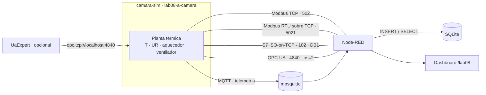
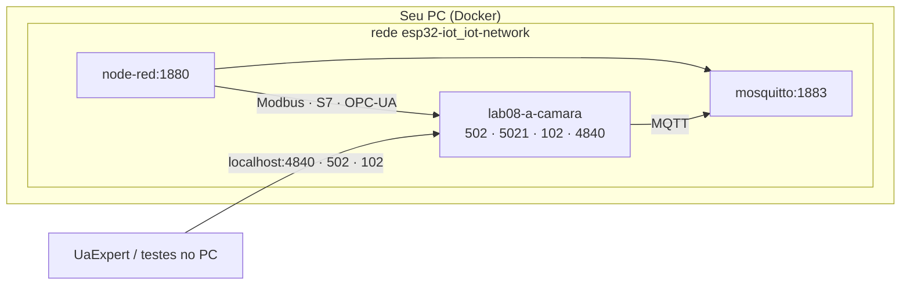
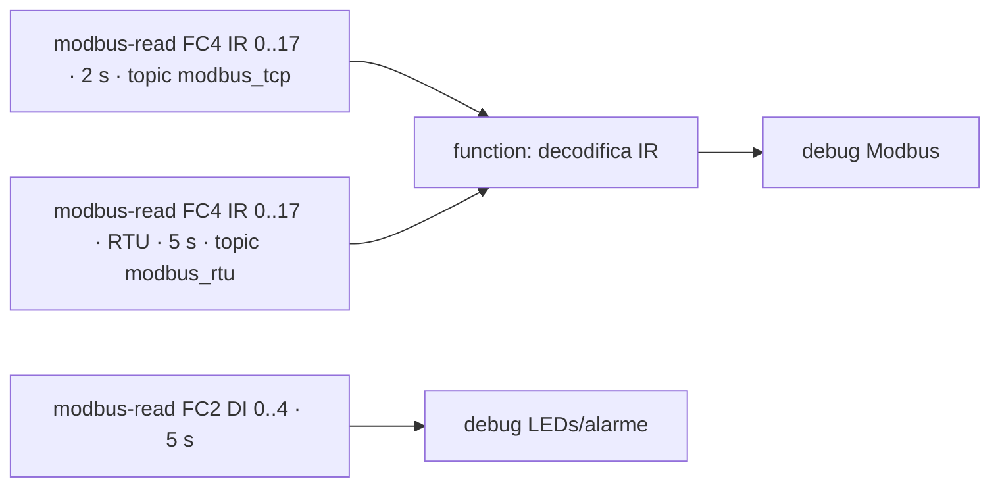
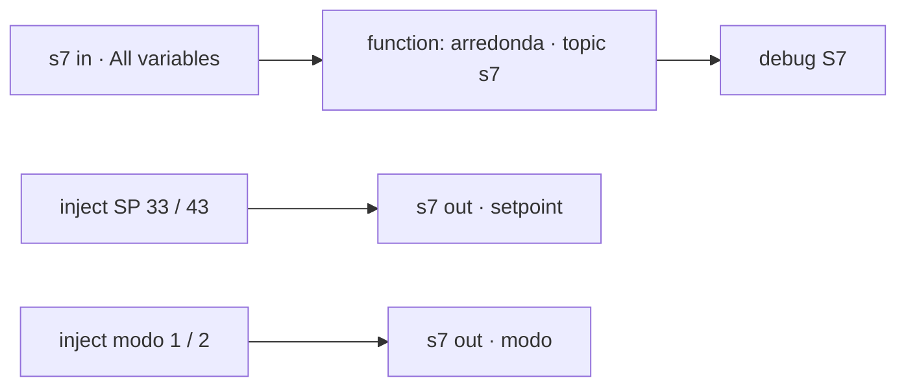
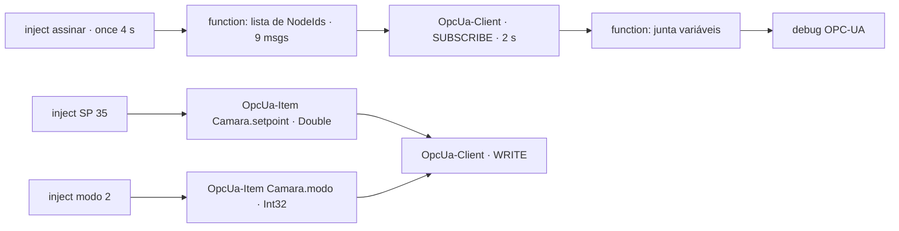
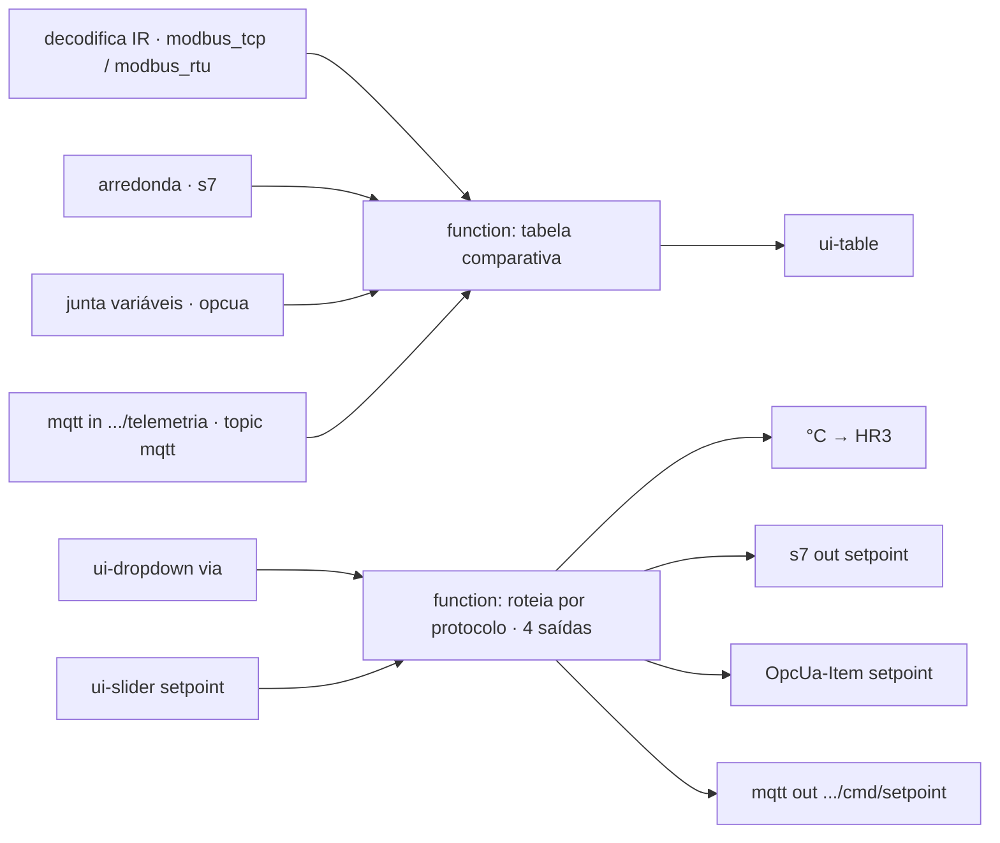
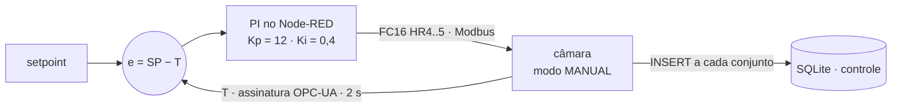

## Checklist — Modbus, S7 e OPC-UA com a câmara simulada {/* #checklist */}

- [ ] `camara-sim` rodando na rede do stack do curso, com `testar_clientes.py` passando em todos os protocolos (T1)
- [ ] Modbus TCP e RTU sobre TCP no Node-RED: leitura de input registers decodificada e escrita de setpoint e habilitação (T2)
- [ ] S7: leitura do DB1 com tabela de variáveis e escrita de setpoint e modo (T3)
- [ ] OPC-UA: assinatura de 9 variáveis, junção num único objeto e escrita por NodeId (T4)
- [ ] Painel multiprotocolo: a mesma câmara vista por 5 caminhos e setpoint escrito por qualquer um (T5)
- [ ] Controle PI no Node-RED (lê por OPC-UA, escreve por Modbus) comparado com o PI interno no SQLite (T6)
- [ ] Previsões P1–P4 respondidas no `README.md`
- [ ] Nenhum `push --force`; cada tarefa num commit `Tn:`

:::info[Pontuação]
**T1…T6 = 100 pts** (esta aula não tem desafios): T1 10 · T2 20 · T3 15 · T4 20 · T5 15 ·
T6 20. O autograder normaliza para 0–10. Vale o commit `Tn:` mais recente de cada tarefa.
:::

<LabSetup />

### Configuração do ambiente de desenvolvimento {/* #setup */}

<DevTools />

---

Nos Labs 05 a 07, o ESP32 montou, peça por peça, uma **câmara climática**: DHT22, OLED,
potenciômetro no ADC, aquecedor e ventilador por PWM e um controle ON/OFF. Tudo falava
**MQTT**, o protocolo típico de IoT.

Na indústria, porém, quem conversa com o chão de fábrica são **CLPs**, **IHMs** e **SCADAs**,
e eles falam outros protocolos: **Modbus**, **S7** (Siemens) e **OPC-UA**. Nesta aula, a
câmara vira uma "máquina" industrial: o **`camara-sim`** é um ESP32 simulado com o mesmo
modelo térmico da câmara, que expõe **a mesma planta** pelos quatro protocolos ao mesmo tempo.
O Node-RED faz o papel do SCADA: lê, compara, comanda e, no fim, **fecha a malha de
controle** por fora do ESP32.



## Objetivos

- Subir um **simulador de equipamento** em contêiner, ligado à rede do stack do curso.
- Entender o **modelo de dados** de cada protocolo: registradores e bobinas (Modbus), blocos
  de dados com endereço em bytes (S7) e nós com nome e tipo (OPC-UA).
- Ler e escrever pelos três protocolos no Node-RED, incluindo **escalas** (×10), **float32 em
  dois registradores** e **bits empacotados**.
- Comparar **varredura** (_polling_: Modbus e S7) com **assinatura** (OPC-UA) e
  **publicação** (MQTT).
- (Integrador) Fechar uma **malha de controle PI no SCADA**: medir por um protocolo, atuar por
  outro e comparar o desempenho com o PI embarcado, usando o **SQLite**.

## Material

- Stack Docker do curso (`mqtt5-node-red-sqlite`): **mosquitto**, **Node-RED** com
  `node-red-contrib-modbus`, `node-red-contrib-s7`, `node-red-contrib-opcua`,
  `node-red-node-sqlite` e Dashboard 2.0. Esses nós já vêm no `Dockerfile` do stack.
- O simulador **`camara-sim`**, que já está na pasta `camara-sim/` do repositório do grupo
  (Python 3.12: pymodbus, python-snap7, asyncua e paho-mqtt).
- **Sem ESP32 nem Wokwi nesta aula.** O "firmware" é o simulador.
- Opcional: **UaExpert** (Unified Automation, gratuito com cadastro) para navegar no servidor
  OPC-UA.

:::info[O que o camara-sim simula (e o que não)]
O modelo tem **dois estados térmicos** (resistência e câmara), perdas para o ambiente (25 °C),
umidade calculada pela fórmula de Magnus (aquecer **derruba** a UR), ruído e falhas de leitura
do DHT22, e o PI e o ON/OFF do "firmware". Ele **não** simula atraso de rede, perda de
pacotes nem a segurança do OPC-UA (o servidor aceita conexões anônimas, sem criptografia). Com
`SIM_SPEED=5`, a dinâmica fica **5× mais rápida**: um degrau de 30 → 40 °C assenta em cerca de
30 s, em vez de 2,5 min.
:::

## Clonar o repositório do grupo {/* #clonar */}

<LabTeamMembers labName="lab08" />

## Envie o link do repositório do seu grupo no Moodle: {/* #moodle-link */}

<LabSubmit labName="lab08" />

<details>
<summary><strong>Mapa de tarefas</strong> — 6 tarefas · 100 pts</summary>

- [T1 — Simulador na rede do stack](#t1) · 10 pts
- [T2 — Modbus TCP e RTU sobre TCP](#t2) · 20 pts
- [T3 — S7: lendo e escrevendo o DB1](#t3) · 15 pts
- [T4 — OPC-UA: assinatura e escrita](#t4) · 20 pts
- [T5 — Painel multiprotocolo](#t5) · 15 pts
- [T6 — PI no Node-RED x PI interno](#t6) · 20 pts

</details>

O repositório do grupo nasce do `lab08-template`, que traz uma cópia do simulador em
`camara-sim/`:

<FileTree
  root="lab08-grupo-X"
  files={[
    "camara-sim/camara_sim.py r",
    "camara-sim/camara_model.py r",
    "camara-sim/proto_modbus.py r",
    "camara-sim/proto_s7.py r",
    "camara-sim/proto_opcua.py r",
    "camara-sim/proto_mqtt.py r",
    "camara-sim/testar_clientes.py r",
    "camara-sim/Dockerfile r",
    "camara-sim/docker-compose.yml r",
    "camara-sim/docker-compose.lab.yml r",
    "camara-sim/.env.example r",
    "camara-sim/.env c",
    "camara-sim/README.md r",
    "nodered/flows-lab08.json c",
    "evidencias/t1-testar.txt c",
    "evidencias/t2-modbus.txt c",
    "evidencias/t3-s7.txt c",
    "evidencias/t4-opcua.txt c",
    "evidencias/t5-dashboard.png c",
    "evidencias/t6-sqlite.txt c",
    "evidencias/t6-dashboard.png c",
    "README.md u",
  ]}
/>

:::info[Nomes do Lab 08]
Troque o `a` pela letra do seu grupo em **todos** os nomes abaixo.

| O quê                      | Valor                                   |
| -------------------------- | --------------------------------------- |
| Contêiner e host na rede   | `lab08-a-camara`                        |
| Tópico base MQTT           | `elt85b/lab08/grupo-a/camara`           |
| Rede do stack do curso     | `esp32-iot_iot-network`                 |
| Banco SQLite (no Node-RED) | `/data/sqlite/lab08.sqlite`             |
| Dashboard                  | `http://localhost:1880/dashboard/lab08` |

:::

---

## Parte 1 — O simulador na rede do stack {/* #parte-1 */}

O simulador **não** traz broker nem Node-RED: ele **entra na rede** do stack do curso, onde já
estão `mosquitto` e `node-red`. Lá dentro, o Node-RED o encontra pelo nome
**`lab08-a-camara`**, exatamente como encontraria um CLP pelo nome na rede da fábrica.



### 1.1 Subir

1. Suba o stack do curso, se ainda não estiver rodando (na pasta `mqtt5-node-red-sqlite`:
   `docker compose up -d`). Confira o nome da rede:

   ```powershell title="Terminal"
   docker network ls          # deve aparecer esp32-iot_iot-network
   ```

2. Na pasta `camara-sim/` do repositório, crie o `.env` a partir do exemplo:

   <FileTree root="lab08-grupo-X" files={["camara-sim/.env c"]} />

 <GroupCommands
  language="ini"
  commands={[
    {
      title: "Configurasion ti File .env",
      codeTitle: "camara-sim/.env",
      command: `GRUPO=lab08-{group}
MQTT_BASE={course}/lab08/grupo-{group}/camara
LAB_REDE=esp32-iot_iot-network
SIM_SPEED=5

PORTA_MODBUS_TCP=502
PORTA_MODBUS_RTU=5021
PORTA_S7=102
PORTA_OPCUA=4840`
}
]}
/>

3. Suba o simulador **com o complemento de rede** (`docker-compose.lab.yml`), que o liga à
   rede do stack e aponta o MQTT para `mosquitto`:

<GroupCommands
  commands={[
    {
      title: "1. Iniciar containers e acompanhar logs",
      codeTitle: "Terminal (pasta camara-sim)",
      language: "powershell",
      command: `docker compose -f docker-compose.yml -f docker-compose.lab.yml up -d --build
docker logs -f lab08-{group}-camara`,
    },
    {
      title: "2. Saída Esperada",
      codeTitle: "Saída esperada",
      language: "text",
      command: `[planta] câmara climática simulada do lab08-{group}, speed=5.0x
[s7] servidor na porta 102 (DB1, I, Q, M)
[modbus] TCP em 0.0.0.0:502 (unit 1)
[modbus] RTU sobre TCP em 0.0.0.0:5021
[opcua] opc.tcp://<host>:4840/  (escutando em 0.0.0.0)  'urn:utfpr:camara-climatica' = ns=2
[mqtt] conectando a mosquitto:1883, base '{course}/lab08/grupo-{group}/camara'
[mqtt] conectado; assinando {course}/lab08/grupo-{group}/camara/cmd e {course}/lab08/grupo-{group}/camara/cmd/+`,
    },
  ]}
/>

:::warning[Porta ocupada?]
Se o `up` reclamar de _port is already allocated_, outra coisa no PC já usa a porta. O caso
mais comum é a 502 ou a 102. Troque só o lado do PC no `.env`, por exemplo
`PORTA_MODBUS_TCP=1502` ou `PORTA_S7=1102`. **Dentro da rede** o Node-RED continua usando 502
e 102, porque o mapeamento só vale para quem acessa de fora (o seu PC).
:::

### 1.2 Testar todos os protocolos

O `testar_clientes.py` **escreve** o setpoint por um protocolo e **lê** pelos outros. Rode-o
**dentro** do contêiner, onde ele já conhece o tópico base (`MQTT_BASE`):

<GroupCommands
  language="powershell"
  commands={[
    {
      title: "Executar testes de clientes no container",
      codeTitle: "Terminal",
      command: `docker exec lab08-{group}-camara python testar_clientes.py --mqtt-host mosquitto`,
    },
  ]}
/>

```text title="evidencias/t1-testar.txt (exemplo)"
MQTT escreve SP=36.0         {'temp': 39.9, 'umid': 29.5, 'setpoint': 36.0, 'estado_txt': 'RESFRIANDO', 'aquecedor_pwm': 44.0}
Modbus TCP lê                {'temp': 39.2, 'umid': 31.5, 'sp': 36.0, 'sp_ef': 36.0, 'aq': 0, 've': 100, 'estado': 2, 'leds(v,a,r)': [0, 1, 0]}
Modbus TCP escreve SP=37.5   ok
S7 lê                        {'temp': 37.2, 'umid': 34.5, 'sp': 37.5, 'sp_ef': 37.5, 'aq': 2.0, 've': 100.0, 'estado': 3}
S7 escreve SP=38.0           ok
OPC-UA lê                    {'temp': 36.3, 'umid': 35.1, 'setpoint': 38.0, 'sp_efetivo': 38.0, ...}
OPC-UA escreve SP=39.0       ok
Modbus RTU/TCP lê            {'temp': 36.1, 'umid': 36.4, 'sp': 39.0, 'sp_ef': 39.0, 'aq': 67, 've': 20, 'estado': 1, ...}
MQTT escreve SP=35.0 e lê    {'temp': 36.6, 'umid': 34.9, 'setpoint': 35.0, 'estado_txt': 'RESFRIANDO', ...}
```

Siga a "corrente" do setpoint: o que o MQTT escreveu (36,0) o Modbus lê; o que o Modbus
escreveu (37,5) o S7 lê; e assim por diante. É **uma** planta com **cinco** portas de acesso.
Salve a saída em `evidencias/t1-testar.txt`:

```powershell title="Terminal"
docker exec lab08-a-camara python testar_clientes.py --mqtt-host mosquitto | Out-File -Encoding utf8 ..\evidencias\t1-testar.txt
```

<GroupCommands
  language="powershell"
  commands={[
    {
      title: "Executar testes de clientes no container",
      codeTitle: "Terminal",
      command: `docker exec lab08-{group}-camara python testar_clientes.py --mqtt-host mosquitto | Out-File -Encoding utf8 ..\evidencias\t1-testar.txt`,
    },
  ]}
/>

:::tip[Sem Docker?]
O simulador também roda direto no Python (veja o `camara-sim/README.md`, forma A). Nesse caso,
o Node-RED do stack, que está dentro do Docker, alcança o seu PC por `host.docker.internal`
em vez de `lab08-a-camara`. No Linux e no macOS, as portas 102 e 502 exigem administrador:
use `--s7-port 1102 --modbus-tcp-port 1502`.
:::

<FileTree
  root="lab08-grupo-X"
  files={["camara-sim/.env c", "evidencias/t1-testar.txt c"]}
/>

<CommitPoint
  id="t1"
  task="Simulador na rede do stack"
  pontos={10}
  files="camara-sim/.env evidencias/t1-testar.txt"
/>

---

## Parte 2 — Modbus TCP e RTU sobre TCP {/* #parte-2 */}

### 2.1 O modelo de dados do Modbus

O Modbus não tem nomes nem tipos: só **quatro tabelas** de endereços numerados, de bits ou de
palavras de 16 bits. O significado de cada endereço vem de um **mapa de registradores**, o
documento que o fabricante entrega junto com o equipamento. O mapa da câmara (unit 1,
endereços base 0) é este:

| Tabela (código de função)                     | Acesso      | End.      | Variável                                                      |
| --------------------------------------------- | ----------- | --------- | ------------------------------------------------------------- |
| Coils (FC1 lê · FC5/FC15 escreve)             | R/W bit     | 0 / 1     | `habilitado` / `falha_dht` (simulação)                        |
| Discrete inputs (FC2)                         | R bit       | 0–4       | LED verde, amarelo, vermelho, `dht_ok`, alarme ativo          |
| Holding registers (FC3 lê · FC6/FC16 escreve) | R/W 16 bits | 0 / 1 / 2 | `habilitado` / `modo` (0 MANUAL, 1 ON/OFF, 2 PI) / `fonte_sp` |
|                                               |             | 3         | `setpoint` × 10 (350 = 35,0 °C)                               |
|                                               |             | 4 / 5     | `aquecedor_cmd` / `ventilador_cmd` (%), valem no modo MANUAL  |
| Input registers (FC4)                         | R 16 bits   | 0 / 1 / 2 | temperatura × 10 / umidade × 10 / setpoint efetivo × 10       |
|                                               |             | 3 / 4     | aquecedor / ventilador aplicados (%)                          |
|                                               |             | 6 / 7     | `estado` (0 DESLIGADO … 4 ALARME) / `alarme` (bits)           |
|                                               |             | 8         | LEDs: bit0 verde, bit1 amarelo, bit2 vermelho                 |
|                                               |             | 10        | `heartbeat` (conta a cada ciclo do "firmware")                |
|                                               |             | 12–13     | temperatura em **float32** (palavra alta primeiro, ABCD)      |
|                                               |             | 14–15     | umidade em **float32** (ABCD)                                 |

Três truques aparecem em quase todo equipamento real:

- **Escala:** um registrador só guarda inteiros de 0 a 65535. Para ter uma casa decimal, o
  valor vai **multiplicado por 10**: 35,2 °C viram `352`.
- **Float32 em dois registradores:** para não perder precisão, o mesmo valor também aparece
  como `float` IEEE 754 ocupando **dois** registradores. A ordem das palavras (ABCD, CDAB…)
  muda de fabricante para fabricante, e errar a ordem dá números absurdos.
- **Bits empacotados:** vários sinais booleanos dentro de um registrador (o IR8 dos LEDs).

### 2.2 Clientes: TCP e RTU sobre TCP

O mesmo escravo responde em **duas** portas. A 502 usa **Modbus TCP** (cabeçalho MBAP, sem
CRC). A 5021 usa o quadro **RTU** (endereço + função + dados + **CRC-16**), o mesmo da RS-485,
só que transportado por TCP, como faz um conversor serial-Ethernet.

Crie uma aba **Lab 08** e dois nós de configuração **modbus-client**:

| Campo    | `câmara Modbus TCP` | `câmara Modbus RTU/TCP` |
| -------- | ------------------- | ----------------------- |
| Type     | TCP                 | TCP                     |
| Host     | `lab08-a-camara`    | `lab08-a-camara`        |
| Port     | `502`               | `5021`                  |
| TCP Type | **DEFAULT**         | **TELNET**              |
| Unit-Id  | `1`                 | `1`                     |

:::warning[TELNET, não RTU-BUFFERED]
No `node-red-contrib-modbus`, o tipo que envia quadros **RTU crus** pelo socket se chama
**TELNET**. O "TCP-RTU-BUFFERED", apesar do nome, envia cabeçalho Modbus TCP, e o simulador
na 5021 não responde (o nó fica em _timeout_).
:::

### 2.3 Leitura e decodificação



- **modbus-read** "FC4 IR 0..17": servidor `câmara Modbus TCP`, _FC 4: Read Input
  Registers_, Address `0`, Quantity `18`, Poll Rate `2 s`, Topic `modbus_tcp`.
- O mesmo pelo cliente RTU, a cada `5 s`, Topic `modbus_rtu`.
- **modbus-read** "FC2 DI 0..4": _FC 2: Read Discrete Inputs_, Address `0`, Quantity `5`,
  direto num **debug**.

<FileTree root="lab08-grupo-X" files={["nodered/flows-lab08.json c"]} />

```js title="function: decodifica IR"
// Input registers 0..17 da câmara -> objeto com nomes e unidades
const r = msg.payload;
if (!Array.isArray(r) || r.length < 18) return null;
const s16 = (v) => (v > 0x7fff ? v - 0x10000 : v); // int16 com sinal
const f32 = (i) => {
  // float32 big-endian (ABCD)
  const b = Buffer.alloc(4);
  b.writeUInt16BE(r[i], 0);
  b.writeUInt16BE(r[i + 1], 2);
  return b.readFloatBE(0);
};
const ESTADOS = ["DESLIGADO", "AQUECENDO", "RESFRIANDO", "ESTAVEL", "ALARME"];
msg.payload = {
  temp_x10: s16(r[0]) / 10, // IR0: °C x 10
  temp: Number(f32(12).toFixed(2)), // IR12-13: float32
  umid: Number(f32(14).toFixed(1)), // IR14-15
  sp_efetivo: s16(r[2]) / 10, // IR2
  aquecedor_pwm: r[3],
  ventilador_pwm: r[4],
  pot_raw: r[5],
  estado: r[6],
  estado_txt: ESTADOS[r[6]] ?? "?",
  alarme: r[7],
  leds: {
    verde: r[8] & 1,
    amarelo: (r[8] >> 1) & 1,
    vermelho: (r[8] >> 2) & 1,
  },
  heartbeat: r[10],
};
return msg;
```

Ligue a saída a um **debug** "Modbus TCP" com _status_ `payload.temp`. Compare `temp_x10` com
`temp`: o primeiro tem **uma** casa decimal, o segundo, a precisão do float.

### 2.4 Escrita

| Nó                              | Configuração                                                      |
| ------------------------------- | ----------------------------------------------------------------- |
| inject "SP 30 °C" / "SP 40 °C"  | payload número `30` / `40`                                        |
| function "°C → HR3 (×10)"       | `msg.payload = Math.round(Number(msg.payload) * 10); return msg;` |
| modbus-write "FC6 HR3 setpoint" | _FC 6: Preset Single Register_, Address `3`, Quantity `1`         |
| inject "Liga" / "Desliga"       | payload booleano `true` / `false`                                 |
| modbus-write "FC5 coil 0"       | _FC 5: Force Single Coil_, Address `0`, Quantity `1`              |

Clique "SP 40 °C" e acompanhe o debug: `sp_efetivo` vai a 40 e o `estado` passa a
`AQUECENDO`. Clique "Desliga": tudo vai a 0 e o estado a `DESLIGADO`. No log do simulador,
cada escrita aparece com o protocolo de origem:

```powershell title="Terminal"
docker logs lab08-a-camara 2>&1 | Select-String "\[cmd\]"
```

```text title="Saída esperada"
[13:06:57] [cmd] modbus: setpoint = 30.0
[13:07:38] [cmd] modbus coil: habilitado = False
[13:07:41] [cmd] modbus coil: habilitado = True
```

:::tip[Preveja antes de rodar]
**P1:** o que acontece se você esquecer a função "×10" e mandar `37.5` direto para o HR3?
(Dica: o registrador só guarda inteiros, e o simulador **satura** o setpoint em 20…55 °C.)
E se ler o float32 dos IR12–13 na ordem **CDAB**, que tipo de número aparece? Teste e anote.
:::

**Evidência:** em `evidencias/t2-modbus.txt`, cole um objeto do debug "Modbus TCP", um do
"Modbus RTU/TCP" (o mesmo debug, com `topic` `modbus_rtu`), um array do debug de LEDs e as
linhas `[cmd]` do log.

<FileTree
  root="lab08-grupo-X"
  files={["nodered/flows-lab08.json u", "evidencias/t2-modbus.txt c"]}
/>

<CommitPoint
  id="t2"
  task="Modbus TCP e RTU sobre TCP"
  pontos={20}
  files="nodered/flows-lab08.json evidencias/t2-modbus.txt"
/>

---

## Parte 3 — S7: lendo e escrevendo o DB1 {/* #parte-3 */}

### 3.1 O modelo de dados do S7

Num CLP Siemens, os dados do programa ficam em **blocos de dados** (DB). Um DB é uma sequência
de **bytes**, e cada variável é um **tipo** num **deslocamento** (_offset_): `REAL` ocupa
4 bytes, `INT` 2, `DINT` 4, e um `BOOL` é **um bit** de um byte. O protocolo S7 (ISO-on-TCP,
porta 102) lê e escreve faixas desses bytes. O cliente precisa saber o **endereço** de cada
variável, exatamente como no Modbus, mas agora em bytes e com tipos.

| Endereço nodes7         | Bytes | Variável                               | Acesso |
| ----------------------- | ----- | -------------------------------------- | ------ |
| `DB1,X0.0`              | 0.0   | `habilitado`                           | R/W    |
| `DB1,X0.1`              | 0.1   | `fonte_sp` (0 remoto, 1 potenciômetro) | R/W    |
| `DB1,INT2`              | 2–3   | `modo`                                 | R/W    |
| `DB1,REAL4`             | 4–7   | `setpoint` (°C)                        | R/W    |
| `DB1,REAL8`             | 8–11  | `aquecedor_cmd` (%)                    | R/W    |
| `DB1,REAL12`            | 12–15 | `ventilador_cmd` (%)                   | R/W    |
| `DB1,REAL20`            | 20–23 | `temp` (°C)                            | R      |
| `DB1,REAL24`            | 24–27 | `umid` (%)                             | R      |
| `DB1,REAL28`            | 28–31 | `sp_efetivo` (°C)                      | R      |
| `DB1,REAL32` / `REAL36` | 32–39 | aquecedor / ventilador aplicados (%)   | R      |
| `DB1,INT40` / `INT42`   | 40–43 | `estado` / `alarme`                    | R      |
| `DB1,X44.0` … `X44.2`   | 44    | LEDs verde, amarelo, vermelho          | R      |
| `DB1,DINT48`            | 48–51 | `heartbeat`                            | R      |

O DB1 do simulador é **sem acesso otimizado**: os endereços são fixos, como num S7-300 ou num
S7-1200 com _Optimized block access_ desligado. Num S7-1200/1500 real, isso e o _PUT/GET_
precisam ser liberados no TIA Portal.

### 3.2 Leitura e escrita no Node-RED

Crie um nó de configuração **s7 endpoint** "câmara S7 (DB1)":

| Campo          | Valor                                                              |
| -------------- | ------------------------------------------------------------------ |
| Transport      | Ethernet (ISO-on-TCP)                                              |
| Address / Port | `lab08-a-camara` / `102`                                           |
| Mode           | Rack/Slot: `0` / `1`                                               |
| Cycle time     | `2000` ms                                                          |
| Variables      | as 15 linhas da tabela acima (nome à direita, endereço à esquerda) |



- **s7 in**, _Mode_ **All variables**: entrega um objeto com todas as variáveis da tabela a
  cada ciclo.
- **function** "arredonda" (os `REAL` chegam com muitas casas, como `39.79999923706055`):

  ```js title="function: arredonda"
  // "s7 in" (todas as variáveis) -> números arredondados
  const p = msg.payload;
  const r = (v) => Math.round(v * 100) / 100;
  msg.payload = Object.assign({}, p, {
    temp: r(p.temp),
    umid: r(p.umid),
    setpoint: r(p.setpoint),
    sp_efetivo: r(p.sp_efetivo),
    aquecedor_pwm: r(p.aquecedor_pwm),
    ventilador_pwm: r(p.ventilador_pwm),
  });
  msg.topic = "s7";
  return msg;
  ```

- **s7 out** _Variable_ `setpoint`, alimentado por injects `33` e `43`. Aqui **não** há escala:
  o `REAL` já é o valor em °C.
- **s7 out** _Variable_ `modo`, com injects `1` (ON/OFF) e `2` (PI).

Escreva SP 43 °C pelo S7 e confirme no debug "Modbus TCP" que `sp_efetivo` também mudou.

:::tip[Preveja antes de rodar]
**P2:** um colega declarou o modo como `DB1,REAL2`, em vez de `DB1,INT2`, e escreveu `1`.
Quais bytes do DB1 foram alterados? O que acontece com o **setpoint**, que começa no byte 4?
Por que o Modbus e o OPC-UA não têm esse tipo de erro "silencioso" da mesma forma?
:::

**Evidência:** em `evidencias/t3-s7.txt`, um objeto do debug "S7" e as linhas `[cmd] s7:` do
log do simulador.

<FileTree
  root="lab08-grupo-X"
  files={["nodered/flows-lab08.json u", "evidencias/t3-s7.txt c"]}
/>

<CommitPoint
  id="t3"
  task="S7: lendo e escrevendo o DB1"
  pontos={15}
  files="nodered/flows-lab08.json evidencias/t3-s7.txt"
/>

---

## Parte 4 — OPC-UA: assinatura e escrita {/* #parte-4 */}

### 4.1 O modelo de dados do OPC-UA

No OPC-UA, o servidor publica um **espaço de endereçamento**: uma árvore de **nós**, cada um
com **nome**, **tipo**, **unidade** e permissões. O cliente não precisa de um mapa externo:
ele **navega** (_browse_) e descobre. Cada nó tem um **NodeId**. Na câmara:

```text title="Objects/Camara  (namespace urn:utfpr:camara-climatica = ns=2)"
Medicoes/    temp · umid · pot_raw                       ns=2;s=Camara.temp ...
Atuadores/   aquecedor_pwm · ventilador_pwm · *_duty
Estado/      estado · estado_txt · alarme · led_* · heartbeat · uptime · oled
Comandos/    habilitado · modo · fonte_sp · setpoint · aquecedor_cmd · ventilador_cmd   (graváveis)
Simulacao/   pot_raw_sim · falha_dht                                                     (graváveis)
```

A grande diferença para Modbus e S7 é a **assinatura** (_subscription_). Em vez de o cliente
perguntar a cada 2 s, ele pede ao servidor: "me avise quando estes nós mudarem, verificando a
cada 2 s". O servidor **junta as mudanças** e as entrega em **lotes**.

:::info[Opcional: UaExpert]
No PC, conecte o UaExpert em `opc.tcp://localhost:4840/` (_Security_ None, anônimo). Navegue
até `Objects/Camara` e arraste `temp`, `setpoint` e `estado_txt` para o _Data Access View_.
Repare nos atributos de cada nó: `DataType`, `AccessLevel` e `Description`. O servidor
devolve o endereço que o cliente usou (`localhost` aqui, `lab08-a-camara` no Node-RED), por
isso nenhum dos dois precisa de configuração extra.
:::

### 4.2 Assinatura no Node-RED

Crie um **OpcUa-Endpoint** "câmara OPC-UA": `opc.tcp://lab08-a-camara:4840/`, _Security
Policy_ None, _Mode_ None, anônimo.



O **OpcUa-Client** em _SUBSCRIBE_ cria um item monitorado para cada mensagem que recebe, com
`msg.topic` = NodeId. Uma function gera as nove mensagens de uma vez:

```js title="function: lista de NodeIds"
// Uma mensagem por variável a assinar: msg.topic = NodeId, msg.datatype = tipo OPC-UA
const vars = {
  temp: "Double",
  umid: "Double",
  setpoint: "Double",
  sp_efetivo: "Double",
  aquecedor_pwm: "Double",
  ventilador_pwm: "Double",
  modo: "Int32",
  estado_txt: "String",
  heartbeat: "Int32",
};
return [
  Object.entries(vars).map(([n, t]) => ({
    topic: `ns=2;s=Camara.${n}`,
    datatype: t,
    payload: "",
  })),
];
```

Configure o **OpcUa-Client** "assina (2 s)": _Action_ **SUBSCRIBE**, _Interval_ `2` s.
Cada mudança chega numa mensagem separada, com o valor em `msg.payload.value.value`. Para
trabalhar com o **conjunto**, junte as variáveis:

```js title="function: junta variáveis"
// Cada variável assinada chega numa mensagem separada (msg.topic = NodeId).
// O servidor entrega as mudanças em LOTES (a cada ~2 s): guarda o último valor de
// cada variável e emite UM conjunto 200 ms depois da última mensagem do lote.
const nome = String(msg.topic).split("Camara.")[1];
if (!nome) return null;
const v =
  msg.payload && msg.payload.value !== undefined
    ? msg.payload.value.value
    : msg.payload;
const d = context.get("d") || {};
d[nome] = v;
context.set("d", d);
if (Object.keys(d).length < 9) return null; // ainda faltam variáveis
clearTimeout(context.get("tmr"));
context.set(
  "tmr",
  setTimeout(() => {
    const r = (x) => Math.round(x * 100) / 100;
    node.send({
      topic: "opcua",
      payload: Object.assign({}, d, {
        temp: r(d.temp),
        umid: r(d.umid),
        aquecedor_pwm: r(d.aquecedor_pwm),
        ventilador_pwm: r(d.ventilador_pwm),
      }),
    });
  }, 200),
);
return null;
```

:::warning[Por que o atraso de 200 ms?]
O `heartbeat` muda a cada ciclo do simulador, várias vezes entre duas entregas. O servidor
guarda **todas** as mudanças na fila do item monitorado e as entrega juntas: chegam 4 ou 5
mensagens de `heartbeat` no mesmo milissegundo. Emitir a cada mensagem geraria **4 ou 5
conjuntos repetidos** a cada 2 s (e 4 ou 5 linhas por ciclo no SQLite da T6). O
`setTimeout` reiniciado a cada mensagem (_debounce_) espera o lote terminar e emite **um**
conjunto, já com os valores mais recentes.
:::

### 4.3 Escrita

Para escrever, o **OpcUa-Item** define o NodeId e o **tipo**, e o **OpcUa-Client**
"escreve" usa _Action_ **WRITE**:

| OpcUa-Item        | Item                     | Type     | Injects |
| ----------------- | ------------------------ | -------- | ------- |
| `Camara.setpoint` | `ns=2;s=Camara.setpoint` | `Double` | `35`    |
| `Camara.modo`     | `ns=2;s=Camara.modo`     | `Int32`  | `2`     |

O tipo **tem** de bater com o do servidor. Escrever um `Float` num nó `Double` é recusado com
`BadTypeMismatch`, e o OPC-UA, ao contrário do S7, **avisa**.

:::tip[Preveja antes de rodar]
**P3:** com a câmara estável, o `temp` oscila ±0,1 °C por causa do ruído do DHT22, mas o
`setpoint` fica parado. Ao longo de 1 minuto, quantas mensagens de `temp` e quantas de
`setpoint` o OpcUa-Client entrega? E quantas leituras o Modbus faz do IR2 (setpoint efetivo) no
mesmo minuto? O que isso diz sobre o tráfego de **varredura** × **assinatura** numa rede com
centenas de variáveis que quase nunca mudam?
:::

**Evidência:** em `evidencias/t4-opcua.txt`, um objeto do debug "OPC-UA" e as linhas
`[cmd] opcua:` do log do simulador. (Opcional: uma captura do UaExpert.)

<FileTree
  root="lab08-grupo-X"
  files={["nodered/flows-lab08.json u", "evidencias/t4-opcua.txt c"]}
/>

<CommitPoint
  id="t4"
  task="OPC-UA: assinatura e escrita"
  pontos={20}
  files="nodered/flows-lab08.json evidencias/t4-opcua.txt"
/>

---

## Parte 5 — Painel multiprotocolo {/* #parte-5 */}

Agora o dashboard mostra **a mesma câmara vista por cinco caminhos** e permite escrever o
setpoint **por qualquer um deles**.



### 5.1 Tabela comparativa

Ligue as saídas de "decodifica IR", "arredonda" e "junta variáveis" a uma nova function. Para
o MQTT, use um **mqtt in** `elt85b/lab08/grupo-a/camara/telemetria` (_a parsed JSON object_,
broker `mosquitto:1883`), seguido de uma function que só faz `msg.topic = "mqtt"`.

```js title="function: tabela comparativa"
// Guarda a última leitura de cada caminho e monta a tabela comparativa
const fonte = msg.topic; // modbus_tcp | modbus_rtu | s7 | opcua | mqtt
const p = msg.payload;
const ult = flow.get("ultimas") || {};
ult[fonte] = {
  t: p.temp,
  sp: p.sp_efetivo ?? p.setpoint,
  aq: p.aquecedor_pwm,
  estado:
    p.estado_txt ??
    ["DESLIGADO", "AQUECENDO", "RESFRIANDO", "ESTAVEL", "ALARME"][p.estado] ??
    "?",
  em: Date.now(),
};
flow.set("ultimas", ult);
const NOMES = {
  modbus_tcp: "Modbus TCP (FC4)",
  modbus_rtu: "Modbus RTU/TCP",
  s7: "S7 (DB1)",
  opcua: "OPC-UA (assinatura)",
  mqtt: "MQTT (telemetria)",
};
const agora = Date.now();
msg.payload = Object.keys(NOMES)
  .filter((k) => ult[k])
  .map((k) => ({
    caminho: NOMES[k],
    "T (°C)": ult[k].t?.toFixed(2),
    "SP (°C)": ult[k].sp?.toFixed(1),
    "aquecedor (%)": Math.round(ult[k].aq),
    estado: ult[k].estado,
    "idade (s)": ((agora - ult[k].em) / 1000).toFixed(1),
  }));
return msg;
```

Na página **Lab 08** (`/lab08`) do `My Dashboard`, crie os grupos _Mesma câmara, quatro
protocolos_ (largura 8), _Escrever o setpoint_ (4), _Controle PI no Node-RED_ (4) e
_Temperatura × setpoint_ (8). Ligue a function a um **ui-table** (colunas automáticas,
_Max rows_ 6) no primeiro grupo.

### 5.2 Escrita por qualquer protocolo

- **ui-dropdown** "Escrever por": opções `modbus` (rótulo "Modbus (FC6 HR3)"), `s7`, `opcua`
  e `mqtt`; _Topic_ `via`.
- **ui-slider** "Setpoint (°C)": 20 a 55, passo 0,5, envia **ao soltar**, _Topic_ `sp`.
- Os dois entram na mesma function de **4 saídas**:

  ```js title="function: roteia por protocolo"
  // Encaminha o setpoint para o protocolo escolhido no dropdown
  if (msg.topic === "via") {
    context.set("via", msg.payload);
    node.status({ text: "via " + msg.payload });
    return null;
  }
  const via = context.get("via") || "modbus";
  const sp = Number(msg.payload);
  flow.set("escrita", { via, sp, em: Date.now() });
  node.status({ fill: "blue", shape: "dot", text: `SP ${sp} °C via ${via}` });
  const out = [null, null, null, null];
  out[["modbus", "s7", "opcua", "mqtt"].indexOf(via)] = { payload: sp };
  return out;
  ```

| Saída | Liga em                                                  |
| ----- | -------------------------------------------------------- |
| 1     | function "°C → HR3 (×10)" da T2 (que já leva ao FC6 HR3) |
| 2     | **s7 out** `setpoint` da T3                              |
| 3     | **OpcUa-Item** `Camara.setpoint` da T4                   |
| 4     | **mqtt out** `elt85b/lab08/grupo-a/camara/cmd/setpoint`  |

Escolha cada protocolo, mova o slider e veja **as cinco linhas** da tabela convergirem para o
novo SP. A coluna **idade** mostra há quanto tempo cada caminho foi atualizado: o RTU, lido a
cada 5 s, é o mais "velho".

**Evidência:** a captura do dashboard com as cinco linhas preenchidas em
`evidencias/t5-dashboard.png` e o fluxo exportado em `nodered/flows-lab08.json`.

<FileTree
  root="lab08-grupo-X"
  files={["nodered/flows-lab08.json u", "evidencias/t5-dashboard.png c"]}
/>

<CommitPoint
  id="t5"
  task="Painel multiprotocolo"
  pontos={15}
  files="nodered/flows-lab08.json evidencias/t5-dashboard.png"
/>

---

## Projeto integrador — PI no Node-RED × PI interno {/* #integrador */}

Até aqui, quem controla a temperatura é o "firmware" da câmara (modo 1 ON/OFF ou modo 2 PI).
Agora o **SCADA assume o controle**: a câmara vai para o modo **0 MANUAL**, em que obedece
aos registradores **HR4** (aquecedor) e **HR5** (ventilador), e o Node-RED calcula esses
valores com um **PI**. A medição vem pelo **OPC-UA** e a atuação vai pelo **Modbus**, como
num sistema real em que o SCADA conversa com equipamentos de fabricantes diferentes.



O controlador é discreto, executado a cada conjunto do OPC-UA (~2 s):

```text title="PI com anti-windup"
e  = SP − T                              (°C)
I  = I + Ki · e · dt                     só se a saída não estiver saturada no sentido do erro
u  = Kp · e + I       → aquecedor = u limitado a 0…100 %
ventilador = 20 + 30 · (−e − 0,5)        limitado a 20…100 %  (20 % = circulação)
```

### Requisitos

1. **Ativação.** Um **ui-switch** "PI no Node-RED (modo MANUAL)" num function de 2 saídas:
   - **ligado:** guarda `flow.pi_ativo = true` e escreve `[1, 0]` em **HR0..1** (habilitado,
     modo MANUAL) com **FC16**;
   - **desligado:** escreve `2` no **HR1** com FC6 (volta ao PI interno).

   ```js title="function: ativa / desativa"
   // Liga/desliga o controle externo.
   // Ligar: HR0..1 = [1, 0]  -> habilitado, modo MANUAL (a câmara obedece HR4/HR5)
   // Desligar: HR1 = 2       -> volta ao PI interno
   flow.set("pi_ativo", msg.payload === true);
   node.status({
     fill: msg.payload ? "green" : "grey",
     shape: "ring",
     text: msg.payload ? "externo" : "interno",
   });
   return msg.payload ? [{ payload: [1, 0] }, null] : [null, { payload: 2 }];
   ```

2. **Controlador.** Function "PI" alimentada pelo **"junta variáveis"** da T4, com 2 saídas:
   `[aquecedor, ventilador]` para um **modbus-write** **FC16** em **HR4**, quantidade 2, e um
   objeto de diagnóstico para um debug. Ela só atua com `pi_ativo` **e** `modo === 0`. Fora
   disso, zera o integrador.

   ```js title="function: PI (Kp=12, Ki=0,4)"
   // Controlador PI EXTERNO. Entrada: conjunto do OPC-UA (a cada ~2 s).
   // Só atua quando o controle externo está ativo e a câmara está em modo MANUAL (0).
   const p = msg.payload;
   const ativo = flow.get("pi_ativo") === true;
   if (!ativo || p.modo !== 0) {
     context.set("I", 0);
     context.set("t0", null);
     return [null, null];
   }

   const KP = 12,
     KI = 0.4; // %/°C e %/(°C·s)  <-- ajuste aqui
   const agora = Date.now() / 1000;
   const t0 = context.get("t0");
   const dt = t0 ? Math.min(agora - t0, 10) : 0;
   context.set("t0", agora);

   const e = p.setpoint - p.temp; // erro (°C)
   let I = context.get("I") || 0;
   let u = KP * e + I;
   // anti-windup: só integra se não estiver saturado no sentido do erro
   if ((u < 100 || e < 0) && (u > 0 || e > 0))
     I = Math.min(100, Math.max(0, I + KI * e * dt));
   context.set("I", I);
   const aq = Math.round(Math.min(100, Math.max(0, KP * e + I)));
   const ve = Math.round(Math.min(100, Math.max(20, 20 + 30 * (-e - 0.5)))); // 20 % = circulação

   node.status({
     fill: "green",
     shape: "dot",
     text: `e=${e.toFixed(2)} I=${I.toFixed(1)} aq=${aq}% ve=${ve}%`,
   });
   return [{ payload: [aq, ve] }, { payload: { e, I, aq, ve } }];
   ```

   :::warning[FC16 no modbus-write]
   Para escrever **dois** registradores, o _FC_ do modbus-write tem de ser **FC 16: Preset
   Multiple Registers** (no fluxo exportado, `"dataType": "MHoldingRegisters"`) e o payload,
   um **array**. Com _FC 6_ e quantidade 2, o nó escreve **só o primeiro** valor e não dá
   erro: o ventilador nunca muda e o modo nunca vai a 0.
   :::

3. **Registro.** Tabela `controle` no **`/data/sqlite/lab08.sqlite`**, criada por um inject
   _once_ (0,5 s) → sqlite _Via msg.topic_, e uma linha **por conjunto do OPC-UA**:

   ```sql title="msg.topic do inject 'Criar tabela'"
   CREATE TABLE IF NOT EXISTS controle (
       id          INTEGER PRIMARY KEY AUTOINCREMENT,
       recebido_em TEXT DEFAULT (strftime('%Y-%m-%d %H:%M:%f', 'now', 'localtime')),
       modo        INTEGER,   -- 0 MANUAL (PI no Node-RED), 1 ON/OFF, 2 PI interno
       t           REAL,      -- °C (OPC-UA)
       sp          REAL,      -- setpoint efetivo (°C)
       aq          REAL,      -- % aquecedor aplicado
       ve          REAL       -- % ventilador aplicado
   );
   ```

   ```js title="function: monta parâmetros"
   // Cada conjunto do OPC-UA -> uma linha (com parâmetros)
   const p = msg.payload;
   if (typeof p.temp !== "number" || typeof p.sp_efetivo !== "number")
     return null;
   msg.params = {
     $modo: p.modo,
     $t: p.temp,
     $sp: p.sp_efetivo,
     $aq: p.aquecedor_pwm,
     $ve: p.ventilador_pwm,
   };
   return msg;
   ```

   ```sql title="sqlite: INSERT (prepared)"
   INSERT INTO controle (modo, t, sp, aq, ve) VALUES ($modo, $t, $sp, $aq, $ve);
   ```

4. **Gráfico.** O mesmo conjunto vira 3 pontos num **ui-chart** "Temperatura × setpoint"
   (séries `T (°C)`, `SP (°C)` e `aquecedor (%/2)`, X = key `ts`, Y = key `valor`,
   15 minutos):

   ```js title="function: pontos"
   // Conjunto do OPC-UA -> pontos do gráfico
   const p = msg.payload,
     ts = Date.now();
   return {
     payload: [
       { ts, serie: "T (°C)", valor: p.temp },
       { ts, serie: "SP (°C)", valor: p.sp_efetivo },
       { ts, serie: "aquecedor (%/2)", valor: p.aquecedor_pwm / 2 },
     ],
   };
   ```

5. **Experimento** (com `SIM_SPEED=5`):
   1. inject "Apagar tudo" (`DELETE FROM controle;`);
   2. **PI interno:** switch **desligado**, SP **30 °C**, espere ~1 min; SP **40 °C**, espere
      ~1 min;
   3. **PI no Node-RED:** com SP **30 °C**, ligue o switch e espere ~1 min; SP **40 °C**,
      espere ~1 min;
   4. rode as duas consultas abaixo.

   ```sql title="Comparar controladores (10 min)"
   SELECT CASE modo WHEN 0 THEN 'PI Node-RED' WHEN 1 THEN 'ON/OFF interno'
                    WHEN 2 THEN 'PI interno' END AS controlador,
          COUNT(*)                                             AS n,
          ROUND(AVG(ABS(sp - t)), 2)                           AS erro_medio,
          ROUND(100.0 * SUM(ABS(sp - t) > 0.5) / COUNT(*), 0)  AS pct_fora_banda,
          ROUND(AVG(aq), 1)                                    AS aq_medio
   FROM controle
   WHERE recebido_em >= datetime('now', 'localtime', '-10 minutes')
   GROUP BY modo;
   ```

   ```sql title="Último degrau (pico e tempo)"
   -- Último degrau de SUBIDA de cada controlador: sobressinal e tempo até a banda de 0,5 °C
   WITH m AS (
     SELECT id, recebido_em, modo, t, sp, LAG(sp) OVER (ORDER BY id) AS sp_ant FROM controle
   ),
   d AS (
     SELECT modo, MAX(id) AS id0 FROM m WHERE sp > sp_ant GROUP BY modo
   ),
   j AS (
     SELECT m.*, (SELECT recebido_em FROM m AS a WHERE a.id = d.id0) AS t0
     FROM m JOIN d ON m.modo = d.modo AND m.id >= d.id0
     WHERE m.sp = (SELECT sp FROM m AS b WHERE b.id = d.id0)
   )
   SELECT CASE modo WHEN 0 THEN 'PI Node-RED' WHEN 1 THEN 'ON/OFF interno'
                    WHEN 2 THEN 'PI interno' END AS controlador,
          MAX(sp) AS sp, COUNT(*) AS n,
          ROUND(MAX(t) - MAX(sp), 2) AS sobressinal,
          ROUND((julianday(MIN(CASE WHEN t >= sp - 0.5 THEN recebido_em END))
                 - julianday(MIN(t0))) * 86400, 0) AS s_ate_banda
   FROM j GROUP BY modo;
   ```

   A segunda consulta usa `LAG()` (Lab 06) para achar a linha em que o SP **subiu**. A partir
   dela, mede o pico acima do SP e quanto tempo a temperatura levou para chegar a 0,5 °C dele.

6. **Evidências**
   - `evidencias/t6-sqlite.txt`: a saída das duas consultas.
   - `evidencias/t6-dashboard.png`: o gráfico com os dois degraus (interno e externo).
   - O fluxo exportado de novo em `nodered/flows-lab08.json`.

**Resultado de referência** (simulador com `SIM_SPEED=5`; os seus números vão variar um
pouco por causa do ruído):

```text title="evidencias/t6-sqlite.txt (exemplo)"
controlador   n   erro_medio  pct_fora_banda  aq_medio
PI Node-RED   82  1.65        46              36.9
PI interno    63  1.28        38              33.3

controlador   sp    n   sobressinal  s_ate_banda
PI Node-RED   40.0  56  0.1          28
PI interno    40.0  30  0.1          24
```

Os dois PIs chegam ao SP quase sem sobressinal. O externo é um pouco **mais lento**: ele só
corrige a cada ~2 s, e cada correção atravessa **dois** protocolos (OPC-UA na ida, Modbus na
volta), enquanto o interno roda a cada ciclo do "firmware". O `erro_medio` alto vem dos
degraus: logo depois de cada mudança de SP, o erro é de 10 °C.

:::tip[Preveja antes de rodar]
**P4:** com o PI externo ligado e o aquecedor a 80 %, o contêiner do **Node-RED cai**. O que
acontece com o HR4 e com a temperatura da câmara? Alguém desliga o aquecedor? A proteção de
sobretemperatura do simulador (60 °C, veja o `camara-sim/README.md`) chega a atuar? Teste:
`docker stop node-red`, acompanhe a temperatura pelo `testar_clientes.py` ou pelo UaExpert por
alguns minutos e depois `docker start node-red`. Proponha **uma** forma de evitar o problema,
por exemplo um _watchdog_ no equipamento que volta ao modo 2 se o HR4 não for reescrito em
10 s, e diga por que ela precisa ficar no **equipamento** e não no Node-RED.
:::

<FileTree
  root="lab08-grupo-X"
  files={[
    "nodered/flows-lab08.json u",
    "evidencias/t6-sqlite.txt c",
    "evidencias/t6-dashboard.png c",
  ]}
/>

<CommitPoint
  id="t6"
  task="PI no Node-RED x PI interno"
  pontos={20}
  files="nodered/flows-lab08.json evidencias/t6-sqlite.txt evidencias/t6-dashboard.png"
/>

---

<LabLogout />
