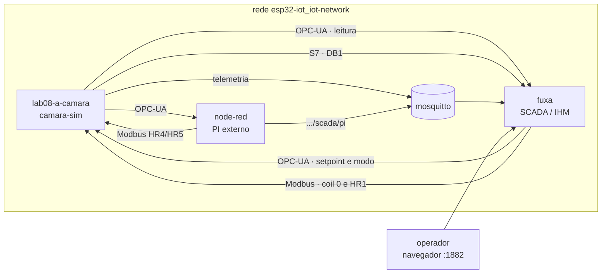
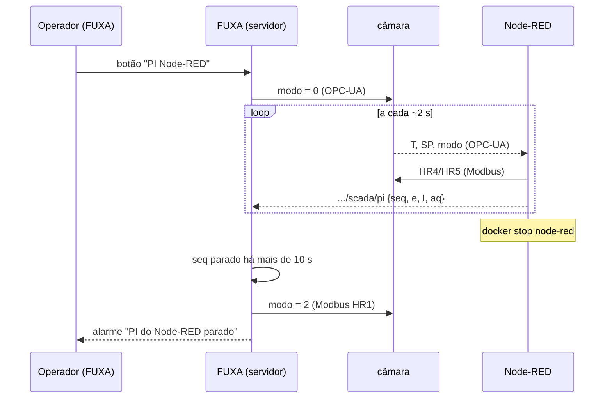

## Checklist — SCADA da câmara com FUXA {/* #checklist */}

- [ ] FUXA 1.3.4 rodando na rede do stack, com os plugins Modbus, OPC-UA e S7 instalados (T1)
- [ ] Quatro conexões com a câmara do Lab 08 (OPC-UA, Modbus TCP, S7 e MQTT), todas em verde e com as tags lendo (T2)
- [ ] Sinótico da câmara: estado em cores, valores, LEDs, barras de PWM, setpoint e botões de modo (T3)
- [ ] Alarmes de temperatura e de falha do sensor, testados e reconhecidos (T4)
- [ ] Histórico (DAQ) e tendência de T, SP e aquecedor, com exportação em CSV (T5)
- [ ] Integração FUXA + Node-RED: o operador escolhe o controlador no FUXA e um supervisor devolve a câmara ao PI interno se o Node-RED cair (T6)
- [ ] Previsões P1–P4 respondidas no `README.md`
- [ ] Nenhum `push --force`; cada tarefa num commit `Tn:`

:::info[Pontuação]
**T1…T6 = 100 pts** (esta aula não tem desafios): T1 10 · T2 20 · T3 20 · T4 15 · T5 15 ·
T6 20. O autograder normaliza para 0–10. Vale o commit `Tn:` mais recente de cada tarefa.
:::

<LabSetup />

### Configuração do ambiente de desenvolvimento {/* #setup */}

<DevTools />

---

No Lab 08, o Node-RED fez o papel de SCADA: cada leitura, cada escala e cada botão foram
**programados** em nós e funções. Funciona, mas não é assim que se supervisiona uma fábrica.
Lá, o operador olha para um **sinótico** desenhado num software de **SCADA/IHM**, onde as
conexões, as tags, os alarmes e o histórico são **configurados**, não programados.

Nesta aula, você monta o SCADA da mesma câmara climática do Lab 08 no **FUXA**, um SCADA web
de código aberto. O `lab08-a-camara` continua o mesmo, e o Node-RED também: ele segue rodando
o **PI externo** da T6 do Lab 08. O FUXA entra por cima dos dois:

- **supervisiona**, lendo a câmara pelos quatro protocolos;
- **opera**: o operador escolhe o setpoint e **qual controlador** está no comando;
- **protege**: se o Node-RED parar, um script do FUXA devolve a câmara ao PI interno e
  dispara um alarme.



## Objetivos

- Instalar e configurar um **SCADA** de mercado: drivers (plugins), conexões e tags.
- Comparar como **cada protocolo** é endereçado num SCADA: NodeId (OPC-UA), registrador
  **base 1** com divisor (Modbus), sintaxe **Step 7** com IP (S7) e chave de JSON (MQTT).
- Desenhar um **sinótico**: formas e cores ligadas ao estado, valores, barras, LEDs e
  comandos.
- Configurar **alarmes** com níveis, texto, grupo e reconhecimento.
- Registrar **histórico** (DAQ) e montar uma **tendência**.
- (Integrador) Dividir o trabalho entre SCADA e controlador e implementar um **supervisor de
  falha** do controlador externo.

## Material

- Stack Docker do curso (`mqtt5-node-red-sqlite`) e o **`lab08-a-camara`** do Lab 08 rodando
  na rede `esp32-iot_iot-network`.
- O fluxo do Lab 08 no Node-RED (T2 a T6).
- **FUXA 1.3.4** (`frangoteam/fuxa:1.3.4`), o mesmo do LAB IoT, que sobe pela pasta `fuxa/`
  do repositório.
- Acesso à internet **no primeiro uso**: os drivers do FUXA são baixados do npm.

:::info[FUXA: o que é e o que esta aula não usa]
O FUXA tem editor (`/editor`) e runtime (`/`) no mesmo servidor Node.js. As telas são SVG; as
conexões rodam no **servidor**, não no navegador. Por isso, 10 operadores com o navegador
aberto não multiplicam o tráfego com a câmara. A aula não usa usuários e permissões,
relatórios em PDF, receitas nem o Node-RED embutido no FUXA. O login fica **desligado**
porque o FUXA roda só no seu PC. No LAB IoT, o FUXA do grupo fica em `/fuxa/<grupo>/`, com
login.
:::

## Clonar o repositório do grupo {/* #clonar */}

<LabTeamMembers labName="lab09" />

## Envie o link do repositório do seu grupo no Moodle: {/* #moodle-link */}

<LabSubmit labName="lab09" />

<details>
<summary><strong>Mapa de tarefas</strong> — 6 tarefas · 100 pts</summary>

- [T1 — FUXA no stack e plugins](#t1) · 10 pts
- [T2 — Conexões e tags](#t2) · 20 pts
- [T3 — Sinótico da câmara](#t3) · 20 pts
- [T4 — Alarmes](#t4) · 15 pts
- [T5 — Histórico e tendência](#t5) · 15 pts
- [T6 — FUXA + Node-RED: quem controla e quem vigia](#t6) · 20 pts

</details>

<FileTree
  details={true}
  defaultOpen={false}
  title="Estrutura de Arquivos do Projeto"
  root="lab09-grupo-X"
  files={[
    "fuxa/docker-compose.yml r",
    "fuxa/exportar_daq.py r",
    "fuxa/projeto-lab09.json c",
    "nodered/flows-lab09.json c",
    "evidencias/t1-plugins.json c",
    "evidencias/t2-conexoes.png c",
    "evidencias/t3-sinotico.png c",
    "evidencias/t4-alarmes.json c",
    "evidencias/t4-alarmes.png c",
    "evidencias/t5-tendencia.png c",
    "evidencias/t5-daq.csv c",
    "evidencias/t6-fallback.png c",
    "evidencias/t6-log.txt c",
    ".gitignore r",
    "README.md u",
  ]}
/>

:::info[Nomes do Lab 09]
A câmara é **a do Lab 08**. Troque o `a` pela letra do seu grupo.

| O quê                           | Valor                                                     |
| ------------------------------- | --------------------------------------------------------- |
| Simulador (host na rede)        | `lab08-a-camara`                                          |
| Telemetria da câmara (MQTT)     | `elt85b/lab08/grupo-a/camara/telemetria`                  |
| Estado do PI externo (T6, novo) | `elt85b/lab09/grupo-a/scada/pi`                           |
| FUXA: editor / runtime          | `http://localhost:1882/editor` · `http://localhost:1882/` |
| Contêiner do FUXA               | `fuxa`                                                    |

O projeto do FUXA é salvo **dentro** do FUXA, em `fuxa/dados/` (fora do Git). O que vai para o
repositório é a **exportação** `fuxa/projeto-lab09.json`. No menu do projeto (ícone de
disquete), use **Rename Project** uma vez (`projeto-lab09`). Depois, **Save Project As...**
baixa `projeto-lab09.json`: mova-o para a pasta `fuxa/`. Exporte de novo ao fim de **cada**
tarefa.
:::

---

## Parte 1 — FUXA no stack {/* #parte-1 */}

### 1.1 Subir

Confira que o stack e a câmara do Lab 08 estão de pé:

```powershell title="Terminal"
docker ps --format "table {{.Names}}\t{{.Status}}"     # mosquitto, node-red, lab08-a-camara
```

Se a câmara não aparecer, suba-a pela pasta `camara-sim/` do repositório do **Lab 08**
(`docker compose -f docker-compose.yml -f docker-compose.lab.yml up -d`). Depois suba o FUXA:

<FileTree root="lab09-grupo-X" files={["fuxa/docker-compose.yml r"]} />

```yaml title="fuxa/docker-compose.yml (já está no repositório)"
services:
  fuxa:
    image: frangoteam/fuxa:1.3.4
    container_name: fuxa
    ports:
      - "1882:1881" # 1881 já é do MQTT Explorer do stack
    volumes:
      - ./dados/appdata:/usr/src/app/FUXA/server/_appdata
      - ./dados/db:/usr/src/app/FUXA/server/_db # projeto, histórico e alarmes
      - ./dados/images:/usr/src/app/FUXA/server/_images
      - ./dados/pkg:/usr/src/app/FUXA/server/_pkg # plugins (drivers)
    networks: [stack]
networks:
  stack:
    name: esp32-iot_iot-network
    external: true
```

```powershell title="Terminal (pasta fuxa)"
docker compose up -d
docker logs -f fuxa          # espere "WebServer is running"
```

Abra `http://localhost:1882/editor`. Na janela **Initial Security Setup**, deixe
_Authentication with Token_ em **Disabled** e clique **OK**.

### 1.2 Drivers como plugins

No FUXA 1.3, só o MQTT vem instalado. **Modbus, OPC-UA e S7 são plugins**, baixados do npm na
primeira vez. Na engrenagem (**Setup**) ▸ **Plugins**, instale:

| Plugin          | Versão  | Protocolo                             |
| --------------- | ------- | ------------------------------------- |
| `modbus-serial` | 8.0.19  | Modbus TCP e RTU                      |
| `node-opcua`    | 2.149.0 | OPC-UA (o maior: leva cerca de 1 min) |
| `node-snap7`    | 1.0.9   | Siemens S7 (biblioteca nativa)        |

:::warning[Sem o volume `_pkg`, os drivers somem]
Os plugins são instalados em `server/_pkg`, **dentro** do contêiner. Sem o volume
`./dados/pkg`, um `docker compose down` + `up` apaga os drivers, e as conexões ficam em erro
até você reinstalar. O compose do repositório já monta esse volume.
:::

**Evidência:** a lista de plugins pela API do FUXA.

```powershell title="Terminal (raiz do repositório)"
curl.exe -s http://localhost:1882/api/plugins -o evidencias/t1-plugins.json
```

Em `evidencias/t1-plugins.json`, os três plugins têm `"current"` preenchido e `"pkg": true`.

<FileTree root="lab09-grupo-X" files={["evidencias/t1-plugins.json c"]} />

<CommitPoint
  id="t1"
  task="FUXA no stack e plugins"
  pontos={10}
  files="evidencias/t1-plugins.json"
/>

---

## Parte 2 — Conexões e tags {/* #parte-2 */}

No FUXA, uma **conexão** (_Connection_) é um equipamento, e uma **tag** é uma variável dele.
Telas, alarmes, histórico e scripts só enxergam **tags**. Em **Setup ▸ Connections**, o botão
**＋** cria uma conexão. O ícone de corrente 🔗 de cada conexão abre a lista de tags, onde o
**＋** cria uma tag. A coluna _Value_ mostra o valor ao vivo: use-a para conferir cada tag.

Crie as quatro conexões, todas com _Polling_ **1 sec**:

| Name            | Type         | Endereço                                    | Outros campos                                  |
| --------------- | ------------ | ------------------------------------------- | ---------------------------------------------- |
| `Camara OPC-UA` | `OPCUA`      | `opc.tcp://lab08-a-camara:4840/`            | _Without Security_                             |
| `Camara Modbus` | `ModbusTCP`  | _Slave IP and Port_ `lab08-a-camara:502`    | _Connection options_ `TcpPort`, _Slave ID_ `1` |
| `Camara S7`     | `SiemensS7`  | _IP-Address_ = **IP** do simulador (abaixo) | _Rack_ `0`, _Slot_ `1`                         |
| `Broker MQTT`   | `MQTTclient` | `mqtt://mosquitto:1883`                     | _Without Security_                             |

### 2.1 OPC-UA: o servidor diz o que tem

Na lista de tags da `Camara OPC-UA`, o **＋** abre o **navegador** do servidor. Expanda
`Objects ▸ Camara` e marque:

| Pasta       | Variáveis (o tipo vem do servidor)                                                        |
| ----------- | ----------------------------------------------------------------------------------------- |
| `Medicoes`  | `temp`, `umid`, `sp_efetivo`                                                              |
| `Atuadores` | `aquecedor_pwm`, `ventilador_pwm`                                                         |
| `Estado`    | `estado`, `estado_txt`, `alarme`, `led_verde`, `led_amarelo`, `led_vermelho`, `heartbeat` |
| `Comandos`  | `habilitado`, `modo`, `setpoint`                                                          |
| `Simulacao` | `falha_dht`                                                                               |

Cada tag fica com o **NodeId** como endereço (`ns=2;s=Camara.temp`) e o tipo do nó
(`Double`, `Int32`, `Boolean`, `String`). É o caminho mais simples: nada de mapa de
registradores.

:::warning[O FUXA não avisa quando a escrita OPC-UA falha]
O servidor recusa uma escrita com tipo errado (`BadTypeMismatch`, Lab 08), mas o FUXA 1.3.4
**não** mostra esse erro: o valor simplesmente não muda. Mantenha o tipo que o navegador
trouxe.
:::

### 2.2 Modbus TCP: endereço base 1 e divisor

Na `Camara Modbus`, crie as tags à mão. No FUXA, o campo **Address offset vai de 1 a 65536**.
Então o **registrador 0** do mapa da câmara é o endereço **1** no FUXA, o IR12 é o **13**, e
assim por diante. O **Divisor** faz a escala na leitura (÷) e na escrita (×).

| Tagname              | Register          | Address offset | Type      | Divisor |
| -------------------- | ----------------- | -------------- | --------- | ------- |
| `IR0 temp x10`       | Input Registers   | **1**          | `Int16`   | `10`    |
| `IR12 temp float`    | Input Registers   | **13**         | `Float32` |         |
| `IR8 leds`           | Input Registers   | **9**          | `UInt16`  |         |
| `C0 habilitado`      | Coil Status       | **1**          | `Bool`    |         |
| `HR1 modo`           | Holding Registers | **2**          | `UInt16`  |         |
| `HR3 setpoint`       | Holding Registers | **4**          | `Int16`   | `10`    |
| `HR4 aquecedor_cmd`  | Holding Registers | **5**          | `UInt16`  |         |
| `HR5 ventilador_cmd` | Holding Registers | **6**          | `UInt16`  |         |

`IR0 temp x10` e `IR12 temp float` devem mostrar **a mesma temperatura**. Se não mostrarem,
o endereço está deslocado de um.

### 2.3 S7: IP, não nome

O driver S7 do FUXA (snap7) **não resolve nomes de host**: com `lab08-a-camara` no campo de
IP, a conexão fica vermelha, e o log do FUXA mostra `TCP : Invalid address`. Descubra o IP
pelo próprio DNS do Docker, de dentro do contêiner do FUXA:

<GroupCommands
  commands={[
    {
      title: "1. Verificar resolução de nome no FUXA",
      codeTitle: "Terminal",
      language: "powershell",
      command: `docker exec fuxa getent hosts lab08-{group}-camara`,
    },
    {
      title: "2. Saída esperada",
      codeTitle: "Saída (exemplo)",
      language: "text",
      command: `172.18.0.5      lab08-{group}-camara`,
    },
  ]}
/>

As tags usam a sintaxe do **Step 7**, não a do nodes7 do Lab 08:

| Tagname                 | Type   | Address      | No Lab 08 (nodes7) |
| ----------------------- | ------ | ------------ | ------------------ |
| `DB1.DBD20 temp`        | `Real` | `DB1.DBD20`  | `DB1,REAL20`       |
| `DB1.DBD4 setpoint`     | `Real` | `DB1.DBD4`   | `DB1,REAL4`        |
| `DB1.DBW2 modo`         | `Int`  | `DB1.DBW2`   | `DB1,INT2`         |
| `DB1.DBX0.0 habilitado` | `Bool` | `DB1.DBX0.0` | `DB1,X0.0`         |
| `DB1.DBD48 heartbeat`   | `DInt` | `DB1.DBD48`  | `DB1,DINT48`       |

No Step 7, a letra depois de `DB` é o **tamanho** (`X` bit, `B` byte, `W` palavra de 2 bytes,
`D` dupla de 4 bytes), e o **tipo** vem do campo _Type_. Um `REAL` e um `DINT` são ambos `DBD`.

:::warning[O IP pode mudar]
O Docker distribui os IPs da rede na ordem em que os contêineres sobem. Se você recriar o
`lab08-a-camara`, confira o IP de novo. Numa fábrica, o CLP tem **IP fixo** justamente por
isso.
:::

### 2.4 MQTT: uma chave do JSON

Na `Broker MQTT`, o **＋** abre o assinante de tópicos. Em _Topic path_ coloque
`elt85b/lab08/grupo-a/camara/telemetria`, escolha **json**, clique _Subscribe_ e marque as
chaves `temp` (nome `telemetria temp`) e `heartbeat` (nome `telemetria heartbeat`). Cada
chave vira uma tag com o tópico como endereço e a chave como subendereço.

**Evidências:**

- `evidencias/t2-conexoes.png`: a tela **Setup ▸ Connections** com as quatro conexões em
  **verde**;
- `fuxa/projeto-lab09.json`: o projeto exportado (**Save Project As...**).

:::tip[Preveja antes de rodar]
**P1:** um colega configurou `IR12 temp float` com _Address offset_ **12**, em vez de 13. Quais
registradores da câmara o FUXA lê nesse caso? Olhe o mapa do Lab 08: o que é o IR11? Que
tipo de número aparece: próximo de 38 °C, enorme ou minúsculo? E se ele tivesse escolhido
`Float32MLE` (ordem de palavras trocada) com o endereço certo? Teste os dois e anote.
:::

<FileTree
  root="lab09-grupo-X"
  files={["fuxa/projeto-lab09.json c", "evidencias/t2-conexoes.png c"]}
/>

<CommitPoint
  id="t2"
  task="Conexoes e tags"
  pontos={20}
  files="fuxa/projeto-lab09.json evidencias/t2-conexoes.png"
/>

---

## Parte 3 — Sinótico da câmara {/* #parte-3 */}

Um sinótico mostra **o processo**, não uma lista de números. O operador precisa entender o
estado da câmara num relance e agir sem procurar.

### 3.1 Como um widget se liga a uma tag

No editor, crie a tela **Camara** (painel _Views_ ▸ **＋**, 1100 × 720). Desenhe com as
ferramentas de _General_ e _Controls_. Com o objeto selecionado, o botão **Property** (ou um
duplo clique) abre a ligação:

- **Tag**: a variável que o widget mostra ou que dirige a animação;
- **Ranges**: faixas de valor → cor (formas, LEDs, botões) ou unidade e casas (valores);
- **Events**: o que acontece no clique (_Click ▸ Set Value_, _Toggle Value_, abrir tela...).

### 3.2 O que a tela precisa ter

| Elemento                               | Ferramenta            | Tag                                                                            | Configuração                                                                      |
| -------------------------------------- | --------------------- | ------------------------------------------------------------------------------ | --------------------------------------------------------------------------------- |
| Corpo da câmara                        | retângulo (_General_) | `estado`                                                                       | Ranges: 0 cinza · 1 laranja · 2 azul · 3 verde · 4 vermelho                       |
| Resistência                            | retângulo             | `aquecedor_pwm`                                                                | 0 cinza · 0,5–100 vermelho                                                        |
| Ventilador                             | círculo               | `ventilador_pwm`                                                               | 0–20,5 cinza (circulação) · 20,6–100 azul                                         |
| T, UR, estado                          | _Value_ (`##`)        | `temp`, `umid`, `estado_txt`                                                   | unidade `°C` / `%`, 1 casa                                                        |
| LEDs                                   | _Semaphore_           | `led_verde`, `led_amarelo`, `led_vermelho`                                     | 0 cinza · 1 cor do LED                                                            |
| Barras de PWM                          | _Progress_ (vertical) | `aquecedor_pwm`, `ventilador_pwm`                                              | 0 a 100                                                                           |
| Setpoint                               | _Input_               | `setpoint` (OPC-UA)                                                            | numérico, mín. 20, máx. 55; escreve no Enter                                      |
| Botões ON/OFF, PI interno, PI Node-RED | _Button_              | `modo` (OPC-UA)                                                                | evento _Click ▸ Set Value_ `1`, `2`, `0`; Ranges: o botão do modo atual fica azul |
| Liga / Desliga                         | _Button_              | escreve `C0 habilitado` (Modbus), cor por `habilitado` (OPC-UA)                | _Set Value_ `1` / `0`                                                             |
| Falha do DHT22                         | _Button_              | `falha_dht`                                                                    | _Toggle Value_ (só existe no simulador)                                           |
| Temperatura por protocolo              | 5 × _Value_           | `temp`, `IR0 temp x10`, `IR12 temp float`, `DB1.DBD20 temp`, `telemetria temp` | a ponte com o Lab 08                                                              |

:::warning[Botões que "ficam acesos"]
Quando o valor sai de **todas** as faixas de um botão, o FUXA **não** volta à cor original.
Ele mantém a última cor aplicada. Por isso, cada botão de modo precisa de uma faixa para
**cada** valor possível: `0`, `1` e `2` (a do próprio modo azul, as outras brancas).
:::

O botão **Liga** escreve pelo **Modbus**, mas a cor vem do **OPC-UA**. Não há problema: é a
mesma câmara, vista por portas diferentes (Lab 08). Em **Setup ▸ Layout**, defina a tela
inicial (_Start_ `Camara`), o menu lateral com `Câmara` e (na T5) `Tendência`, e o cabeçalho
com os **alarmes** em _Push_ (o sino com o contador).

Abra o runtime (`http://localhost:1882/`) e teste: mude o setpoint, troque o modo, desligue e
ligue. O corpo da câmara muda de cor com o estado, e os botões acompanham o modo, mesmo que
outro programa (o dashboard do Lab 08, por exemplo) o mude.

**Evidência:** `evidencias/t3-sinotico.png` com a câmara **aquecendo** (laranja) e o projeto
exportado de novo.

<FileTree
  root="lab09-grupo-X"
  files={["fuxa/projeto-lab09.json u", "evidencias/t3-sinotico.png c"]}
/>

<CommitPoint
  id="t3"
  task="Sinotico da camara"
  pontos={20}
  files="fuxa/projeto-lab09.json evidencias/t3-sinotico.png"
/>

---

## Parte 4 — Alarmes {/* #parte-4 */}

Um alarme é uma **condição anormal que exige ação do operador**: tem prioridade, texto,
grupo, instante de entrada e saída e **reconhecimento** (_ack_). Em **Setup ▸ Alarms ▸ ＋**,
escolha a tag e preencha os níveis (_High High_, _High_, _Low_, _Info_), cada um com faixa
**min–max**, texto, grupo, cores e modo de reconhecimento.

| Alarme         | Tag      | Nível     | Faixa  | Texto                                      | Ack                           |
| -------------- | -------- | --------- | ------ | ------------------------------------------ | ----------------------------- |
| `Temperatura`  | `temp`   | High High | 55–200 | Temperatura MUITO alta (>= 55 °C)          | _Ack by active Alarm allowed_ |
|                |          | High      | 45–55  | Temperatura alta (>= 45 °C)                | _Floating_                    |
| `Sensor DHT22` | `alarme` | High High | 2–3    | Falha do sensor DHT22                      | _Ack by active Alarm allowed_ |
|                |          | Info      | 1–1    | Sobretemperatura (proteção do equipamento) | _Floating_                    |

- O `alarme` da câmara é um **campo de bits** (Lab 08): bit 0 = sobretemperatura, bit 1 =
  sensor. Valor 2 ou 3 significa "sensor com falha".
- **Time in Min-Max range (seconds)** é o tempo que o valor precisa **ficar** na faixa para o
  alarme entrar (use 1 s). O FUXA 1.3.4 não tem atraso para **sair** do alarme. _Check
  interval_ é de quanto em quanto tempo a condição é verificada (1 s).
- **Ack mode**: _Floating_ some sozinho quando a condição acaba; _Ack by active Alarm allowed_
  continua na lista até o operador reconhecer.

**Teste:**

1. Modo **ON/OFF** e setpoint **50 °C**: quando T passa de 45 °C, entra "Temperatura alta".
2. Clique **Falha do DHT22**: a câmara vai para ALARME (vermelho, ventilador a 100 %), e
   entra "Falha do sensor". Clique de novo para tirar a falha.
3. No sino do cabeçalho, abra a lista e **reconheça** (✔) os alarmes.

**Evidências:** a lista de alarmes aberta em `evidencias/t4-alarmes.png` e o histórico pela
API:

```powershell title="Terminal"
curl.exe -s http://localhost:1882/api/alarmsHistory -o evidencias/t4-alarmes.json
```

:::tip[Preveja antes de rodar]
**P2:** com o setpoint em 45 °C e o PI interno, a temperatura oscila ±0,1 °C em torno de
45 °C. O que acontece com o alarme "Temperatura alta" (_Floating_, 1 s na faixa)? Ele entra
e sai quantas vezes por minuto? Aumentar o tempo na faixa para 10 s resolve a **entrada**, e a
**saída**? Por que normas de alarme (ISA-18.2) pedem uma **banda morta** no limite? Como você
a faria no FUXA, que só tem faixas min–max?
:::

<FileTree
  root="lab09-grupo-X"
  files={[
    "fuxa/projeto-lab09.json u",
    "evidencias/t4-alarmes.json c",
    "evidencias/t4-alarmes.png c",
  ]}
/>

<CommitPoint
  id="t4"
  task="Alarmes"
  pontos={15}
  files="fuxa/projeto-lab09.json evidencias/t4-alarmes.json evidencias/t4-alarmes.png"
/>

---

## Parte 5 — Histórico e tendência {/* #parte-5 */}

### 5.1 DAQ: o que gravar e quando

O FUXA tem um **historiador** próprio (o DAQ, em SQLite dentro de `fuxa/dados/db`). Na lista
de tags, o menu **⋮ ▸ Tag options** de cada tag tem:

- **Registration Enabled**: grava a tag;
- **Save if changed**: grava quando o valor muda (verificado a cada _polling_);
- **Save value interval (sec.)**: grava também a cada N s, mesmo parado (use 60).

Ligue o registro em `temp`, `umid`, `sp_efetivo`, `aquecedor_pwm`, `ventilador_pwm` e `modo`.

### 5.2 Tendência

1. **Setup ▸ Line charts ▸ ＋**: gráfico `Camara` com as linhas `temp` (vermelho, eixo Y1),
   `sp_efetivo` (laranja, Y1) e `aquecedor_pwm` (cinza, **Y2**, em %).
2. Crie a tela **Tendencia** e coloque um _Chart_ ocupando a tela. Em _Property_: _Chart to
   show_ `Camara`, _Show mode_ **Realtime**, _Max minutes_ **15** e **Load history** ligado
   (busca o histórico do DAQ ao abrir a tela).
3. Acrescente `Tendência` ao menu (**Setup ▸ Layout**).

Faça um degrau (por exemplo, 35 → 40 °C no PI interno) e veja a resposta na tendência.

### 5.3 Exportar o histórico

O `fuxa/exportar_daq.py` (só biblioteca padrão) consulta a API do DAQ, encontra as tags pelo
**nome** e gera um CSV com uma coluna por tag:

<FileTree root="lab09-grupo-X" files={["fuxa/exportar_daq.py r"]} />

```powershell title="Terminal (raiz do repositório)"
py fuxa/exportar_daq.py --listar                                  # conexões, tags e quais têm DAQ
py fuxa/exportar_daq.py --min 15 --tags temp,sp_efetivo,aquecedor_pwm,modo -o evidencias/t5-daq.csv
```

```text title="evidencias/t5-daq.csv (início)"
instante,temp,sp_efetivo,aquecedor_pwm,modo
2026-10-08 14:24:27,39.8,50,100,1
2026-10-08 14:24:28,40.1,50,100,1
```

Como o DAQ grava **quando muda**, uma tag parada (o setpoint) pode não ter amostras na
janela. O script busca também as 24 h anteriores e repete o último valor conhecido em cada
linha.

**Evidências:** `evidencias/t5-tendencia.png` (com um degrau visível) e
`evidencias/t5-daq.csv`.

:::tip[Preveja antes de rodar]
**P3:** na tendência, quando você muda o setpoint de 35 para 50 °C, a linha do SP aparece como
uma **rampa** inclinada, e não como um degrau. Por quê? (Dica: quando o DAQ gravou o SP, e
como o gráfico liga dois pontos?) Com _Save if changed_ e _polling_ de 1 s, quantas linhas por
hora a `temp` gera com ruído de ±0,1 °C? E o `setpoint`? Que opção de **Deadband** (_Tag
options_) reduziria a `temp` sem perder informação útil?
:::

<FileTree
  root="lab09-grupo-X"
  files={[
    "fuxa/projeto-lab09.json u",
    "evidencias/t5-tendencia.png c",
    "evidencias/t5-daq.csv c",
  ]}
/>

<CommitPoint
  id="t5"
  task="Historico e tendencia"
  pontos={15}
  files="fuxa/projeto-lab09.json evidencias/t5-tendencia.png evidencias/t5-daq.csv"
/>

---

## Projeto integrador — FUXA + Node-RED: quem controla e quem vigia {/* #integrador */}

No Lab 08, o PI externo do Node-RED era ligado por um switch no dashboard do próprio
Node-RED. E a P4 mostrou o problema: se o Node-RED cai com o aquecedor ligado, **ninguém**
desliga.

Agora as responsabilidades se separam:

| Quem     | Faz                                                                                                                 |
| -------- | ------------------------------------------------------------------------------------------------------------------- |
| Câmara   | executa: obedece ao **modo** (0 MANUAL, 1 ON/OFF, 2 PI interno)                                                     |
| Node-RED | **controla**: roda o PI sempre que a câmara está em modo 0 e publica o seu estado                                   |
| FUXA     | **opera e vigia**: o operador escolhe o modo; um script devolve a câmara ao modo 2 se o Node-RED parar de responder |



### Requisitos

1.  **Node-RED** (importe o fluxo do Lab 08 e chame a aba de **Lab 09**)
    - O PI passa a obedecer **ao modo**, venha de onde vier: troque a primeira linha útil da
      function "PI".

      ```js title="function: PI — início (o resto é igual ao Lab 08)"
      // Lab 09: atua sempre que a câmara está em modo 0 (MANUAL), não importa quem escolheu
      // o modo (FUXA, dashboard do Node-RED, Modbus, S7...). Fora do modo 0 fica parado.
      const p = msg.payload;
      if (p.modo !== 0) {
        context.set("I", 0);
        context.set("t0", null);
        node.status({
          fill: "grey",
          shape: "ring",
          text: `parado (modo ${p.modo})`,
        });
        return [null, null];
      }
      ```

    - A **2ª saída** do PI (diagnóstico) também vai para uma function e um **mqtt out**
      `elt85b/lab09/grupo-a/scada/pi`:

      ```js title="function: estado do PI -> SCADA"
      // Estado do PI -> FUXA. O 'seq' é o sinal de vida que o supervisor do FUXA vigia.
      const seq = (context.get("seq") || 0) + 1;
      context.set("seq", seq);
      const p = msg.payload;
      msg.payload = {
        seq,
        e: Number(p.e.toFixed(3)),
        I: Number(p.I.toFixed(2)),
        aq: p.aq,
        ve: p.ve,
        ts: Date.now(),
      };
      return msg;
      ```

2.  **FUXA: tags novas**
    - Na `Broker MQTT`: tópico `elt85b/lab09/grupo-a/scada/pi`, **json**, chaves `seq` (nome
      `pi seq`), `e` (`pi erro`), `I` (`pi integral`) e `aq` (`pi aquecedor`).
    - Na conexão **FUXA Server** (o bloco azul no topo de _Connections_), tags do tipo
      `number`: `pi_externo_ok` (valor inicial 1), `pi_externo_idade_s` e `fallbacks`
      (iniciais 0). Ligue o DAQ em `pi_externo_ok`.

3.  **FUXA: supervisor.** Em **Setup ▸ Scripts ▸ ＋**: nome `supervisor_pi_externo`,
    _Execute mode_ **Server (Execute in server)** e, em _Script scheduling_, **Loop with
    interval** de **2 s**:

    ```js title="script: supervisor_pi_externo"
    // Supervisor do PI externo: roda no SERVIDOR do FUXA a cada 2 s.
    // Se a câmara está em MANUAL (modo 0) e o Node-RED parou de publicar .../scada/pi
    // (o seq não muda há mais de 10 s), volta ao PI interno (modo 2) e sinaliza o alarme.
    const LIMITE_S = 10;
    // tags pelo NOME (conexão, tag): não depende dos ids que o editor sorteia
    const tag = (conexao, nome) => $getTagId(nome, conexao);
    const MODO = tag("Camara OPC-UA", "modo"); // leitura do modo
    const MODO_MB = tag("Camara Modbus", "HR1 modo"); // escrita do fallback (Modbus HR1)
    const SEQ = tag("Broker MQTT", "pi seq"); // sinal de vida do Node-RED
    // tags do "FUXA Server": o $getTagId não as encontra, use o id (botão de tags do editor)
    const OK = "t_xxxxxxxx-xxxxx"; // pi_externo_ok
    const IDADE = "t_xxxxxxxx-xxxxx"; // pi_externo_idade_s
    const FALLBACKS = "t_xxxxxxxx-xxxxx"; // fallbacks

    const modo = Number($getTag(MODO));
    const seq = $getTag(SEQ);
    const agora = Date.now();
    const wd =
      globalThis.wd ||
      (globalThis.wd = { seq: seq, desde: agora, modo: modo, disparou: false });
    // recomeça a contar quando chega seq novo OU quando o operador acabou de escolher o modo 0
    if (seq !== wd.seq || (modo === 0 && wd.modo !== 0)) {
      wd.seq = seq;
      wd.desde = agora;
      wd.disparou = false;
    }
    wd.modo = modo;
    const idade = Math.round((agora - wd.desde) / 1000);
    $setTag(IDADE, idade);
    if (modo === 0 && idade > LIMITE_S && !wd.disparou) {
      wd.disparou = true; // uma vez só (a leitura do modo demora um ciclo)
      $setTag(MODO_MB, 2); // fallback: PI interno
      $setTag(OK, 0);
      $setTag(FALLBACKS, Number($getTag(FALLBACKS) || 0) + 1);
      console.log(
        "supervisor: PI externo sem resposta ha " + idade + " s -> modo 2",
      );
    } else if (modo === 0 && idade <= LIMITE_S) {
      $setTag(OK, 1); // em modo 0 e o Node-RED respondendo
    }
    ```

    Troque os três `t_xxxxxxxx-xxxxx` pelos ids das suas tags do FUXA Server: no editor de
    scripts, o seletor de tags insere o id. Os nomes **das conexões e das tags** usados no
    `$getTagId` têm de ser **exatamente** os da T2.

4.  **FUXA: alarme e tela**
    - Alarme `Controlador externo`, tag `pi_externo_ok`, **High High** na faixa **0–0**,
      texto "PI do Node-RED parado: supervisor voltou ao PI interno", grupo `Supervisao`,
      _Ack by active Alarm allowed_.
    - Painel "Supervisão do PI externo" no sinótico: LED `pi_externo_ok`, valores
      `pi_externo_idade_s`, `pi erro`, `pi integral`, `pi aquecedor` e `fallbacks`.

5.  **Experimento** (setpoint 40 °C)
    1. No FUXA, clique **PI Node-RED**: o painel de supervisão mostra o erro e a integral
       mudando, e a idade fica em 0–2 s.
    2. Pare o controlador: `docker stop node-red`. Cronometre: em cerca de 10 a 14 s, a câmara
       volta ao **PI interno** (o botão "PI interno" acende) e entra o alarme.
    3. `docker start node-red`, espere o Node-RED subir e clique **PI Node-RED** de novo.

6.  **Evidências**
    - `evidencias/t6-fallback.png`: o sinótico depois do fallback, com o alarme aparecendo.
    - `evidencias/t6-log.txt`: as escritas de modo vistas pela câmara:

      <GroupCommands
        language="powershell"
        commands={[
          {
            title: "Filtrar logs e salvar evidência",
            codeTitle: "Terminal",
            command: `docker logs lab08-{group}-camara 2>&1 | Select-String "modo =" | Out-File -Encoding utf8 evidencias/t6-log.txt`,
          },
        ]}
      />

           ```text title="evidencias/t6-log.txt (exemplo)"
           [14:25:49] [cmd] opcua: modo = 0
           [14:26:32] [cmd] modbus: modo = 2
           [14:26:57] [cmd] opcua: modo = 0
           ```

           `opcua: modo = 0` é o operador (botão do FUXA), `modbus: modo = 2` é o **supervisor**.

    - `nodered/flows-lab09.json` (fluxo exportado) e `fuxa/projeto-lab09.json` (de novo).

:::tip[Preveja antes de rodar]
**P4:** agora há **dois** programas que escrevem o modo: o FUXA (operador e supervisor) e o
Node-RED (switch do dashboard do Lab 08). O que acontece se o operador clicar **ON/OFF** no
FUXA enquanto o PI externo está agindo? E se o **FUXA** cair enquanto a câmara está em modo
0 e, depois, o Node-RED também cair? Com base na P4 do Lab 08: o supervisor no FUXA
substitui um _watchdog_ dentro do equipamento? Onde cada proteção deve ficar?
:::

<FileTree
  root="lab09-grupo-X"
  files={[
    "nodered/flows-lab09.json c",
    "fuxa/projeto-lab09.json u",
    "evidencias/t6-fallback.png c",
    "evidencias/t6-log.txt c",
  ]}
/>

<CommitPoint
  id="t6"
  task="FUXA + Node-RED: quem controla e quem vigia"
  pontos={20}
  files="nodered/flows-lab09.json fuxa/projeto-lab09.json evidencias/t6-fallback.png evidencias/t6-log.txt"
/>

---

<LabLogout />
