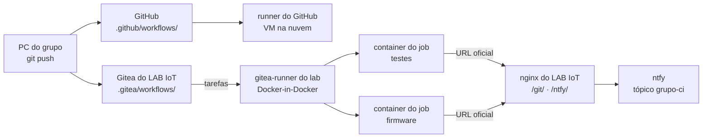

## Checklist — o CI/CD do firmware no runner do LAB IoT {/* #checklist */}

- [ ] Repositório do grupo também no Gitea do LAB IoT, com um `git push` enviando para os dois, e o `ci.yml` do Lab 10 rodando no runner do laboratório (T1)
- [ ] `diagnostico.yml` rodado no runner do lab **e** no do GitHub, com a tabela "o que o job enxerga" no `README.md` (T2)
- [ ] `.gitea/workflows/ci.yml`: o pipeline portado, verde no Gitea (T3)
- [ ] Tempos de fila e de cada job medidos com `ci/duracoes.py`: cache frio, cache quente e a turma toda junta (T4)
- [ ] Release `v1.1.0` no Gitea com o firmware, e o experimento do `permissions:` (403) registrado (T5)
- [ ] `main` protegido no Gitea: um PR com teste vermelho bloqueado, a notificação no ntfy e o merge depois da correção (T6)
- [ ] Previsões P1–P4 respondidas no `README.md`
- [ ] Nenhum `push --force`; cada tarefa num commit `Tn:`

:::info[Pontuação]
**T1…T6 = 100 pts** (esta aula não tem desafios): T1 10 · T2 15 · T3 20 · T4 15 · T5 20 ·
T6 20. O autograder normaliza para 0–10. Vale o commit `Tn:` mais recente de cada tarefa **no
GitHub**.
:::

<LabSetup />

### Configuração do ambiente de desenvolvimento {/* #setup */}

<DevTools />

---

No Lab 10, cada `push` acordava uma máquina virtual **do GitHub**, na nuvem, que testava,
compilava, simulava e publicava o firmware. Funciona, mas tem custo e limites. Os minutos de
um repositório privado são contados. A máquina não enxerga nada do laboratório. E o código, os
tokens e o firmware passam por um serviço de terceiros.

Nesta aula, o **mesmo pipeline** roda no **LAB IoT**, num servidor da turma:

1. o Gitea do LAB IoT tem o **Gitea Actions**, que lê workflows no mesmo formato do GitHub
   Actions;
2. quem executa os jobs é o **runner do laboratório**, um `gitea-runner` num container, com o
   seu próprio Docker (Docker-in-Docker): cada job ganha um container novo e descartável;
3. os secrets do ntfy e do Wokwi já estão na **organização** do grupo no Gitea, e a
   notificação chega pelo ntfy do LAB IoT;
4. o `main` do Gitea fica **protegido**: código com teste vermelho não entra.



## Objetivos

- Entender o papel do **runner**: quem pede trabalho, como o job escolhe a máquina
  (`runs-on` e rótulos) e onde o job roda de fato.
- Ver, por experimento, o **isolamento** de um job: rede, Docker, privilégios, secrets.
- **Portar** um workflow do GitHub Actions para o Gitea Actions e saber o que muda.
- Medir **fila** e **cache** num runner compartilhado pela turma.
- Fazer **CD** pela API do Gitea com o token do job e o **mínimo** de permissão.
- Usar o CI como **portão**: proteção de ramo com verificações obrigatórias.

## Material

- O mesmo do Lab 10: VS Code + PlatformIO + extensão Wokwi, e o `git` no terminal.
- O acesso do grupo ao **LAB IoT** (está na página de acesso do repositório do grupo no GitHub):
  usuário `lab11-x`, a senha do grupo e a organização `lab11-grupo-x` no Gitea (`<base>/git/`).
- O app **ntfy** no celular, com o servidor do LAB IoT e o login do grupo (como no Lab 10).
- Rede do laboratório (ou o endereço público do LAB IoT, se o professor ligou o túnel).

:::info[GitHub Actions × Gitea Actions]
| | GitHub Actions (Lab 10) | Gitea Actions (Lab 11) |
| --- | --- | --- |
| Pasta dos workflows | `.github/workflows/` | `.gitea/workflows/` (se não existir, `.github/workflows/`) |
| Quem executa | VM do GitHub, uma por job | o runner do lab: um container por job |
| `runs-on: ubuntu-latest` | imagem do GitHub | rótulo do runner → `runner-images:ubuntu-latest` |
| `uses: actions/checkout@v4` | github.com | também github.com (`DEFAULT_ACTIONS_URL=github`) |
| Secrets e variables | do repositório (que você criou) | da **organização** (o professor criou) e/ou do repositório |
| Token do job | `GITHUB_TOKEN` | `GITEA_TOKEN` (o `GITHUB_TOKEN` também existe, é o mesmo) |
| Release | `softprops/action-gh-release` | API do Gitea (`ci/release_gitea.py`) |
| Vagas | muitas (cota de minutos) | `capacity` do runner (2 jobs ao mesmo tempo, para a turma) |
:::

## Clonar o repositório do grupo {/* #clonar */}

<LabTeamMembers labName="lab11" />

## Envie o link do repositório do seu grupo no Moodle: {/* #moodle-link */}

<LabSubmit labName="lab11" />

<details>
<summary><strong>Mapa de tarefas</strong> — 6 tarefas · 100 pts</summary>

- [T1 — O repositório no Gitea e o runner do lab](#t1) · 10 pts
- [T2 — O que o job enxerga](#t2) · 15 pts
- [T3 — O pipeline portado para o Gitea](#t3) · 20 pts
- [T4 — Fila e cache](#t4) · 15 pts
- [T5 — Release no Gitea com o token do job](#t5) · 20 pts
- [T6 — CI como portão (proteção do main) e ntfy](#t6) · 20 pts

</details>

O repositório nasce do `lab11-template`, com o **Lab 10 resolvido** (firmware, testes, cenário
e o `.github/workflows/ci.yml` completo) e quatro arquivos novos em `ci/`:

<FileTree
  root="lab11-grupo-X"
  files={[
    ".github/workflows/ci.yml r",
    ".github/workflows/diagnostico.yml c",
    ".gitea/workflows/diagnostico.yml c",
    ".gitea/workflows/ci.yml c",
    "ci/diagnostico.yml r",
    "ci/release_gitea.py r",
    "ci/duracoes.py r",
    "ci/notificar.sh r",
    "ci/cenario_integracao.yaml r",
    "ci/verificar_pwm.py r",
    "ci/resumo_junit.py r",
    "lib/camara_logica/camara_logica.cpp r",
    "src/main.cpp r",
    "test/test_logica/test_logica.cpp r",
    "platformio.ini r",
    "evidencias/t1-remotos.txt c",
    "evidencias/t1-log-runner.txt c",
    "evidencias/t1-gitea-actions.png c",
    "evidencias/t2-diagnostico-gitea.txt c",
    "evidencias/t2-diagnostico-github.txt c",
    "evidencias/t3-gitea-actions.png c",
    "evidencias/t4-duracoes.md c",
    "evidencias/t5-403.txt c",
    "evidencias/t5-release.png c",
    "evidencias/t6-pr-bloqueado.png c",
    "evidencias/t6-ntfy.png c",
    "README.md u",
  ]}
/>

---

## Parte 1 — O runner do laboratório {/* #parte-1 */}

### 1.1 Quem faz o trabalho

O Gitea **não executa** nada. Ele guarda o código, lê o workflow a cada `push` e cria uma
**fila de jobs**. Quem executa é o **runner**, um programa que fica perguntando ao Gitea "tem
trabalho para mim?" (a cada 2 s). Ao pegar um job, o runner:

1. recebe o workflow do job, o contexto (`github.*`), os secrets e as variables;
2. cria um **container** com a imagem do rótulo (`ubuntu-latest` →
   `docker.gitea.com/runner-images:ubuntu-latest`);
3. roda os steps dentro dele, manda o log ao Gitea em tempo real e, no fim, o resultado;
4. **apaga** o container. O job seguinte começa limpo.

O runner do LAB IoT é **um** para a turma toda, com `capacity: 2`: dois jobs ao mesmo tempo.
Ele foi registrado no Gitea com um token que só o professor tem e roda num container com o
**seu próprio Docker** (Docker-in-Docker). Os containers dos jobs nascem nesse Docker interno,
e não no Docker do servidor, onde estão o Gitea, o Mosquitto e os Node-RED.

```yaml title="runner/config.yaml (gerado pelo gen_iot_scada_portal.py, trecho)"
runner:
  capacity: 2 # jobs ao mesmo tempo (todos os grupos)
  timeout: 1h # um job que passa disso é cancelado
  labels: # runs-on: ubuntu-latest  ->  esta imagem
    - "ubuntu-latest:docker://docker.gitea.com/runner-images:ubuntu-latest"
cache:
  enabled: true # actions/cache (ex.: ~/.platformio) sem sair do lab
container:
  privileged: false # os jobs NÃO são privilegiados (o runner é)
  options: "--memory=3g --cpus=2"
  valid_volumes: [] # nenhum job monta pasta do servidor
```

O rótulo tem duas partes. O **nome** (`ubuntu-latest`) é o que o Gitea compara com o `runs-on:`
do job. O resto (`docker://...`) só o runner usa: é a imagem do container. Em
`<base>/git/-/admin/actions/runners`, o professor vê o runner, o estado (**Idle** ou
**Active**) e os rótulos.

### 1.2 O repositório no Gitea {/* #t1 */}

1. Entre no Gitea (`<base>/git/`) com o usuário do grupo. Na organização `lab11-grupo-x`:
   **+ → Novo repositório**, nome `camara-ci`, **privado**, **sem** README, `.gitignore` nem
   licença (o repositório precisa nascer vazio para receber o seu `push`).
2. Crie um **token de acesso** para o `git` do PC, em vez de usar a senha: avatar →
   **Configurações → Aplicações → Gerar token**, permissão **repository: leitura e escrita**.
   Sem túnel, o LAB IoT usa HTTP: senha e token passam **sem criptografia** pela rede do
   laboratório. Um token pode ser revogado sem trocar a senha do grupo (que vale para
   Node-RED, FUXA, ntfy...).
3. No clone do repositório do GitHub, acrescente o Gitea como um segundo remoto, `lab`, e
   envie:

   ```bash
   git remote add lab http://<IP do LAB IoT>/git/lab11-grupo-x/camara-ci.git
   git push lab main          # usuário lab11-x; senha = o token do passo 2
   ```

4. Para um `git push` mandar para **os dois**, dê ao `origin` duas URLs de envio. Ao
   acrescentar a primeira URL de push, o `git` deixa de usar a URL normal para enviar, por isso
   a do GitHub entra de novo:

<GroupCommands
  commands={[
    {
      title: "1. Configurar múltiplos remotos no Git",
      codeTitle: "Terminal",
      language: "bash",
      command: `git remote set-url --add --push origin https://github.com/<org>/lab11-grupo-{group}.git
git remote set-url --add --push origin http://<IP do LAB IoT>/git/lab11-grupo-{group}/camara-ci.git
git remote -v`,
    },
    {
      title: "2. Saída Esperada",
      codeTitle: "Saída esperada",
      language: "text",
      command: `lab     http://192.168.0.10/git/lab11-grupo-{group}/camara-ci.git (fetch)
lab     http://192.168.0.10/git/lab11-grupo-{group}/camara-ci.git (push)
origin  https://github.com/<org>/lab11-grupo-{group}.git (fetch)
origin  https://github.com/<org>/lab11-grupo-{group}.git (push)
origin  http://192.168.0.10/git/lab11-grupo-{group}/camara-ci.git (push)`,
    },
  ]}
/>

### 1.3 O workflow do Lab 10 no runner do lab

Ainda não existe `.gitea/workflows/`. Então o Gitea usa o `.github/workflows/ci.yml`, o mesmo
do Lab 10. Abra **Actions** no repositório do Gitea: o `push` do passo 3 já criou uma
execução. Clique no job **Testes da lógica** e acompanhe.

- O job ficou um tempo em **Esperando**? É a fila: outros grupos estão usando as 2 vagas.
- No começo do log, o runner se apresenta (`lab11-runner ... received task ...`) e mostra a
  imagem do container. Copie as primeiras linhas do log para `evidencias/t1-log-runner.txt`.
- Os secrets `NTFY_TOPIC`, `NTFY_TOKEN` e `WOKWI_CLI_TOKEN` e a variable `NTFY_URL` **não**
  foram criados por você: vêm da **organização**, e só o dono dela (o professor) vê a lista.
  O job recebe os valores, o grupo não. A notificação vai para o tópico `lab11-x-ci`: assine-o
  no app ntfy.

Quando a execução terminar, confira a notificação no celular. O botão diz **"Abrir no
GitHub"** e o link tem uma barra a mais (`/git//lab11-grupo-x/...`). Anote: a T3 corrige.

<FileTree
  root="lab11-grupo-X"
  files={[
    "evidencias/t1-remotos.txt c",
    "evidencias/t1-log-runner.txt c",
    "evidencias/t1-gitea-actions.png c",
    "README.md u",
  ]}
/>

Salve `git remote -v` em `evidencias/t1-remotos.txt` e uma captura da execução no Gitea em
`evidencias/t1-gitea-actions.png`. No `README.md`, preencha as URLs dos dois remotos.

<CommitPoint
  id="t1"
  task="Repositorio no Gitea e o runner do lab"
  pontos={10}
  files="evidencias/t1-remotos.txt evidencias/t1-log-runner.txt evidencias/t1-gitea-actions.png README.md"
/>

---

## Parte 2 — O que o job enxerga {/* #parte-2 */} {/* #t2 */}

Um runner compartilhado executa código de **todos** os grupos no servidor do laboratório. A
pergunta de segurança é: o que esse código alcança? Em vez de confiar na descrição, meça. O
`ci/diagnostico.yml` imprime quem o job é e testa, um a um, o que ele alcança:

```yaml title="ci/diagnostico.yml (passo central)"
- name: O que o job alcança
  env:
    NTFY_URL: ${{ vars.NTFY_URL }}
  run: |
    teste() { if bash -c "$2" >/dev/null 2>&1; then echo "✅ $1"; else echo "❌ $1"; fi; }
    host="${NTFY_URL#*://}"; host="${host%%/*}"; host="${host%%:*}"
    teste "nome 'gitea' (rede interna do lab)"      "getent hosts gitea"
    teste "nome 'mosquitto' (rede interna do lab)"  "getent hosts mosquitto"
    teste "Docker do servidor (/var/run/docker.sock)" "test -S /var/run/docker.sock"
    teste "container privilegiado (mount tmpfs)"   "mount -t tmpfs none /mnt"
    teste "Gitea pela URL oficial"                 "curl -fsS -m 5 ${GITHUB_SERVER_URL%/}/api/healthz"
    teste "ntfy pela URL oficial"                  "curl -fsS -m 5 ${NTFY_URL%/}/v1/health"
    teste "broker MQTT em ${host}:1883"            "timeout 3 bash -c '</dev/tcp/${host}/1883'"
    teste "internet (github.com)"                  "curl -fsS -m 5 -o /dev/null https://github.com"
```

O último passo mostra o que acontece com um secret no log: o valor inteiro vira `***`, mas o
tamanho e um pedaço do começo, não.

:::tip[Preveja antes de rodar]
**P1:** o diagnóstico vai para `.gitea/workflows/diagnostico.yml` (e uma cópia para
`.github/workflows/`). Ele só roda quando alguém clica em **Run workflow**. Depois do `push`,
o que acontece com o **CI** (o `ci.yml` do Lab 10) no Gitea? E no GitHub?

**P2:** o Gitea é um container **no mesmo servidor** do runner. O job vai conseguir resolver o
nome `gitea`? E o `actions/checkout`, que baixa o código do Gitea, vai funcionar? Por quê?
:::

1. Copie o arquivo para as duas pastas e envie:

   ```bash
   mkdir -p .gitea/workflows
   cp ci/diagnostico.yml .gitea/workflows/diagnostico.yml
   cp ci/diagnostico.yml .github/workflows/diagnostico.yml
   git add .gitea .github && git commit -m "T2: diagnostico do runner" && git push
   ```

2. Confira o **P1** na aba Actions do Gitea e na do GitHub.
3. Rode o diagnóstico nos dois: **Actions → Diagnóstico do runner → Run workflow** (ramo
   `main`). Copie o log de cada um para `evidencias/t2-diagnostico-gitea.txt` e
   `evidencias/t2-diagnostico-github.txt`.
4. Preencha no `README.md` a tabela **O que o job enxerga**, com as duas colunas.

:::warning[Por que Docker-in-Docker]
O jeito mais simples de montar um runner é dar a ele o `/var/run/docker.sock` do servidor. Aí
cada job vira um container **irmão** do Gitea, do Mosquitto e dos Node-RED. Responda no P2: o
que um workflow de qualquer grupo conseguiria fazer com esse socket?
:::

<FileTree
  root="lab11-grupo-X"
  files={[
    ".gitea/workflows/diagnostico.yml c",
    ".github/workflows/diagnostico.yml c",
    "evidencias/t2-diagnostico-gitea.txt c",
    "evidencias/t2-diagnostico-github.txt c",
    "README.md u",
  ]}
/>

<CommitPoint
  id="t2"
  task="O que o job enxerga"
  pontos={15}
  files=".gitea/workflows/diagnostico.yml .github/workflows/diagnostico.yml evidencias/t2-diagnostico-gitea.txt evidencias/t2-diagnostico-github.txt README.md"
/>

---

## Parte 3 — O pipeline portado para o Gitea {/* #parte-3 */} {/* #t3 */}

Depois da T2, o Gitea só enxerga `.gitea/workflows/`. O CI volta quando o `ci.yml` estiver lá.
Comece pela cópia:

```bash
cp .github/workflows/ci.yml .gitea/workflows/ci.yml
```

Quase tudo funciona como está: `actions/checkout`, `setup-python`, `cache`, `upload-artifact`
e `download-artifact` vêm do github.com e falam com o Gitea. `needs`, `outputs`, `if:`,
`concurrency`, `permissions` e o `$GITHUB_STEP_SUMMARY` também. Três coisas mudam.

### 3.1 O link da execução

No Gitea, `github.server_url` é o `ROOT_URL` e **termina em `/`**
(`http://192.168.0.10/git/`). O link montado como no Lab 10 sai com barra dupla. Monte-o no
script, cortando a barra com `${SERVER_URL%/}`. O caminho é o mesmo do GitHub
(`/actions/runs/<run_id>`). O botão da notificação passa a dizer **Gitea**. E, num PR, o
`github.ref_name` do Gitea é só o **número** do PR (o ref é `refs/pull/1/head`); o nome do ramo
está no `github.head_ref`:

```diff title=".gitea/workflows/ci.yml (job notificar, passo Publica no ntfy)"
         env:
           NTFY_URL: ${{ vars.NTFY_URL }}
           NTFY_TOPIC: ${{ secrets.NTFY_TOPIC }}
           NTFY_TOKEN: ${{ secrets.NTFY_TOKEN }}
-          RUN_URL: ${{ github.server_url }}/${{ github.repository }}/actions/runs/${{ github.run_id }}
+          CI_NOME: Gitea
+          # no Gitea, server_url é o ROOT_URL e termina em "/": o link é montado no script
+          SERVER_URL: ${{ github.server_url }}
+          RUN_ID: ${{ github.run_id }}
           # tudo o que vem do usuário entra por variável de ambiente, NUNCA direto no "run:"
           COMMIT_MSG: ${{ github.event.head_commit.message || github.event.pull_request.title }}
-          REF_NAME: ${{ github.ref_name }}
+          REF_NAME: ${{ github.head_ref || github.ref_name }}   # num PR: o ramo, não o nº do PR
 ...
         run: |
+          export RUN_URL="${SERVER_URL%/}/${REPO}/actions/runs/${RUN_ID}"
           resultado=success
```

### 3.2 A release

O `softprops/action-gh-release` fala a API **do GitHub** e não serve aqui. O
`ci/release_gitea.py` (pronto) faz o mesmo pela API do Gitea, com o token do job:

1. procura a release da tag (`GET /releases/tags/<tag>`) e, se não existir, cria
   (`POST /releases`); tag com `-` (como `v1.1.0-rc1`) vira **pré-release**;
2. anexa cada arquivo (`POST /releases/<id>/assets`) e troca o que já tiver o mesmo nome, para
   um **re-run** não duplicar nada;
3. escreve o link no resumo do job.

```yaml title=".gitea/workflows/ci.yml (job publicar)"
publicar:
  name: Release com o firmware
  needs: [firmware, simulacao]
  if: startsWith(github.ref, 'refs/tags/v')
  runs-on: ubuntu-latest
  permissions:
    contents: write # o GITEA_TOKEN deste job pode criar a release
  steps:
    - uses: actions/checkout@v4
      with:
        sparse-checkout: ci

    - uses: actions/setup-python@v5 # o script da release só usa a biblioteca padrão
      with:
        python-version: "3.12"

    - uses: actions/download-artifact@v4
      with:
        name: firmware
        path: saida

    # no lugar do softprops/action-gh-release (que fala a API do GitHub): a API do Gitea
    - name: Cria a release e anexa o firmware (API do Gitea)
      env:
        GITEA_TOKEN: ${{ secrets.GITEA_TOKEN }}
        API: ${{ github.api_url }}/repos/${{ github.repository }} # api_url = <ROOT_URL>api/v1
        TAG: ${{ github.ref_name }}
        SERVER_URL: ${{ github.server_url }}
        RUN_ID: ${{ github.run_id }}
      run: |
        export RUN_URL="${SERVER_URL%/}/${GITHUB_REPOSITORY}/actions/runs/${RUN_ID}"
        python3 ci/release_gitea.py "$TAG" \
          saida/firmware.bin saida/bootloader.bin saida/partitions.bin saida/firmware.elf
```

### 3.3 Os secrets

Atualize o comentário do topo: no Gitea, os secrets e a variable vêm da **organização**. Um
secret com o mesmo nome no **repositório** (Configurações → Actions → Secrets) tem precedência:
é assim que um grupo usaria outro tópico do ntfy sem mexer no da organização.

### 3.4 Conferir

```bash
git add .gitea/workflows/ci.yml && git commit -m "T3: pipeline no Gitea Actions" && git push
```

No Gitea, a execução precisa ficar **verde** em todos os jobs (`publicar` aparece como pulado:
não é tag). No celular, a notificação agora abre a execução **no Gitea**. Na lista de commits,
o commit ganha o ✓ (é um _status_ por job: `CI / Testes da lógica (pio test -e native) (push)`).
No GitHub, o `.github/workflows/ci.yml` continua rodando igual.

<FileTree
  root="lab11-grupo-X"
  files={[
    ".gitea/workflows/ci.yml c",
    "evidencias/t3-gitea-actions.png c",
    "README.md u",
  ]}
/>

<CommitPoint
  id="t3"
  task="Pipeline portado para o Gitea Actions"
  pontos={20}
  files=".gitea/workflows/ci.yml evidencias/t3-gitea-actions.png README.md"
/>

---

## Parte 4 — Fila e cache {/* #parte-4 */} {/* #t4 */}

Num runner da turma, o tempo até o resultado tem duas partes: a **fila** (esperar uma vaga) e a
**duração** dos jobs, que depende muito do **cache**. Sem cache, cada job de firmware baixa
de novo o toolchain do ESP32 (centenas de MB). O `ci/duracoes.py` lê os tempos pela API do
Gitea:

```bash
export GITEA_TOKEN=<o token do passo 1.2>      # no PowerShell: $env:GITEA_TOKEN="..."
python ci/duracoes.py http://<IP do LAB IoT>/git lab11-grupo-x/camara-ci 5
```

```text title="Formato da saída (valores ilustrativos)"
| execução | ref | resultado | fila | Testes da lógica | Firmware | Simulação no Wokwi | Release com o firmware | Notificação | total |
|---|---|---|---|---|---|---|---|---|---|
| #4 | main | success | 3s | 41s | 2min10s | 1min05s | pulado | 6s | 4min12s |
```

A coluna **fila** é o tempo do `push` até o primeiro job começar. A partir daí, os jobs de uma
execução podem esperar de novo por vaga entre um e outro.

1. **Cache frio**: acrescente `v2-` no começo das duas chaves de cache (`key: v2-pio-...` no
   job `testes` e `key: v2-pio-esp32-...` no `firmware`), faça commit e push. Chave nova é cache
   vazio.
2. **Cache quente**: sem mudar nada, `git commit --allow-empty -m "cache quente"` e push.
3. **A turma toda**: no sinal do professor, todos os grupos fazem um push ao mesmo tempo.
4. Rode o `duracoes.py`, salve a tabela em `evidencias/t4-duracoes.md` e escreva no `README.md`
   a análise: quanto o cache economiza, em que job, e quanto foi fila no passo 3.

:::tip[Preveja antes de rodar]
**P3:** (a) o runner tem 2 vagas e 8 grupos fazem push juntos, cada execução com duração total
D (a soma dos jobs, que você mediu nos passos 1 e 2). Quanto tempo leva até a **última**
execução terminar? E a **primeira**? Pense em como o Gitea escolhe o próximo job. (b) A chave do
cache é `pio-Linux-6.2.0-<hash do platformio.ini>`, a **mesma** em todos os grupos. Se o cache
fosse um só para o runner inteiro, o que um grupo poderia fazer com o firmware de outro?
:::

<FileTree
  root="lab11-grupo-X"
  files={[
    ".gitea/workflows/ci.yml u",
    "evidencias/t4-duracoes.md c",
    "README.md u",
  ]}
/>

<CommitPoint
  id="t4"
  task="Fila e cache"
  pontos={15}
  files=".gitea/workflows/ci.yml evidencias/t4-duracoes.md README.md"
/>

---

## Parte 5 — Release no Gitea com o token do job {/* #parte-5 */} {/* #t5 */}

Cada job recebe um **token próprio**, o `GITEA_TOKEN`. Ele vale só para o repositório do job e
só enquanto o job roda, com as permissões do bloco `permissions:`. No topo do workflow, ele só
**lê** (`contents: read`). Apenas o job `publicar` pede `contents: write`.

:::tip[Preveja antes de rodar]
**P4:** (a) sem o `permissions: contents: write` no job `publicar`, o que acontece ao criar a
release? Com que código HTTP? (b) O `GITEA_TOKEN` de um job do seu grupo consegue ler o
repositório de **outro** grupo? Com que resposta? (c) Um PR de um ramo do seu repositório
recebe os secrets da organização? E um PR vindo de um **fork**?
:::

1. **O experimento**: apague o bloco `permissions:` do job `publicar`, faça commit, crie a tag
   `v1.1.0-rc1` e envie **só para o Gitea**:

   ```bash
   git commit -am "experimento: publicar sem contents: write"
   git tag v1.1.0-rc1
   git push lab main v1.1.0-rc1
   ```

   Copie do log do job `publicar` o erro para `evidencias/t5-403.txt`.

2. **A release**: devolva o `permissions:`, faça commit e crie a tag `v1.1.0`. Com as duas URLs
   de push, ela vai para os dois. O GitHub publica pelo `.github/workflows/ci.yml`, e o Gitea
   pelo `.gitea/workflows/ci.yml`:

   ```bash
   git commit -am "T5: release no Gitea"
   git tag v1.1.0
   git push && git push origin v1.1.0
   ```

3. Em **Releases** no Gitea: `v1.1.0` com `firmware.bin`, `bootloader.bin`, `partitions.bin` e
   `firmware.elf`. Captura em `evidencias/t5-release.png` e o link no `README.md`. O
   experimento criou alguma release (`v1.1.0-rc1`) no Gitea? Explique no P4.

:::note[O token deveria morrer com o job]
Num Gitea 28.1 de teste, um `GITEA_TOKEN` usado durante o job continuou aceito depois que o
job terminou, até o Gitea reiniciar (o Gitea guarda o token num cache em memória). Por isso
vale a regra de qualquer CI: nunca imprima um token no log, e dê a cada job só a permissão de
que ele precisa.
:::

<FileTree
  root="lab11-grupo-X"
  files={[
    ".gitea/workflows/ci.yml u",
    "evidencias/t5-403.txt c",
    "evidencias/t5-release.png c",
    "README.md u",
  ]}
/>

<CommitPoint
  id="t5"
  task="Release no Gitea com o token do job"
  pontos={20}
  files=".gitea/workflows/ci.yml evidencias/t5-403.txt evidencias/t5-release.png README.md"
/>

---

## Projeto integrador — CI como portão {/* #integrador */} {/* #t6 */}

Até aqui, o CI **avisa**. Um aviso vermelho não impede ninguém de juntar o código ao `main`.
Com a **proteção de ramo**, o Gitea só aceita o merge de um PR quando as verificações
obrigatórias estiverem verdes. É assim que equipes garantem que o `main` sempre compila e passa
nos testes.

### Requisitos

1. **Proteção do `main`** no Gitea: **Configurações → Ramos → Adicionar regra**, padrão `main`:
   - **Habilitar verificação de status**, com os padrões `CI / Testes*` e `CI / Firmware*` (o
     `*` vale para push e PR);
   - deixe o **push** liberado: as tarefas continuam indo direto ao `main`. A regra trava o
     **merge de PR**.
2. **Um PR que não pode entrar**: num ramo `quebra`, troque o `4095.0f` por `4096.0f` no
   `adcParaSetpoint` (o bug do P1 do Lab 10), envie só para o Gitea e abra o PR para o `main`:

   ```bash
   git switch -c quebra
   # edite lib/camara_logica/camara_logica.cpp
   git commit -am "quebra: /4096 no setpoint"
   git push lab quebra
   ```

   No Gitea: **Novo pull request** (`quebra` → `main`). Quando o job de testes ficar vermelho,
   o botão de merge fica **bloqueado**. Capture a tela em `evidencias/t6-pr-bloqueado.png`.

3. **A notificação**: o ❌ chega no tópico `lab11-x-ci`, com o botão **Abrir no Gitea**.
   Capture em `evidencias/t6-ntfy.png`.
4. **Corrija e junte**: desfaça a mudança no ramo `quebra`, envie, espere ficar verde e faça o
   merge **no Gitea**. Depois, traga o `main` para o PC e envie aos dois:

   ```bash
   git switch quebra && git revert --no-edit HEAD && git push lab quebra
   # ... merge do PR no Gitea ...
   git switch main && git pull lab main && git push
   ```

5. No `README.md`, o link do PR bloqueado.

```text title="Exemplo das notificações do T6 (ntfy, tópico lab11-x-ci)"
❌ camara-ci: CI falhou em quebra                                    prioridade alta
   testes: failure · firmware: skipped · simulação: skipped · release: skipped
   0123456 por lab11-x: quebra: /4096 no setpoint

✅ camara-ci: CI ok em quebra
   testes: success · firmware: success · simulação: success · release: skipped
```

<FileTree
  root="lab11-grupo-X"
  files={[
    "evidencias/t6-pr-bloqueado.png c",
    "evidencias/t6-ntfy.png c",
    "README.md u",
  ]}
/>

<CommitPoint
  id="t6"
  task="CI como portao e ntfy"
  pontos={20}
  files="evidencias/t6-pr-bloqueado.png evidencias/t6-ntfy.png README.md"
/>

---

<LabLogout />
