# SCADA Open Source com FUXA e Node-RED

## Objetivos

Ao final deste laboratório, o aluno deverá ser capaz de:

- compreender a diferença entre **IoT Dashboard**, **HMI** e **SCADA**;
- compreender o papel do **Node-RED** em uma arquitetura de automação;
- utilizar o **FUXA** como plataforma SCADA/HMI Open Source;
- integrar dispositivos IoT através de **MQTT**;
- armazenar dados históricos no **InfluxDB**;
- utilizar o **Grafana** para análise histórica;
- compreender a separação entre **operação**, **integração** e **análise de dados**;
- executar toda a infraestrutura utilizando **Docker Compose**.

---

# 1. Arquitetura do laboratório

A arquitetura proposta utiliza cinco componentes principais:

| Componente | Função                                |
| ---------- | ------------------------------------- |
| Mosquitto  | Broker MQTT                           |
| Node-RED   | Integração, processamento e automação |
| FUXA       | SCADA/HMI                             |
| InfluxDB   | Histórico de séries temporais         |
| Grafana    | Análise e dashboards                  |

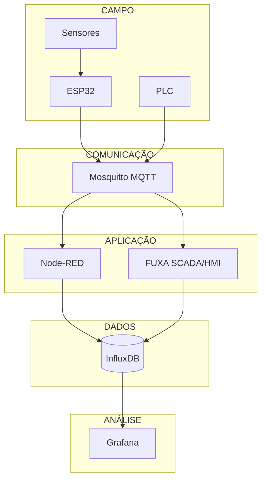

A ideia central é:

> **Node-RED integra e automatiza. FUXA supervisiona e opera. InfluxDB armazena. Grafana analisa. MQTT conecta.**

---

# 2. Por que utilizar FUXA?

O FUXA é uma plataforma Web Open Source para **SCADA/HMI e visualização de processos**.

O projeto suporta protocolos como:

- MQTT;
- Modbus RTU/TCP;
- OPC-UA;
- Siemens S7;
- BACnet;
- Ethernet/IP.

Também possui editor gráfico Web e execução através de Docker. O repositório oficial mantém um `compose.yml` próprio e documentação de execução. ([GitHub — FUXA](https://github.com/frangoteam/FUXA))

Para este laboratório, o FUXA complementa o Node-RED em vez de substituí-lo.

---

# 3. Node-RED × FUXA

## Node-RED

O Node-RED é utilizado para:

- processamento;
- transformação de mensagens;
- regras;
- automação;
- integração com APIs;
- comunicação com bancos;
- notificações;
- integração entre sistemas.

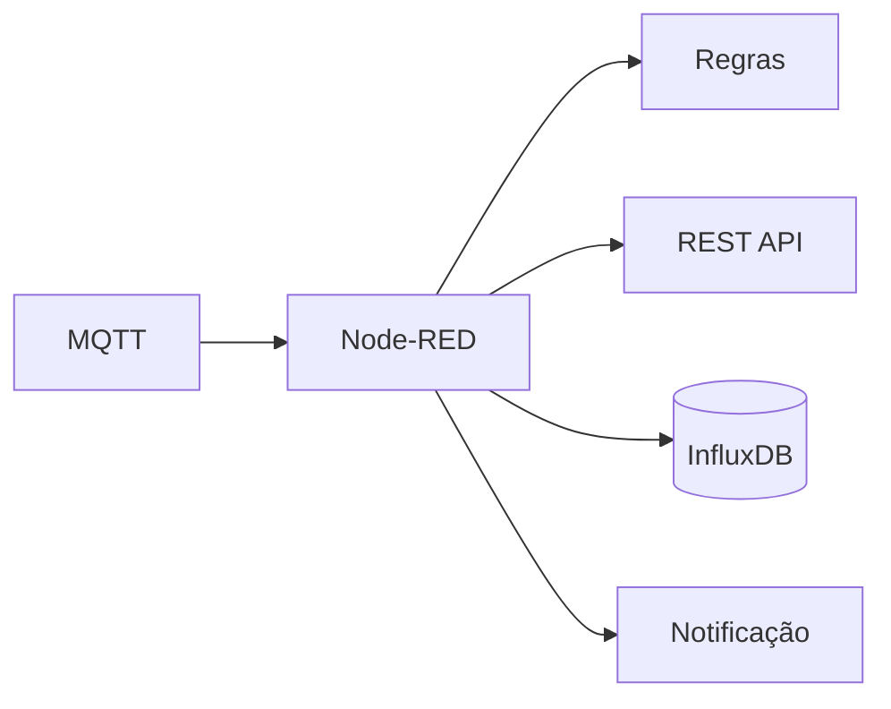

## FUXA

O FUXA é utilizado para:

- HMI;
- supervisão;
- representação do processo;
- estados dos equipamentos;
- comandos;
- alarmes;
- visualização operacional.

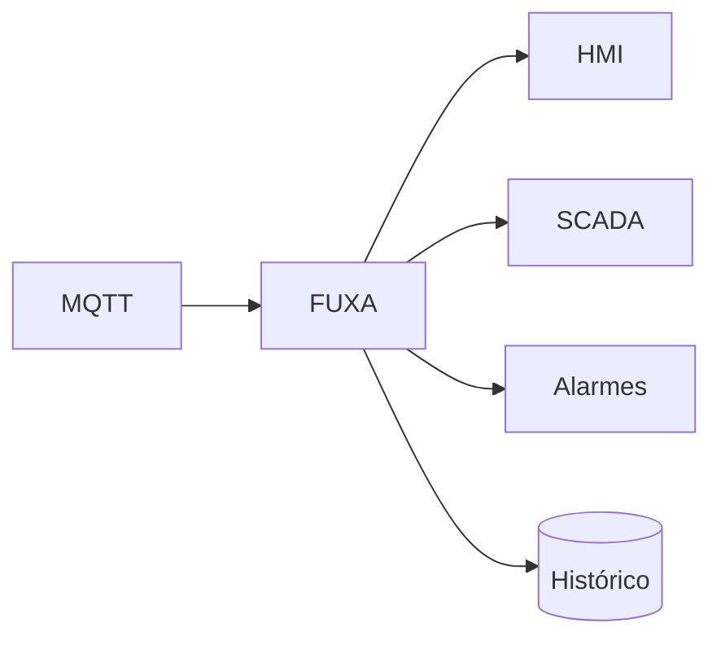

---

# 4. Dashboard × HMI × SCADA

### Dashboard

Responde:

> Como estão os dados?

### HMI

Responde:

> Como o operador visualiza e controla a máquina?

### SCADA

Responde:

> Como supervisionamos o processo?

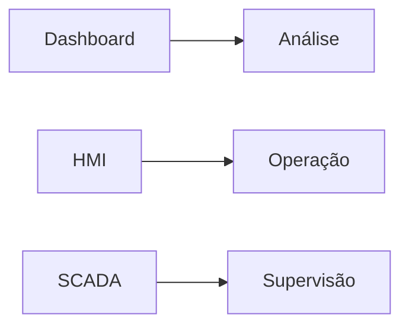

Neste laboratório:

```text
FUXA    → HMI / SCADA
Grafana → Analytics
```

---

# 5. Estrutura do projeto

Crie a seguinte estrutura:

```text
iot-scada/
│
├── docker-compose.yml
│
├── .env
│
├── mosquitto/
│   └── config/
│       └── mosquitto.conf
│
├── node-red/
│   └── data/
│
├── fuxa/
│   ├── appdata/
│   ├── db/
│   ├── logs/
│   └── images/
│
├── influxdb/
│
└── grafana/
```

As pastas utilizadas pelo FUXA correspondem às áreas de persistência indicadas pelo próprio projeto para aplicação, banco/DAQ, logs e imagens.

O Node-RED utiliza `/data` para seus flows, configurações e demais dados persistentes.

---

# 6. Docker Compose

O arquivo abaixo cria todo o laboratório:

```yaml
services:
  # ============================================================
  # MQTT BROKER
  # ============================================================
  mosquitto:
    image: eclipse-mosquitto:2
    container_name: iot-mosquitto
    restart: unless-stopped

    ports:
      - "1883:1883"

    volumes:
      - ./mosquitto/config:/mosquitto/config
      - mosquitto-data:/mosquitto/data
      - mosquitto-log:/mosquitto/log

    networks:
      - iot

  # ============================================================
  # NODE-RED
  # ============================================================
  node-red:
    image: nodered/node-red:latest
    container_name: iot-node-red
    restart: unless-stopped

    environment:
      - TZ=${TZ:-America/Sao_Paulo}

    ports:
      - "1880:1880"

    volumes:
      - ./node-red/data:/data

    depends_on:
      - mosquitto
      - influxdb

    networks:
      - iot

  # ============================================================
  # FUXA SCADA / HMI
  # ============================================================
  fuxa:
    image: frangoteam/fuxa:latest
    container_name: iot-fuxa
    restart: unless-stopped

    ports:
      - "1881:1881"

    volumes:
      - ./fuxa/appdata:/usr/src/app/FUXA/server/_appdata
      - ./fuxa/db:/usr/src/app/FUXA/server/_db
      - ./fuxa/logs:/usr/src/app/FUXA/server/_logs
      - ./fuxa/images:/usr/src/app/FUXA/server/_images

    depends_on:
      - mosquitto
      - influxdb

    networks:
      - iot

  # ============================================================
  # INFLUXDB
  # ============================================================
  influxdb:
    image: influxdb:2.7
    container_name: iot-influxdb
    restart: unless-stopped

    ports:
      - "8086:8086"

    environment:
      - DOCKER_INFLUXDB_INIT_MODE=setup
      - DOCKER_INFLUXDB_INIT_USERNAME=${INFLUXDB_USERNAME:-admin}
      - DOCKER_INFLUXDB_INIT_PASSWORD=${INFLUXDB_PASSWORD:-admin12345}
      - DOCKER_INFLUXDB_INIT_ORG=${INFLUXDB_ORG:-lab}
      - DOCKER_INFLUXDB_INIT_BUCKET=${INFLUXDB_BUCKET:-iot}
      - DOCKER_INFLUXDB_INIT_ADMIN_TOKEN=${INFLUXDB_TOKEN:-iot-lab-token}

    volumes:
      - influxdb-data:/var/lib/influxdb2
      - influxdb-config:/etc/influxdb2

    networks:
      - iot

  # ============================================================
  # GRAFANA
  # ============================================================
  grafana:
    image: grafana/grafana:latest
    container_name: iot-grafana
    restart: unless-stopped

    ports:
      - "3000:3000"

    environment:
      - GF_SECURITY_ADMIN_USER=${GRAFANA_USER:-admin}
      - GF_SECURITY_ADMIN_PASSWORD=${GRAFANA_PASSWORD:-admin12345}

    volumes:
      - grafana-data:/var/lib/grafana

    depends_on:
      - influxdb

    networks:
      - iot

# ==============================================================
# VOLUMES
# ==============================================================
volumes:
  mosquitto-data:
  mosquitto-log:

  influxdb-data:
  influxdb-config:

  grafana-data:

# ==============================================================
# NETWORK
# ==============================================================
networks:
  iot:
    driver: bridge
```

O serviço FUXA utiliza a imagem oficial publicada pelo projeto e a porta `1881`, conforme o Compose mantido no repositório oficial.

O Node-RED utiliza a imagem `nodered/node-red` e persiste `/data`, conforme a documentação oficial.

---

# 7. Configuração do Mosquitto

Crie:

```text
mosquitto/config/mosquitto.conf
```

Com:

```conf
listener 1883 0.0.0.0

allow_anonymous true

persistence true
persistence_location /mosquitto/data/

log_dest stdout
```

> **Atenção:** `allow_anonymous true` é adequado para o laboratório local, mas não deve ser utilizado dessa maneira em uma implantação industrial exposta a redes não confiáveis.

---

# 8. Variáveis de ambiente

Crie um arquivo `.env`:

```dotenv
TZ=America/Sao_Paulo

INFLUXDB_USERNAME=admin
INFLUXDB_PASSWORD=admin12345
INFLUXDB_ORG=lab
INFLUXDB_BUCKET=iot
INFLUXDB_TOKEN=iot-lab-token

GRAFANA_USER=admin
GRAFANA_PASSWORD=admin12345
```

Para um laboratório compartilhado, altere as senhas antes de disponibilizar o ambiente em uma rede externa.

---

# 9. Inicializando o laboratório

A partir da pasta `iot-scada`:

```bash
docker compose pull
```

Depois:

```bash
docker compose up -d
```

Verifique os containers:

```bash
docker compose ps
```

Visualize os logs:

```bash
docker compose logs -f
```

Ou apenas do FUXA:

```bash
docker compose logs -f fuxa
```

---

# 10. Acessando os serviços

Depois da inicialização:

| Serviço  | Endereço                |
| -------- | ----------------------- |
| Node-RED | `http://localhost:1880` |
| FUXA     | `http://localhost:1881` |
| InfluxDB | `http://localhost:8086` |
| Grafana  | `http://localhost:3000` |
| MQTT     | `localhost:1883`        |

O FUXA documenta `http://localhost:1881` como endereço de acesso após a execução em Docker.

---

# 11. Comunicação entre containers

Um detalhe importante do Docker Compose:

> **Dentro da rede Docker, não usamos `localhost` para acessar outro container.**

Por exemplo, no Node-RED:

```text
MQTT Broker:

Host: mosquitto
Port: 1883
```

Não:

```text
localhost:1883
```

No FUXA:

```text
MQTT Broker:

Host: mosquitto
Port: 1883
```

No Node-RED, o InfluxDB será:

```text
http://influxdb:8086
```

E não:

```text
http://localhost:8086
```

A resolução dos nomes dos serviços é fornecida pela rede criada pelo Docker Compose.

---

# 12. Testando MQTT

Podemos testar o broker diretamente pelo terminal.

Abra um terminal:

```bash
docker compose exec mosquitto \
  mosquitto_sub \
  -h localhost \
  -t lab/test
```

Em outro terminal:

```bash
docker compose exec mosquitto \
  mosquitto_pub \
  -h localhost \
  -t lab/test \
  -m "Olá SCADA"
```

O primeiro terminal deverá receber:

```text
Olá SCADA
```

---

# 13. Testando pelo Node-RED

No Node-RED:

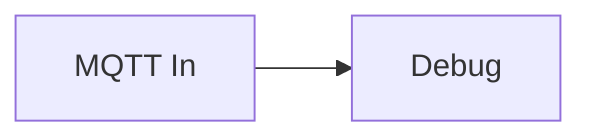

Configure:

```text
Broker: mosquitto
Port: 1883
Topic: lab/test
```

Publique:

```text
lab/test
```

O Node-RED deverá receber a mensagem.

---

# 14. Primeiro fluxo MQTT

Uma estrutura didática simples:

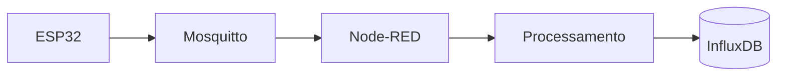

Por exemplo:

```text
lab/esp32/temperature
```

Payload:

```json
{
  "value": 27.4,
  "unit": "C"
}
```

---

# 15. Configurando o FUXA

No FUXA:

```text
http://localhost:1881
```

Crie um projeto para o laboratório.

A primeira experiência pode utilizar MQTT como fonte de dados:

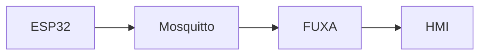

Crie uma variável:

```text
temperature
```

Associada ao tópico:

```text
lab/esp32/temperature
```

A partir dela, podemos criar:

- indicador numérico;
- gauge;
- gráfico;
- estado;
- alarme.

---

# 16. Primeira tela SCADA

O objetivo inicial é criar algo semelhante a:

```text
┌─────────────────────────────────────────────┐
│             ESTAÇÃO IoT / SCADA             │
├─────────────────────────────────────────────┤
│                                             │
│        TEMPERATURA                          │
│                                             │
│             ┌─────────┐                     │
│             │  27.4°C │                     │
│             └─────────┘                     │
│                                             │
│        ┌───────────────┐                    │
│        │     MOTOR     │                    │
│        │               │                    │
│        │    RUNNING    │                    │
│        └───────────────┘                    │
│                                             │
│       [ START ]       [ STOP ]              │
│                                             │
│       Comunicação: ● ONLINE                │
│                                             │
└─────────────────────────────────────────────┘
```

---

# 17. Node-RED como camada de lógica

Uma regra didática:

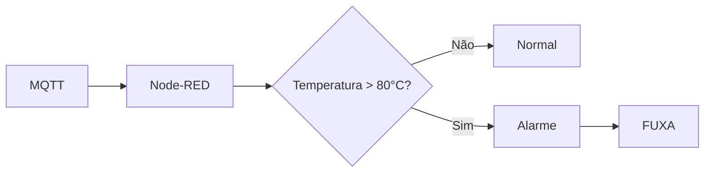

O FUXA apresenta o estado:

```text
⚠ ALARME DE TEMPERATURA
```

Enquanto o Node-RED implementa a lógica.

---

# 18. InfluxDB

O InfluxDB será responsável pelo histórico.

Exemplo conceitual:

```text
measurement:
    environment

tags:
    device=esp32-01

fields:
    temperature=27.4
    humidity=62.1
```

Fluxo:

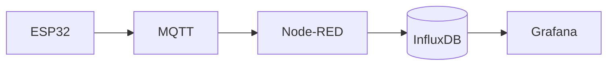

---

# 19. Grafana

Acesse:

```text
http://localhost:3000
```

Configure o InfluxDB como datasource.

Dentro da rede Docker:

```text
URL:

http://influxdb:8086
```

Utilize:

```text
Organization:
lab

Bucket:
iot

Token:
iot-lab-token
```

Crie então um dashboard com:

- temperatura;
- umidade;
- corrente;
- potência;
- estado da bomba;
- nível do tanque.

---

# 20. Arquitetura completa

Depois de configurados todos os componentes:

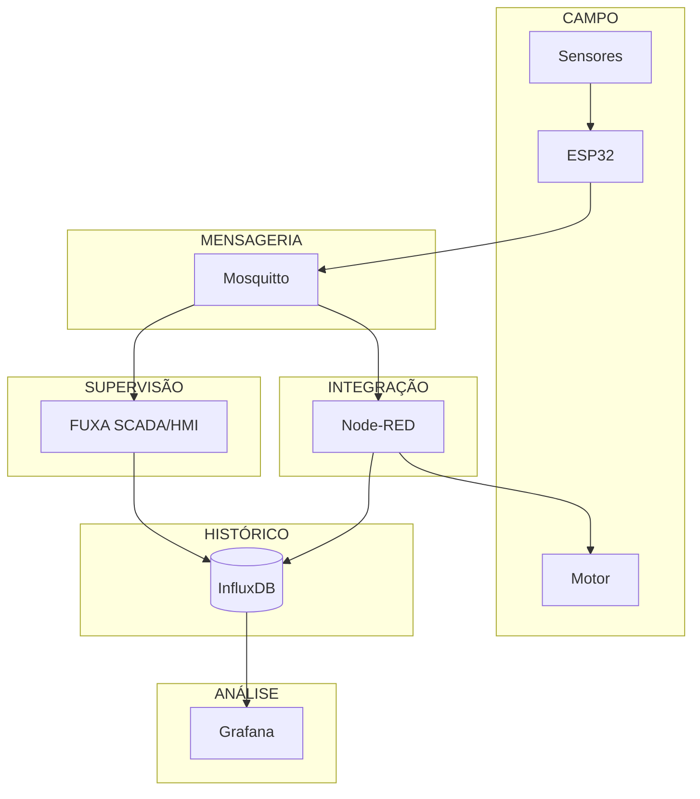

---

# 21. Organização das responsabilidades

```text
┌─────────────────────────────────────────┐
│                 GRAFANA                 │
│       Tendências / Analytics            │
├─────────────────────────────────────────┤
│                  FUXA                   │
│             SCADA / HMI                 │
├─────────────────────────────────────────┤
│               NODE-RED                  │
│        Integração / Automação           │
├─────────────────────────────────────────┤
│                 MQTT                    │
│              Mensageria                 │
├─────────────────────────────────────────┤
│          ESP32 / PLC / Sensores         │
│                 Campo                   │
└─────────────────────────────────────────┘
```

Essa separação é um dos principais objetivos pedagógicos do laboratório.

---

# 22. Atividade prática

## Estação de bombeamento

Implemente uma estação contendo:

```text
Tanque
 ├── nível
 └── temperatura

Bomba
 ├── estado
 ├── corrente
 └── velocidade
```

Tópicos MQTT:

```text
lab/tank/level
lab/tank/temperature
lab/pump/state
lab/pump/current
lab/pump/speed
lab/pump/command
```

Comandos:

```text
START
STOP
```

---

## Regra 1 — Temperatura

No Node-RED:

```text
SE temperatura > 80 °C
ENTÃO
    gerar alarme
```

---

## Regra 2 — Nível

```text
SE nível < 20 %
ENTÃO
    impedir partida da bomba
```

---

## FUXA

Criar uma tela com:

- tanque;
- bomba;
- nível;
- temperatura;
- corrente;
- velocidade;
- estado;
- START;
- STOP;
- alarme.

---

## InfluxDB

Registrar:

```text
level
temperature
current
speed
state
```

---

## Grafana

Criar:

```text
Temperatura × tempo
Corrente × tempo
Nível × tempo
Velocidade × tempo
Estado da bomba
```

---

# 23. Evolução do laboratório

O projeto pode crescer em etapas.

## Etapa 1 — MQTT


## Etapa 2 — Persistência

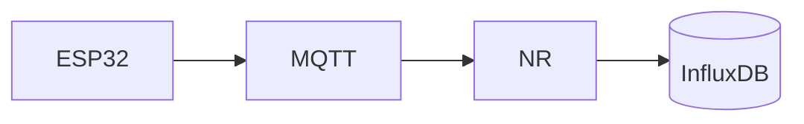

## Etapa 3 — Analytics

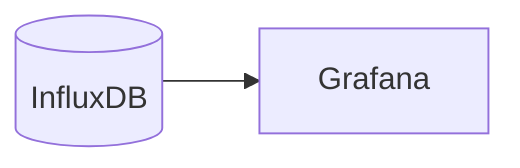

## Etapa 4 — SCADA

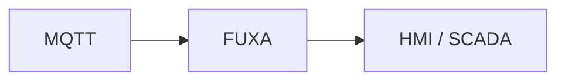

## Etapa 5 — Sistema completo

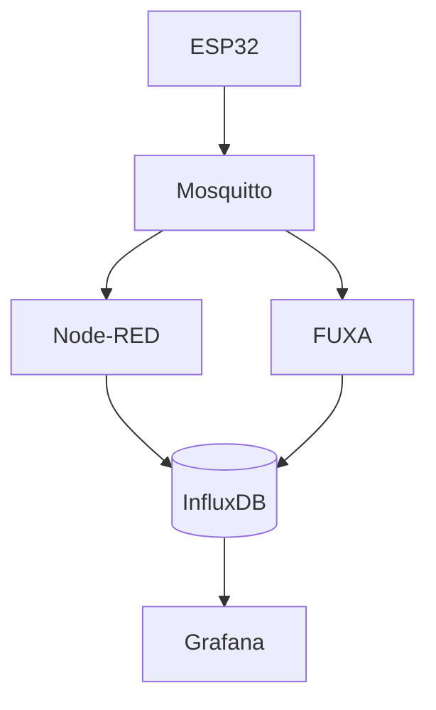

---

# 24. Comandos úteis

### Iniciar

```bash
docker compose up -d
```

### Parar

```bash
docker compose down
```

### Ver status

```bash
docker compose ps
```

### Ver logs

```bash
docker compose logs -f
```

### Atualizar imagens

```bash
docker compose pull
docker compose up -d
```

### Reiniciar apenas o FUXA

```bash
docker compose restart fuxa
```

### Reiniciar Node-RED

```bash
docker compose restart node-red
```

### Remover containers sem apagar os volumes

```bash
docker compose down
```

### Remover também os volumes

```bash
docker compose down -v
```

> **Cuidado:** `docker compose down -v` remove os volumes nomeados deste projeto e, portanto, os dados persistidos do InfluxDB, Grafana e Mosquitto.

---

# 25. Verificação final

Depois de executar:

```bash
docker compose up -d
```

verifique:

```bash
docker compose ps
```

O resultado deverá apresentar aproximadamente:

```text
NAME             STATUS

iot-mosquitto    Up
iot-node-red     Up
iot-fuxa         Up
iot-influxdb     Up
iot-grafana      Up
```

Teste os serviços:

```text
Node-RED
http://localhost:1880

FUXA
http://localhost:1881

InfluxDB
http://localhost:8086

Grafana
http://localhost:3000
```

---

# 26. Conclusão

Para este laboratório didático, a arquitetura escolhida é:

```text
ESP32 / PLC / Sensores
          │
          ▼
       MQTT
          │
          ├──────────────┐
          ▼              ▼
      Node-RED         FUXA
          │           SCADA/HMI
          │              │
          └──────┬───────┘
                 ▼
              InfluxDB
                 │
                 ▼
              Grafana
```

A principal ideia pedagógica é separar claramente as funções:

> **MQTT conecta.**

> **Node-RED integra e automatiza.**

> **FUXA supervisiona e opera.**

> **InfluxDB armazena.**

> **Grafana analisa.**

Com essa arquitetura, o mesmo laboratório pode ser utilizado progressivamente para ensinar **IoT, MQTT, Node-RED, automação, HMI, SCADA, bancos de dados de séries temporais e observabilidade**.

## Referências

- [FUXA — GitHub](https://github.com/frangoteam/FUXA)
- [FUXA — documentação](https://frangoteam.github.io/FUXA/)
- [FUXA — Docker Compose](https://github.com/frangoteam/FUXA/blob/master/compose.yml)
- [Node-RED — Docker](https://nodered.org/docs/getting-started/docker)
