# SCADA Open Source com FUXA e Node-RED

## Objetivos

Ao final deste laboratório, o aluno deverá ser capaz de:

- compreender a diferença entre **IoT Dashboard**, **HMI** e **SCADA**;
- compreender o papel do **Node-RED** em uma arquitetura de automação;
- utilizar o **FUXA** como plataforma SCADA/HMI Open Source;
- integrar dispositivos IoT através de **MQTT**;
- armazenar dados históricos no **InfluxDB**;
- utilizar o **Grafana** para análise histórica;
- compreender a separação entre **operação**, **integração** e **análise de dados**;
- executar toda a infraestrutura utilizando **Docker Compose**.

---

## 1. Por que utilizar um SCADA Open Source?

Em projetos de IoT é comum começar com uma arquitetura semelhante a:

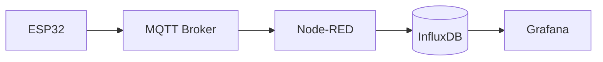

Essa arquitetura é excelente para:

- aquisição de dados;
- processamento;
- automação;
- armazenamento;
- dashboards;
- integração com APIs.

Entretanto, um **dashboard IoT** não necessariamente é um **SCADA**.

Em uma aplicação industrial, também precisamos representar:

- equipamentos;
- estados;
- comandos;
- variáveis de processo;
- alarmes;
- estados de comunicação;
- telas de operação;
- interação do operador com o processo.

É nesse ponto que entra o **FUXA**.

---

# 2. O que é o FUXA?

O **FUXA** é uma plataforma Web Open Source para **SCADA/HMI e visualização de processos**.

O projeto fornece um editor gráfico Web e suporta diversos protocolos industriais e de IoT, incluindo:

- MQTT;
- Modbus RTU/TCP;
- OPC-UA;
- Siemens S7;
- BACnet;
- Ethernet/IP;
- ODBC;
- entre outros.

O projeto também possui suporte a armazenamento/historian, incluindo InfluxDB, e disponibiliza execução através de Docker.

O código-fonte está disponível no GitHub:

[FUXA no GitHub](https://github.com/frangoteam/FUXA?utm_source=chatgpt.com)

A documentação do projeto também está disponível online:

[Documentação do FUXA](https://frangoteam.github.io/FUXA/?utm_source=chatgpt.com)

---

# 3. FUXA não substitui o Node-RED

Uma decisão importante deste laboratório é:

> **Não substituir o Node-RED pelo FUXA.**

As duas ferramentas possuem responsabilidades diferentes.

| Ferramenta | Responsabilidade                 |
| ---------- | -------------------------------- |
| Mosquitto  | Transporte MQTT                  |
| Node-RED   | Integração e automação           |
| FUXA       | SCADA/HMI                        |
| InfluxDB   | Histórico de séries temporais    |
| Grafana    | Análise e visualização histórica |

Podemos visualizar essa separação da seguinte maneira:

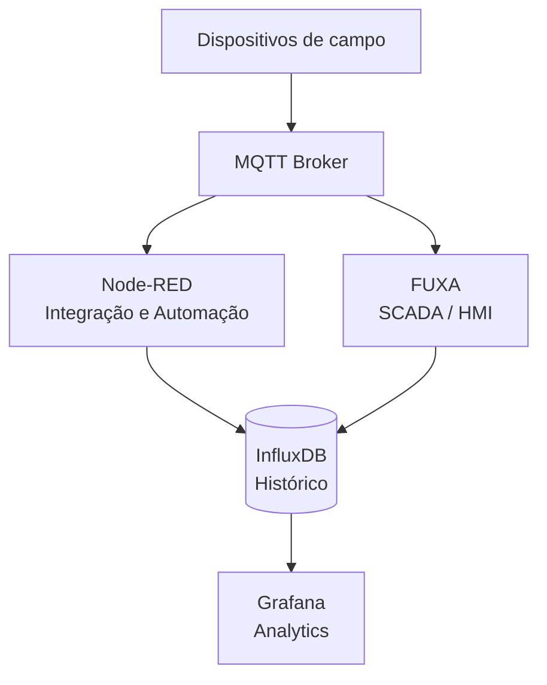

---

# 4. Node-RED: integração e automação

O Node-RED trabalha muito bem como camada de integração.

Ele pode:

- receber mensagens MQTT;
- transformar dados;
- validar valores;
- executar regras;
- controlar dispositivos;
- chamar APIs;
- enviar notificações;
- gravar dados;
- integrar bancos de dados;
- comunicar-se com outros sistemas.

A documentação oficial também fornece uma configuração Docker e mostra o uso de um broker MQTT pelo nome do serviço dentro de uma rede Docker.

Exemplo conceitual:

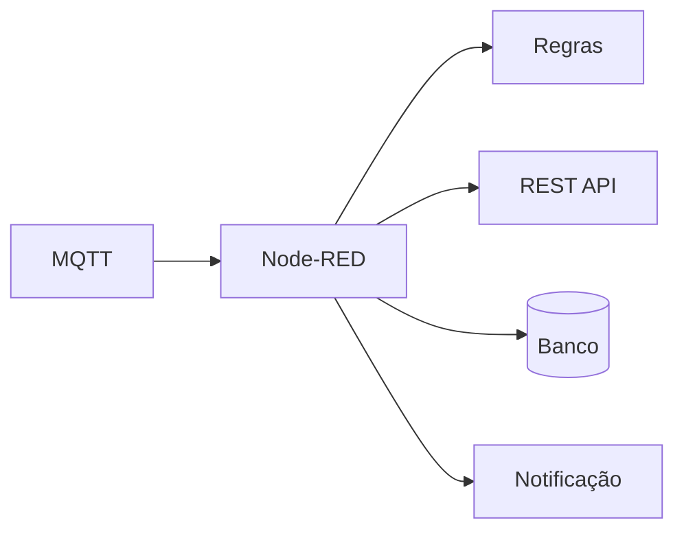

O Node-RED é, portanto, especialmente interessante quando precisamos perguntar:

> "O que devemos fazer com esse dado?"

---

# 5. FUXA: supervisão e operação

O FUXA responde a uma pergunta diferente:

> "Como o operador deve visualizar e interagir com o processo?"

Por exemplo:

```text
┌───────────────────────────────────────────────┐
│              SISTEMA DE BOMBEAMENTO           │
├───────────────────────────────────────────────┤
│                                               │
│       ┌──────────┐                            │
│       │  TANQUE  │                            │
│       │          │                            │
│       │   72 %   │                            │
│       └────┬─────┘                            │
│            │                                  │
│            ▼                                  │
│       ┌──────────┐                            │
│       │  BOMBA   │                            │
│       │    M1    │                            │
│       │  RUNNING │                            │
│       └────┬─────┘                            │
│            │                                  │
│            ▼                                  │
│         PROCESSO                              │
│                                               │
│  Temperatura: 32.5 °C                         │
│  Pressão:      2.4 bar                        │
│                                               │
│  [ START ]       [ STOP ]                     │
│                                               │
│  ● Comunicação: ONLINE                       │
└───────────────────────────────────────────────┘
```

O FUXA fornece um editor Web para criar esse tipo de visualização e pode conectar-se diretamente a dispositivos e protocolos industriais.

---

# 6. Comparação: Dashboard × HMI × SCADA

É importante diferenciar os conceitos.

## Dashboard

Normalmente responde:

> "Como estão os dados?"

Exemplo:

```text
Temperatura: 32 °C
Energia:     4.2 kWh
Potência:    1.8 kW
```

---

## HMI

Responde:

> "Como o operador controla a máquina?"

Exemplo:

```text
MOTOR M1

Estado: STOPPED

[ START ]
[ STOP  ]
```

---

## SCADA

Responde:

> "Como supervisionamos todo o processo?"

Incluindo:

- equipamentos;
- variáveis;
- estados;
- alarmes;
- comandos;
- comunicação;
- históricos;
- telas de processo.

Uma forma didática de visualizar:

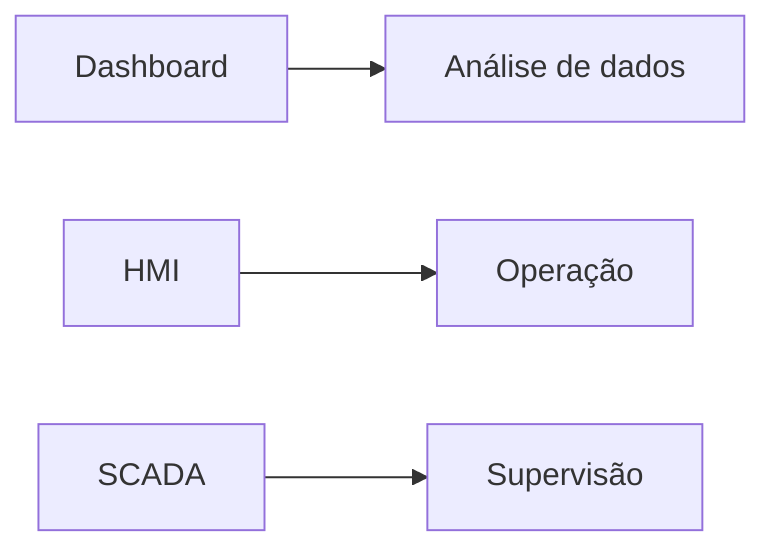

O FUXA permite explorar principalmente a parte **HMI/SCADA**, enquanto o Grafana permanece dedicado à análise.

---

# 7. Arquitetura proposta para o laboratório

A arquitetura completa será:

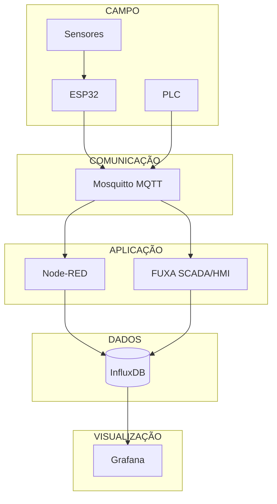

---

# 8. Responsabilidade de cada componente

## Mosquitto

Responsável pelo transporte das mensagens MQTT.

```text
ESP32
  │
  │ MQTT
  ▼
Mosquitto
```

Não devemos colocar lógica complexa no broker.

---

## Node-RED

Responsável por:

```text
MQTT
 │
 ▼
Node-RED
 ├── transformação
 ├── validação
 ├── regras
 ├── automação
 ├── APIs
 ├── notificações
 └── persistência
```

---

## FUXA

Responsável por:

```text
Processo
   │
   ▼
 FUXA
   ├── HMI
   ├── SCADA
   ├── estados
   ├── comandos
   ├── visualização
   └── supervisão
```

---

## InfluxDB

Responsável pelo histórico:

```text
timestamp
temperature
pressure
power
energy
state
```

---

## Grafana

Responsável por:

- gráficos;
- tendências;
- indicadores;
- análise histórica;
- comparação de períodos;
- dashboards.

---

# 9. Comunicação MQTT

Um exemplo de organização dos tópicos:

```text
lab/
├── esp32/
│   ├── temperatura
│   ├── umidade
│   ├── corrente
│   └── potencia
│
├── motor/
│   ├── estado
│   ├── comando
│   └── velocidade
│
└── tanque/
    ├── nivel
    ├── temperatura
    └── alarme
```

Por exemplo:

```text
lab/esp32/temperatura
```

Payload:

```json
{
  "value": 27.4,
  "unit": "°C",
  "timestamp": "2026-10-02T17:00:00Z"
}
```

---

# 10. Fluxo de dados

Considere um sensor de temperatura conectado a um ESP32.

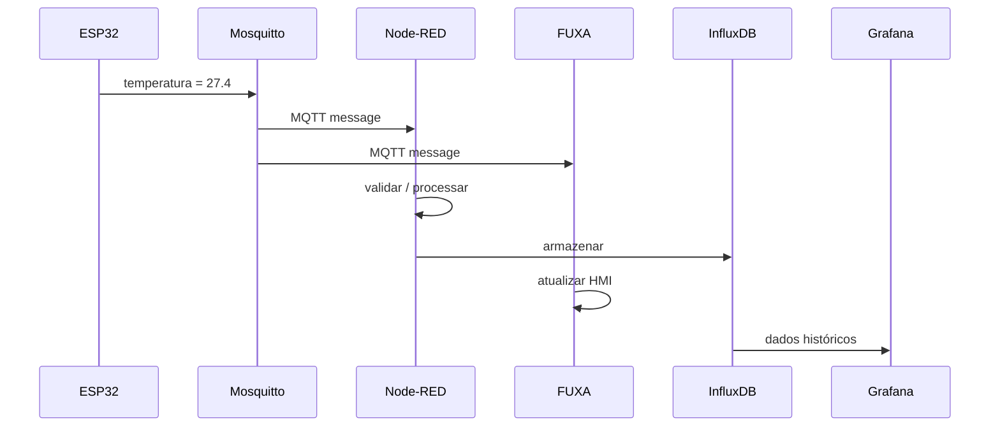

Esse fluxo mostra uma característica importante:

> O FUXA e o Node-RED podem consumir a mesma infraestrutura MQTT sem que um precise substituir o outro.

---

# 11. Quando utilizar Node-RED?

Use Node-RED quando a tarefa envolver **lógica ou integração**.

### Exemplos

```text
SE temperatura > 80 °C
    enviar alerta
```

ou:

```text
MQTT
 ↓
Node-RED
 ↓
REST API
 ↓
Sistema externo
```

ou:

```text
MQTT
 ↓
Node-RED
 ↓
InfluxDB
```

---

# 12. Quando utilizar FUXA?

Use FUXA quando a tarefa envolver **supervisão e operação**.

### Exemplos

```text
Mostrar:

Motor M1
    Estado = RUNNING
    Corrente = 4.8 A
    Velocidade = 1750 rpm
```

ou:

```text
Operador

[ START MOTOR ]
[ STOP MOTOR  ]
```

ou:

```text
Tanque

Nível
████████████░░░░ 72 %

Temperatura
32.5 °C

Estado
ONLINE
```

---

# 13. FUXA + Node-RED

Existe ainda uma integração específica entre FUXA e Node-RED no próprio projeto FUXA, através do diretório `node-red/node-red-contrib-fuxa`.

Isso permite explorar uma arquitetura em que:

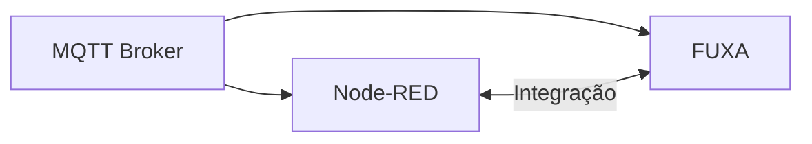

Para fins didáticos, entretanto, é recomendável começar com a arquitetura mais simples:

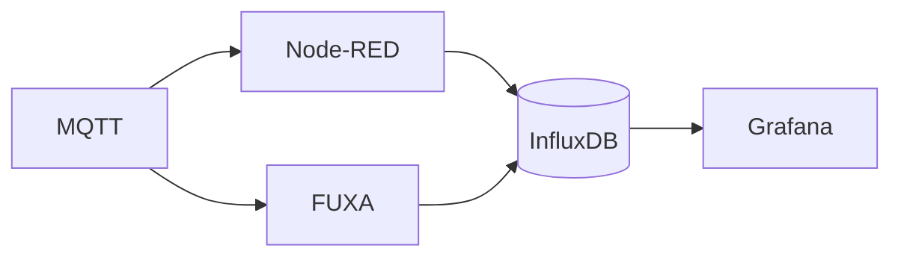

Depois que os alunos compreenderem cada componente individualmente, a integração direta entre FUXA e Node-RED pode ser introduzida.

---

# 14. Por que FUXA para este laboratório?

A escolha do FUXA está relacionada principalmente ao objetivo didático.

| Requisito            | FUXA                  |
| -------------------- | --------------------- |
| Open Source          | Sim                   |
| Web                  | Sim                   |
| Docker               | Sim                   |
| MQTT                 | Sim                   |
| Modbus               | Sim                   |
| OPC-UA               | Sim                   |
| HMI                  | Sim                   |
| SCADA                | Sim                   |
| Editor visual        | Sim                   |
| InfluxDB             | Sim                   |
| Node-RED             | Integração disponível |
| IoT                  | Sim                   |
| Automação industrial | Sim                   |

Essas características são documentadas pelo projeto FUXA.

---

# 15. Por que não utilizar somente Node-RED?

É perfeitamente possível criar um dashboard utilizando Node-RED.

Porém, didaticamente, isso pode esconder uma distinção importante.

Se utilizarmos somente:

```text
ESP32
 ↓
MQTT
 ↓
Node-RED
 ↓
Dashboard
```

o aluno pode concluir que:

> Node-RED = SCADA

Essa não é a melhor forma de apresentar os conceitos.

Uma arquitetura mais clara é:

```text
                 ┌───────────────┐
                 │   Node-RED    │
                 │               │
                 │ Integração    │
                 │ Automação     │
                 └───────┬───────┘
                         │
                         │
MQTT ────────────────────┼────────────
                         │
                         │
                 ┌───────▼───────┐
                 │     FUXA      │
                 │               │
                 │ SCADA / HMI   │
                 └───────────────┘
```

Assim o aluno percebe que são **camadas diferentes da solução**.

---

# 16. FUXA versus Grafana

Também não devemos substituir Grafana pelo FUXA.

### FUXA

```text
          OPERAÇÃO

┌─────────────────────────┐
│ Motor M1                │
│                         │
│ ● RUNNING               │
│                         │
│ Speed: 1750 rpm         │
│ Current: 4.8 A          │
│                         │
│ [ STOP ]                │
└─────────────────────────┘
```

### Grafana

```text
        ANÁLISE

Current
  8 ┤        ╭─╮
  6 ┤    ╭───╯ ╰──╮
  4 ┤────╯        ╰────
  2 ┤
    └──────────────────
       08  10  12  14
```

A diferença é conceitualmente importante:

```text
FUXA    → operação
Grafana → análise
```

---

# 17. Arquitetura Docker

Uma possível organização do projeto:

```text
iot-scada/
│
├── docker-compose.yml
│
├── .env
│
├── mosquitto/
│   ├── config/
│   ├── data/
│   └── log/
│
├── node-red/
│   └── data/
│
├── fuxa/
│   ├── appdata/
│   ├── db/
│   ├── logs/
│   └── images/
│
├── influxdb/
│   └── data/
│
└── grafana/
    └── data/
```

O projeto FUXA disponibiliza execução Docker e um `compose.yml`, incluindo volumes para persistência de projeto, dados/histórico, logs e imagens.

O Node-RED também possui documentação oficial para execução em Docker e persistência dos flows através do volume `/data`.

---

# 18. Evolução didática

Uma vantagem dessa arquitetura é permitir uma evolução gradual.

## Etapa 1 — MQTT


Objetivo:

- publicar;
- assinar;
- compreender tópicos;
- payloads;
- QoS.

---

## Etapa 2 — Node-RED

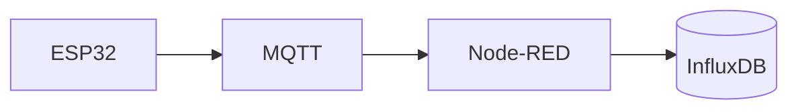

Objetivo:

- flows;
- processamento;
- regras;
- persistência.

---

## Etapa 3 — Grafana

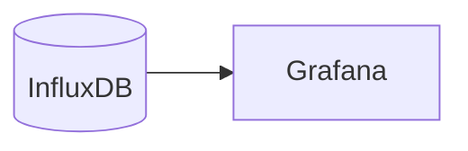

Objetivo:

- séries temporais;
- trends;
- dashboards;
- análise.

---

## Etapa 4 — FUXA

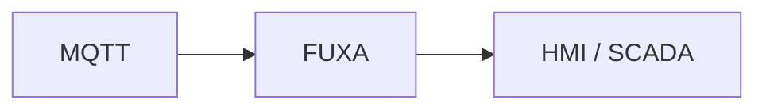

Objetivo:

- tags;
- equipamentos;
- estados;
- comandos;
- supervisão.

---

## Etapa 5 — Arquitetura completa

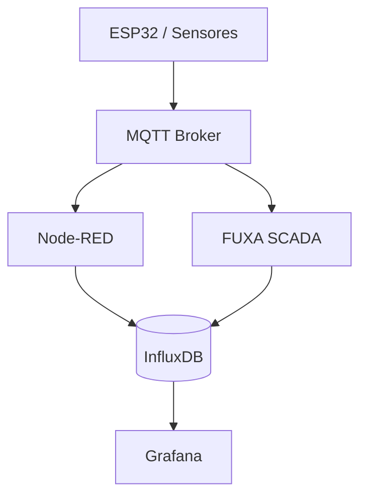

Nesse ponto o aluno já possui uma pequena infraestrutura que representa conceitos encontrados em sistemas industriais modernos.

---

# 19. Atividade prática

## Desafio

Construir uma estação de bombeamento simulada.

### Variáveis

```text
tank.level
tank.temperature
pump.state
pump.current
pump.speed
```

### Comandos

```text
pump/start
pump/stop
```

### MQTT

```text
lab/tank/level
lab/tank/temperature
lab/pump/state
lab/pump/current
lab/pump/speed
lab/pump/command
```

### Node-RED

Implementar:

```text
Temperatura > 80 °C
        ↓
    ALARME
```

e:

```text
Nível < 20 %
        ↓
    impedir partida
```

### FUXA

Criar uma tela contendo:

- tanque;
- bomba;
- nível;
- temperatura;
- corrente;
- velocidade;
- estado da bomba;
- botão START;
- botão STOP;
- indicação de alarme.

### InfluxDB

Registrar:

```text
level
temperature
current
speed
```

### Grafana

Criar:

- temperatura × tempo;
- corrente × tempo;
- nível × tempo;
- velocidade × tempo.

---

# 20. Resultado esperado

Ao final do laboratório, teremos:

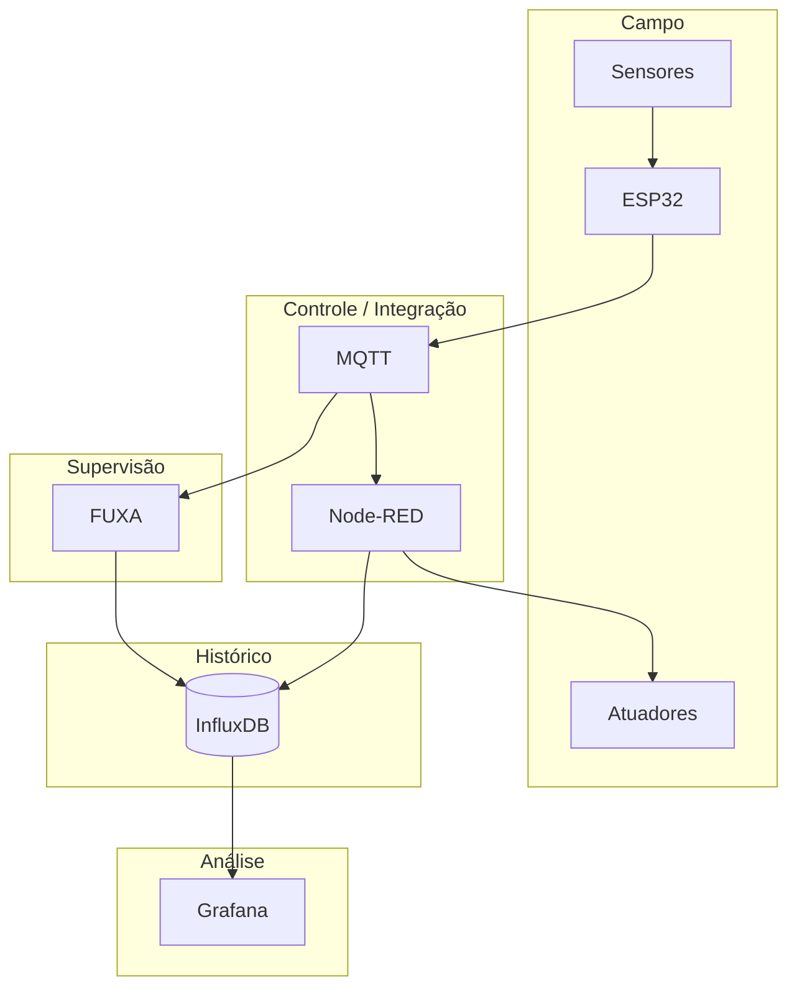

O aluno passa a enxergar a arquitetura como **camadas**, e não como uma única aplicação:

```text
┌──────────────────────────────────────┐
│              GRAFANA                 │
│          Análise / Analytics         │
├──────────────────────────────────────┤
│               FUXA                   │
│             SCADA / HMI              │
├──────────────────────────────────────┤
│            NODE-RED                  │
│       Integração / Automação         │
├──────────────────────────────────────┤
│             MQTT                     │
│           Mensageria                 │
├──────────────────────────────────────┤
│        ESP32 / PLC / Sensores        │
│              Campo                   │
└──────────────────────────────────────┘
```

---

# 21. Conclusão

Para este laboratório didático, a arquitetura recomendada é:

```text
ESP32
  ↓
MQTT
  ↓
┌───────────────────────┐
│       Node-RED        │
│ Integração / Lógica   │
└───────────────────────┘
          │
          ├───────────────┐
          ▼               ▼
       InfluxDB          FUXA
          │            SCADA/HMI
          ▼               │
       Grafana            │
          │               │
          └───────┬───────┘
                  ▼
               Operador
```

A ideia central é:

> **Node-RED integra e automatiza. FUXA supervisiona e opera. InfluxDB armazena. Grafana analisa. MQTT conecta.**

Essa separação é particularmente útil em um curso porque permite que o mesmo projeto seja utilizado para ensinar **IoT, MQTT, automação, HMI, SCADA, bancos de dados de séries temporais e observabilidade**, acrescentando complexidade gradualmente.

## Referências

- [FUXA — GitHub oficial](https://github.com/frangoteam/FUXA?utm_source=chatgpt.com)
- [FUXA — documentação](https://frangoteam.github.io/FUXA/?utm_source=chatgpt.com)
- [Node-RED — Docker](https://nodered.org/docs/getting-started/docker?utm_source=chatgpt.com)
