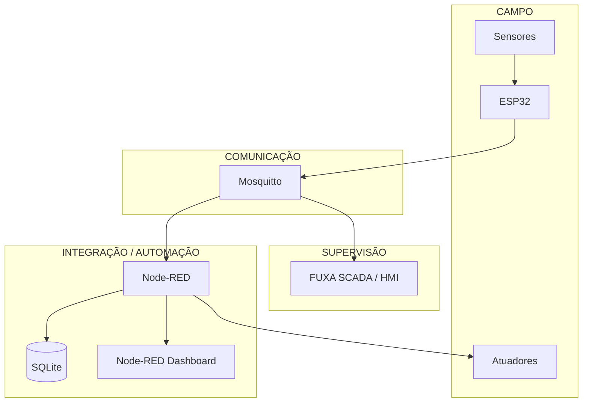
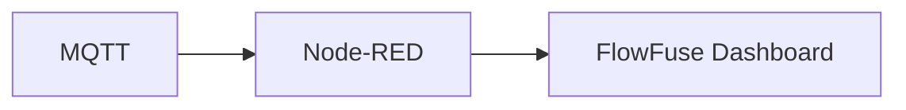
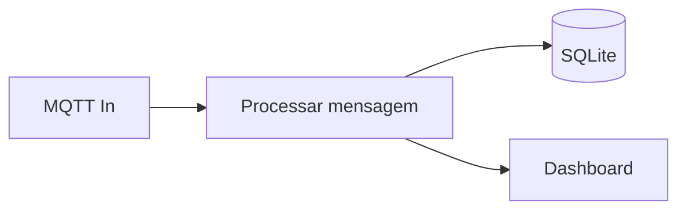
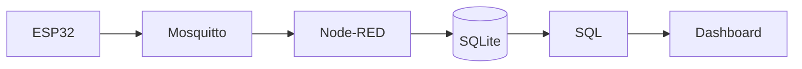
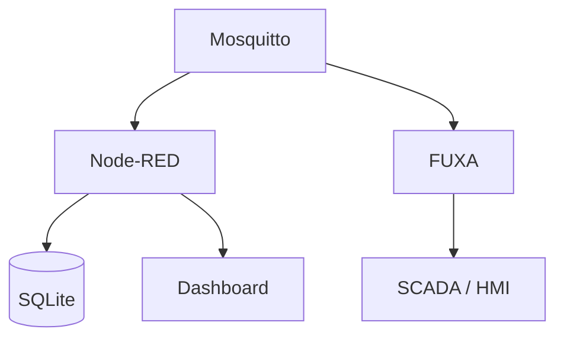
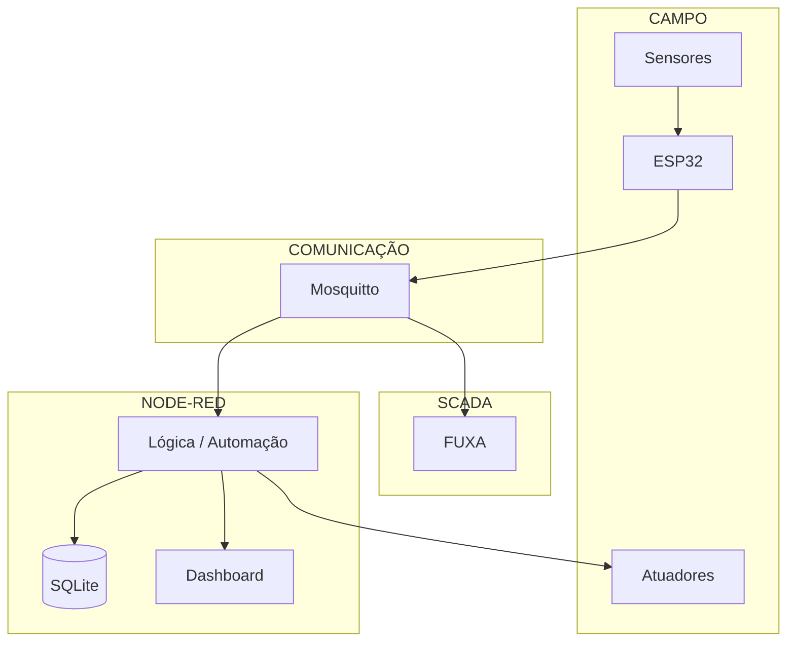
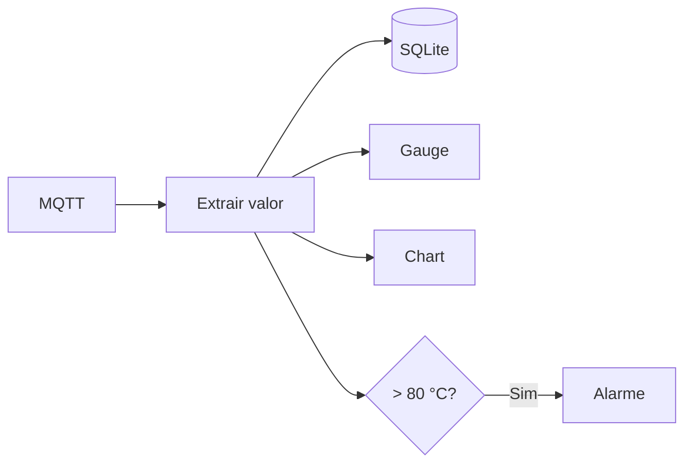
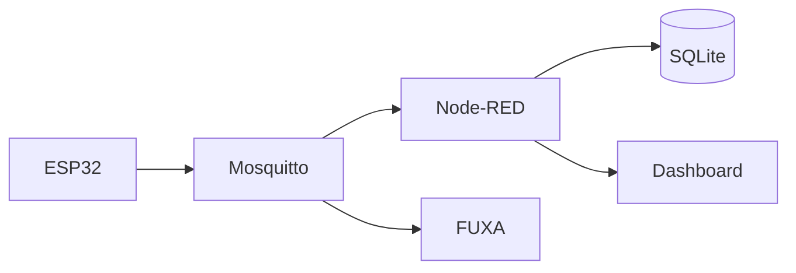
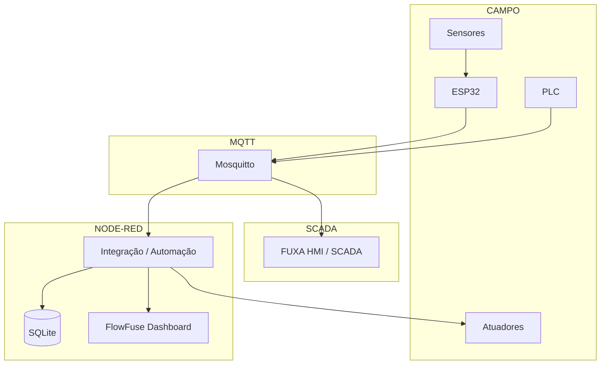

# SCADA Open Source com FUXA e Node-RED

## Stack simplificado

Para o laboratório didático, vamos reduzir a infraestrutura original.

### Stack anterior

```text
ESP32
  ↓
Mosquitto
  ↓
Node-RED
  ├── InfluxDB
  └── Grafana

FUXA
```

### Novo stack

```text
ESP32
  ↓
Mosquitto
  ↓
Node-RED
  ├── SQLite
  └── Dashboard

FUXA
  ↓
SCADA / HMI
```

A arquitetura passa de **cinco containers de aplicação para apenas três**:

| Componente | Função                                    |
| ---------- | ----------------------------------------- |
| Mosquitto  | Broker MQTT                               |
| Node-RED   | Integração, automação, SQLite e Dashboard |
| FUXA       | SCADA / HMI                               |

O SQLite será um **arquivo dentro do volume persistente do Node-RED**, portanto não precisamos de um container separado.

---

# 1. Arquitetura



A ideia central passa a ser:

> **MQTT conecta. Node-RED integra, automatiza, armazena e apresenta. FUXA supervisiona e opera.**

---

# 2. Por que eliminar InfluxDB e Grafana?

Para uma infraestrutura didática inicial, InfluxDB + Grafana adicionam conceitos que não são essenciais para o primeiro contato com SCADA:

```text
InfluxDB
    ↓
Database
    ↓
Datasource
    ↓
Grafana
    ↓
Dashboard
```

Isso significa mais:

- containers;
- configurações;
- credenciais;
- volumes;
- datasources;
- conceitos para o aluno aprender.

Podemos começar com:

```text
Node-RED
    │
    ├── SQLite
    │
    └── Dashboard
```

O aluno ainda aprende:

- persistência;
- SQL;
- histórico;
- gráficos;
- indicadores;
- dashboards;
- MQTT;
- automação.

Posteriormente, InfluxDB e Grafana podem ser introduzidos como uma **segunda etapa**.

---

# 3. Node-RED Dashboard 2.0

O dashboard será implementado diretamente no Node-RED.

O projeto atualmente recomendado é o **FlowFuse Dashboard**, também conhecido como **Node-RED Dashboard 2.0**. O pacote é:

```text
@flowfuse/node-red-dashboard
```

Ele fornece componentes como:

- `ui-button`;
- `ui-chart`;
- `ui-gauge`;
- `ui-text`;
- `ui-form`;
- `ui-table`;
- páginas;
- grupos;
- temas.

O projeto oficial informa que o Dashboard 2.0 é o sucessor do antigo Node-RED Dashboard e pode ser instalado através do Palette Manager.

---

# 4. SQLite

O SQLite será utilizado para armazenar dados históricos simples.

Por exemplo:

```sql
CREATE TABLE measurements (
    id INTEGER PRIMARY KEY AUTOINCREMENT,
    timestamp DATETIME DEFAULT CURRENT_TIMESTAMP,
    device TEXT,
    variable TEXT,
    value REAL
);
```

Exemplo:

```text
id | timestamp           | device | variable    | value
---+---------------------+--------+-------------+------
1  | 2026-10-02 17:00:01 | esp32  | temperature | 27.4
2  | 2026-10-02 17:00:02 | esp32  | temperature | 27.5
3  | 2026-10-02 17:00:03 | esp32  | temperature | 27.6
```

O banco ficará, por exemplo, em:

```text
/data/scada.sqlite
```

Como `/data` será persistente, o banco também será persistente.

---

# 5. Estrutura do projeto

```text
iot-scada/
│
├── docker-compose.yml
│
├── .env
│
├── mosquitto/
│   └── config/
│       └── mosquitto.conf
│
├── node-red/
│   └── data/
│
└── fuxa/
    ├── appdata/
    ├── db/
    ├── logs/
    └── images/
```

Não precisamos mais de:

```text
influxdb/
grafana/
```

---

# 6. Docker Compose

O novo `docker-compose.yml` fica bastante menor:

```yaml
services:
  # ============================================================
  # MQTT BROKER
  # ============================================================
  mosquitto:
    image: eclipse-mosquitto:2
    container_name: iot-mosquitto
    restart: unless-stopped

    ports:
      - "1883:1883"

    volumes:
      - ./mosquitto/config:/mosquitto/config
      - mosquitto-data:/mosquitto/data
      - mosquitto-log:/mosquitto/log

    networks:
      - iot

  # ============================================================
  # NODE-RED
  # ============================================================
  node-red:
    image: nodered/node-red:latest
    container_name: iot-node-red
    restart: unless-stopped

    environment:
      TZ: ${TZ:-America/Sao_Paulo}

    ports:
      - "1880:1880"

    volumes:
      - ./node-red/data:/data

    depends_on:
      - mosquitto

    networks:
      - iot

  # ============================================================
  # FUXA SCADA / HMI
  # ============================================================
  fuxa:
    image: frangoteam/fuxa:latest
    container_name: iot-fuxa
    restart: unless-stopped

    ports:
      - "1881:1881"

    volumes:
      - ./fuxa/appdata:/usr/src/app/FUXA/server/_appdata
      - ./fuxa/db:/usr/src/app/FUXA/server/_db
      - ./fuxa/logs:/usr/src/app/FUXA/server/_logs
      - ./fuxa/images:/usr/src/app/FUXA/server/_images

    depends_on:
      - mosquitto

    networks:
      - iot

# ==============================================================
# VOLUMES
# ==============================================================
volumes:
  mosquitto-data:
  mosquitto-log:

# ==============================================================
# NETWORK
# ==============================================================
networks:
  iot:
    driver: bridge
```

O Compose oficial do FUXA utiliza a imagem `frangoteam/fuxa:latest`, a porta `1881` e exatamente as quatro áreas persistentes utilizadas acima.

---

# 7. Configuração do Mosquitto

Crie:

```text
mosquitto/config/mosquitto.conf
```

Com:

```conf
listener 1883 0.0.0.0

allow_anonymous true

persistence true
persistence_location /mosquitto/data/

log_dest stdout
```

> `allow_anonymous true` é apropriado apenas para o laboratório local. Em uma implantação real, utilize autenticação e controle de acesso.

---

# 8. Variáveis de ambiente

Crie:

```text
.env
```

Com:

```dotenv
TZ=America/Sao_Paulo
```

Não precisamos mais das variáveis de InfluxDB e Grafana.

---

# 9. Instalação do Dashboard

Depois de iniciar o Node-RED:

```text
http://localhost:1880
```

Abra:

```text
Menu
  ↓
Manage Palette
  ↓
Install
```

Procure:

```text
@flowfuse/node-red-dashboard
```

e clique em:

```text
Install
```

Esse é o pacote atualmente recomendado para o Dashboard 2.0.

> **Não instale `node-red-dashboard` para este projeto.** O projeto antigo está deprecated e não recebe mais desenvolvimento ativo.

---

# 10. Dashboard

Depois da instalação, teremos no Node-RED novos nós para interface gráfica.

A arquitetura será:



O Dashboard é servido pelo próprio Node-RED.

Não precisamos de:

```text
Grafana
```

nem de:

```text
Servidor Web separado
```

---

# 11. Dashboard de temperatura

Imagine:

```text
ESP32
  │
  ▼
MQTT
  │
  ▼
Node-RED
  │
  ├────────► SQLite
  │
  └────────► Dashboard
```

No Dashboard:

```text
┌─────────────────────────────────────┐
│          ESTAÇÃO IoT                │
├─────────────────────────────────────┤
│                                     │
│       TEMPERATURA                   │
│                                     │
│            27.4 °C                  │
│                                     │
│       ┌──────────────────┐          │
│  30°C │       ╭──╮       │          │
│       │   ╭───╯  ╰──╮    │          │
│  25°C │───╯          ╰───│          │
│       └──────────────────┘          │
│                                     │
│       Estado: ● ONLINE              │
│                                     │
└─────────────────────────────────────┘
```

---

# 12. Node-RED e SQLite

O fluxo pode ser:



O mesmo dado pode alimentar:

- banco;
- gráfico;
- indicador;
- alarme;
- lógica de controle.

---

# 13. Banco SQLite

O banco pode ficar em:

```text
node-red/data/scada.sqlite
```

A vantagem é que o arquivo está dentro do diretório persistente:

```text
node-red/
└── data/
    ├── flows.json
    ├── flows_cred.json
    └── scada.sqlite
```

Ao executar:

```bash
docker compose down
```

o banco permanece.

Ao executar novamente:

```bash
docker compose up -d
```

o mesmo banco será reutilizado.

---

# 14. Exemplo de tabela

Uma estrutura simples:

```sql
CREATE TABLE measurements (
    id INTEGER PRIMARY KEY AUTOINCREMENT,
    timestamp DATETIME DEFAULT CURRENT_TIMESTAMP,
    device TEXT NOT NULL,
    variable TEXT NOT NULL,
    value REAL NOT NULL
);
```

Inserção:

```sql
INSERT INTO measurements
(device, variable, value)
VALUES
('esp32-01', 'temperature', 27.4);
```

Consulta:

```sql
SELECT
    timestamp,
    value
FROM measurements
WHERE
    device = 'esp32-01'
    AND variable = 'temperature'
ORDER BY timestamp;
```

---

# 15. Histórico

O SQLite permite ensinar SQL sem introduzir imediatamente um banco especializado em séries temporais.



O aluno aprende:

```text
MQTT
 ↓
Node-RED
 ↓
SQL
 ↓
Dashboard
```

Antes de aprender:

```text
MQTT
 ↓
Node-RED
 ↓
InfluxDB
 ↓
Grafana
```

---

# 16. FUXA continua separado

O FUXA continua desempenhando o papel de SCADA/HMI.



Portanto:

### Node-RED Dashboard

```text
Dashboard IoT
```

### FUXA

```text
HMI / SCADA
```

Isso mantém o objetivo pedagógico original.

---

# 17. Node-RED Dashboard × FUXA

| Função                   | Node-RED Dashboard | FUXA |
| ------------------------ | -----------------: | ---: |
| Dashboard IoT            |                 🟢 |   🟢 |
| Gráficos                 |                 🟢 |   🟢 |
| Indicadores              |                 🟢 |   🟢 |
| Botões                   |                 🟢 |   🟢 |
| Forms                    |                 🟢 |   🟡 |
| MQTT                     |                 🟢 |   🟢 |
| Lógica                   |                 🟢 |   🟡 |
| Automação                |                 🟢 |   🟡 |
| HMI                      |                 🟡 |   🟢 |
| SCADA                    |                 🟡 |   🟢 |
| Alarmes                  |                 🟡 |   🟢 |
| Protocolos industriais   |                 🟡 |   🟢 |
| Visualização de processo |                 🟡 |   🟢 |

O FUXA é explicitamente voltado a SCADA/HMI e visualização de processos industriais, incluindo MQTT, Modbus, OPC-UA e Siemens S7.

---

# 18. Arquitetura didática final

A arquitetura passa a ser:



---

# 19. Três containers

A infraestrutura agora é:

```text
┌────────────────────────────────────┐
│             Docker                 │
│                                    │
│  ┌────────────┐                    │
│  │ Mosquitto  │                    │
│  └─────┬──────┘                    │
│        │                           │
│        ▼                           │
│  ┌────────────┐                    │
│  │ Node-RED   │                    │
│  │            │                    │
│  │ SQLite     │                    │
│  │ Dashboard  │                    │
│  └─────┬──────┘                    │
│        │                           │
│        │                           │
│        ▼                           │
│  ┌────────────┐                    │
│  │   FUXA     │                    │
│  │ SCADA/HMI  │                    │
│  └────────────┘                    │
│                                    │
└────────────────────────────────────┘
```

Isso é significativamente mais simples para os alunos.

---

# 20. Inicialização

Na primeira execução:

```bash
docker compose pull
```

Depois:

```bash
docker compose up -d
```

Verifique:

```bash
docker compose ps
```

Deveremos ter:

```text
iot-mosquitto
iot-node-red
iot-fuxa
```

---

# 21. Serviços

| Serviço            | Endereço                          |
| ------------------ | --------------------------------- |
| Node-RED           | `http://localhost:1880`           |
| Node-RED Dashboard | `http://localhost:1880/dashboard` |
| FUXA               | `http://localhost:1881`           |
| MQTT               | `localhost:1883`                  |

O endereço padrão do FlowFuse Dashboard é `/dashboard`.

---

# 22. Testando MQTT

Terminal 1:

```bash
docker compose exec mosquitto \
  mosquitto_sub \
  -h localhost \
  -t lab/test
```

Terminal 2:

```bash
docker compose exec mosquitto \
  mosquitto_pub \
  -h localhost \
  -t lab/test \
  -m "Olá SCADA"
```

Resultado:

```text
Olá SCADA
```

---

# 23. Primeiro exercício

Criar um ESP32 que publique:

```text
lab/esp32/temperature
```

Payload:

```json
{
  "value": 27.4,
  "unit": "C"
}
```

O Node-RED deverá:



---

# 24. Segundo exercício — estação de bombeamento

Variáveis:

```text
tank.level
tank.temperature
pump.state
pump.current
pump.speed
```

Tópicos:

```text
lab/tank/level
lab/tank/temperature
lab/pump/state
lab/pump/current
lab/pump/speed
lab/pump/command
```

Comandos:

```text
START
STOP
```

---

# 25. Node-RED Dashboard

O dashboard deverá apresentar:

```text
┌─────────────────────────────────────────┐
│       ESTAÇÃO DE BOMBEAMENTO            │
├─────────────────────────────────────────┤
│                                         │
│  NÍVEL                                   │
│  ███████████████░░░░  72 %              │
│                                         │
│  TEMPERATURA                             │
│  32.5 °C                                │
│                                         │
│  CORRENTE                                │
│  4.8 A                                  │
│                                         │
│  VELOCIDADE                              │
│  1750 rpm                               │
│                                         │
│  BOMBA                                   │
│  ● RUNNING                              │
│                                         │
│  [ START ]        [ STOP ]              │
│                                         │
└─────────────────────────────────────────┘
```

---

# 26. FUXA

A mesma estação pode ser representada no FUXA como uma tela SCADA:

```text
┌─────────────────────────────────────────┐
│         SISTEMA DE BOMBEAMENTO          │
├─────────────────────────────────────────┤
│                                         │
│              ┌─────────┐                │
│              │ TANQUE  │                │
│              │         │                │
│              │   72%   │                │
│              └────┬────┘                │
│                   │                     │
│                   ▼                     │
│              ┌─────────┐                │
│              │  BOMBA  │                │
│              │   M1    │                │
│              │ RUNNING │                │
│              └─────────┘                │
│                                         │
│       ● Comunicação: ONLINE             │
│                                         │
└─────────────────────────────────────────┘
```

---

# 27. Evolução do curso

A simplificação permite uma progressão bastante clara.

### Aula 1 — MQTT

```text
ESP32 → Mosquitto → Node-RED
```

### Aula 2 — Automação

```text
ESP32 → MQTT → Node-RED → Atuador
```

### Aula 3 — Dashboard

```text
Node-RED → FlowFuse Dashboard
```

### Aula 4 — Persistência

```text
Node-RED → SQLite
```

### Aula 5 — SCADA

```text
MQTT → FUXA
```

### Aula 6 — Integração



---

# 28. O que fica para uma etapa avançada?

Depois que o aluno dominar essa arquitetura:

```text
ESP32
 ↓
MQTT
 ↓
Node-RED
 ↓
SQLite
 ↓
Dashboard
```

podemos introduzir:

```text
              ┌── InfluxDB
              │
Node-RED ─────┼── PostgreSQL
              │
              ├── Grafana
              │
              └── API REST
```

Assim, **InfluxDB e Grafana deixam de ser pré-requisitos** e passam a ser uma evolução natural.

---

# 29. Arquitetura final recomendada



## Conceito fundamental

> **Mosquitto** → comunicação MQTT
>
> **Node-RED** → lógica, automação, SQLite e Dashboard
>
> **FUXA** → HMI/SCADA
>
> **SQLite** → histórico local simples
>
> **FlowFuse Dashboard** → visualização IoT

Essa é uma arquitetura muito mais adequada para **começar o laboratório com os alunos**. Depois, quando a necessidade de histórico em escala e analytics aparecer, podemos adicionar **InfluxDB + Grafana como módulo avançado**, sem alterar os fundamentos do projeto.
