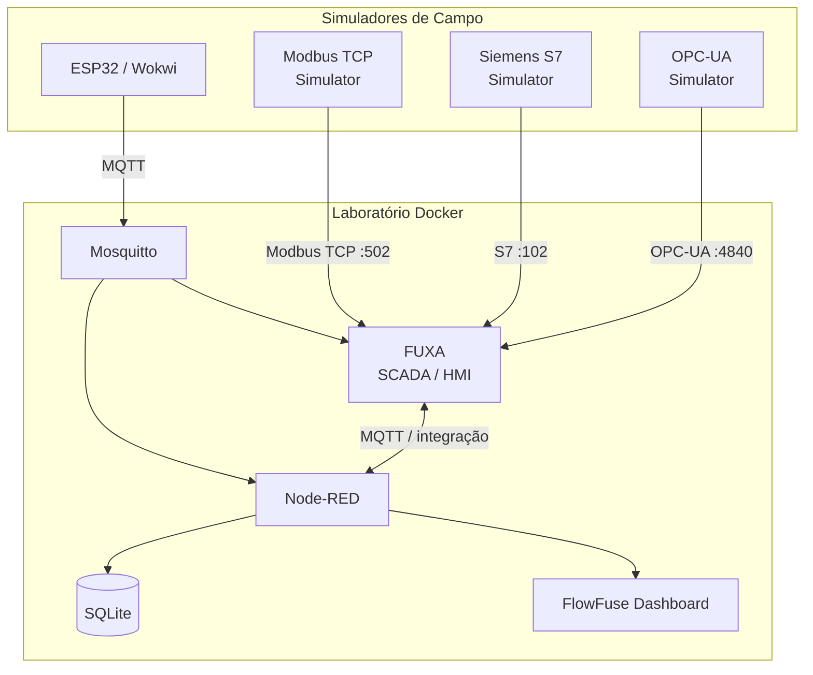

Eu transformaria o stack anterior em um **laboratório multiprotocolo**, mas manteria os simuladores separados do núcleo da arquitetura. Assim o aluno consegue ligar/desligar cada tecnologia independentemente.

A vantagem é que o próprio FUXA já possui conectores para **Modbus RTU/TCP, Siemens S7, OPC-UA e MQTT**, portanto podemos usar o FUXA como ponto de comparação entre os protocolos. ([GitHub][1])

A proposta seria:



## 1. Estrutura do projeto

Eu usaria:

```text
scada-lab/
├── docker-compose.yml
├── .env
│
├── mosquitto/
│   └── config/
│       └── mosquitto.conf
│
├── node-red/
│   ├── Dockerfile
│   └── data/
│
├── fuxa/
│   ├── appdata/
│   ├── db/
│   ├── logs/
│   └── images/
│
└── simulators/
    ├── Dockerfile
    ├── requirements.txt
    └── server.py
```

A ideia é que o aluno faça simplesmente:

```bash
docker compose up -d --build
```

e tenha todo o laboratório disponível.

---

# 2. Docker Compose

Eu faria o Compose desta forma:

```yaml
services:
  # ==========================================================
  # MQTT BROKER
  # ==========================================================

  mosquitto:
    image: eclipse-mosquitto:2
    container_name: scada-mosquitto
    restart: unless-stopped

    ports:
      - "1883:1883"

    volumes:
      - ./mosquitto/config:/mosquitto/config
      - mosquitto-data:/mosquitto/data
      - mosquitto-log:/mosquitto/log

    networks:
      - scada

  # ==========================================================
  # NODE-RED
  # ==========================================================

  node-red:
    build:
      context: ./node-red

    container_name: scada-node-red
    restart: unless-stopped

    environment:
      TZ: ${TZ:-America/Sao_Paulo}

    ports:
      - "1880:1880"

    volumes:
      - ./node-red/data:/data

    depends_on:
      - mosquitto

    networks:
      - scada

  # ==========================================================
  # FUXA - SCADA / HMI
  # ==========================================================

  fuxa:
    image: frangoteam/fuxa:latest
    container_name: scada-fuxa
    restart: unless-stopped

    ports:
      - "1881:1881"

    volumes:
      - ./fuxa/appdata:/usr/src/app/FUXA/server/_appdata
      - ./fuxa/db:/usr/src/app/FUXA/server/_db
      - ./fuxa/logs:/usr/src/app/FUXA/server/_logs
      - ./fuxa/images:/usr/src/app/FUXA/server/_images

    depends_on:
      - mosquitto
      - modbus-sim
      - opcua-sim
      - s7-sim

    networks:
      - scada

  # ==========================================================
  # MODBUS TCP SIMULATOR
  # ==========================================================

  modbus-sim:
    build:
      context: ./simulators

    container_name: scada-modbus-sim
    restart: unless-stopped

    command: python /app/server.py modbus

    ports:
      - "502:502"

    networks:
      - scada

  # ==========================================================
  # OPC-UA SIMULATOR
  # ==========================================================

  opcua-sim:
    build:
      context: ./simulators

    container_name: scada-opcua-sim
    restart: unless-stopped

    command: python /app/server.py opcua

    ports:
      - "4840:4840"

    networks:
      - scada

  # ==========================================================
  # SIEMENS S7 SIMULATOR
  # ==========================================================

  s7-sim:
    build:
      context: ./simulators

    container_name: scada-s7-sim
    restart: unless-stopped

    command: python /app/server.py s7

    ports:
      - "102:102"

    networks:
      - scada

volumes:
  mosquitto-data:
  mosquitto-log:

networks:
  scada:
    driver: bridge
```

### Portas

| Serviço          |  Porta | Função     |
| ---------------- | -----: | ---------- |
| Mosquitto        | `1883` | MQTT       |
| Node-RED         | `1880` | Automação  |
| FUXA             | `1881` | SCADA/HMI  |
| Modbus Simulator |  `502` | Modbus TCP |
| OPC-UA Simulator | `4840` | OPC-UA     |
| S7 Simulator     |  `102` | Siemens S7 |

---

# 3. Simulador multiprotocolo

Aqui há uma possibilidade muito interessante para o laboratório: **um único container Python contendo três servidores simulados**.

Hoje existem bibliotecas que tornam isso relativamente simples:

- `pymodbus` possui servidor Modbus TCP. ([PyModbus][2])
- `asyncua` fornece servidor OPC-UA em Python. ([GitHub][3])
- `python-snap7` atualmente possui um servidor S7 para testes/desenvolvimento. ([Python-Snap7][4])

Isso evita depender de três projetos externos diferentes.

### `simulators/Dockerfile`

```dockerfile
FROM python:3.12-slim

WORKDIR /app

COPY requirements.txt .

RUN pip install --no-cache-dir -r requirements.txt

COPY server.py .

CMD ["python", "server.py"]
```

### `simulators/requirements.txt`

```text
pymodbus
asyncua
python-snap7
```

---

# 4. Modelo de processo

Eu faria os três simuladores representarem **a mesma planta**.

Por exemplo:

```text
                 TANQUE
            ┌─────────────┐
            │             │
            │   LEVEL     │
            │      ↓      │
            │             │
            └──────┬──────┘
                   │
                   ▼
                ┌─────┐
                │PUMP │
                └─────┘
```

Variáveis:

| Tag           | Tipo |    Exemplo |
| ------------- | ---- | ---------: |
| `Level`       | REAL |     65.2 % |
| `Temperature` | REAL |    27.4 °C |
| `Pressure`    | REAL |    2.1 bar |
| `PumpRunning` | BOOL |       true |
| `PumpSpeed`   | REAL |     72.0 % |
| `Flow`        | REAL | 15.3 L/min |

E cada protocolo expõe a mesma planta.

---

# 5. Modbus

Por exemplo:

```text
Holding Register

40001 → Level × 10
40002 → Temperature × 10
40003 → Pressure × 10
40004 → PumpSpeed × 10

Coils

00001 → PumpRunning
00002 → PumpCommand
```

Assim o aluno pode conectar o FUXA ao:

```text
modbus-sim:502
```

e estudar:

```text
IP/Host       = modbus-sim
Port           = 502
Unit ID        = 1
```

---

# 6. OPC-UA

O simulador poderia disponibilizar:

```text
Objects
└── Plant
    ├── Tank
    │   ├── Level
    │   ├── Temperature
    │   └── Pressure
    │
    └── Pump
        ├── Running
        ├── Speed
        └── Flow
```

Endpoint:

```text
opc.tcp://opcua-sim:4840/freeopcua/server/
```

Isso permite ensinar a diferença fundamental:

```text
Modbus
   ↓
Registers / Coils


OPC-UA
   ↓
Objects / Nodes / Variables
```

---

# 7. Siemens S7

O simulador S7 ficaria disponível como:

```text
s7-sim:102
```

e podemos criar, por exemplo:

```text
DB1

DBD0   Level
DBD4   Temperature
DBD8   Pressure
DBD12  PumpSpeed

DBX16.0 PumpRunning
DBX16.1 PumpCommand
```

O `python-snap7` atualmente documenta explicitamente um servidor S7 para emulação/testes e permite iniciar o servidor na porta TCP 102. ([Python-Snap7][4])

Isso é muito melhor para a disciplina do que simplesmente mostrar capturas de tela de um CLP real.

---

# 8. FUXA como laboratório de protocolos

No FUXA, os alunos poderiam criar três dispositivos:

```text
FUXA
│
├── DEV_MODBUS
│      └── modbus-sim:502
│
├── DEV_OPCUA
│      └── opcua-sim:4840
│
└── DEV_S7
       └── s7-sim:102
```

E depois montar **uma única tela SCADA**:

```text
┌───────────────────────────────────────────────┐
│             ESTAÇÃO DE BOMBEAMENTO            │
├───────────────────────────────────────────────┤
│                                               │
│       ┌───────────────┐                       │
│       │               │                       │
│       │    TANQUE     │  Level: 65.2 %       │
│       │               │  Temp: 27.4 °C       │
│       │      65%      │  Pressure: 2.1 bar   │
│       │               │                       │
│       └───────┬───────┘                       │
│               │                               │
│             ┌───┐                             │
│             │ P │       Pump: RUNNING         │
│             └───┘       Speed: 72 %           │
│                                               │
├───────────────────────────────────────────────┤
│ Protocolos                                    │
│                                               │
│ MQTT       ● CONNECTED                        │
│ Modbus     ● CONNECTED                        │
│ OPC-UA     ● CONNECTED                        │
│ S7         ● CONNECTED                        │
└───────────────────────────────────────────────┘
```

Isso cria uma atividade excelente: **"o mesmo processo industrial utilizando diferentes protocolos de comunicação"**.

---

# 9. E o Node-RED?

Aqui eu faria uma segunda atividade.

Em vez de Node-RED substituir o FUXA:

```text
Modbus ──► Node-RED
OPC-UA ──► Node-RED
S7 ──────► Node-RED
MQTT ────► Node-RED
```

o aluno compara:

```text
                 ┌───────────────┐
                 │     FUXA      │
                 │ SCADA / HMI   │
                 └───────┬───────┘
                         │
                    supervisão
                         │
                         ▼
                 ┌───────────────┐
                 │   Node-RED    │
                 │ integração    │
                 │ automação     │
                 └───────┬───────┘
                         │
                ┌────────┼────────┐
                ▼        ▼        ▼
             SQLite    MQTT    Dashboard
```

O Node-RED pode então:

- registrar os dados em SQLite;
- publicar os dados em MQTT;
- implementar regras;
- gerar alarmes;
- converter protocolos;
- alimentar o Dashboard;
- integrar sistemas externos.

---

## 10. Um exercício particularmente interessante

Depois de os alunos testarem cada protocolo isoladamente, fazemos:

### Experimento

O **mesmo nível do tanque** é disponibilizado por:

```text
Modbus → Level
OPC-UA → Level
S7     → Level
MQTT   → Level
```

O Node-RED coleta os quatro:

```text
                 ┌── Modbus ──┐
                 │             │
                 ├── OPC-UA ───┤
                 │             │
                 ├── S7 ───────┤
                 │             │
                 └── MQTT ─────┘
                         │
                         ▼
                    Node-RED
                         │
                    ┌────┴────┐
                    ▼         ▼
                 SQLite    Dashboard
```

O aluno percebe na prática que **o protocolo de comunicação e a aplicação SCADA são coisas diferentes**.

---

## 11. Uma melhoria importante no Compose

Eu também colocaria os simuladores em um **profile**:

```yaml
profiles:
  - protocols
```

Assim teremos dois modos:

### Laboratório básico

```bash
docker compose up -d
```

```text
Mosquitto
Node-RED
FUXA
```

### Laboratório multiprotocolo

```bash
docker compose --profile protocols up -d --build
```

```text
Mosquitto
Node-RED
FUXA

+ Modbus simulator
+ OPC-UA simulator
+ S7 simulator
```

Isso é muito útil para uma disciplina, porque o mesmo repositório pode acompanhar o aluno durante todo o semestre.

**Eu recomendo essa abordagem em vez de adicionar simuladores industriais pesados ao Compose:** fica portátil no Windows + Docker Desktop, não exige CLP físico e permite que cada aula habilite apenas o protocolo que está sendo estudado.

A FUXA atual também possui integração MQTT além de Modbus, OPC-UA e S7, então ela consegue funcionar como o ponto SCADA comum para os quatro caminhos. ([GitHub][5])

Se você quiser, o próximo passo é eu montar o **repositório completo `scada-lab/`**, incluindo `docker-compose.yml`, Dockerfile do Node-RED com **FlowFuse Dashboard + SQLite já instalados**, simulador Python funcional para **Modbus + OPC-UA + S7**, `mosquitto.conf` e **flows do Node-RED pré-carregados** para que o aluno precise apenas executar `docker compose up -d --build`.

[1]: https://github.com/frangoteam/FUXA?utm_source=chatgpt.com "GitHub - frangoteam/FUXA: Web-based Process Visualization (SCADA/HMI/Dashboard) software · GitHub"
[2]: https://pymodbus.readthedocs.io/en/latest/source/server.html?utm_source=chatgpt.com "Server (3.x) — PyModbus 4.0.0dev14 documentation"
[3]: https://github.com/FreeOpcUa/opcua-asyncio?utm_source=chatgpt.com "GitHub - FreeOpcUa/opcua-asyncio: OPC UA library for python >= 3.10 · GitHub"
[4]: https://python-snap7.readthedocs.io/en/latest/API/server.html?utm_source=chatgpt.com "Server — python-snap7 3.2.0 documentation"
[5]: https://github.com/MartiZoltanHUN/FUXA/blob/main/README.md?utm_source=chatgpt.com "FUXA/README.md at main · MartiZoltanHUN/FUXA · GitHub"
