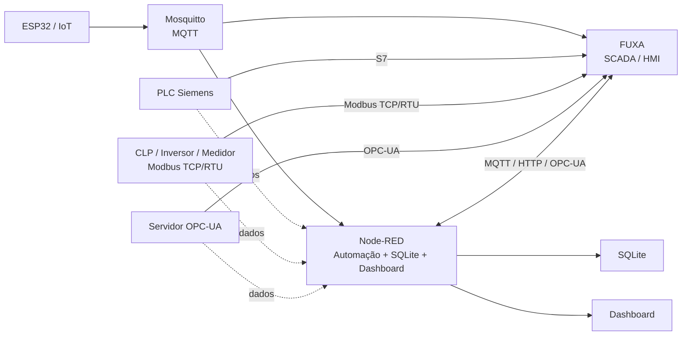
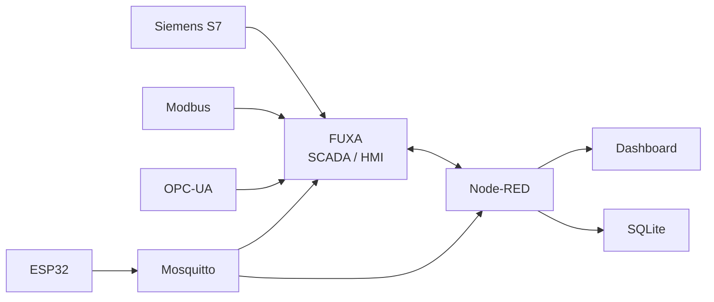

A arquitetura fica mais interessante se o **MQTT não for tratado como único protocolo de campo**. O FUXA pode atuar diretamente como cliente de alguns protocolos industriais, enquanto o Node-RED pode fazer a integração, conversão e automação.

Uma arquitetura didática seria:



### O papel de cada protocolo

| Protocolo      | Onde usar                                 | Exemplo didático            |
| -------------- | ----------------------------------------- | --------------------------- |
| **MQTT**       | IoT / comunicação assíncrona              | ESP32 → Mosquitto           |
| **Modbus TCP** | CLPs, inversores, medidores               | Medidor de energia → FUXA   |
| **Modbus RTU** | RS-485                                    | Sensor/CLP → gateway → FUXA |
| **OPC-UA**     | Automação industrial / interoperabilidade | PLC/servidor → FUXA         |
| **Siemens S7** | CLPs Siemens                              | S7-1200/1500 → FUXA         |
| **HTTP/REST**  | Integração de sistemas                    | Node-RED ↔ equipamento/API  |

## 1. Modbus

O caminho mais simples para laboratório é **Modbus TCP**:

```text
┌──────────────┐
│ CLP / Medidor │
│ Modbus TCP    │
└──────┬───────┘
       │ TCP :502
       ▼
┌──────────────┐
│     FUXA     │
│     SCADA    │
└──────────────┘
```

Por exemplo:

```text
192.168.10.20:502

Holding Register 40001 → Temperatura
Holding Register 40002 → Pressão
Coil 00001             → Bomba
```

No FUXA você cria os **tags** associados aos registradores Modbus.

Para um laboratório, isso permite ensinar:

- coils;
- discrete inputs;
- input registers;
- holding registers;
- leitura/escrita;
- escala de valores;
- endereçamento;
- Modbus TCP;
- posteriormente Modbus RTU/RS-485.

### E o Node-RED?

Ele pode ficar no caminho quando você quiser processamento:

```text
Modbus
   │
   ▼
Node-RED
   ├── SQLite
   ├── regras
   ├── alarmes
   └── MQTT
```

Ou diretamente:

```text
Modbus ──────► FUXA
   │
   └──────────► Node-RED
```

Isso é particularmente interessante didaticamente porque mostra a diferença entre **SCADA** e **middleware de integração**.

---

# 2. OPC-UA

OPC-UA muda um pouco o conceito.

Em vez de simplesmente trabalhar com registradores, você normalmente trabalha com uma **árvore de informações**:

```text
OPC-UA Server
│
├── Plant
│   ├── Tank01
│   │   ├── Level
│   │   ├── Temperature
│   │   └── Pressure
│   │
│   └── Pump01
│       ├── Running
│       ├── Speed
│       └── Current
```

A arquitetura pode ser:

```text
             OPC-UA
                │
                ▼
        ┌───────────────┐
        │ OPC-UA Server │
        └───────┬───────┘
                │
          ┌─────┴─────┐
          ▼           ▼
       FUXA        Node-RED
          │           │
          ▼           ▼
        SCADA       SQLite
```

Isso é excelente para mostrar aos alunos a diferença entre:

```text
Modbus
    ↓
registradores/endereço

OPC-UA
    ↓
objetos / nós / variáveis
```

OPC-UA também permite trabalhar posteriormente com:

- namespace;
- NodeId;
- browse;
- subscriptions;
- leitura/escrita;
- segurança;
- certificados;
- tipos de dados.

---

# 3. Siemens S7

Para CLPs Siemens, você pode ter uma arquitetura específica:

```text
┌────────────────────┐
│ Siemens S7-1200/1500│
│                    │
│ DB1                │
│   Temperature      │
│   Level            │
│   PumpRunning      │
│                    │
└─────────┬──────────┘
          │ S7
          ▼
       ┌──────┐
       │ FUXA │
       └──┬───┘
          │
          ▼
       SCADA/HMI
```

E paralelamente:

```text
Siemens S7
     │
     ├────────► FUXA
     │
     └────────► Node-RED
                    │
                    ├── SQLite
                    ├── Dashboard
                    └── MQTT
```

Isso permite um exercício bastante interessante:

```text
                    ┌─────────────┐
                    │ Siemens PLC │
                    └──────┬──────┘
                           │ S7
                           ▼
                    ┌─────────────┐
                    │    FUXA     │
                    │    SCADA    │
                    └──────┬──────┘
                           │
                     supervisão
                           │
                           ▼
                    ┌─────────────┐
                    │  Node-RED   │
                    │  integração │
                    └──────┬──────┘
                           │
                 ┌─────────┴─────────┐
                 ▼                   ▼
              SQLite            MQTT
```

---

# 4. O ponto mais importante: não colocar tudo no Node-RED

Eu manteria uma regra didática simples:

> **FUXA fala diretamente com os equipamentos industriais; Node-RED integra sistemas e implementa lógica de aplicação.**

Assim:

```text
                  CAMPO
                    │
       ┌────────────┼────────────┐
       │            │            │
    Modbus         S7         OPC-UA
       │            │            │
       └────────────┼────────────┘
                    ▼
                  FUXA
                SCADA/HMI
                    │
                    │
             dados/eventos
                    ▼
                Node-RED
             ┌──────┼──────┐
             ▼      ▼      ▼
          SQLite  MQTT   Dashboard
```

E para IoT:

```text
ESP32
  │
  │ MQTT
  ▼
Mosquitto
  │
  ├──────────► Node-RED
  │              │
  │              ├── SQLite
  │              └── Dashboard
  │
  └──────────► FUXA
```

Dessa forma você consegue demonstrar **duas famílias de automação** no mesmo laboratório:

### Automação industrial

```text
PLC / equipamento
       │
 Modbus / S7 / OPC-UA
       │
       ▼
     FUXA
       │
       ▼
   Node-RED
```

### IoT

```text
ESP32
  │
 MQTT
  │
  ▼
Mosquitto
  │
  ▼
Node-RED
```

E finalmente integrar as duas:



**Esse desenho é particularmente bom para uma disciplina**, porque você pode acrescentar os protocolos progressivamente sem alterar o núcleo do ambiente Docker.

### Uma sequência de aulas possível

1. **MQTT** → ESP32 + Mosquitto
2. **Node-RED** → aquisição e automação
3. **SQLite** → histórico
4. **Dashboard** → supervisão IoT
5. **FUXA** → conceitos de SCADA/HMI
6. **Modbus TCP** → primeiro protocolo industrial
7. **Modbus RTU** → RS-485
8. **Siemens S7** → integração com PLC
9. **OPC-UA** → interoperabilidade industrial
10. **Integração** → PLC + IoT + SCADA + Node-RED

Um próximo passo interessante seria transformar o Compose atual em um **laboratório multiprotocolo**, adicionando simuladores Docker para **Modbus TCP, OPC-UA e Siemens S7**, permitindo que os alunos pratiquem os três protocolos **sem precisar possuir um CLP físico**.
