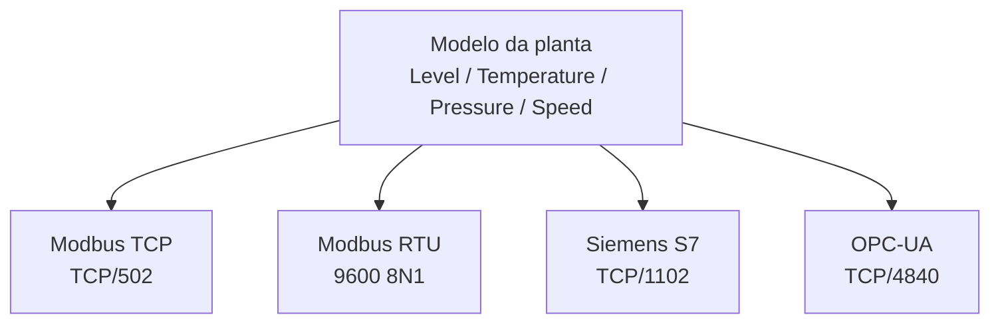
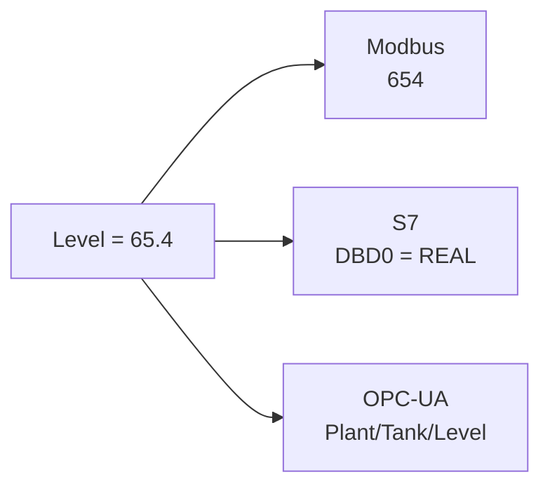
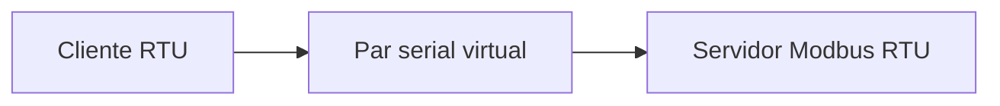
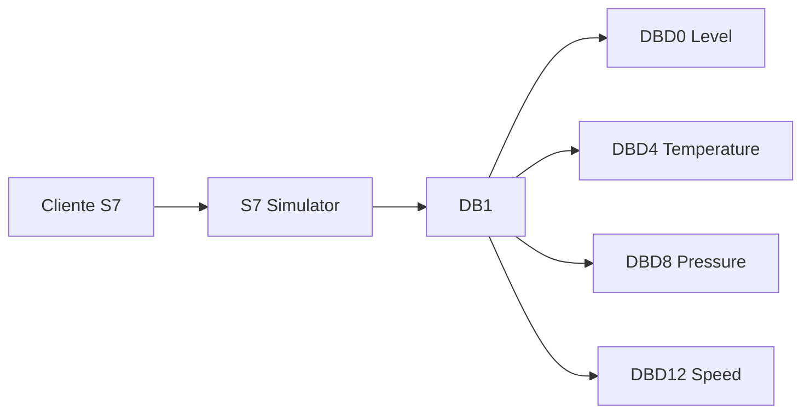
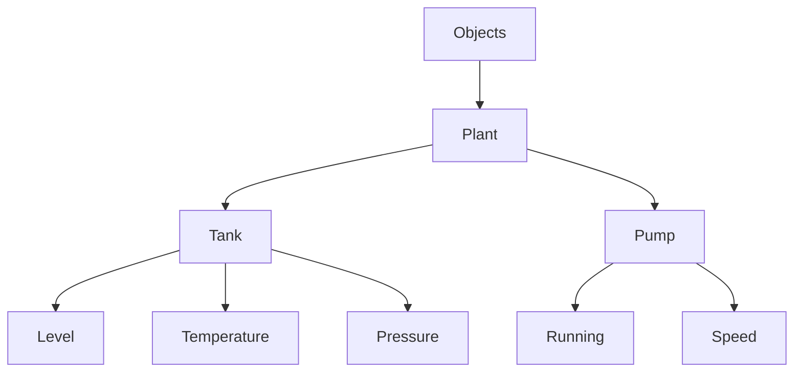
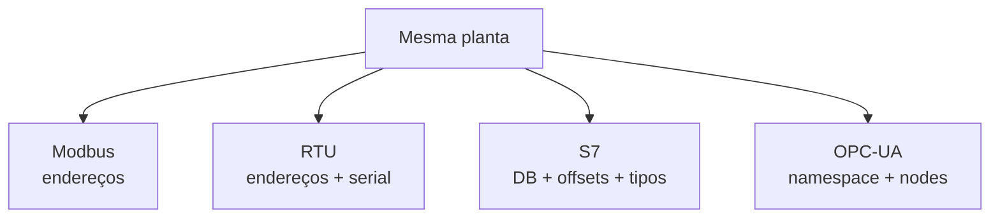
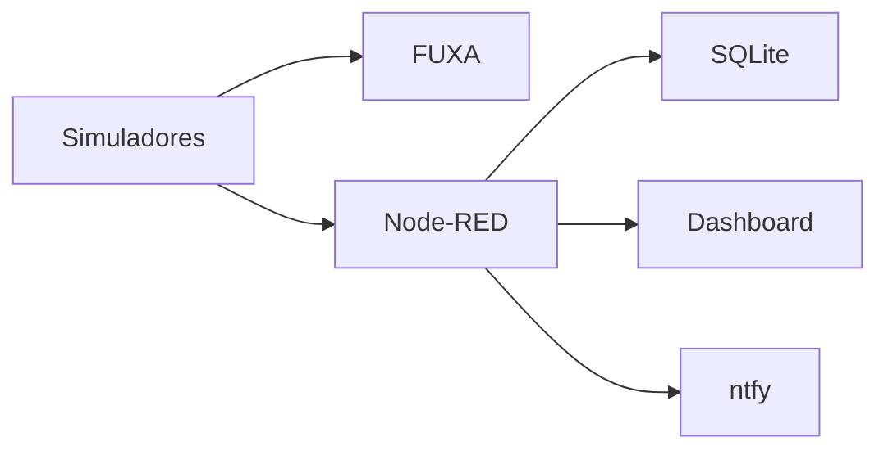

# Simuladores de Protocolos Industriais

Este projeto contém somente os simuladores. FUXA, Node-RED, MQTT e bancos ficam para uma etapa posterior.

## Arquitetura



Os quatro servidores representam a mesma planta, mas cada protocolo possui um modelo de dados diferente.

## 1. Iniciar

```powershell
docker compose build
docker compose up -d
docker compose ps
```

Logs:

```powershell
docker compose logs -f
```

Parar:

```powershell
docker compose down
```

## 2. Modelo do processo

| Variável     | Faixa aproximada | Unidade |
| ------------ | ---------------: | ------- |
| Level        |            45–85 | %       |
| Temperature  |            24–30 | °C      |
| Pressure     |          1,8–2,2 | bar     |
| Pump Speed   |            60–80 | %       |
| Pump Running |              0/1 | boolean |



## 3. Modbus TCP

Endpoint:

```text
localhost:502
```

Mapa:

| Registro | Offset | Variável     |  Escala |
| -------- | -----: | ------------ | ------: |
| 40001    |      0 | Level        |     ×10 |
| 40002    |      1 | Temperature  |     ×10 |
| 40003    |      2 | Pressure     |     ×10 |
| 40004    |      3 | Pump Speed   |     ×10 |
| 00001    |      0 | Pump Running | boolean |
| 00002    |      1 | Pump Command | boolean |

Se `Level = 65.4`, o holding register contém aproximadamente `654`.

Verifique:

```powershell
docker compose logs modbus-tcp
Test-NetConnection localhost -Port 502
```

:::warning
Clientes podem usar `40001` como referência e `0` como offset. Confira a convenção do cliente.
:::

## 4. Modbus RTU

RTU usa serial/RS-485, não uma porta TCP.

```text
9600 8N1
Unit ID = 1
```

O container cria:

```text
/run/rtu/ttyV0  ← servidor
/run/rtu/ttyV1  ← cliente de teste
```



O par fica dentro do container para manter o laboratório portátil no Docker Desktop. Não aparece automaticamente como `COMx` no Windows.

:::note
Para conectar FUXA/Node-RED diretamente a uma porta serial do host, use uma interface RS-485 USB ou uma solução de porta serial virtual específica do sistema operacional.
:::

## 5. Siemens S7

Endpoint:

```text
localhost:1102
```

DB1:

```text
DB1
├── DBD0    Level
├── DBD4    Temperature
├── DBD8    Pressure
├── DBD12   Pump Speed
└── DBX16
    ├── .0   Pump Running
    └── .1   Pump Command
```

Os quatro primeiros valores são `REAL` IEEE-754 big-endian.



Configuração típica do cliente:

```text
IP:   localhost
Port: 1102
Rack: 0
Slot: 1
DB:   1
```

O `python-snap7` fornece um servidor S7 clássico para testes e permite registrar áreas como `SrvArea.DB` e iniciar o servidor em uma porta TCP configurável.

:::tip
A porta `1102` foi escolhida para o laboratório. Em instalações S7 clássicas, TCP/102 é a porta usual.
:::

## 6. OPC-UA

Endpoint:

```text
opc.tcp://localhost:4840/freeopcua/server/
```

Namespace:

```text
urn:industrial-sim
```

Árvore:



O cliente deve navegar pela árvore para localizar os Nodes.

## 7. Comparação

| Variável    | Modbus TCP       | Modbus RTU       | S7        | OPC-UA                 |
| ----------- | ---------------- | ---------------- | --------- | ---------------------- |
| Level       | Holding Register | Holding Register | DB1.DBD0  | Plant/Tank/Level       |
| Temperature | Holding Register | Holding Register | DB1.DBD4  | Plant/Tank/Temperature |
| Pressure    | Holding Register | Holding Register | DB1.DBD8  | Plant/Tank/Pressure    |
| Speed       | Holding Register | Holding Register | DB1.DBD12 | Plant/Pump/Speed       |
| Running     | Coil             | Coil             | DBX16.0   | Plant/Pump/Running     |



## 8. Roteiro de laboratório

### Prática 1 — Modbus TCP

1. Suba os containers.
2. Teste `localhost:502`.
3. Leia HR 40001–40004.
4. Aplique a escala ×10.
5. Compare os valores com o modelo.

### Prática 2 — Modbus RTU

1. Observe os logs.
2. Identifique `ttyV0` e `ttyV1`.
3. Observe `9600 8N1`.
4. Entenda Unit ID.
5. Compare RTU com TCP.

### Prática 3 — Siemens S7

1. Conecte em `localhost:1102`.
2. Rack `0`, Slot `1`.
3. Leia DB1.
4. Interprete DBD0, DBD4, DBD8 e DBD12 como REAL.
5. Leia DBX16.0.

### Prática 4 — OPC-UA

1. Conecte ao endpoint.
2. Navegue `Objects/Plant`.
3. Explore `Tank` e `Pump`.
4. Observe as variáveis mudando.
5. Compare Nodes com registros Modbus.

### Prática 5 — comparação

Para `Level = 65.4`:

```text
Modbus TCP → HR ≈ 654
Modbus RTU → HR ≈ 654
S7         → DB1.DBD0 = REAL 65.4
OPC-UA     → Plant/Tank/Level = 65.4
```

## 9. Diagnóstico

```powershell
docker compose ps
docker compose logs modbus-tcp
docker compose logs modbus-rtu
docker compose logs s7
docker compose logs opcua
```

Teste as portas TCP:

```powershell
Test-NetConnection localhost -Port 502
Test-NetConnection localhost -Port 1102
Test-NetConnection localhost -Port 4840
```

Rebuild:

```powershell
docker compose build --no-cache
docker compose up -d
```

## 10. Próxima etapa

Depois que os quatro simuladores forem compreendidos isoladamente:



A recomendação didática é validar primeiro os simuladores e só depois adicionar FUXA e Node-RED.
